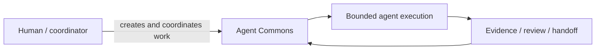
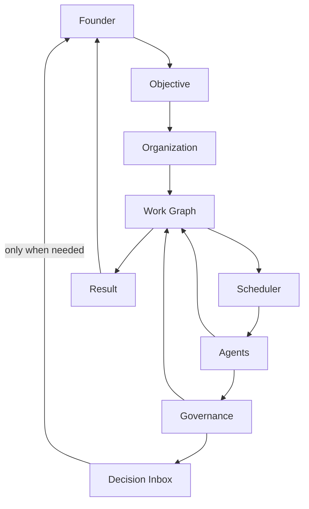
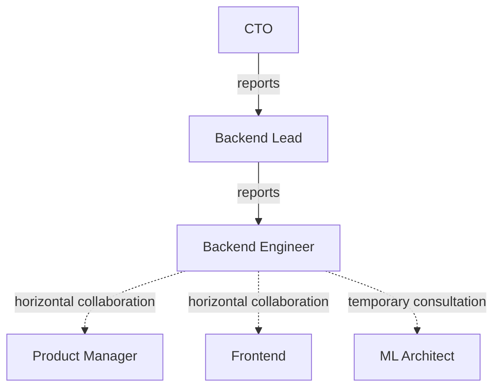
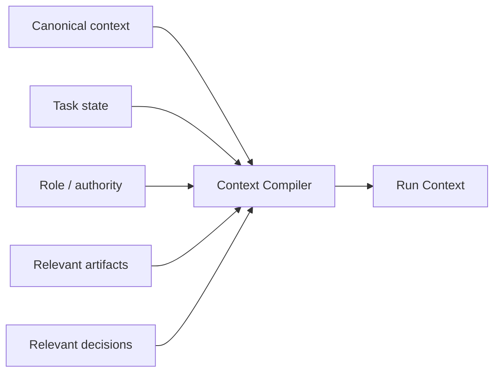
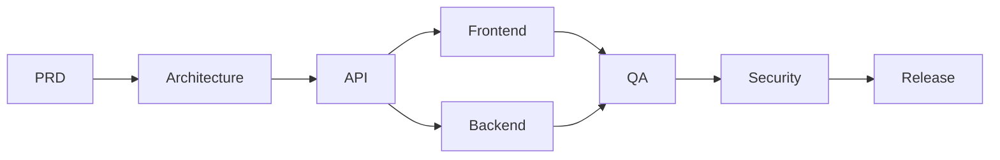
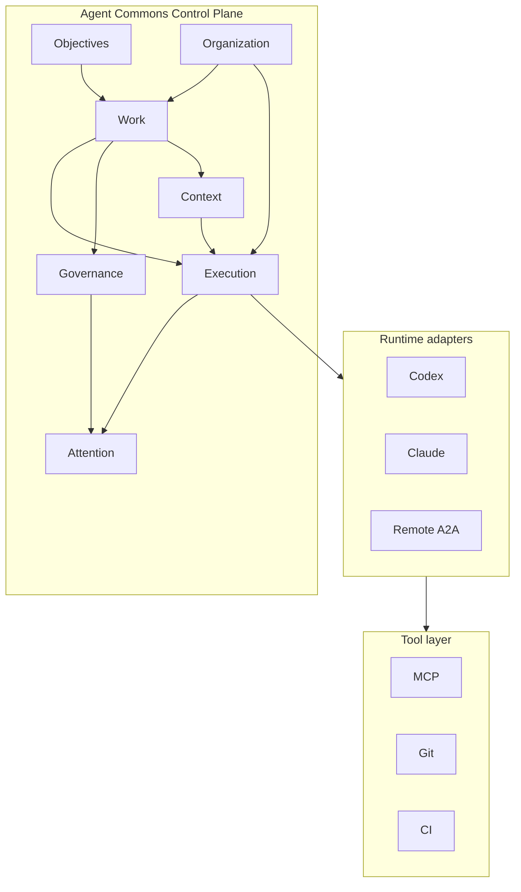
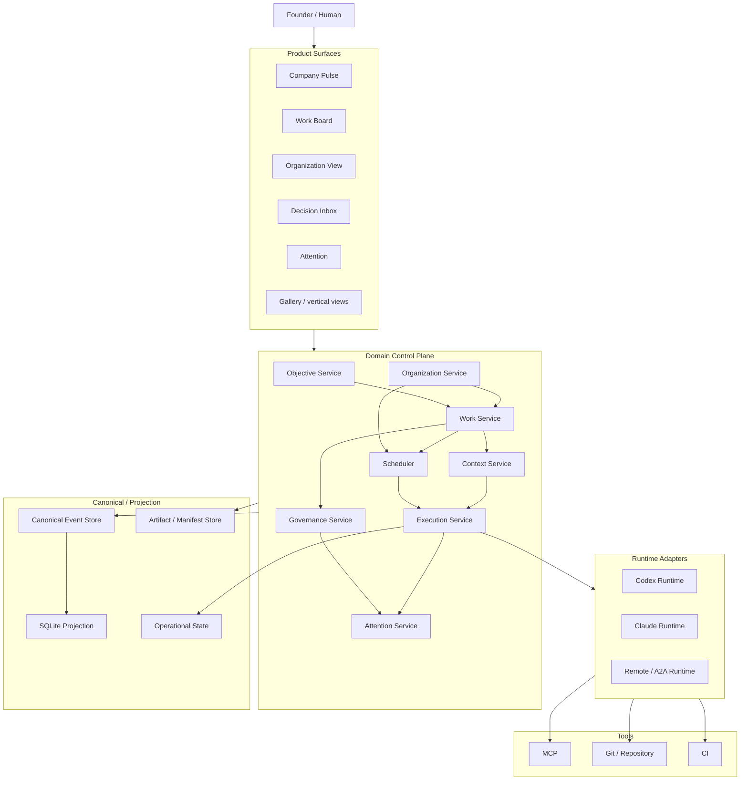
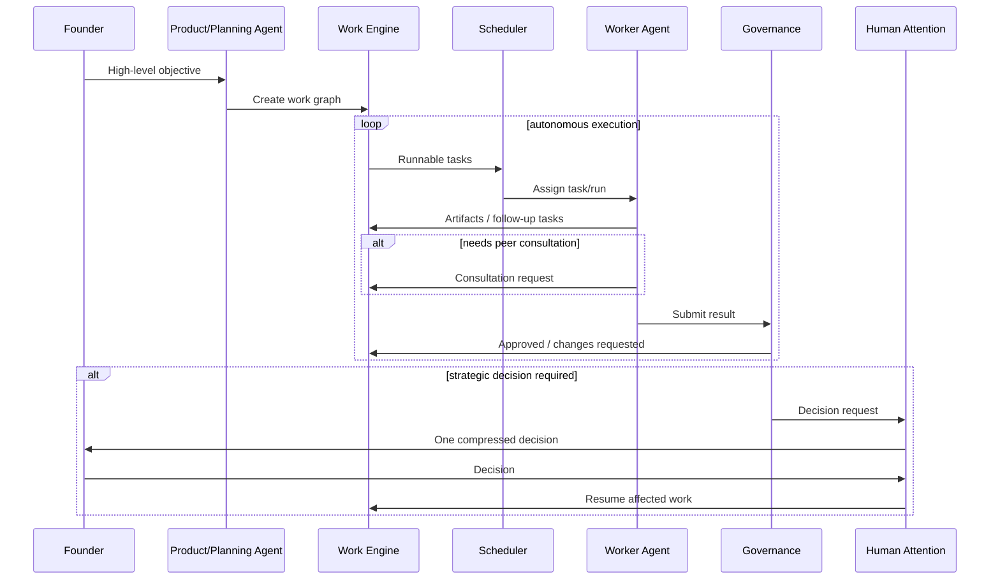

# Agent Commons: продуктовый и архитектурный review

**Дата:** 24 августа 2026  
**Основа:** текущее описание Agent Commons на срезе `f998e33`  
**Цель документа:** оценить текущую архитектуру и продуктовую модель Agent Commons с учётом направления на автономную AI-организацию: роли, task-driven execution, оргструктура, authority, динамические коммуникации, scheduler, human-in-the-loop и управляемая автономность.

---

# 1. Executive verdict

Agent Commons уже имеет **сильный coordination/governance core** и во многих местах спроектирован заметно лучше типичного multi-agent orchestration framework.

Особенно сильны:

- immutable canonical history;
- exact-revision semantics;
- разделение `completed` и `accepted`;
- independent review;
- evidence / verification / staleness;
- persistent roles отдельно от runtime session;
- handoff вместо сохранения полного transcript;
- narrow MCP surface;
- fail-closed broker;
- единый service boundary;
- rebuildable projection.

Главный пробел находится не в надёжности ядра, а в **центре продуктовой модели**.

Сегодня Agent Commons в первую очередь отвечает на вопрос:

> Как нескольким людям и AI-агентам безопасно и проверяемо работать над одним репозиторием?

Целевая система должна дополнительно отвечать на вопрос:

> Как автономная AI-организация сама превращает цель founder-а в работу, распределяет её между сотрудниками, разрешает зависимости, эскалирует только важные решения и движет проект вперёд?

То есть следующий качественный скачок:

```text
trusted coordination workspace
            ↓
autonomous organizational control plane
```

Я бы **не переписывал Agent Commons с нуля**. Большая часть уже созданного ядра пригодится напрямую.

Но я бы изменил roadmap и сделал следующим главным направлением не Gallery, а:

1. **Task-driven runtime**
2. **Organization + authority**
3. **Scheduler / work dispatch**
4. **Decision / Attention Inbox**
5. **Context compiler**
6. **Dynamic collaboration**
7. И только затем — специализированные product surfaces вроде Design Gallery

---

# 2. Что уже сделано очень хорошо

## 2.1. Проектная истина отделена от общения агентов

Это, вероятно, самая сильная часть архитектуры.

У тебя явно различаются:

```text
message
proposal
artifact
verification
review
decision
accepted task
```

То есть мнение агента не становится автоматически проектной истиной.

Особенно удачна модель:

```text
completed != accepted
```

и требование exact revision для review/evidence.

Это крайне полезно в agentic-системах, потому что одна из типичных ошибок — считать успешный ответ модели доказательством того, что задача решена.

### Рекомендация

**Сохранить без принципиальных изменений.**

Это один из core differentiators Agent Commons.

---

## 2.2. Immutable canonical history + rebuildable projection

Текущая модель:

```text
canonical append-only history
          ↓
replay
          ↓
SQLite projection
          ↓
views / search / UI
```

очень хороша для локального repo-first продукта.

Плюсы:

- auditability;
- deterministic reconstruction;
- Git-visible history;
- отсутствие скрытого mutable state как project truth;
- disposable read model;
- удобное recovery.

### Рекомендация

Сохранять.

Но storage backend следует абстрагировать, чтобы файловый ledger не стал архитектурным ограничением при переходе к shared/cloud deployment.

---

## 2.3. Persistent role и runtime session разделены

Это фундаментально правильное решение.

Организационный сотрудник должен существовать независимо от конкретного вызова модели:

```text
Backend Engineer
    │
    ├── session 1
    ├── session 2
    └── session 3
```

Session может:

- упасть;
- timeout-нуться;
- закончить context window;
- быть заменена другой моделью.

Но сотрудник, его ответственность, task ownership и организационный контекст остаются.

### Рекомендация

Развить эту идею дальше и формально добавить ещё одну сущность:

```text
Agent / Employee
Task
Run
Session
```

где:

- **Agent** — организационная identity;
- **Task** — работа;
- **Run** — конкретная попытка выполнения;
- **Session** — конкретная provider/model session внутри run.

---

## 2.4. Claims правильно сделаны как lease

Хорошо, что claim не означает:

> этот файл принадлежит мне.

А означает:

> сейчас этот участник координационно работает с этим ресурсом.

Это полезный concurrency primitive.

### Рекомендация

Оставить claims внутри runtime/coordination слоя, но **понизить их значимость в продуктовой mental model**.

Пользователь должен видеть:

```text
Backend #2 работает над AUTH-23
Potential overlap: auth/*
```

а не думать в терминах lease semantics.

---

## 2.5. Independent review и stale evidence

Очень сильная часть.

Особенно важны:

- reviewer не должен принимать собственный результат;
- review относится к exact revision;
- новая revision делает старое доказательство stale;
- история не стирается.

### Рекомендация

Сохранить, но сделать policy-driven, чтобы одна и та же строгость не тормозила всю автономную организацию.

Подробнее ниже.

---

## 2.6. Narrow MCP boundary

Текущий подход:

```text
agent
  ↓
purpose-scoped MCP tools
  ↓
CommonsManager
```

правильный.

Агенту не даётся бесконтрольный shell/filesystem только потому, что он LLM.

### Рекомендация

Продолжать.

MCP должен оставаться **tool/data protocol**, а не становиться внутренним orchestration protocol Agent Commons.

---

## 2.7. Broker fail-closed

Хорошо, что:

```text
provider exited successfully
```

не означает:

```text
work accepted
```

И что ambiguous terminal state переводится в `needs_operator`.

### Рекомендация

Сохранить safety model, но постепенно изменить место broker-а в архитектуре: он должен стать runtime adapter, а не центром модели делегации.

---

# 3. Главный conceptual gap

Сегодня система в основном выглядит так:



Целевая модель должна выглядеть так:



Разница фундаментальная.

Сейчас Commons хорошо хранит и координирует **работу, которую кто-то уже определил**.

Следующий уровень — организация должна сама:

- создавать задачи;
- декомпозировать цели;
- определять зависимости;
- находить исполнителей;
- запускать выполнение;
- обнаруживать blockers;
- инициировать консультации;
- инициировать reviews;
- создавать follow-up work;
- эскалировать только важные решения.

---

# 4. Главное изменение: Task должен стать executable work object

У тебя Task уже сильнее обычной карточки issue tracker.

Но в целевой архитектуре Task должен стать **центральной runtime-сущностью**.

## Предлагаемая модель

```text
Task
├── objective / parent
├── owner
├── eligible roles
├── priority
├── execution state
├── acceptance state
├── blockers
├── acceptance criteria
├── required capabilities
├── authority requirements
├── context baseline
├── runs
├── artifacts
├── reviews
├── decisions
└── audit trail
```

### Критично

```text
Task != Delegation
Task != Run
Task != Session
```

Пример:

```text
TASK-123
   │
   ├── Run #1
   │    └── Codex session A
   │        → crashed
   │
   ├── Run #2
   │    └── Codex session B
   │        → changes requested
   │
   └── Run #3
        └── Codex session C
            → succeeded
```

Task остаётся одной бизнесовой единицей работы.

---

# 5. Delegation стоит опустить на уровень Run

Сейчас delegation выглядит как отдельная важная domain entity.

Исторически это логично.

Но для будущей организации модель проще:

```text
Task
   ↓
Run
   ↓
Runtime
```

Например:

```text
Task AUTH-23

Run #1
runtime = Codex
agent = backend_01

Run #2
runtime = Claude
agent = backend_01
```

Тогда delegation — это не самостоятельная разновидность работы, а одна из форм запуска run.

### Что оставить от текущей delegation model

- exact target binding;
- child session;
- limits;
- provider profile;
- terminal proof;
- recovery;
- operational state.

Но поместить это под общий `ExecutionRun`.

---

# 6. Разделить execution state и acceptance state

Текущий lifecycle:

```text
ready
assigned
active
blocked
completed
review
accepted
cancelled
```

логичен, но смешивает две разные оси:

1. выполняется ли работа;
2. принята ли она.

Это со временем усложнит state machine.

## Предлагаю

### ExecutionState

```text
BACKLOG
READY
ASSIGNED
IN_PROGRESS
BLOCKED
DONE
CANCELED
```

### AcceptanceState

```text
NOT_REQUIRED
PENDING
APPROVED
CHANGES_REQUESTED
STALE
REJECTED
```

Тогда возможны естественные состояния:

```text
execution = DONE
acceptance = PENDING
```

или:

```text
execution = DONE
acceptance = STALE
```

или:

```text
execution = DONE
acceptance = NOT_REQUIRED
```

Это особенно полезно при разных review policies.

---

# 7. Сделать AcceptancePolicy first-class

Сейчас строгий `accepted` полезен, но для автономной компании одинаковый процесс на все задачи станет bottleneck.

Я бы ввёл:

```text
AcceptancePolicy
```

Например:

### LIGHT

```text
DONE => terminal
```

Для:

- docs cleanup;
- formatting;
- low-risk refactor;
- generated report.

### STANDARD

```text
DONE
 ↓
independent review
 ↓
APPROVED
```

### VERIFIED

```text
DONE
 ↓
review
 ↓
verification
 ↓
APPROVED
```

### HUMAN

```text
DONE
 ↓
review
 ↓
human acceptance
```

Для:

- strategic product decision;
- external publication;
- production-sensitive action.

Это сохраняет твою сильную governance-модель, но не превращает её в обязательную бюрократию.

---

# 8. Добавить Organization как отдельный bounded context

Сейчас standing roles уже дают хорошую основу.

Но будущая модель требует полноценной организационной семантики.

## Предлагаемый домен

```text
Organization
├── Agent
├── Role
├── Responsibility
├── Authority
├── ReportingRelation
├── CollaborationPolicy
├── Team
└── TemporaryAssignment
```

Не стоит добавлять всё это в существующий `roles.py`.

Это отдельная предметная область.

---

# 9. Не смешивать capability, permission и authority

Это один из наиболее важных моментов.

Сегодня grants отвечают примерно на вопрос:

> Что этот агент технически может сделать?

Но организационная authority отвечает на другой вопрос:

> Что он имеет право решить самостоятельно?

Например backend engineer может технически иметь доступ к:

```text
database migrations
```

но организационно не иметь права самостоятельно менять shared schema.

Поэтому:

```text
Capability
    ≠
Permission
    ≠
Authority
```

## Capability

```text
умеет Python
умеет FastAPI
умеет PostgreSQL
```

## Permission

```text
может писать в repo
может запускать tests
не может deploy production
```

## Authority

```text
может самостоятельно выбирать internal implementation
не может самостоятельно менять public API
```

Это три отдельных слоя.

---

# 10. Reporting graph не должен быть communication graph

Нужно формально разделить:

```text
REPORTS_TO
CAN_ASSIGN
DEFAULT_COLLABORATOR
CAN_ESCALATE_TO
CAN_REQUEST_REVIEW_FROM
```

Например:



Организация получается matrix-like, а не чистым деревом.

---

# 11. Temporary link и Consultation — разные вещи

У тебя уже есть временные role links.

Это полезно, но я бы сузил их семантику.

## Temporary organizational relation

Использовать для:

```text
temporary squad
task force
temporary project assignment
temporary reporting
```

## Consultation

Отдельный work/communication object:

```yaml
consultation:
  requester: backend_01
  responder: ml_architect
  task: VIDEO-143
  question: "Can inference service guarantee ordered responses?"
  status: resolved
```

Разовый вопрос Backend → ML Architect не должен менять сам organizational graph.

---

# 12. Thread не должен становиться универсальной сущностью

Есть риск, что discussion thread постепенно превратится в собственный Slack.

Если через него идут:

- вопросы;
- proposal;
- review;
- critique;
- escalation;
- decision;
- FYI;

automation начинает зависеть от parsing текста.

## Лучше

Сделать semantic communication objects:

```text
Question
Consultation
ReviewRequest
Escalation
DecisionRequest
Announcement
```

А `Thread` оставить контейнером разговора, если он нужен.

То есть:

```text
Thread = conversation container

DecisionRequest = domain object
```

Это сильно облегчит routing и scheduler.

---

# 13. Context Pack: сохранить идею, но разделить canonical и compiled context

Текущее направление Context Pack правильное.

Но я бы избегал модели:

> один огромный общий pack, который наследуют все агенты.

Со временем он станет слишком большим и начнёт ухудшать контекст.

## Лучше разделить

### Canonical Context Pack

Durable revisioned knowledge:

```text
facts
decisions
sources
constraints
open questions
```

### Compiled Execution Context

Создаётся под конкретный Run:

```text
Role
+
Task
+
Parent objective
+
Relevant decisions
+
Relevant artifacts
+
Relevant consultations
+
Required repository context
```

Получается:



Это сильнее, чем просто shared prompt baseline.

---

# 14. Не добавлять vector database сейчас

У тебя уже есть structured truth:

```text
tasks
decisions
findings
artifacts
reviews
handoffs
objectives
```

Пока этого достаточно.

Semantic search может быть индексом поверх этих объектов.

Не стоит делать:

```text
vector memory = truth
```

Лучше:

```text
structured truth
      ↓
semantic retrieval index
```

Vector storage имеет смысл добавить, когда обычный structured/search retrieval действительно перестанет хватать.

---

# 15. Broker превратить в runtime adapter

Сейчас broker занимает заметное место в архитектуре.

В будущем control plane должен знать не про Codex/Claude broker, а про абстракцию:

```text
AgentRuntime
```

Например:

```text
start(run_spec) -> run_id
observe(run_id) -> RunState
cancel(run_id)
resume(run_id)
```

Реализации:

```text
CodexRuntime
ClaudeRuntime
LocalProcessRuntime
RemoteA2ARuntime
```

Это позволит менять execution provider без изменения domain model.

---

# 16. A2A не должен становиться внутренним ядром

Я бы не перестраивал Agent Commons так, чтобы каждый локальный agent разговаривал через A2A.

Внутри одного control plane собственные typed domain commands будут проще и надёжнее:

```text
create_task
request_consultation
request_review
raise_escalation
create_decision_request
```

A2A имеет смысл как boundary:

```text
Agent Commons
      ↕
External agent/service
```

То есть:

```text
A2A = interoperability adapter
```

не:

```text
A2A = internal architecture
```

---

# 17. MCP также не должен становиться orchestration layer

У тебя здесь уже хороший подход.

Нужно сохранить простую модель:

```text
MCP
=
Agent ↔ Tool / Data
```

И отдельно:

```text
Commons Task
=
organizational work object
```

Не смешивать Commons Task и protocol-level long-running task semantics внешних protocol/tool runtimes.

---

# 18. Добавить Scheduler как отдельный bounded context

Это, вероятно, самый важный новый компонент после task runtime.

Сегодня:

```text
record delegation
→ broker
```

Нужно:

```text
Task becomes executable
        ↓
Scheduler
        ↓
Find eligible agents
        ↓
Check dependencies
        ↓
Check capability
        ↓
Check authority
        ↓
Check permissions
        ↓
Check availability / workload
        ↓
Create Run
```

## Важно

Scheduler должен быть **в основном детерминированным**.

Например:

```text
eligible =
    state == READY
    AND blockers == 0
    AND required_capabilities ⊆ agent.capabilities
    AND permissions_ok
    AND authority_ok
    AND agent_available
```

LLM/ranker нужен только для неоднозначного выбора между несколькими кандидатами.

Не нужно спрашивать LLM:

> Кто должен сделать эту очевидную backend-задачу?

если правила уже это знают.

---

# 19. Work Graph важнее красивой Kanban-доски

Task board полезен человеку.

Но для автономии важнее dependency graph.

Например:



Scheduler должен понимать этот DAG.

Board — всего лишь одна projection этого work graph.

---

# 20. Не вводить тяжёлую Jira-иерархию раньше времени

В предыдущем PRD я предлагал:

```text
Initiative
Epic
Task
Subtask
```

После повторной проверки я бы **не делал это обязательным в V1**.

Это лишняя product ontology до доказанной необходимости.

Для начала достаточно:

```text
Objective
Task
```

где Task может:

- иметь `parent_task`;
- иметь dependencies;
- иметь tags/type.

То есть произвольный граф:

```text
Objective
  ↓
Task
  ├── Task
  └── Task
```

Когда появится реальная потребность, можно добавить typed hierarchy как projection или optional template.

---

# 21. Decision Inbox должен быть выше Gallery в roadmap

С учётом новой product vision я бы поменял приоритет.

Текущий roadmap:

```text
Context Pack
Design Package / Gallery
```

Я бы сделал:

```text
1. Task runtime
2. Organization / authority
3. Scheduler
4. Attention + Decision Inbox
5. Context compiler
6. Dynamic collaboration
7. Design Package / Gallery
```

## Почему

Gallery улучшает один специализированный workflow.

Decision Inbox реализует **саму главную идею автономной организации**:

> система сама работает, а человек подключается только на важных решениях.

Причём foundations для decisions у тебя уже существуют.

Это высокий product leverage при относительно небольшом новом domain scope.

---

# 22. Attention может стать одним из главных продуктов

У тебя уже есть attention model.

Я бы сделал её главным founder/manager interface.

Не:

```text
30 agents sent 84 messages
```

а:

```text
3 things need your attention
```

Например:

```text
DECISION REQUIRED
Choose target customer for V1

BLOCKER
Architecture decision blocks 4 tasks

RISK
Broker canary failed twice

REVIEW
Security-sensitive change awaiting approval
```

Attention становится **complexity compression layer**.

Это одна из самых сильных потенциальных возможностей текущей архитектуры.

---

# 23. Founder не должен быть главным coordinator

Очень важно не сделать красивый UI, где founder просто становится диспетчером 30 агентов.

Плохой UX:

```text
Backend asks founder
Frontend asks founder
QA asks founder
Architect asks founder
```

Хороший UX:

```text
Backend
   ↓
Backend Lead
   ↓
Architect / PM
   ↓
internal resolution

Founder only if:
strategic decision required
```

То есть human-in-the-loop должен быть **последним уровнем escalation**, а не универсальным fallback.

---

# 24. Добавить explicit escalation policy

Нужна first-class модель:

```text
EscalationPolicy
```

Например:

```yaml
escalation:
  technical_local:
    owner: tech_lead

  system_architecture:
    owner: software_architect

  product_scope:
    owner: product_manager

  budget_overrun:
    owner: founder

  irreversible_external_action:
    owner: founder
```

Так агенту не нужно самому угадывать:

> Кого мне спросить?

---

# 25. Добавить typed decision ownership

Decision сейчас есть, но для AI-company важно различать:

```text
decision proposer
decision participants
decision authority
decision owner
```

Например:

```text
Backend proposes
Architect recommends
PM comments
Founder decides
```

или:

```text
Backend proposes
Tech Lead decides
Founder never sees it
```

Это одна из ключевых составляющих реальной organizational autonomy.

---

# 26. Agent-generated tasks обязательно должны быть поддержаны

Агенты должны иметь право обнаруживать новую работу.

Например:

```text
Backend discovers race condition
      ↓
creates task
      ↓
BACKLOG
```

Но:

```text
create_task
!=
start_task
```

Это крайне важно.

Иначе система легко создаст бесконечный self-improvement loop.

Поэтому agent-generated task по умолчанию должен попадать:

```text
BACKLOG
```

или проходить policy/admission.

---

# 27. Добавить Work Admission / Prioritization gate

Для autonomy недостаточно scheduler-а.

Нужен отдельный вопрос:

> Стоит ли вообще выполнять эту задачу?

Scheduler отвечает:

> Кто и когда её выполнит?

Но кто-то должен отвечать:

> Нужно ли её выполнять?

Это Work Admission.

Например:

```text
new task
   ↓
admission policy
   ↓
BACKLOG / READY / REJECTED
```

PM/Lead/policy могут оценивать:

- objective relevance;
- priority;
- cost;
- risk;
- duplication;
- scope.

Это защитит систему от explosion задач.

---

# 28. Добавить Organization Templates, но не Marketplace

Template — полезный product primitive.

Например:

```text
Software Startup
AI Product Team
Research Team
Solo Founder
```

Создаётся стартовый набор:

```text
PM
Architect
Tech Lead
Backend
Frontend
QA
```

Но я бы пока **не делал "Agent Marketplace"**.

Это слишком рано и ведёт к marketplace/product complexity.

Достаточно:

```text
Role Templates
```

---

# 29. Не моделировать реальные компании слишком буквально

Есть риск увлечься:

```text
CEO
CTO
VP
Director
Lead
Senior
Middle
Junior
```

и получить organizational theatre.

LLM не становится качественно другим агентом только потому, что ему дали title.

Роль должна менять реальные свойства:

```text
context
tools
authority
responsibility
evaluation
escalation path
workflow position
```

Если роль ничего из этого не меняет — её не должно существовать.

---

# 30. Product Manager должен владеть WHAT/WHY, но не HOW

Твоё будущее org-моделирование должно поддерживать matrix organization.

PM:

```text
owns:
WHAT
WHY
PRIORITY
ACCEPTANCE
```

Engineering:

```text
owns:
HOW
```

Поэтому Backend может иметь горизонтальную связь с PM, но не быть его direct report.

Это нужно выразить не только UI-графом, но и authority rules.

---

# 31. Design Gallery не отменять, а понизить приоритет

Gallery сама по себе хорошая идея.

Особенно если Agent Commons должен поддерживать не только coding agents.

Но сейчас она является **vertical workflow**, а не core organization capability.

Я бы оставил:

```text
Design Package
Artifact Preview
Feedback
```

как отдельный модуль после того, как заработает общая loop:

```text
objective
→ work
→ execution
→ review
→ decision
```

Тогда Gallery естественно станет specialized projection work/artifact graph.

---

# 32. File ledger следует абстрагировать

Для текущего local-first режима:

```text
.events + manifests
```

отлично.

Но если продукт когда-то должен стать:

```text
multi-user
remote
cloud
team-shared
```

domain не должен зависеть от файловой физики.

Я бы ввёл interface:

```text
CanonicalEventStore
```

реализации:

```text
FileEventStore
```

позже:

```text
PostgresEventStore
```

Аналогично для manifests/artifact metadata.

Это не значит мигрировать на Postgres сейчас.

Это значит **не привязать core domain к filesystem навсегда**.

---

# 33. SQLite projection оставить

Здесь я практически ничего бы не менял.

Для local-first:

```text
immutable history + SQLite projection
```

очень хороший компромисс.

Не надо переходить на PostgreSQL только ради будущего масштаба до того, как появится remote multi-user продукт.

---

# 34. Не добавлять Kafka / Temporal / microservices сейчас

В предыдущем концептуальном PRD я упоминал PostgreSQL/Temporal как future варианты.

Для текущего Agent Commons это преждевременно.

Сейчас гораздо важнее доказать organization execution loop.

Текущая архитектура может остаться:

```text
single application
+ workers
+ event ledger
+ projection
```

до появления реальных scaling constraints.

---

# 35. Слишком большой structural refactor — реальный риск

A0–A8 выглядит дисциплинированно.

Но есть риск оказаться в состоянии:

> архитектура становится всё красивее, но главный autonomous product loop ещё не доказан.

Я бы завершил только те structural seams, которые нужны, чтобы безопасно добавлять:

```text
TaskRun
Organization
Authority
Scheduler
Attention
```

После этого остановил бы широкий механический refactor и переключился на behavioral/product work.

## Критерий

Refactor должен отвечать:

> Какую следующую продуктовую capability он разблокирует?

Если ответ:

> просто делает структуру красивее,

это повод отложить.

---

# 36. CommonsManager: правильная boundary, но должен стать composition facade

Сейчас единая service boundary — плюс.

Но `CommonsManager` не должен сам знать детали всех новых domains.

Целевая форма:

```text
CommonsManager
   │
   ├── TaskService
   ├── OrganizationService
   ├── GovernanceService
   ├── ExecutionService
   ├── ContextService
   └── AttentionService
```

Manager:

- composition;
- transaction/orchestration boundary;
- facade.

Но business rules должны находиться в тематических collaborators.

---

# 37. Предлагаемая новая bounded-context карта



---

# 38. Suggested domain entities

Не обязательно реализовывать все сразу.

## Existing — сохранить

```text
Objective
Task
Artifact
Review
Verification
Decision
Finding
Handoff
Claim
Role
Session
```

## New / elevated

```text
Agent
ExecutionRun
AuthorityPolicy
ReportingRelation
Consultation
Escalation
AcceptancePolicy
WorkAdmission
```

## Derived / projection-first

```text
AttentionItem
WorkGraph
CompanyPulse
AgentWorkload
```

Некоторые из них не обязаны быть canonical entities с первого дня.

Например `CompanyPulse` должен быть projection, а не persisted truth.

---

# 39. Не превращать каждую концепцию в canonical event family

Это ещё один риск.

Твоя архитектура любит explicit canonical entities, что хорошо.

Но не всё должно становиться persistent domain object.

Например:

```text
agent workload percentage
recommended next agent
company progress
```

это projections.

Не нужно создавать канонические:

```text
WorkloadCalculated
ProgressCalculated
```

если они полностью выводятся из existing truth.

Правило:

> Persist decisions and facts; derive views.

---

# 40. Workspaces: task-level isolation поддержать

Для coding execution очень сильная модель:

```text
Task / Run
   ↓
isolated Git worktree
```

Но связь лучше делать именно с Run:

```text
Task
  ├── Run A → worktree A
  └── Run B → worktree B
```

Потому что одна задача потенциально может иметь несколько attempts или parallel explorations.

---

# 41. Handoff сохранить, но изменить его роль

Handoff очень полезен для:

```text
session replacement
provider replacement
human ↔ agent transfer
```

Но между persistent employees основным механизмом continuity должны стать:

```text
Task
Artifacts
Decisions
Context compiler
```

Handoff — дополнительный concise transition note, не основной storage знания.

---

# 42. Orientation должен эволюционировать в Role/Task Context API

Сегодня `orient` помогает новому окну понять проект.

Это сильный seed будущего Context Compiler.

Вместо одного универсального:

```text
orient
```

со временем можно получить:

```text
orient_for_agent(agent_id)
orient_for_task(task_id)
compile_run_context(agent_id, task_id)
```

То есть существующая capability естественно становится частью agent runtime.

---

# 43. Inbox следует разделить на Agent Inbox и Human Attention

Не смешивать:

```text
всё, что произошло
```

с:

```text
что требует моего действия
```

## Agent Inbox

```text
new assignment
consultation request
review request
blocker resolved
changes requested
```

## Founder / Manager Attention

```text
decision required
critical blocker
policy violation
budget threshold
irreversible action
unrecoverable runtime failure
```

Это сильно улучшит UX.

---

# 44. Company Pulse должен быть projection

Для founder нужен один экран:

```text
Objectives
Progress
Blocked work
Agents active
Reviews waiting
Decisions required
Risks
```

Но не нужно хранить это отдельной truth сущностью.

Он строится из:

```text
Tasks
Objectives
Runs
Reviews
Decisions
Attention
```

---

# 45. Cost / resource budgets — позже, но architecture hook нужен сейчас

Когда появятся 20–30 agents, расходы станут реальным scheduling signal.

Не нужно сейчас строить billing system.

Но `Run` стоит проектировать так, чтобы можно было сохранить:

```text
provider
model
tokens
duration
estimated_cost
```

Потом scheduler сможет учитывать:

```text
budget
latency
quality tier
```

---

# 46. Model routing не должен быть свойством Role

Не стоит жёстко писать:

```text
ML Architect = GPT-X
Backend = Codex-Y
```

Лучше:

```text
Role
  ↓
ModelPolicy
  ↓
Runtime selects provider/model
```

Например:

```text
model_policy:
  reasoning_tier: high
  coding_required: false
  max_cost: ...
```

Тогда provider/model можно менять независимо от organization definition.

---

# 47. Не переоценивать agent performance metrics на раннем этапе

Метрики вида:

```text
Backend #1 review pass rate = 81%
```

интересны позже.

Но на старте они могут создать ложную точность.

Сначала измерять system-level метрики:

```text
task completion
rework
blocked time
founder interventions
cost
runtime failures
```

И только после достаточного числа homogeneous tasks сравнивать agents.

---

# 48. Главная North Star метрика

Не:

```text
number of agents
number of messages
number of tasks
```

А:

> Какая доля meaningful work проходит от постановки objective до accepted result без вмешательства founder?

Можно назвать:

```text
Autonomous Work Completion Rate
```

Но считать её нужно осторожно и на понятных scope units.

Дополнительная сильная метрика:

```text
Founder Attention Load
```

например:

```text
human decisions / completed accepted work items
```

Именно её продукт должен снижать.

---

# 49. Что бы я убрал или не добавлял сейчас

Я бы **не делал сейчас**:

- полноценный Jira clone;
- Slack clone;
- Agent Marketplace;
- сложную Initiative/Epic/Story ontology;
- vector-memory subsystem;
- Kafka;
- Temporal;
- microservices;
- multi-user auth;
- remote cloud deployment;
- arbitrary BPMN/workflow designer;
- full A2A internal routing;
- organization self-hiring;
- sophisticated performance ranking;
- auto-production deployment.

Это всё может быть полезно позже.

Но сейчас оно ухудшит signal-to-complexity ratio.

---

# 50. Что бы я добавил сейчас

## P0 — доказать autonomous work loop

### 1. Task → Run

Добавить first-class `ExecutionRun`.

### 2. Agent identity

Формально отделить persistent employee от session/runtime.

### 3. Scheduler

Минимальный deterministic dispatch.

### 4. Agent-generated follow-up tasks

С admission в backlog.

### 5. Blocker-aware execution

Task автоматически становится runnable при снятии dependencies.

### 6. Runtime recovery

Retry/resume/stalled detection через Run lifecycle.

---

# 51. Следующий слой — организация

## P1

### 1. AuthorityPolicy

Что агент может решить самостоятельно.

### 2. ReportingRelation

Кто чей manager.

### 3. Default collaboration

К кому можно обращаться горизонтально.

### 4. EscalationPolicy

Кому какой класс вопроса поднимать.

### 5. Consultation

Typed temporary communication.

---

# 52. Затем human interface

## P1/P2

### Decision Inbox

Человек видит только решения.

### Attention

Человек видит только отклонения и blockers.

### Company Pulse

Человек видит состояние организации сверху.

Это гораздо важнее детального monitoring каждого agent process.

---

# 53. Затем Context Compiler

После того как Task/Agent/Authority станут стабильными, Context Pack получает более точное назначение:

```text
Canonical knowledge
     ↓
Context compiler
     ↓
Role + Task specific execution context
```

Так Context Pack перестаёт быть просто shared memory feature и становится частью runtime architecture.

---

# 54. Gallery после core loop

Когда общий work/organization loop стабилен, Design Package и Gallery могут стать первым сильным vertical workflow:

```text
Designer
   ↓
Design Package
   ↓
Gallery
   ↓
Feedback
   ↓
Task / decision
```

Тогда Gallery будет использовать общие primitives, а не создавать параллельную продуктовую модель.

---

# 55. Перепроверенный roadmap

## Phase A — Finish only necessary structural seams

Цель:

```text
CommonsManager / CLI / MCP / UI
→ thin composition boundaries
```

Не продолжать broad refactor ради самого refactor.

---

## Phase B — Executable Work

Реализовать:

```text
Task
ExecutionRun
Run lifecycle
Scheduler
Task claiming/assignment
Dependencies
Agent-created follow-up
```

### Success criterion

Можно положить несколько связанных задач в Commons и система сама:

- найдёт runnable;
- выберет исполнителя;
- запустит;
- обработает failure;
- передаст в review;
- разблокирует dependent task.

---

## Phase C — Organization

Реализовать:

```text
Agent
Role
Responsibility
AuthorityPolicy
ReportingRelation
CollaborationPolicy
EscalationPolicy
Consultation
```

### Success criterion

Backend-agent сам понимает:

- что ему можно решить;
- кому эскалировать архитектуру;
- кому задать product-вопрос;
- у кого попросить review.

---

## Phase D — Human Attention Compression

Реализовать:

```text
Attention projection
Decision Inbox
Founder view
```

### Success criterion

Founder не мониторит sessions.

Он получает только:

```text
important decisions
critical blockers
unrecoverable failures
```

---

## Phase E — Context

Реализовать:

```text
Context Pack
Context Compiler
Run binding
fingerprint
```

### Success criterion

Новая session получает reproducible task-specific context без transcript replay.

---

## Phase F — Vertical workflows

Например:

```text
Design Package / Gallery
Research package
Release package
```

---

# 56. Предлагаемая целевая архитектура Agent Commons



---

# 57. Самый важный data-flow



Именно эту петлю я бы считал целевой продуктовой сущностью.

---

# 58. Что в текущей системе я считаю переусложнённым

Не критично, но есть несколько мест, где complexity уже выше product maturity.

## 58.1. Очень глубокая governance semantics до автономного scheduler-а

Ты уже отлично знаешь, как доказывать, что результат принят.

Но система пока слабее отвечает на вопрос:

> Кто вообще должен начать следующую работу?

Это дисбаланс.

Следующий engineering effort лучше направить именно туда.

---

## 58.2. Большая программа structural refactoring

Она полезна, но должна иметь stopping point.

Иначе architecture work начнёт конкурировать с product discovery.

---

## 58.3. Gallery раньше organization loop

Gallery выглядит интересным use case, но пока не усиливает главный autonomous loop.

---

## 58.4. Delegation как крупная самостоятельная concept

После появления TaskRun она может стать проще.

---

# 59. Что, наоборот, пока недоделано концептуально

Наиболее важные missing pieces:

1. **Executable work**
2. **Scheduler**
3. **Organizational authority**
4. **Reporting vs collaboration**
5. **Escalation routing**
6. **Work admission**
7. **Attention compression**
8. **Task-specific context compilation**
9. **Runtime adapter abstraction**

Именно эти элементы превращают Commons из collaboration ledger в organizational OS.

---

# 60. Что я бы сделал первым практически

Если выбирать один минимальный vertical slice, я бы сделал:

## Autonomous Task Loop V1

Организация:

```text
Tech Lead
Backend Engineer
Reviewer
```

Tasks:

```text
Task A
   ↓
Task B
```

Поведение:

1. Task A находится в READY.
2. Scheduler назначает Backend Engineer.
3. Создаётся Run.
4. Запускается Codex.
5. Agent выполняет задачу.
6. Регистрирует artifact.
7. Task переходит в DONE/PENDING_REVIEW.
8. Reviewer получает review.
9. Approval делает Task A accepted.
10. Task B автоматически разблокируется.
11. Scheduler запускает Task B.
12. Если Backend создаёт follow-up task, он попадает в backlog.
13. Founder не участвует.

Если этот loop работает end-to-end, архитектурное направление доказано.

---

# 61. После этого — первый настоящий organizational test

Добавить:

```text
Product Manager
Tech Lead
Backend
Frontend
Architect
QA
Founder
```

И дать objective:

> Добавить authentication feature.

Проверить, может ли система без ручного routing:

1. уточнить продуктовый scope;
2. создать tasks;
3. определить architecture task;
4. разблокировать backend/frontend;
5. инициировать горизонтальную communication;
6. провести QA;
7. эскалировать founder-у только реально стратегический вопрос.

Если да — Agent Commons уже становится не coordination tool, а зачатком автономной компании.

---

# 62. Итоговая оценка

## Что оставить почти без изменений

- immutable canonical history;
- exact revisions;
- artifact/evidence model;
- independent review;
- stale semantics;
- SQLite projection;
- narrow MCP;
- handoff;
- fail-closed runtime;
- single service boundary.

## Что улучшить

- Task сделать executable;
- delegation обобщить до Run;
- lifecycle разделить на execution/acceptance;
- review сделать policy-driven;
- roles расширить organization/authority semantics;
- temporary communication типизировать;
- Context Pack превратить в input для compiler;
- CommonsManager сделать composition facade;
- file storage абстрагировать interface-ом.

## Что добавить

- Scheduler;
- Agent identity;
- AuthorityPolicy;
- ReportingRelation;
- EscalationPolicy;
- Consultation;
- Work Admission;
- Attention / Decision Inbox;
- runtime adapters;
- task-specific context compiler.

## Что отложить

- heavy Jira hierarchy;
- Slack clone;
- Agent Marketplace;
- vector memory;
- Temporal/Kafka/microservices;
- сложные performance rankings;
- organization self-hiring;
- production autonomy;
- Gallery как приоритет №1.

---

# 63. Финальный вывод

Agent Commons уже построен на правильной идее:

> AI-работа должна оставлять проверяемую проектную память, а не исчезать в chat history.

Следующий шаг не требует разрушать эту модель.

Нужно добавить поверх неё второй принцип:

> Работа должна не только сохраняться, но и **сама двигаться через организацию**.

Тогда итоговая формула станет:

```text
Objective
   ↓
Organization
   ↓
Work Graph
   ↓
Scheduler
   ↓
Agents
   ↓
Artifacts + Evidence
   ↓
Governance
   ↓
Attention only when necessary
   ↓
Human strategic decision
```

Именно это превращает Agent Commons из очень хорошего coordination/governance workspace в **operating system для автономной AI-команды**.

Главная рекомендация:

> **Не расширять количество поверхностей и сущностей ради полноты. Сначала доказать один end-to-end autonomous work loop на существующем сильном governance core.**

После этого станет намного понятнее, какие части organization layer действительно нужны, а какие были бы лишь симуляцией структуры человеческой компании.
