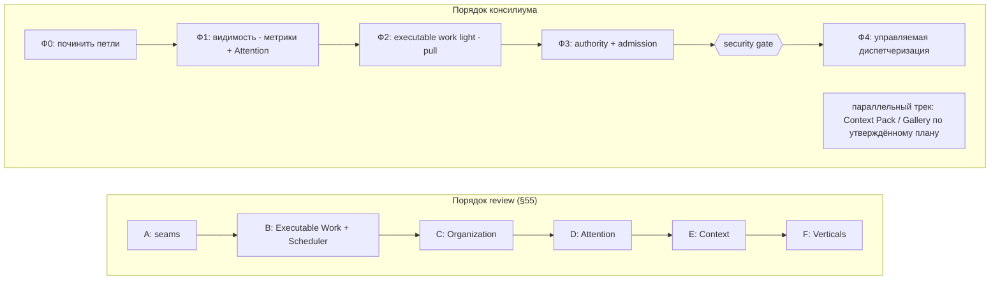
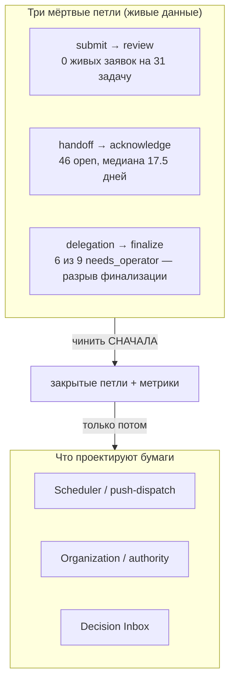
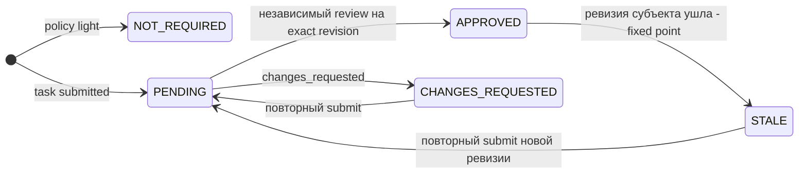
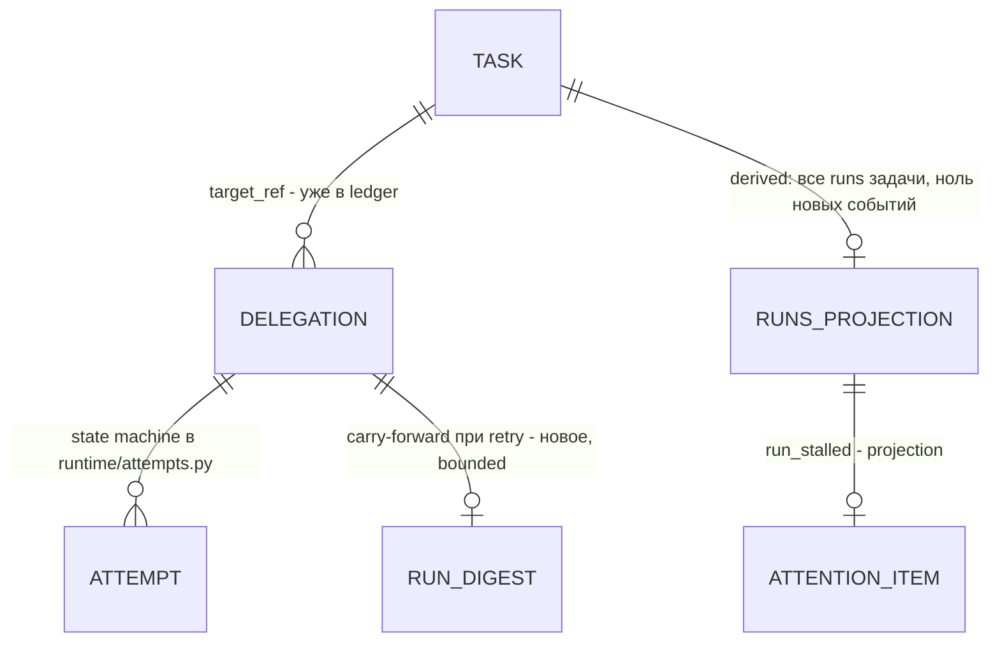
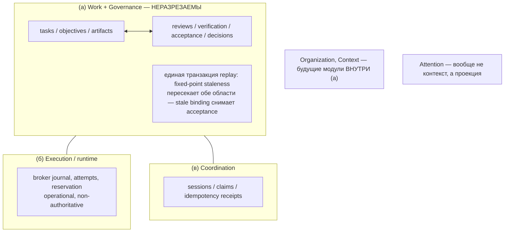
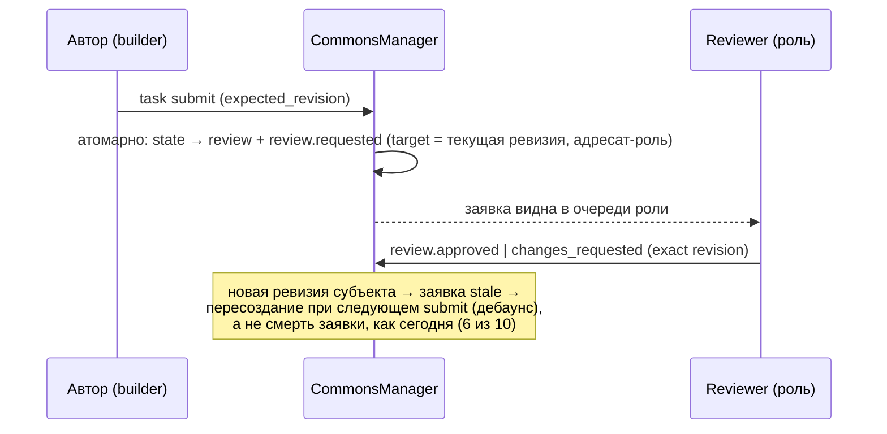
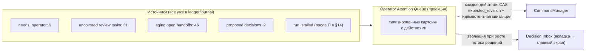
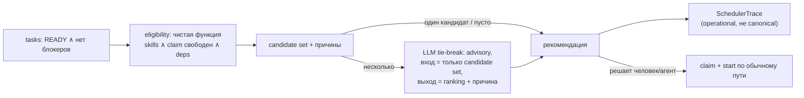
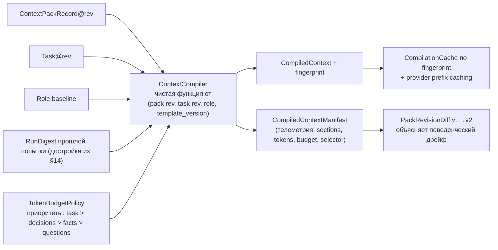
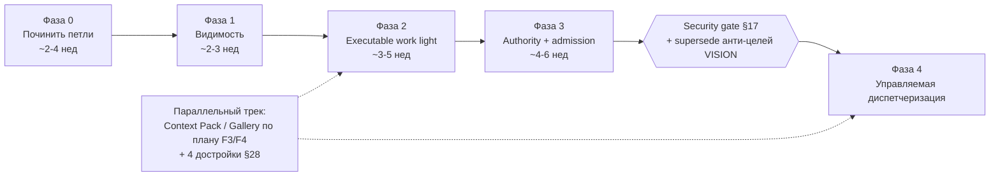

# Agent Commons: консилиумный review архитектурных улучшений

**Дата:** 25 августа 2026 (живой срез workspace — 24 августа 2026)
**Жанр и статус:** review-документ. Всё изложенное ниже — анализ и **предложения**, а НЕ принятые decisions. Правда проекта в Agent Commons продвигается только явно, по контракту commons: отдельным decision с evidence, exact revision и операторской властью. Ни один пункт этого документа не становится правдой проекта фактом своей публикации; конфликт этого документа с существующим review остаётся честно неразрешённым, пока оператор не примет резолюцию.
**Состав консилиума:**

- **LLM/Agent Architect** — context engineering, eval-петли, multi-agent оркестрация;
- **CTO / Technical Director** — canonical ledger, миграции, security-секвенирование;
- **ML Team Lead** — операционная линза, живая диагностика workspace, agent-llm-evals;
- **Product Manager** — синтез, структура SCQA/Pyramid, этот документ.

**Исходники:**

- `agent_commons_product_architecture_review.md` — существующий review (2607 строк, 63 секции, срез `f998e33`); ссылки вида «review §N» ниже указывают на его секции;
- анализ PRD «CompanyOS» и рекомендации Claude о применимости его идей к Agent Commons;
- живой срез workspace ветки `codex/context-gallery-program` (24 августа 2026, read-only CLI + подсчёт по проекции);
- проверка кода: `src/agent_commons/runtime/{broker,policy,attempts,model}.py`, `src/agent_commons/services/{manager,delegation_instruction}.py`, `src/agent_commons/domain/{attention,transitions,lifecycle}.py`, `src/agent_commons/evals/catalog.py`, `src/agent_commons/storage/idempotency.py`, `docs/{VISION,ARCHITECTURE,PROTOCOL,THREAT_MODEL,ROADMAP,context-pack-gallery-implementation-plan}.md`, ADR 0001/0003/0004/0009.

**Revision boundary этого документа:** текущий checkout на момент синтеза — `4844fdbc95adc12ed9b11937d1eb6415f3fb3ba6` (`git rev-parse HEAD`); working tree dirty до создания этого review. Числа живой проекции относятся к read-only срезу 24 августа и не заменяют canonical ledger или evidence, привязанные к exact revision.

---

# 1. Executive verdict

Главный вывод консилиума помещается в три строки:

```text
диагноз review  — ВЕРЕН:    coordination workspace должен вырасти
                            в organizational control plane;

метод review    — НЕВЕРЕН:  не миграция ledger, не новые canonical-сущности,
                            не ранний scheduler — а derived-проекции поверх
                            нетронутой канонической истории;

порядок review  — НЕВЕРЕН:  не диспетчеризация сначала, а починка трёх
                            измеримо мёртвых петель обратной связи, метрики
                            и Attention — до любого повышения автономии.
```

Три причины, каждая с доказательной базой.

**Причина 1. Ядро Agent Commons — не просто «сильное», это одновременно governance-moat и готовый eval-субстрат.** Существующий review прав, что ядро переписывать нельзя (review §2, §62), но недооценивает его вдвойне. Во-первых, revision-bound evidence, независимость review по principals, идемпотентные квитанции и fail-closed делегация — это дифференциатор, который PRD CompanyOS даже не формулирует (см. §41). Во-вторых, каждый run оставляет типизированный, ограниченный, привязанный к ревизии канонический след — то есть trace-инфраструктура для eval-петли, которую в agentic-системах обычно строят с нуля, здесь является побочным продуктом домена. Живой workspace подтверждает: 67 из 67 review-вердиктов `independent=true`, staleness реально ловит устаревшие суждения (23 stale вердикта из 67).

**Причина 2. Метод review дороже и опаснее, чем derived-путь, дающий тот же результат.** ExecutionState/AcceptanceState (review §6) и AcceptancePolicy (review §7) выводимы из существующих событий на replay без единого нового event type; delegation уже является Run во всём, кроме имени (проверено по `runtime/attempts.py`, см. §14); из семи предложенных bounded contexts (review §37) реальных границ консистентности три (см. §15). Миграция canonical-модели с живой историей из 1215 событий — это необратимое сужение совместимости чекаутов при нулевом продуктовом выигрыше относительно проекции.

**Причина 3. Живые цифры workspace опровергают порядок фаз review.** Review ставит Scheduler в P0 (review §18, §50), а Attention — в фазу D (review §55). Но в реальном workspace диспетчеризовать почти нечего (ready = 4, active = 3), тогда как закрытие работы стоит: 31 задача в `review` без единого живого review-запроса, 46 открытых handoffs с медианой 17.5 дней, 29% терминальных делегаций в `needs_operator` (из них 2/3 — продуктовый дефект финализации), objectives = 0. Автономный приток работы в систему, не умеющую закрывать собственные петли, — это генератор незакрытой работы с красивой схемой.

Разница порядков наглядно:



Итоговая формула консилиума: **autonomy настолько, насколько её покрывает существующий governance** — и ни шагом дальше, пока петли обратной связи не закрываются и не измеряются.

---

# 2. Как читать этот документ

Документ построен по Pyramid Principle: вердикт — в §1, доказательная база — в §5–11 (живой диагноз), несогласия с review — в §12–18, конструктивные проекты — в §19–31, красные линии — в §32, пересобранный roadmap — в §33–39, протокол разногласий консилиума — в §40, сравнение с PRD CompanyOS — в §41, итоговая оценка — в §42–43.

Правила чтения:

1. Каждое крупное предложение несёт явный блок trade-offs: **что выигрываем / что платим / чем рискуем / когда пересмотреть**.
2. Ссылки «review §N» указывают на секции `agent_commons_product_architecture_review.md`; ссылки на код — на актуальные файлы ветки.
3. Числа взяты из живой проекции (read-only CLI, 24 августа 2026). Расхождение с более ранним orient-снимком брифа (22 задачи в review против 31 в живой проекции) разрешено в пользу живых данных — само расхождение за считанные дни иллюстрирует скорость накопления склада.
4. Несогласия экспертов сознательно не сглажены: там, где консилиум не сошёлся, dissent зафиксирован в §40 — это требование контракта commons (decision с dissent сильнее декоративного консенсуса).

---

# 3. Сводная карта вердиктов по существующему review

| Секции review | Тезис review | Вердикт консилиума |
|---|---|---|
| §2.1–2.7, §62–63 | Ядро сильное, не переписывать | **Подтверждаем и усиливаем**: ядро = moat + eval-субстрат (§4) |
| §14 | Vector DB не сейчас | **Подтверждаем** + измеримый критерий наступления «сейчас» (§4) |
| §16, §17 | A2A и MCP — не ядро | **Подтверждаем безоговорочно** (§4) |
| §19–20 | Work Graph > Kanban; без Jira-иерархии | **Подтверждаем** (§4) |
| §26–27 | create_task ≠ start_task; admission gate | **Подтверждаем принцип**, добавляем механику анти-взрыва (§30) |
| §28 | Templates без marketplace | **Подтверждаем** (§4) |
| §29 | Organization theatre | **Подтверждаем и превращаем в проверяемый инвариант** (§29) |
| §33–34 | SQLite оставить; без Kafka/Temporal | **Подтверждаем** (§4) |
| §35, §58.2 | Риск бесконечного structural refactor | **Подтверждаем; ситуация хуже описанной** — нужен stop-лист (§4, §34) |
| §36 | CommonsManager → composition facade | **Частично**: точечно, по потребности коллабораторов, не сплошняком (§4) |
| §39 | Persist decisions, derive views | **Подтверждаем — лучшая одиночная формулировка review** (§4) |
| §6–7 | ExecutionState/AcceptanceState + AcceptancePolicy как новые canonical | **Ось верна, слой неверен**: derived-проекции, не миграция (§12–13) |
| §5, §58.4 | Delegation опустить до Run | **Отклоняем в этом виде**: delegation уже Run; строить projection + digest (§14) |
| §8, §37, §56 | Семь bounded contexts | **Отклоняем в этом виде**: реальных границ консистентности три (§15) |
| §18, §50, §55, §58.1 | Scheduler в P0, Attention в фазе D | **Отклоняем порядок**: Attention и петли раньше; push только за security gate (§16–17) |
| §21, §31, §58.3 | Decision Inbox выше Gallery; Gallery понизить | **Наполовину**: Inbox/Queue — да, Gallery-трек не останавливать (§23, §39, §40) |
| §23–24 | Многоуровневая эскалация | **Отклоняем при текущем масштабе** — это theatre по меркам самого review §29 (§40) |
| — | (отсутствует) | **Крупнейшие пробелы review**: eval-петля, миграционный контракт ledger, security-секвенирование, живой диагноз петель, судьба objectives = 0 (§5–11, §13, §17, §18) |

---

# 4. Что консилиум подтверждает в review

Прежде чем спорить, зафиксируем согласие — оно охватывает большую часть фундамента.

**Review §2.1–2.7 (ядро).** Разделение `completed`/`accepted`, независимость review по принципалам (сессия + роль, накопленный work-author set), fixed-point staleness (stale binding → stale review → снятие acceptance), fail-closed брокер, narrow MCP, единый service boundary, rebuildable projection — сохранить без принципиальных изменений. Это подтверждено не только чтением кода (1106 проходящих тестов, ~37 kLOC src / ~38 kLOC tests), но и боевым workspace: механизмы реально работают на 117 задачах и 67 review.

**Review §14 (vector DB не сейчас).** Согласие всех троих экспертов, с уточнением от LLM Architect — измеримые триггеры наступления «сейчас», любой из: (а) context-recall eval показывает, что >15–20% gold-релевантных записей не находятся structured+FTS селектором; (б) rediscovery rate — повторное репортование findings, эквивалентных resolved (сейчас 17 reported / 7 resolved — считать стоит уже сегодня); (в) workspace стабильно >5–10k записей и p95 времени selection мешает компиляции контекста. До того — graph-adjacent structured selection, затем SQLite FTS5 поверх существующей проекции. Красная линия неизменна: `vector index = derived, rebuildable, never truth`.

**Review §16–17 (A2A/MCP не ядро).** Внутри одного control plane типизированные domain commands строго доминируют над протокольной прослойкой: у них уже есть CAS (`expected_revision`), идемпотентность и schema-валидация — A2A пришлось бы дублировать всё это поверх. ARCHITECTURE уже называет AHP-адаптер «replaceable optional edge». Попытка гнать lifecycle через MCP-семантику long-running tasks сломала бы доказанное тестом свойство единственного write path.

**Review §19–20 (Work Graph > Kanban, без Jira-иерархии).** `Objective → Task(+parent, +deps)` — достаточная онтология; всё остальное — projections.

**Review §28 (templates без marketplace), §33–34 (SQLite; без Kafka/Temporal/microservices).** Согласие без оговорок. Temporal решает durable execution — журнал брокера + reservation-before-spawn + reconciliation уже решают ту же задачу на локальном масштабе честнее (fail-closed вместо auto-retry).

**Review §35 / §58.2 (риск бесконечного structural refactor).** Согласие, и ситуация хуже, чем описано: ветка уже на 45 коммитах вида «Extract X Commands» / «Introduce Frozen Y Projection Record», пока review-конвейер стоит 18+ дней. Критерий «какую продуктовую capability разблокирует этот refactor» — правильный stopping rule, но он неоперационален без явного stop-листа; консилиум даёт его в §34.

**Review §36 (composition facade) — с оговоркой.** Текущая MRO-композиция 12 command-миксинов `CommonsManager` (1307 строк) — приемлемый шов: единый `__init__`, общие `record_event`/validate. Конвертация в объект-композицию оправдана точечно — там, где коллаборатору нужен независимый жизненный цикл (`DelegationRuntimeService` уже так живёт). Facade ради facade — минус недели.

**Review §39 (persist decisions and facts; derive views).** Лучшая одиночная формулировка всего review и фундамент половины предложений этого документа: Attention, Pulse, workload, метрики, scheduler traces, context manifests — только проекции, никогда — canonical events вида `WorkloadCalculated`.

**Review §45 (cost hooks сейчас, billing потом), §46 (model routing не свойство Role), §47 (не переоценивать агентские метрики).** Согласие; поправка к §47 — системные счётчики (needs_operator rate, rework, review latency) нужны не «потом», а вчера: без них проект 18+ дней не видел остановку собственного review-конвейера. С персональными рейтингами агентов согласны подождать.

---

# 5. Живой срез workspace: цифры против намерений

Это гвоздь документа. ML Team Lead не поверил брифу на слово и прогнал read-only команды по текущей проекции (`agent-commons --read-only --json task list | review list | handoff list | delegation list` + подсчёт по state/stale/independent/возрастам). Реальность на 24 августа 2026:

```text
tasks:       117 всего:  28 accepted / 41 completed / 31 review /
                          4 ready / 3 active / 10 cancelled
reviews:      67 всего:  41 approved / 16 changes_requested / 10 requested
                          ВСЕ 67 — independent=true
stale:        23 из 67 review-вердиктов stale (34%)
handoffs:     46 open / 13 acknowledged; медиана open = 17.5 дней,
              max 35 дней, 24 из 46 старше 14 дней
delegations:  15 succeeded / 9 needs_operator / 3 failed / 4 cancelled
              → needs_operator = 29% терминальных (9/31)
decisions:    30 accepted / 2 proposed
findings:     17 reported / 7 resolved
objectives:   0
ledger:       1215 событий, 4.9 MB, ~4 KB/событие, 128 манифестов
ветка:        45 коммитов структурной работы над main
```

Из этого среза следуют пять фактов (§6–10), которых нет ни в review, ни в рекомендациях Claude — и которые меняют приоритеты сильнее любой архитектурной дискуссии.

---

# 6. Факт 1. Review-конвейер физически разорван

Из 31 задачи в состоянии `review` **ноль** имеют открытый `requested` review, привязанный к ним. Все 10 открытых review-запросов целятся в задачи, которые уже `accepted` (7) или `completed` (2) — это висячие заявки, 6 из 10 уже stale, самой свежей 18 дней.

```text
                 склад                            очередь ревьюера
   ┌────────────────────────────┐        ┌─────────────────────────────────┐
   │ 31 задача в state=review   │        │ 10 requested review             │
   │ ни одной живой заявки      │   ✂    │ все — на уже accepted/completed │
   │ возраст: 18–35 дней        │        │ 6 из 10 stale                   │
   └────────────────────────────┘        └─────────────────────────────────┘
        полный склад                          пустая очередь
```

Механика разрыва: переход задачи в `review` (`task submit`) и создание review-запроса — два несвязанных действия, и агенты стабильно делают первое без второго. Очередь review не «перегружена» — она **пуста при полном складе**: ревьюить некому нечего, потому что заявок нет.

Следствие для архитектурного спора: review §18 предлагает scheduler, наращивающий приток в эту очередь. Консилиум предлагает сначала починить сцепку (проект в §20) — это дешевле любой новой сущности и устраняет целый класс «молчаливо неревьюемой» работы.

---

# 7. Факт 2. needs_operator — на 2/3 продуктовый дефект, а не сбой LLM

Разбор всех 9 живых `needs_operator` (29% терминальных делегаций):

```text
6 × «The provider exited successfully but did not record a canonical
     terminal result» — провайдер отработал, канонической финализации нет
     (разрыв process_finished / canonical_finalization);

1 × воркер сделал работу полностью, но не смог финализировать: у сессии нет
     artifact:write/review:write, а commons_succeed_delegation требует
     существующий typedRef (delegation.4VM28CTT…: «Requesting operator
     registration of the artifact/review… so the delegation can be finalized»);

1 × рассинхрон AGENT_COMMONS_STATE_BASE воркера с workspace
     (delegation.56ZPSZ3B…);

1 × задача на три подсистемы в 40-минутный однопопыточный бюджет +
     песочница без CLI (delegation.2WXFJ54N…).
```

Это не «модель не справилась». Это три отсутствующих продуктовых механизма:

1. **канал финализации для capability-бедных воркеров** — родительская сторона брокера должна уметь превращать bounded-отчёт воркера в canonical artifact + terminal result своей властью (§21);
2. **preflight окружения воркера** до запуска модели — state-base, CLI из песочницы, видимость требуемых MCP-write-инструментов (§21);
3. **admission-проверка влезаемости задачи в бюджет исполнения** (§30).

Бонус: 9 живых кейсов — это готовый labelled dataset для триажа классов отказов (data flywheel, которого review не заметил). Первое практическое действие любого roadmap — каждой из 9 присвоить `failure_class`, каждому классу — либо фикс, либо eval-кейс.

---

# 8. Факт 3. Handoff-долг: 46 открытых передач с медианой 17.5 дней

По замыслу (ONBOARDING требует handoff с blockers и next actions) handoff — передача эстафеты, обязанная быть принятой. По данным — журнал, притворяющийся передачей: 46 open против 13 acknowledged, медианный возраст open — 17.5 дней, максимум 35, 24 из 46 старше двух недель. Next actions в них протухли вместе с ревизиями.

Отягчающее: адресация — зоопарк спеллингов (`local-operator`, `operator`, `maintainer`, `role:maintainer`, `*`, сырые session id, stable-instance id). Проект уже ловил канонический инцидент невидимых префиксованных handoffs — finding.7B0CXG5QTQ5SCY2JMCTW7W2SVH, комментарий прямо в `views.py::addressed_spellings`. Читающую сторону починили матчером, но writer-сторона всё ещё принимает произвольные строки — следующий вариант того же бага гарантирован.

Review §41 прав, что handoff — не основной носитель знания, но рецепт консилиума другой: не «понизить роль handoff», а **починить его петлю** — typed recipients, supersede-by-newer, expiry-как-эскалация (§24).

---

# 9. Факт 4. objectives = 0: верх воронки не существует

Весь верх целевой воронки review (Objective → Organization → Work Graph, review §3, §48, §55) построен на сущности, которую реальный оператор не использовал **ни разу**. Следствия:

- North Star review §48 («доля работы от objective до accepted без вмешательства founder») и Autonomous Work Ratio из рекомендаций Claude **невычислимы** — у дроби нет знаменателя;
- admission gate по objective-релевантности (review §27) — процесс без входа;
- метрика №0 любого дашборда — не AWR, а **objective coverage**: доля активных задач, привязанных к objective, начиная с посева 2–3 реальных objectives (операторская работа на час).

Гипотеза CTO, требующая проверки до строительства rollup: оператор ставит работу через чат и tasks напрямую — тогда сначала нужно понять, почему objectives неудобны, а не навешивать на них gate.

---

# 10. Факт 5. DX: онбординг окна из 8 шагов и сломанный read-only orient

`agent-commons --read-only --json orient` падает с `LifecycleConflictError: "an explicit active session is required for writes"`. Orientation — первая команда любого окна — не работает без полной церемонии session start (7 флагов + eval + приватный nonce), при том что `--read-only review list` / `task list` / `handoff list` работают: orient тащит write-путь (session-адресация/синхронизация) там, где обязан быть чистым read.

Полный онбординг окна сегодня — 8 шагов: читать ONBOARDING → doctor → session show → session start → orient → inbox → task list → claim list; doctor при этом платит index-cost за всех («normal canonical writes deliberately do not pay that index cost»). Стоимость: ~10 минут церемонии и заметная доля контекстного окна **каждого** окна — то есть системный налог на всё остальное. Review §42 говорит об эволюции orient в Context API, но не замечает, что базовый orient сломан в read-only. Рецепт — композитная команда `start` (§25).

---

# 11. Главный операционный вывод: петли раньше диспетчера

Обе бумаги (review на 63 секции и рекомендации Claude) проектируют **новые** петли — scheduler, organization, decision inbox. Между тем три уже существующие петли обратной связи измеримо мертвы:



Закон пропускной способности решает спор о приоритетах: узкое место этого workspace — не dispatch (ready = 4, active = 3 — диспетчеризовать почти нечего), а закрытие работы (review + completed = 72 задачи в незакрытых состояниях против 28 accepted). Scheduler увеличит приток в очередь, которая уже не течёт. Автономность поверх разорванных петель = быстрее наполняющийся склад незакрытой работы.

### Рекомендация

Принять «петли раньше диспетчера» как организующий принцип roadmap (§33): Фаза 0 целиком посвящена трём петлям и DX, и ни один шаг к автономии не делается, пока метрики петель не зелёные.

---

# 12. Несогласие 1. ExecutionState/AcceptanceState — derived-проекция, а не миграция (review §6–7)

**Позиция CTO, поддержана консилиумом.** Разделение осей «выполняется ли работа» и «принята ли она» (review §6) — концептуально верное. Но review молчаливо предполагает миграцию канонической модели: две новые state machines, новые event families, переписывание ~1100 строк `domain/lifecycle.py` с боевыми инвариантами. Это не нужно и опасно.

Ключевое наблюдение: двухосное состояние — **тотальная функция от существующей истории**. Обе оси выводимы на replay из текущих событий без единого нового event type:

```text
task.completed                → execution = DONE
task.submitted                → acceptance = PENDING
review.approved (bound)       → acceptance = APPROVED
stale binding (fixed-point)   → acceptance = STALE
policy = light                → acceptance = NOT_REQUIRED
reopened                      → execution = IN_PROGRESS, acceptance сброшена
```

Более того, fixed-point projection **уже** вычисляет acceptance-ось отдельно: stale binding снимает acceptance, оставляя задачу в `review`; «accepting the reviewed task does not stale that approval; reopening or changing the reviewed subject does». Acceptance уже де-факто derived state — review предлагает канонизировать то, что достаточно спроецировать.

Derived-ось acceptance как state-диаграмма (вычисляется на replay, не пишется в ledger):



**AcceptancePolicy (review §7) — не изобретать параллельный словарь.** LIGHT/STANDARD/VERIFIED/HUMAN на 70% реифицируют уже задокументированные operating modes `light / standard / governed` (PROTOCOL §12, README), для которых roadmap MVP-1 прямо обещает «machine-enforced configuration presets». Правильная форма — перенос существующего режима с уровня «договорённость протокола» на уровень **additive-поля задачи** (с дефолтом из workspace), с существующими именами. Критично: LIGHT обязан проецироваться в `acceptance = NOT_REQUIRED`, а **не** в автоматический `task.accepted` — фабрикация acceptance-событий без review сломала бы протокольный инвариант MVP-0 «acceptance binds current independent approval».

Операционная выгода немедленная (ML Team Lead): 41 задача висит в `completed` навсегда, потому что единственный честный терминал — `accepted` через обязательный независимый review. LIGHT-политика законно осушит заметную часть склада для docs/низкорисковых задач, не ослабляя review там, где он нужен.

### Рекомендация

Двухосную модель делать в две ступени: (а) derived-only в проекции/DTO, `TRANSITION_SPECS` для существующих типов не меняется, golden-replay без диффа; (б) только если через 2–3 квартала derived-модель окажется тесной — рассматривать нативные event types, с миграционным контрактом §13 и минимум одним released-циклом между ступенями. AcceptancePolicy — additive-поле задачи с именами `light/standard/governed`, назначается при создании, меняется только оператором.

### Trade-offs

- **Что выигрываем:** та же выразительность модели за 1–2 недели вместо месяцев; ноль риска для идемпотентности, replay и чужих чекаутов; осушение склада `completed`.
- **Что платим:** двойная бухгалтерия понятий на переходный период — канонический lifecycle остаётся одноосным, двухосность живёт в проекции и UI.
- **Чем рискуем:** derived-таблица разъедется с интуицией канонического lifecycle; лечится golden-replay гейтом и табличными тестами соответствия.
- **Когда пересмотреть:** если появятся команды, которым нужно **писать** по acceptance-оси нечто, невыводимое из существующих событий (например, отдельный акт «принято без review» с собственным аудитом) — тогда ступень (б).

---

# 13. Миграционный контракт ledger — обязательное дополнение к review

**Крупнейший технический пробел review (позиция CTO):** предлагая крупные изменения доменной модели, review не говорит ни слова о том, как их переживёт живая история из 1215 событий и чужие чекауты. THREAT_MODEL фиксирует прецедент `agent.v1`: новая каноническая сущность ломает старые бинарники fail-closed, а откат — только checkout до первого события. Каждое новое event family — необратимое сужение совместимости чекаута; вводить их надо скупо и по контракту:

```text
1. Словарь событий append-only: event_type никогда не переиспользуется
   и не меняет смысл.
2. Payload-схемы версионируются per family: изменение = новая схема (task.v2),
   старые события валидны под своей схемой навсегда. Additive-поля —
   единственное изменение внутри версии (прецеденты: artifact_refs +
   artifact_bindings, extensions.model).
3. Проекция тотальна над всей исторической лексикой: replay отображает старые
   события в новую модель детерминированной, документированной функцией.
   Никакого dual-write двух state machines.
4. Совместимость читателя fail-closed + workspace format epoch: маркер в
   workspace.yaml, чтобы старый бинарник отказывал одним понятным сообщением,
   а не 1215-ю domain_validation_rejected.
5. Golden-replay в CI: зафиксированный снапшот реального ledger-а реплеится
   новым кодом; результат сравнивается с эталонной проекцией. Любой diff —
   осознанный, в коммите с эталоном.
6. Новые оси состояния проходят две ступени: (а) derived-only в проекции;
   (б) только когда стабильно — новые event types. Между (а) и (б) —
   минимум один released цикл.
```

### Рекомендация

Принять контракт decision-ом **до** любых изменений доменной модели; golden-replay гейт поставить в CI в Фазе 0 — он дешевле всего и защищает и от этого документа тоже.

### Trade-offs

- **Что выигрываем:** предсказуемая эволюция схем; страховка чужих чекаутов; возможность вообще обсуждать изменения модели без страха аварии.
- **Что платим:** дисциплина versioned-схем и поддержка эталонного снапшота (обновление эталона — осознанный шаг в каждом меняющем проекцию PR).
- **Чем рискуем:** эталон превратится в «шумный» файл при частых легитимных изменениях проекции; лечится нормализованным форматом эталона и правилом «diff объясняется в описании PR».
- **Когда пересмотреть:** при переходе к single-writer сервису (потолок 4 из §15) контракт расширяется, но не отменяется.

---

# 14. Несогласие 2. Delegation уже есть Run (review §5, §58.4)

**Позиция LLM/Agent Architect, поддержана CTO.** Review предлагает «опустить delegation до уровня Run» и ввести first-class `ExecutionRun` (review §5, §50). Проверка по коду показывает: delegation **уже является** Run во всём, кроме имени:

- exact target binding + `target_revision` в момент request;
- attempt state machine `RESERVED → LAUNCHING → RUNNING → терминал` с `NEEDS_OPERATOR` (`src/agent_commons/runtime/attempts.py`);
- «Retry after a terminal outcome creates a new delegation rather than rewriting the old one» (ARCHITECTURE.md);
- reconcile после crash; `launch_plan_sha256`; разделение process_finished / canonical_finalization.

Переименование в `ExecutionRun` — это миграция canonical-схемы с 31 живой делегацией в истории, которую нельзя переписывать (§13), ради нулевой новой семантики. Дороже того: ARCHITECTURE прямо предупреждает, что run, смоделированный как инстанс роли, «invites inheriting the role's context» — свежая child session на каждый запуск является **механизмом** независимости review, и обобщение Run обязано его пережить.

Реальные дыры не в онтологии, а в эргономике — три дешёвых достройки:



1. **Task-side runs projection**: `task_runs(task_id) → [{delegation, attempts, outcome, cost}]` из существующих `target_ref` — ноль новых событий. Закрывает вопрос review §4 («runs как грань Task») бесплатно.
2. **RunDigest carry-forward**: при retry (которая и так «новая delegation») компилятор кладёт в инструкцию ограниченный digest прошлой попытки — `{prior_delegation, outcome, failure_class: revision_moved | tool_protocol | timeout | scope, operator_note ≤ 500 chars, no transcripts}`. Сегодня оператор переносит контекст неудачи руками, что при 29% needs_operator дорого.
3. **Stalled detection**: heartbeat-порог поверх существующей телеметрии (`stdout_bytes_seen`/milestone spans): «RUNNING и нет прогресса N минут» → attention item `run_stalled` (projection), без вмешательства в state machine. Активная отмена живого процесса без доказательства смерти остаётся запрещённой (комментарий в `domain/transitions.py` — это инвариант, не TODO).

Схема CTO «Run поверх, а не вместо»:

```text
        сейчас                          целевое (аддитивно)
  Task ──► Delegation ──► process    Task ──► Run (read/service-слой)
                                              ├─ impl v1: Delegation (события те же)
                                              └─ impl v2+: местная сессия, remote, ...
```

### Рекомендация

Семантику Run строить как projection + relation над существующей delegation (фасад в сервис-слое), не как новую canonical сущность. Это в 5–10 раз дешевле и не трогает идемпотентность. Обобщение обязано сохранить: target_ref+target_revision в момент запроса; свежую child session на каждый запуск; terminal ⇒ новый Run; ambiguity ⇒ needs_operator.

### Trade-offs

- **Что выигрываем:** видимость «все попытки задачи X», автоматическая память попыток при retry, ранняя видимость зависших runs — без миграции и без риска для независимости review.
- **Что платим:** «Run» первое время — фасад над delegation-словарём; в терминологии кода и UI сосуществуют два слова.
- **Чем рискуем:** digest попадает в инструкцию — значит обязан проходить тот же security scan, что и любой canonical текст (instruction injection — Untrusted Inputs №1 в THREAT_MODEL).
- **Когда пересмотреть:** при появлении второго типа исполнения (местная сессия без брокера, remote runtime) — тогда Run-фасад получает вторую реализацию, и только если фасада не хватит, обсуждать канонизацию по контракту §13.

---

# 15. Несогласие 3. Семь bounded contexts — оверинжиниринг (review §8, §37, §56)

**Позиция CTO + LLM Architect.** Как карта модулей диаграмма review §37 безвредна; как декомпозиция с интерфейсными границами — работа против review §35 при команде из 1–2 человек. Реальных границ **консистентности** в коде три:



Почему Work и Governance неразрезаемы: fixed-point staleness — это одна транзакция replay, в которой изменение ревизии артефакта (Work) каскадно инвалидирует review и снимает acceptance (Governance). Разрезать их интерфейсом — значит либо тащить распределённую консистентность внутрь одного процесса, либо сломать сам fixed-point.

### Рекомендация

Диаграмму семи контекстов оставить как документационную карту; интерфейсные границы проводить только по трём фактическим границам консистентности. Organization и Context растить как модули внутри (а); Attention — держать проекцией. `CanonicalEventStore`-интерфейс (review §32) — да, но извлечённый из **фактических** операций: append-immutable, scan-ordered, anchor-check — их три, без спекулятивного будущего Postgres.

### Trade-offs

- **Что выигрываем:** квартал инженерного времени; отсутствие искусственных интерфейсов, которые пришлось бы ломать при первом реальном требовании.
- **Что платим:** структура «менее красивая», чем на диаграмме review §56, ещё N месяцев.
- **Чем рискуем:** модули внутри (а) срастутся сильнее нужного; лечится критерием выхода из фазы швов — «добавление Run + task next + attention-проекции трогает ≤ 3 существующих модулей и 0 существующих event-схем».
- **Когда пересмотреть:** при появлении multi-host/несколько ОС-пользователей (потолок 4 CTO) — тогда граница проходит через single-writer сервис, и разговор о контекстах становится предметным.

---

# 16. Несогласие 4. Порядок фаз: Attention и петли раньше scheduler (review §18, §50, §55)

**Позиция всех трёх экспертов** — самое консенсусное несогласие консилиума.

Аргумент LLM Architect (готовность входов): предикат eligibility review §18 опирается на `required_capabilities ⊆ agent.capabilities`, но capabilities в MVP-0 **самодекларируемые и неаутентифицированные** (ARCHITECTURE: «roles and capabilities coordinate work but cannot prove authority»). Scheduler, диспетчеризующий работу по самодекларациям, — автономия на честном слове.

Аргумент CTO (blast radius): THREAT_MODEL фиксирует — MVP-0 не аутентифицирует акторов, Claude-builder не имеет OS-границы («external isolation is the only boundary»), UI защищён одним bearer-токеном. Диспетчер, сам запускающий писателей в этих условиях, — расширение blast radius без границы.

Аргумент ML Team Lead (пропускная способность): диспетчеризовать нечего (ready = 4), закрывать — есть что (72 незакрытые задачи). Плюс review сам себе противоречит: §21 ставит Decision Inbox высоко, а §55 отправляет Attention в фазу D после Executable Work и Organization.

Правильная лестница:

```text
Этап 0 (сейчас):   task next — pull, advisory, детерминированный:
                   candidate set + причины отбора; человек/агент решает сам.
Этап 1:            + записанный SchedulerTrace на каждый вызов
                   (operational, не canonical).
Этап 2 (за gate):  push-dispatch за фичефлагом, только для задач
                   с AcceptancePolicy >= standard, с бюджетом запусков на окно.
LLM tie-break:     всегда advisory; вход = только candidate set;
                   выход = ranking + причина; пишется в trace;
                   смена модели = смена policy_version.
```

И честность требует зафиксировать то, что review признаёт лишь мимоходом: scheduler и автозапуск противоречат явным анти-целям VISION.md («not a general autonomous model launcher, open-ended task scheduler»). Любой шаг туда обязан начинаться с явного supersede соответствующих decisions — не с тихой эрозии анти-целей.

### Рекомендация

Схема фаз — в §33–38: Attention/метрики/петли (Фазы 0–1) → pull-исполнение (Фаза 2) → authority/admission (Фаза 3) → security gate → push (Фаза 4). Формула review §58.1 «догнать dispatch до уровня governance» отклоняется в пользу «autonomy настолько, насколько её покрывает существующий governance».

### Trade-offs

- **Что выигрываем:** каждый вызов `task next` генерирует labelled data (приняли ли рекомендацию) — честная основа для любого будущего LLM-ranker; автономия включается на закрытых петлях, а не поверх склада.
- **Что платим:** отказ от «wow»-автозапуска минимум на квартал.
- **Чем рискуем:** pull-режим не создаст ощущения прогресса к автономии; лечится измеримым критерием выхода каждой фазы (§34–38) — прогресс виден в метриках, а не в демо.
- **Когда пересмотреть:** после месяца review coverage = 100% и needs_operator < 10% — тогда Этап 2 за security gate.

---

# 17. Security gate: цена любого push-dispatch

Развёрнутое условие «этапа 2» (позиция CTO, поддержана консилиумом). Ни один пункт ниже не является опцией:

1. **OS-граница для писателей.** Пока Claude-builder без OS-sandbox, автономный запуск ограничивается Codex-профилями с `--sandbox workspace-write` + read-only independent-reviewer; Claude-builder — только ручной операторский запуск до появления внешней изоляции (контейнер/VM). THREAT_MODEL это уже говорит; сделать энфорсом в конфиге диспетчера (тест: конфиг отвергает автозапуск writable-профиля без OS-границы), а не рекомендацией.
2. **Авторитет диспетчера = операторский grant** по образцу broker grant: локальный, вне workspace, не выводимый из session capabilities. Scheduler не наследует самодекларации сессий.
3. **`auto`-грант на создание ролей остаётся withheld** до и во время включения диспетчера: не совмещать два повышения автономии в одном релизе (паттерн THREAT_MODEL «механизм готов, уровень withheld» — правильный шаблон).
4. **Периодные бюджеты** (units/день на роль и на workspace) — только в operator-owned конфиге брокера. THREAT_MODEL объясняет, почему ceilings нельзя класть в `workspace.yaml`: он лежит внутри делегированного workspace и писабелен builder-ом с `--sandbox workspace-write`. Рекомендации Claude этот нюанс не проговаривают — консилиум фиксирует его как обязательный.
5. **Routing только по типизированным полям.** Диспетчер и escalation не читают прозу задач (instruction injection — Untrusted Inputs №1 в THREAT_MODEL). Отсюда минимальная типизация коммуникаций: `Consultation` и `DecisionRequest` сейчас, остальные четыре типа review §12 — по потребности.

### Trade-offs

- **Что выигрываем:** автономия с границей: компрометация одного writable-воркера не превращается в компрометацию оператора; бюджеты не редактируются самим агентом.
- **Что платим:** push-автономия для Claude-профилей отложена до внешней изоляции; операторский grant — ещё одна ручная настройка.
- **Чем рискуем:** gate воспринимается как бюрократия и обходится «временными» флагами; лечится тестом-энфорсом в конфиге и красной линией §32.
- **Когда пересмотреть:** при появлении аутентификации акторов и OS-изоляции обоих провайдеров — состав gate пересматривается, но принцип «граница до автономии» — нет.

---

# 18. Несогласие 5. Отсутствие eval-петли — крупнейший пробел review

**Позиция LLM/Agent Architect, для ML Team Lead — «дисквалифицирующий пропуск».** В 63 секциях review нет ни слова о том, **как узнать**, что autonomous loop работает. Success-критерии фаз B–E (review §55) — демо-сценарии («система сама найдёт/запустит/разблокирует»), не измеримые пороги. Для документа об архитектуре автономности это не мелочь: автономия без регрессионного гейта — это генератор неревьюенного поведения.

При этом каркас уже существует и review его не заметил: `src/agent_commons/evals/catalog.py` — 25 кейсов, 8 implemented, версионированный `CATALOG_VERSION`, честные статусы planned/unsupported («reported as non-passing rather than simulated» — редкая дисциплина) и `MetricsAggregate` с полями `pass_at_1`, `pass_power_k`, `needs_operator_rate`.

Ключевая мысль: **ledger — это типизированный trace.** Грейдер читает не транскрипт, а канонический след run-а. Три уровня поверх существующего каталога:

```text
L1  Protocol evals (есть: 8 implemented) — CLI/state/safety, детерминированные.
L2  Runtime evals (planned → implemented) — DeterministicFakeProvider прогоняет
    broker/attempts через сценарии: crash-reconcile, active-cancel-receipt,
    budget-exhaustion, claims-overlap. Грейдер = deterministic_state.
L3  Ledger-graded agent-work evals (новое) — golden tasks в fixture workspace,
    реальный provider, opt-in (как уже требует ROADMAP).
    Грейдер читает НЕ транскрипт, а канонические события сессии:
      - терминальный outcome-tool вызван (не prose-only exit);
      - review привязан к exact revision;
      - changed paths ⊆ claim;
      - для reviewer — ни одной write-мутации артефактов;
      - expected_revision перечитан перед outcome.
    LLM-as-judge — только вторым слоем и только над bounded records.
```

Что гейтим (самое дешёвое место регрессий — instruction-as-code: шаблон в `services/delegation_instruction.py` — фактически прошивка поведения всех воркеров, и его изменение сегодня не гейтится ничем; `launch_plan_sha256` фингерпринтит argv, но не текст инструкции):

```text
delegation_instruction template change  → полный L2 + L3 smoke, template_version bump
profile flags / permission mode change  → L2 + L3
provider/model version change           → L3 (+ canary через provider_canary)
scheduler policy_version change         → replay исторических SchedulerTrace
```

Порядок промоции planned → implemented — строго по живым инцидентам (правило: каждый кейс указывает canonical finding/delegation, который он бы поймал): `review-pipeline-coupling` (ловил бы Факт 1), `handoff-addressing-roundtrip` (finding.7B0CXG5QTQ5SCY2JMCTW7W2SVH), `delegation-finalization-channel` (ловил бы 6/9), `read-only-orient` (Факт 5), затем из planned — `claims-overlap`, `budget-exhaustion`, `crash-reconcile`, `stale-state-maintenance`. Механика гейта: ратчет (CI падает при регрессии implemented-кейса или уменьшении implemented-count против CATALOG_VERSION); единая таксономия `failure_tags` = reason-коды метрики финализации, чтобы production-инцидент и регрессионный кейс говорили на одном языке; `pass^k` (k=3) для брокер-конкурентных кейсов — для agentic-работы стабильность важнее среднего: флаки-агент хуже слабого.

### Рекомендация

Eval-петля — не отдельная фаза, а сквозная дисциплина каждой фазы roadmap (§33): каждая фаза заканчивается новыми implemented-кейсами и включённым ратчетом. Первое действие — триаж 9 живых needs_operator в failure_class (самый дешёвый датасет, который у проекта уже есть).

### Trade-offs

- **Что выигрываем:** изменения инструкций/профилей/моделей перестают быть слепыми; регрессии семантики оркестрации ловятся до мержа; критерии фаз становятся числами.
- **Что платим:** поддержка каталога и fixture workspaces; L3 с реальным провайдером — деньги (лечится opt-in nightly, как уже принято в ROADMAP).
- **Чем рискуем:** соблазн «симулировать» planned-кейсы ради зелёного гейта — прямо запрещено красной линией §32 (семантика honest non-passing сохраняется).
- **Когда пересмотреть:** при появлении API-провайдеров L3 расширяется на model-routing решения — правило «маршрут только по eval-дельте» делает eval-петлю предпосылкой роутинга.

---

# 19. Синтез: двенадцать проектов консилиума (обзор)

Конструктивная часть документа — двенадцать конкретных проектов, каждый с выгодой, привязкой к живым цифрам и trade-offs. Порядок соответствует roadmap (§33), а не важности «на бумаге»:

```text
П1  Починка review-coupling: submit ⇒ review request        (Факт 1)   §20
П2  Финализация делегаций: parent-side канал + preflight    (Факт 2)   §21
П3  Пять метрик первого дня как проекции                    (Факты 1-4) §22
П4  Operator Attention Queue → эволюция в Decision Inbox    (Факты 1-3) §23
П5  Handoff-гигиена: typed адресаты, supersede, expiry      (Факт 3)   §24
П6  Онбординг окна: композитный start + фикс orient         (Факт 5)   §25
П7  Детерминированный pull task next + SchedulerTrace       (§16)      §26
П8  Authority: decision_scope и review routing              (§16-17)   §27
П9  Context Compiler: бюджет, кэш, манифест, drift          (план F3/F4) §28
П10 Role realness check против organization theatre         (review §29) §29
П11 Anti-explosion механика agent-generated tasks           (review §26-27) §30
П12 Периодные бюджеты и хвост рекомендаций Claude           (§17)      §31
```

---

# 20. Проект 1. Починка review-coupling: submit ⇒ review request

Целевая механика (закрывает Факт 1):



Переход задачи в `review` требует (или атомарно создаёт) review-запрос, привязанный к текущей ревизии и адресованный роли-ревьюеру. При новой ревизии открытый запрос помечается stale и пересоздаётся — с дебаунсом «при следующем submit, а не при каждом artifact update», чтобы частые ревизии не генерировали спам заявок. Плюс разовый операторский backfill: заявки на 31 задачу склада и закрытие 10 висячих запросов через `superseded` (не удаление — canonical history не трогаем).

Ответ на смежный вопрос «не слишком ли строг review»: 16 changes_requested из 67 (24%) — это норма и даже признак здоровья (независимый review с зубами; CR-rate около нуля был бы тревогой — штамповка). Патология не в строгости, а в 50% недоведённых remediation-петель и складе незаявленных задач. Масштабировать review надо не батчингом и не ослаблением критериев, а: routing по декларации (§27), AcceptancePolicy light для низкорисковых (§12), делегированные reviewer-профили (уже есть `independent-reviewer` × 2 провайдера) с бюджетом на N ревью в день.

### Trade-offs

- **Что выигрываем:** review coverage 0% → 100% by construction; исчезает класс «молчаливо неревьюемой» работы; ревьюеру не нужно сканировать доску.
- **Что платим:** +1 связка в lifecycle-переходе; миграционный шов — replay истории, где заявок не было, обязан оставаться валидным (контракт §13).
- **Чем рискуем:** авто-пересоздание заявок при частых ревизиях = спам; лечится дебаунсом.
- **Когда пересмотреть:** при декларативном review routing (§27) адресация заявки переезжает из «роль по умолчанию» в routing-правила.

---

# 21. Проект 2. Финализация делегаций: parent-side канал + environment preflight

Разрыв (7 из 9 живых needs_operator, см. Факт 2):

```text
worker (без artifact:write / review:write)
   │  сделал работу, exit 0
   ▼
broker: process_finished ✓ … canonical_finalization ✗ → needs_operator
   ▼
оператор вручную регистрирует artifact + закрывает delegation   ← 7 раз подряд
```

Двухчастное решение:

**(а) Терминальный отчёт воркера как bounded typed payload** (заявленные пути, чек-суммы, итог), который **родительская сторона** брокера превращает в canonical artifact + terminal result. Воркер не получает новых прав — финализирует parent по своей authority. Гейт против «воркер диктует правду»: отчёт валидируется против фактического диффа рабочего дерева (attestation путей); финализация всегда от parent; `delegation.succeeded` по-прежнему ≠ review approval ≠ acceptance — тройное разделение остаётся несущей стеной.

**(б) Preflight окружения воркера** до запуска модели: state-base совпадает с workspace, CLI доступен из песочницы, требуемые MCP-write-инструменты профиля видимы. Ловит delegation.56ZPSZ3B и половину 2WXFJ54N до сжигания attempt; `broker preflight` уже существует — расширить контракт, а не строить заново.

### Trade-offs

- **Что выигрываем:** finalization_gap 6/9 → ~0; needs_operator остаётся для настоящих ambiguity; операторский ручной труд по 7 кейсам исчезает.
- **Что платим:** parent-side финализация — новый код на границе брокера; строгая схема отчёта.
- **Чем рискуем:** канал отчёта станет generic write path в обход governance — прямо запрещено красной линией §32 (отчёт воркера — данные, не команда).
- **Когда пересмотреть:** при появлении API-провайдеров канал финализации обобщается на них — контракт отчёта проектировать провайдер-нейтральным сразу.

---

# 22. Проект 3. Пять метрик первого дня

Все — проекции над ledger, ни одной новой canonical-сущности (review §39 соблюдён буквально). Считаются за дни, а не недели, и немедленно делают видимыми Факты 1–4 — без них проект 18+ дней не видел остановку собственного review-конвейера.

| # | Метрика | Формула из существующих событий | Сегодня | Anti-gaming ловушка |
|---|---------|--------------------------------|---------|---------------------|
| 1 | Review coverage & age | % задач в `review` с live non-stale requested review на текущую ревизию; медианный возраст задач в `review` | **0%**; 18+ дней | считать только `independent=true` и привязку к exact revision — иначе накрутка самозаявками |
| 2 | Evidence churn | stale вердикты / все вердикты | **34%** (23/67) | не «наказывать» за пересабмит; парная метрика — median time stale→re-review |
| 3 | Handoff half-life | медиана open→acknowledged; % open >14 дней | **17.5 дн; 52%** (24/46) | ack ≠ действие: требовать typed ref на follow-up (task/thread) в acknowledgement |
| 4 | Delegation finalization integrity | needs_operator по машинным reason-кодам (finalization_gap / env_mismatch / scope_overrun / other) | **29%**; 6/9 finalization_gap | классифицировать кодом из телеметрии (`process_canonical_mismatch`), не прозой |
| 5 | Rework loop | CR-вердикты/все вердикты; доля CR-целей, дошедших до approved | **24%** (16/67); **50%** (7/14) | цель — вторая цифра ↑, а не первая ↓: давление на «меньше CR» = rubber-stamping |

Шестая, композитная: **Operator Attention Load** = needs_operator + proposed decisions + open handoffs к оператору + uncovered review tasks (сегодня ≈ 9 + 2 + 9 + 31) — это и есть контент экрана §23. Метрика №0 — **objective coverage** (Факт 4): Autonomous Work Ratio из рекомендаций Claude и North Star review §48 отложены до появления знаменателя.

### Trade-offs

- **Что выигрываем:** остановки петель видны в день возникновения; общий язык порогов (coverage = 100%, half-life < 7 д, finalization_gap < 5%) для всех фазовых критериев.
- **Что платим:** дни работы над проекцией + `pulse`-команда/карточка UI; дисциплина документированных порогов.
- **Чем рискуем:** метрики превратятся в самоцель и начнут геймиться — колонка ловушек обязательна к реализации вместе с самой метрикой.
- **Когда пересмотреть:** после месяца стабильных петель добавить AWR и founder attention load (review §48) — уже с знаменателем.

---

# 23. Проект 4. Operator Attention Queue → эволюция в Decision Inbox

Спор «Decision Inbox first» (Claude, CTO, review §21) против «metrics first» (ML Team Lead) консилиум разрешает объектом, а не порядком: первым строится **Operator Attention Queue** — очередь всего, что ждёт оператора; Decision Inbox — её вкладка, которая станет главной, когда появится поток решений (сегодня proposed decisions = 2 — инбокс из двух карточек не «главная поверхность человека»).



Фундамент уже существует: `src/agent_commons/domain/attention.py::awaits_human` канонически выбирает decision_request/question/proposal к оператору, blocked runs (`input_needed|failed|timed_out|needs_operator`) и «работа вернулась». Осталось построить экран и дополнить анти-сигналами процесса (незаявленные review, stale заявки, aging handoffs) — attention обязан показывать не только «что просят», но и «что молча сломалось».

Обязательное требование (LLM Architect): кнопки очереди (accept/reject/defer decision, acknowledge handoff, resolve needs_operator) идут через существующие мутации с CAS `expected_revision` и идемпотентными квитанциями — никакого «UI-специального» пути записи. Approve-кнопка обязана нести exact revision: кнопка без ревизии — это blind accept.

### Trade-offs

- **Что выигрываем:** оператор начинает день с одного экрана вместо четырёх списков; attention debt (46 handoffs) получает владельца; обязательная операторская приборная панель для будущего включения любой автономии.
- **Что платим:** недели на проекцию + CLI + панель; поддержание типизации карточек.
- **Чем рискуем:** очередь станет вторым write path через «удобные» кнопки — запрещено красной линией §32; либо превратится в бесконечную ленту — лечится порогом Attention Load и expiry-эскалацией (§24).
- **Когда пересмотреть:** когда поток decisions станет сопоставим с потоком операционных сигналов — Decision Inbox выходит на первый план, как и хотели Claude и review §21.

---

# 24. Проект 5. Handoff-гигиена: типизированные адресаты, supersede, expiry

Четыре изменения, закрывающие Факт 3:

1. **Typed recipients при записи:** валидировать `to` против реестра ролей/сессий/agent ids; свободные строки (`operator` vs `local-operator` vs `maintainer`) — источник невидимых handoffs с каноническим инцидентом (finding.7B0CXG5QTQ5SCY2JMCTW7W2SVH; матчер `views.py::addressed_spellings` — лечение читателя, а нужна валидация писателя).
2. **Supersede-by-newer:** новый handoff той же сессии по тому же subject той же аудитории автоматически помечает предыдущий `superseded` (видимо, не удалённо). Orientation показывает только последний на пару (subject, audience). Ключ суперсида обязан включать subject/task ref, не только автора — иначе пересуперсид затрёт различающийся контент двух рабочих потоков одной сессии.
3. **Инбокс-курсор + ack** (уже в roadmap MVP-1) с требованием typed follow-up ref (task/thread) в acknowledgement — ack без действия это ack-спам.
4. **Expiry как эскалация:** open > 14 дней → строка в Attention Queue (§23), не автозакрытие. Авто-acknowledge и авто-закрытие по TTL запрещены красной линией §32.

### Trade-offs

- **Что выигрываем:** инбокс из 46 → ~10–15 живых; чтение инбокса перестаёт стоить полконтекста окна; класс багов адресации закрыт на write-стороне.
- **Что платим:** реестр адресатов — ещё одна валидация на write-пути; supersede-семантика в replay.
- **Чем рискуем:** слишком агрессивный ключ суперсида; лечится включением subject ref в ключ и eval-кейсом `handoff-addressing-roundtrip`.
- **Когда пересмотреть:** если после гигиены медиана open→ack всё ещё > 7 дней — проблема не в механике, а в назначении handoff (тогда прав review §41: снижать роль handoff в пользу Task/Artifacts/Decisions).

---

# 25. Проект 6. Онбординг окна: композитный `start` и фикс read-only orient

Композит `agent-commons start --role <r>` = doctor (bounded) + `session ensure` (идемпотентный: находит живую сессию окна по stable-instance-id + checkout или создаёт; client/software выводится из окружения; nonce — в state, не в глазах агента) + compact orient + inbox одним bounded JSON. Восемь шагов → три. И отдельно — **починить `--read-only orient`**: точная ошибка (`LifecycleConflictError: an explicit active session is required for writes`) — готовый регрессионный eval-кейс `read-only-orient`.

### Trade-offs

- **Что выигрываем:** время-до-полезной-работы окна с ~10 минут церемонии до <1; меньше токенов контекста на старт; skills упрощаются до одного вызова; налог платят все окна — выгода умножается на каждое.
- **Что платим:** новая композитная поверхность, обязанная остаться тонкой обёрткой над теми же manager-вызовами (не параллельная бизнес-логика).
- **Чем рискуем:** `session ensure` «одолжит» чужую сессию; лечится ключом по stable-instance-id + checkout, как уже сделано в идемпотентности (ADR 0003).
- **Когда пересмотреть:** при эволюции orient в Role/Task Context API (review §42) start-композит становится его клиентом.

---

# 26. Проект 7. Детерминированный pull `task next` + SchedulerTrace

Форма из рекомендаций Claude (№4), поднятая в приоритете (CTO: «read-model запрос плюс существующий claim — не требует ни нового словаря grants, ни routing»). Реальность агентных систем: детерминированный предикат отбирает кандидатов почти всегда либо однозначно, либо пусто; LLM-tie-break нужен в <10% случаев, и его главная опасность — не «плохой выбор», а невоспроизводимость и незаписанность причин.



Записанный след каждого вызова:

```json
{
  "trace": "schedtrace.01H...",
  "policy_version": "next-v1",
  "task": "task.X@rev",
  "candidates": [
    {"agent": "agent.backend", "eligible": true,  "score": {"skills": 3, "load": 1}},
    {"agent": "agent.frontend", "eligible": false, "reason": "skills_mismatch"}
  ],
  "tie_break": {"used": false},
  "recommendation": "agent.backend"
}
```

Границы автономии — по классу действия, не по ролям: рекомендация — всегда; назначение (assigned) — auto при policy light/standard; запуск run — только через существующий operator-granted broker path; acceptance/promotion — никогда. Nondeterminism-контракт: identical inputs → identical recommendation (property-тест предвосхищён planned-кейсом `task-next-critical-path` в eval-каталоге); смена policy_version или модели tie-break — replay исторических traces.

### Trade-offs

- **Что выигрываем:** исполняемость работы без капли новой автономии; labelled data о качестве рекомендаций с первого дня; готовый eligibility-предикат для будущего push (Фаза 4 использует тот же, не новый).
- **Что платим:** trace-хранилище растёт — но оно operational/disposable.
- **Чем рискуем:** tie-break незаметно расширит вход с candidate set до полного контекста; запрещено контрактом — вход фиксирован.
- **Когда пересмотреть:** месяц review coverage = 100% + операторский grant → тот же предикат за фичефлагом в push-режиме (§17, §38).

---

# 27. Проект 8. Authority: decision_scope и review routing

Рекомендацию Claude №3 консилиум расщепляет (ML Team Lead): в ней склеены две работы разной цены.

**Дешёвая и срочная половина — review routing:** декларативное «submit → создать review-запрос на роль X» по типизированным признакам работы (paths, tags, task type): security-sensitive → security review, frontend-asset → владелец single-writer asset. Это прямое продолжение П1 (§20) и лечение Факта 1 на стороне адресации. Routing читает только типизированные поля — не прозу (§17, п. 5).

**Дорогая половина — decision_scope:** расширение словаря grants с ролевого домена (сейчас ADR 0009 покрывает только create_roles/retire_roles/open_links) на рабочий: admit_work, assign, approve_low_risk. Строить по образцу ADR 0009: уровни deny/ask/auto, narrowest-wins по цепочке создателей, derived at read time (ничего не хранить-и-распространять), auto принудительно даунгрейдится до ask до отдельного решения. Это расширение канонической модели — новые event families, необратимость чекаутов (§13), — поэтому проектируется после того, как pull-режим (§26) покажет, каких решений реально не хватает, а не до.

Различение трёх слоёв review §9 (capability ≠ permission ≠ authority) консилиум подтверждает — оно и реализуется этим расщеплением: capability остаётся координационной самодекларацией, permission — профилем брокера, authority — операторским grant-ом.

### Trade-offs

- **Что выигрываем:** правильная работа попадает к правильному ревьюеру без ручного роутинга; авторитет рабочих решений становится проверяемым, а не подразумеваемым.
- **Что платим:** routing — decision-конфиг + валидация; decision_scope — полноценная работа над канонической моделью по контракту §13.
- **Чем рискуем:** словарь scope разрастётся в спекулятивную онтологию — правило: каждый scope вводится под конкретное действие, которое кто-то реально хочет делать auto/ask.
- **Когда пересмотреть:** после квартала pull-режима список реально запрашиваемых решений известен — словарь строится по нему.

---

# 28. Проект 9. Context Compiler: бюджет, кэш, манифест, drift

Здесь консилиум примиряет review §13 с текущим планом: review пересказывает утверждённый `docs/context-pack-gallery-implementation-plan.md`, не добавляя нового — план уже фиксирует canonical revisioned `ContextPackRecord`, immutable binding на ревизию, `ContextCompiler.compile(binding, launch) → CompiledContext`, fingerprint скомпилированного baseline, телеметрию без prompt body и правило «публикация Pack v2 не меняет запущенный от v1 run». **Gallery-трек не останавливать** (против review §21/§31/§58.3): по утверждённому плану именно он — носитель Context Pack semantic slice (волны F3/F4 после A8); убрать Gallery = отложить Context Pack, который review сам же требует в §13 и §53.

Что реально отсутствует и в плане, и в review — четыре достройки:

```text
ContextPackRecord (canonical, revisioned)        -- есть в плане
ContextPackBinding (frozen, revision-bound)      -- есть в плане
CompiledContext {text, fingerprint, source_refs} -- есть в плане
────────────────────────────────────────────────────────────────
CompiledContextManifest  (телеметрия)            -- ДОБАВИТЬ
TokenBudgetPolicy        (детерминированное усечение) -- ДОБАВИТЬ
CompilationCache         (ключ = fingerprint)    -- ДОБАВИТЬ
PackRevisionDiff         (projection)            -- ДОБАВИТЬ
```



**CompiledContextManifest** — телеметрийная (не canonical) запись того, из чего собран контекст: template_version, pack binding, секции с источниками `kind:id@rev` и токенами, бюджет с фактом усечения. Зачем: (1) при отказе run-а можно ответить «что он знал», не храня prompt body — privacy-контракт не нарушается; (2) вход для context-евалов (recall: попали ли gold-релевантные decisions в selection); (3) diff манифестов двух runs объясняет поведенческий дрейф между pack v1/v2.

**TokenBudgetPolicy** — детерминированный порядок усечения по kind-приоритетам, зафиксированный в template_version. Никогда не «умное» LLM-сжатие внутри компилятора: компилятор обязан остаться чистой функцией `(pack_rev, task_rev, role, template_version) → bytes`, иначе fingerprint теряет смысл. **Кэш** тривиален именно потому, что функция чистая (ключ = fingerprint) и открывает provider-side prefix caching — у обоих CLI-провайдеров стабильный префикс = прямые деньги.

### Trade-offs

- **Что выигрываем:** объяснимость контекста без транскриптов; кэш и экономия; основа для context-евалов; управляемая деградация вместо молчаливой (Context Compiler без budget policy деградирует молча).
- **Что платим:** ~1–2 недели и одна телеметрийная схема поверх утверждённого плана.
- **Чем рискуем:** соблазн положить манифест в canonical ledger — нельзя (derived, объёмно; review §39 здесь прав); embeddings внутри компиляции — запрещено (недетерминизм убивает fingerprint), допустимы только в предвыборе кандидатов с фиксацией финального отбора по id.
- **Когда пересмотреть:** при срабатывании retrieval-триггеров из §4 (vector DB) selection function получает ranking layer — манифест уже готов это фиксировать.

---

# 29. Проект 10. Role realness check против organization theatre

Review §29 — один из двух самых важных тезисов документа («LLM не становится другим агентом от титула»), но оставлен эссе. Консилиум превращает его в проверяемый инвариант. Что реально меняет поведение LLM-агента, по убыванию силы эффекта:

```text
1. tool surface        — role_tools в BrokerRequest уже сужает набор (реализовано);
2. context composition — что компилятор кладёт/НЕ кладёт: reviewer не видит
                         rationale builder-а (независимость!), builder не видит
                         review-чеклистов;
3. authority/grants    — что можно решить/сделать без ask;
4. graders             — какие L3-ассерты применяются к выходу этой роли;
5. escalation target   — куда типизированно поднимать.
Титул в список не входит.
```

Энфорсимый **role realness check** при создании роли: определение обязано отличаться от каждой sibling-роли хотя бы одним из {tools, grants, context template, graders, escalation} — иначе typed refusal `role_indistinguishable`. Плюс измерение пост-фактум: если две «разные» reviewer-роли на одинаковых review targets дают статистически неразличимые вердикты (готовый council-эксперимент на L3), роли сливаются.

Тот же принцип бьёт по review §23–24: многоуровневая эскалация Backend → Lead → Architect → Founder при текущем масштабе (один оператор + окна агентов) — это ровно та theatre, от которой предостерегает §29: промежуточные «решатели» без enforce-имых grants не решают ничего. Многоуровневость станет осмысленной, когда у промежуточной роли появится grant уровня deny/ask/auto на конкретный класс решений. До тех пор — плоская эскалация к оператору с типизированными классами причин.

### Trade-offs

- **Что выигрываем:** каждая роль оплачивает своё существование реальной дифференциацией; орг-модель не разрастается в симуляцию компании.
- **Что платим:** проверка при создании роли + периодический L3-эксперимент различимости.
- **Чем рискуем:** формальное «отличие ради отличия» (одному ревьюеру дописали лишний tool); лечится пост-фактум измерением неразличимости вердиктов.
- **Когда пересмотреть:** при 10+ активных ролях и живой authority-матрице — тогда иерархия эскалации может стать реальной, и review §23–24 возвращается в повестку.

---

# 30. Проект 11. Anti-explosion механика agent-generated tasks

Review §26–27 прав в принципе (`create_task ≠ start_task`, admission gate), но не даёт механики против infinite task generation. В кодовой базе уже есть точный прецедент решения: `turnover_budget` для ролей (ADR 0009) считает создания **и** retirement вместе, чтобы create/retire-цикл не обходил потолок. Тот же паттерн переносится на задачи:

```text
create_task(origin=agent_generated)
      │
      ▼
[1] provenance: origin_refs = {run, finding|review},
      generation_depth = parent.depth + 1;
      depth > cap (2-3) → refuse (паттерн RuntimePolicy.remaining_depth)
      ▼
[2] task_budget по delegation tree: created_tasks считаются как
      turnover_budget — создания И отмены вместе (урок ADR 0009)
      ▼
[3] duplicate suggestion при create (MVP-1 roadmap уже обещает)
      → warning + relation
      ▼
[4] admission: backlog → admitted
      light:      auto-admit под caps [1]-[2]
      standard+:  решение роли с authority admit_work;
                  без objective-привязки — не admitted;
      влезаемость в бюджет исполнения проверяется здесь
      (урок delegation.2WXFJ54N: «3 подсистемы в 40 минут одним attempt» —
      это провал admission, а не исполнения)
```

Оговорка по срокам (ML Team Lead): пробка сегодня downstream (review), а не на входе (ready = 4, cancelled 10 из 117 — вход не взрывается); дешёвая половина (agent-created → backlog по умолчанию) — сейчас, полный admission — вместе с `task next` (§26), когда появится авто-приток. Пункт [4] упирается в Факт 4: без objectives admission по релевантности физически невозможен — дисциплина objectives не «nice-to-have», а предусловие. Chaos-eval обязателен: сценарий, где роли инструктивно предписано плодить задачи, должен упираться в caps, а не в благоразумие модели.

### Trade-offs

- **Что выигрываем:** право агентов обнаруживать работу без риска self-improvement-взрыва; каждый agent-generated task несёт provenance.
- **Что платим:** caps + admission-решение как новый шаг для standard+ задач.
- **Чем рискуем:** слишком тесные caps задушат легитимный поток находок; лечится наблюдением за долей refused и порогом в operator-owned конфиге.
- **Когда пересмотреть:** после включения push-dispatch (Фаза 4) caps пересматриваются под фактическую скорость авто-притока.

---

# 31. Проект 12. Периодные бюджеты и хвост рекомендаций Claude

Остальное из списка Claude, принятое консилиумом с уточнениями:

1. **Периодные бюджеты agent/day** поверх лимитов брокера (`OperatorLimits.parent_budget_microusd`, `provider_units`) — согласие всех; место хранения критично: только operator-owned конфиг брокера (§17, п. 4). Приоритет поднимается, как только появится `task next`: авто-pull без дневного лимита — способ сжечь подписку.
2. **Фактический учёт стоимости** (tokens/cost per attempt) в телеметрии — поле стоит копейки сейчас и недостижимо задним числом (review §45 подтверждён); кормит колонку cost в runs projection (§14) и будущий scheduler.
3. **Rollup Objective → Task** (Company Pulse как проекция) — тривиален после метрик §22, но только после посева objectives (Факт 4); полную Initiative/Epic-иерархию не брать (review §20 подтверждён).
4. **Шаблоны команд / прогрессивная сложность UI** — low-risk хвост; шаблоны без marketplace (review §28).
5. **Model routing** — сознательно не в приоритетах: до API-провайдеров ось выбора мала (4 профиля = {codex, claude} × {builder, independent-reviewer} — операторские execution-оболочки, не выбор качества). Два правила на будущее: роли ссылаются на policy, policy резолвится в профиль (не размножать профили комбинаторикой); routing-правило добавляется **только по eval-дельте** — «Claude лучше в review» без L3-цифр это vibes. Критично: router обязан фильтровать кандидатов тем же principals-предикатом независимости, что и ручной путь.

### Trade-offs

- **Что выигрываем:** дешёвые страховки (бюджеты, cost-телеметрия) до того, как они станут срочными.
- **Что платим:** несколько полей телеметрии и конфиг-поверхность.
- **Чем рискуем:** бюджеты в неправильном месте хранения (workspace.yaml) — прямо запрещено §17/§32.
- **Когда пересмотреть:** с приходом API-провайдеров (ROADMAP: Anthropic/OpenAI/Google/OpenRouter/vLLM + SGR) пункт 5 разворачивается в полноценный routing-слой.

---

# 32. Красные линии консилиума

Объединение от всех троих экспертов. Нарушение любой из них — авария, а не trade-off:

1. **Каноническая история не переписывается никогда.** Ни миграция, ни «нормализация» существующих event-файлов, ни «чистка инбокса». Инструменты — только corrections/invalidations/supersessions + новые события. Скрипт «перепишем 1215 файлов под новую схему» рвёт ledger anchor, content-addressed манифесты, семантические хэши квитанций и чужие чекауты разом.
2. **Идемпотентные квитанции выводимы из ledger.** Каждая новая командная поверхность (scheduler, inbox-actions, Run, composite start) идёт через тот же receipt-путь со стабильными ключами; новый код не создаёт receipts, не выводимые из канонических событий — иначе ломается recovery-контракт ADR 0003.
3. **Независимость review по principals не ослабляется.** Никаких self-review, никакого batch-approve «скопом за неделю»: один вердикт = одна exact revision. Run не моделируется как инстанс роли; child session всегда свежая. Любой router/scheduler фильтрует кандидатов тем же predicate, что и ручной путь; авто-созданные сущности наследуют lineage. 67/67 independent — метрика, которой workspace может гордиться; она не разменивается на пропускную способность.
4. **Approve-кнопки несут exact revision.** Ввод `kind:id` — можно; публикация evidence — только `{ref, revision}`. Кнопка без ревизии — blind accept.
5. **Единственный write path — через CommonsManager.** Оркестратор, Inbox, Gallery, композитные команды — адаптеры. Тест «удаление record_event ломает все роуты» остаётся зелёным смыслом, а не формой.
6. **Проекции никогда не становятся правдой.** Attention, Pulse, workload, метрики, SchedulerTrace, context manifests — rebuildable; их потеря не теряет ничего; никаких `WorkloadCalculated`-событий.
7. **Авто-cancel активной работы запрещён.** Канонический terminal — только после доказательства смерти процесса (token + fingerprint + pid + сессия) через reconciliation; watchdog — потребитель журнала и продюсер attention-проекции, не писатель ledger.
8. **Никакого auto-dispatch, пока review coverage не держится на 100% в течение месяца.** Автономный приток в мёртвую очередь — способ превратить 72 незакрытые задачи в 150.
9. **Автономия — только через явный supersede анти-целей VISION.** Scheduler, автозапуск, авто-компания противоречат записанным анти-целям; шаг туда начинается с supersede соответствующих decisions, не с тихой эрозии.
10. **Acceptance не фабрикуется.** LIGHT ⇒ `acceptance = NOT_REQUIRED`; событие `task.accepted` без bound independent approval не пишет никакой код, включая будущий scheduler. `delegation.succeeded` ≠ review approval ≠ acceptance.
11. **Ceilings не живут в файлах, писабельных агентом.** Бюджеты, гранты, профили — только operator-owned пути с проверками владения.
12. **Транскрипты и reasoning не попадают ни в ledger, ни в eval-хранилища.** Грейдим bounded canonical records и манифесты; digests проходят security scan.
13. **Компилятор контекста — чистая функция** от (pack revision, task revision, role, template_version) с fingerprint; без сетевого retrieval, LLM-сжатия и embeddings внутри компиляции.
14. **LLM никогда не пишет authority-переходы.** Tie-break, ranking, judge — advisory data в trace; acceptance/promotion/admission выполняет детерминированный код под governance или человек.
15. **Fail-closed семантика брокера переживает любой рефакторинг поведенчески байт-в-байт**: exec gate, ephemeral stdin, needs_operator при неоднозначности; permission-модели провайдеров (CodexSandbox vs ClaudePermissionMode) различны и остаются явными.
16. **Loopback-поверхности не становятся сетевыми** до настоящей аутентификации; bearer-token — не граница для сети.
17. **Evals не симулируют.** Семантика «planned/unsupported = non-passing» сохраняется; зелёный гейт на несуществующей capability хуже красного.

---

# 33. Пересобранный roadmap: обзор

Синтез трёх экспертных последовательностей (LLM Architect §5-топ-7, CTO A'–F', ML Team Lead P1–P7) в пять фаз с параллельным треком. Организующие принципы: (1) петли раньше диспетчера (§11); (2) derived раньше canonical (§12–13); (3) видимость раньше автономии; (4) security gate — жёсткое предусловие push (§17); (5) каждая фаза заканчивается числом, а не демо (§18).



Отличия от фаз A–F review §55: Attention раньше исполнения (обязательная операторская приборная панель, без которой автономию включать нельзя, и она дешевле всего); Organization урезана до authority + routing и сдвинута за pull-режим; ReportingRelation/Team/CollaborationPolicy не строятся, пока живые кейсы не потребуют (review §29 предупреждает об organizational theatre — ему стоит послушать себя); Context-трек не откладывается в фазу E, а идёт параллельно по уже утверждённому плану.

---

# 34. Фаза 0 — «Починить петли»

**Что входит:**

- П1: review-coupling submit ⇒ review request + backfill 31 задачи + закрытие 10 висячих заявок через `superseded` (§20);
- П2: parent-side канал финализации + worker-env preflight; триаж всех 9 живых needs_operator в failure_class (§21, §7);
- П5: handoff-гигиена — typed recipients, supersede-by-newer, ack-курсор, expiry-эскалация (§24);
- П6: композитный `start` + фикс `--read-only orient` (§25);
- stop-лист структурного рефакторинга decision-ом: разрешённые оставшиеся швы — (1) `CanonicalEventStore`-интерфейс из трёх фактических операций, (2) чистая функция eligibility для `task next`, (3) шов Run-поверх-delegation в сервис-слое; **всё остальное «Extract/Introduce Frozen» — стоп**;
- golden-replay CI-гейт на снапшоте реального ledger (§13);
- eval-промоция: 4 новых кейса (`review-pipeline-coupling`, `handoff-addressing-roundtrip`, `delegation-finalization-channel`, `read-only-orient`) + ратчет implemented-count в CI (§18).

**Что НЕ входит:** новые canonical-сущности; scheduler в любом виде; authority-словарь; экраны (кроме минимального CLI).

**Критерии успеха (числа):** review coverage = 100% by construction; склад `review` < 10 за две недели; 0 новых finalization_gap за месяц, общий needs_operator rate < 10% на следующих 50 делегациях (с 29%); open handoffs < 15, медианный возраст < 7 дней; 3 команды до полезной работы окна; implemented eval-кейсов 8 → 12+; новые «Extract»-коммиты вне stop-листа не появляются.

---

# 35. Фаза 1 — «Видимость»

**Что входит:**

- П3: 5 метрик + Operator Attention Load как проекции, `pulse`-команда и карточка UI, задокументированные пороги (§22);
- П4: Operator Attention Queue — экран + CLI, все действия через CAS-мутации с exact revision (§23);
- посев 2–3 реальных objectives и привязка живых задач (операторская работа на час) → у objective coverage и будущей North Star появляется знаменатель (§9);
- AcceptancePolicy как additive-поле (`light/standard/governed`) + двухосная derived-проекция execution/acceptance; триаж склада 41 completed (light-терминал / в review / cancelled с причиной) (§12);
- фактический учёт стоимости в телеметрии attempts (§31).

**Что НЕ входит:** Decision Inbox как отдельная программа (это вкладка Queue); founder-grade экраны; персональные рейтинги агентов (review §47).

**Критерии успеха:** все 5 метрик видны в CLI и UI и считаются только из ledger; median time-to-action по needs_operator < 24 ч; objectives > 0 и ≥ 80% активных задач привязаны; golden-replay без диффа на старой истории; LIGHT ⇒ NOT_REQUIRED (ни одного сфабрикованного `task.accepted`); открытых handoffs устойчиво < 10.

---

# 36. Фаза 2 — «Executable work light»

**Что входит:**

- П7: детерминированный pull `task next` + SchedulerTrace; property-тест identical-inputs → identical-output (кейс `task-next-critical-path` → implemented) (§26);
- runs projection: `task_runs(task_id)` из существующих `target_ref` (§14);
- RunDigest carry-forward при retry, с security scan digest-а (§14);
- stalled watchdog: heartbeat-TTL → attention item `run_stalled`; канонический terminal — только через reconciliation (§14);
- eval-гейт на instruction/profile: `template_version` для `delegation_instruction`, изменение шаблона без зелёного L2/L3 не мержится; промоция planned-кейсов `claims-overlap`, `budget-exhaustion`, `crash-reconcile` (§18);
- периодные бюджеты в operator-owned конфиге — до любого регулярного использования `task next` (§31).

**Что НЕ входит:** push-dispatch в любом виде (ноль автозапусков — это критерий, а не пожелание); новые canonical event families; полный admission-механизм.

**Критерии успеха:** acceptance rate рекомендаций `task next` измеряется (доля принятых); ноль автозапусков; retry получает digest прошлой неудачи автоматически; attempts-per-success на дашборде; stalled run виден в Queue в пределах TTL без ручного опроса; `pass^k` (k=3) отслеживается для брокер-кейсов.

---

# 37. Фаза 3 — «Authority + admission»

**Что входит:**

- декларативный review routing по типизированным признакам (security-sensitive → security review) (§27);
- decision_scope: расширение словаря grants на рабочий домен по образцу ADR 0009 (deny/ask/auto, narrowest-wins, derived at read time, auto → ask), спроектированное по фактическому списку решений, накопленному pull-режимом (§27);
- П11 полностью: generation_depth cap, task_budget по turnover-паттерну, dedup-suggestion, admission с objective-привязкой и проверкой влезаемости в бюджет исполнения; chaos-eval «роль плодит задачи» (§30);
- минимальная типизация коммуникаций: `Consultation`, `DecisionRequest` (review §11–12 в минимальном объёме);
- П10: role realness check + L3-эксперимент различимости ролей (§29).

**Что НЕ входит:** ReportingRelation, Team, CollaborationPolicy, многоуровневая эскалационная матрица (review §23–24) — до живых кейсов; marketplace; model routing.

**Критерии успеха:** chaos-eval упирается в caps, а не в благоразумие модели; 100% security-sensitive работ маршрутизируются декларативно; все agent-generated tasks несут origin_refs и ни одна не запускается без admitted; создание неразличимой роли получает typed refusal `role_indistinguishable`; новые event families (если понадобились) прошли контракт §13 с format epoch.

---

# 38. Фаза 4 — «Управляемая диспетчеризация за security gate»

**Жёсткие предусловия (вход в фазу):** review coverage = 100% в течение месяца (красная линия §32, п. 8); needs_operator rate < 10%; security gate §17 целиком — OS-граница для writable-профилей энфорсится конфигом с тестом, операторский grant диспетчера, периодные бюджеты в operator-owned конфиге, `auto`-грант ролей всё ещё withheld; THREAT_MODEL обновлён; и **явный supersede** анти-целей VISION («not an open-ended task scheduler») отдельным decision-ом.

**Что входит:**

- push-dispatch за фичефлагом: тот же eligibility-предикат, что в Фазе 2 (не новый), + лимит параллелизма + бюджет запусков на окно; только задачи с AcceptancePolicy ≥ standard;
- эскалация плоская, к оператору, с типизированными классами причин;
- replay исторических SchedulerTrace как регрессионный гейт смены policy_version.

**Что НЕ входит:** авто-запуск Claude-builder без внешней изоляции; авто-acceptance/promotion в любом виде (красная линия навсегда); auto-hire/рекурсивная делегация (max_depth остаётся операторским решением); autonomous company.

**Критерии успеха:** сценарий review §60 работает в управляемом режиме — оператор включает флаг, система выбирает, запускает, доводит до review и разблокирует зависимую задачу, не создав ни одного неревьюенного акта; blast radius инцидента любого воркера ограничен его песочницей; отключение флага возвращает систему в pull-режим без потерь.

---

# 39. Параллельный трек: Context Pack / Gallery

Трек **не останавливается и не понижается** (против review §21/§31/§58.3; позиция LLM Architect, поддержана PM): по утверждённому `docs/context-pack-gallery-implementation-plan.md` Gallery — носитель семантики Context Pack (волны F3/F4 после A8), и HEAD уже на границе волн R2→F2. Остановить трек = отложить Context Compiler, который review сам требует в §13/§53, и обесценить сделанные структурные швы.

**Что входит:** волны F3/F4 по плану + четыре достройки §28 (CompiledContextManifest, TokenBudgetPolicy, CompilationCache, PackRevisionDiff); контекстные евалы (recall gold-релевантных decisions в selection).

**Что НЕ входит:** vector DB до срабатывания триггеров §4; LLM-сжатие внутри компилятора; манифест в canonical ledger.

**Критерии успеха:** тест «две child-runs — равный baseline fingerprint» зелёный (уже в плане); манифест объясняет состав контекста без prompt body; бюджет с детерминированным усечением; diff v1→v2 показывается оператору; Gallery ходит только через существующие manager-мутации (single write path сохранён, typed 409 остаётся честным).

---

# 40. Протокол разногласий консилиума

Требование контракта commons: dissent сохраняется, а не сглаживается. Ниже — реальные расхождения, оставшиеся после синтеза. Резолюция каждого — за оператором; до явного decision позиции равноправны.

## 40.1. Decision Inbox-first против metrics-first

- **Claude (рекомендации) и CTO:** Decision Inbox — первая поверхность; он дешевле, чем кажется (`attention.py::awaits_human` уже есть), и является обязательной операторской панелью до любой автономии.
- **ML Team Lead:** первым — метрики: единственная чисто проекционная работа на дни, немедленно вскрывающая мёртвые петли; Inbox из 2 proposed decisions — кнопки к пустой очереди; правильный объект — Operator Attention Queue над 9 + 2 + 9 + 31 сигналами.
- **Синтез PM (принят в roadmap):** объект спора снят выбором поверхности — Queue строится в Фазе 1 вместе с метриками, Decision Inbox — её вкладка с эволюцией в главный экран при росте потока решений. **Остаточный dissent:** CTO считает допустимым строить экран до полного дашборда; ML Team Lead — что экран без метрик повторит слепоту последних 18 дней.

## 40.2. Судьба Gallery-трека

- **Review (§21, §31, §58.3):** понизить приоритет Gallery до окончания core loop.
- **LLM Architect:** не трогать — Gallery несёт Context Pack semantic slice (F3/F4); её остановка откладывает Context Compiler, нужный самому review.
- **CTO:** Context Compiler у него в поздней фазе F' — то есть фактически ближе к позиции review по срокам, хотя и без остановки трека.
- **Синтез PM (принят):** параллельный трек без остановки (§39), но без расширения scope до завершения Фаз 0–1. **Остаточный dissent:** CTO предпочёл бы перебросить часть Gallery-мощности на Фазу 0.

## 40.3. Многоуровневая эскалация (review §23–24)

- **Review:** проектировать заранее — эскалационная матрица нужна до масштаба.
- **LLM Architect + ML Team Lead:** при одном операторе промежуточные «решатели» без enforce-имых grants — organization theatre по определению review §29; достаточно плоской эскалации с типизированными классами.
- **Синтез PM (принят):** плоская эскалация до появления реальных grants у промежуточных ролей (§29, §37). **Остаточный dissent:** review-позиция «строить заранее» остаётся записанной как альтернатива на случай быстрого роста числа ролей.

## 40.4. Глубина governance (review §58.1)

- **Review:** governance глубже dispatch — это дисбаланс, усилие направить в dispatch.
- **LLM Architect (поддержан консилиумом):** глубина governance — не перекос, а moat и предпосылка автономии; формула — «autonomy настолько, насколько её покрывает governance», а не «догнать dispatch».
- **Синтез PM (принят):** формула LLM Architect легла в основу §1 и §38. **Остаточный dissent:** нет — но зафиксировано, что review-позиция станет верной после Фазы 4: тогда узким местом действительно станет dispatch-эргономика.

## 40.5. Малые расхождения (зафиксированы без развёрнутой резолюции)

- Порядок №3/№4 рекомендаций Claude: CTO и ML Team Lead поднимают `task next` выше authority (принято в roadmap); Claude ставил authority раньше.
- Состав первой волны метрик: Claude предлагал AWR — консилиум единогласно заменил на objective coverage + needs_operator rate (AWR невычислим при objectives = 0).
- CommonsManager facade (review §36): полная конвертация (review) против точечной по потребности (CTO; принято).
- Admission gate: сейчас (review §27) против «вместе с task next» (ML Team Lead; принято — §30).

---

# 41. Сравнение с PRD CompanyOS

Короткая рамка для оператора, принесшего PRD.

**Что PRD подтверждает:** направление совпадает по десятку осей — persistent work, agent ≠ session, task ≠ run, artifacts > conversations, decision как сущность, audit, attention compression, «агент создаёт задачу → backlog», context assembler, метрики и guardrails. Это независимое подтверждение, что Agent Commons копает в правильном месте.

**Где Agent Commons сильнее PRD (и что нельзя потерять при заимствовании):**

- **revision-bound evidence и каскадный staleness** — у PRD нет понятия «доказательство устарело вместе с ревизией»;
- **независимость review по principals** — принудительная, накопленным work-author set, а не декларативная;
- **идемпотентные квитанции с ledger anchor** — recovery-контракт, которого в PRD нет;
- **тройное разделение review (суждение) / verification (воспроизводимый факт) / acceptance (governance-переход)** — PRD сводит всё к «done».

**Рамка консилиума (единогласно, самая точная фраза всего материала):** Agent Commons — **готовый governance-субстрат ПОД CompanyOS-подобную надстройку**. Оркестратор строится поверх как *клиент* CommonsManager — четвёртый адаптер рядом с CLI/MCP/UI, — а не как новый слой внутри него; это сохраняет доказанное свойство единственного write path. Всё, что в PRD требует пивота (scheduler-цикл event→policy→launch, автономная компания, auto-hire, рекурсивная делегация, PostgreSQL/FastAPI-сервис, A2A как ядро, marketplace), проходит только через явный supersede анти-целей VISION — и только после фаз 0–3.

---

# 42. Итоговая оценка: оставить / улучшить / добавить / отложить

По форме review §62, с поправками консилиума.

## Оставить почти без изменений

- immutable canonical history + rebuildable projection;
- exact revisions, revision-bound evidence, fixed-point staleness;
- независимость review по principals; тройное разделение review/verification/acceptance;
- идемпотентные квитанции с ledger anchor;
- fail-closed брокер (exec gate, ephemeral stdin, needs_operator, reservation-before-spawn);
- narrow MCP; единый write path через CommonsManager; SQLite projection;
- eval-каталог с дисциплиной honest non-passing;
- утверждённый план Context Pack / Gallery.

## Улучшить (derived-путём, без миграций)

- lifecycle: двухосная execution/acceptance **проекция** + AcceptancePolicy как additive-поле с именами light/standard/governed;
- delegation: task-side runs projection + RunDigest carry-forward + stalled watchdog (Run — фасад, не сущность);
- review-петля: атомарная сцепка submit ⇒ review request + backfill;
- финализация делегаций: parent-side канал + preflight;
- handoff: typed recipients, supersede-by-newer, ack-курсор, expiry-эскалация;
- DX: композитный `start`, фикс read-only orient;
- Context Compiler: манифест, токен-бюджет, кэш, drift-diff;
- evals: L2→L3, ратчет, гейт на instruction/profile/model.

## Добавить (как проекции и операторские конфиги)

- 5 метрик + Operator Attention Load + objective coverage;
- Operator Attention Queue (→ Decision Inbox);
- детерминированный pull `task next` + SchedulerTrace;
- декларативный review routing; затем decision_scope по образцу ADR 0009;
- anti-explosion механика agent-generated tasks (depth cap, task_budget, dedup, admission);
- role realness check;
- периодные бюджеты и cost-телеметрия;
- golden-replay CI-гейт + миграционный контракт ledger + format epoch;
- Consultation/DecisionRequest (минимальная типизация).

## Отложить (с записанными условиями возврата)

- push-scheduler — за security gate и supersede анти-целей (Фаза 4);
- миграция delegation → canonical ExecutionRun; канонизация двухосного lifecycle — только если derived-модель окажется тесной (≥ 2–3 квартала);
- семь bounded contexts как интерфейсные границы; ReportingRelation/Team/CollaborationPolicy; многоуровневая эскалационная матрица;
- vector DB — до измеримых триггеров; model routing — до API-провайдеров и eval-дельты;
- Jira-иерархия, Slack-clone, marketplace, Kafka/Temporal/microservices, multi-user auth, A2A как ядро, auto-hire, autonomous company — согласие с review §49 полностью.

---

# 43. Финальный вывод

Существующий review заканчивается верной формулой: «работа должна не только сохраняться, но и сама двигаться через организацию». Консилиум добавляет к ней недостающее условие движения.

Живой workspace показал: система с образцовым governance-ядром (67/67 независимых review, работающий staleness, fail-closed делегация) одновременно 18+ дней не замечала, что её собственный review-конвейер пуст при полном складе, две трети операторских эскалаций — её же продуктовый дефект финализации, а верх целевой воронки (objectives) не существует. Это не приговор архитектуре — это приговор порядку работ, в котором диспетчеризация проектируется раньше, чем закрываются и измеряются существующие петли.

Поэтому итоговая формула консилиума:

```text
починить петли  →  увидеть систему в числах  →  сделать работу исполняемой
без автономии (pull)  →  дать решениям авторитет  →  и только за security gate,
после supersede анти-целей, — позволить работе двигаться самой,
ровно настолько, насколько её покрывает существующий governance.
```

Ядро Agent Commons не нужно догонять до автономии — автономию нужно дорастить до ядра. Ledger уже умеет быть и памятью, и совестью, и трейсом этой организации; всё предложенное здесь — проекции, сцепки и границы поверх него, и почти ничего — новые сущности. Если через два квартала метрики Фаз 0–2 зелёные, а derived-модель тесна — этот же документ содержит контракт, по которому её можно безопасно канонизировать.

Ни одно из этих предложений не является правдой проекта. Следующий шаг — операторская резолюция: принять фазовый план decision-ом (с dissent из §40), завести задачи Фазы 0 и позволить метрикам §22 судить всё остальное.
