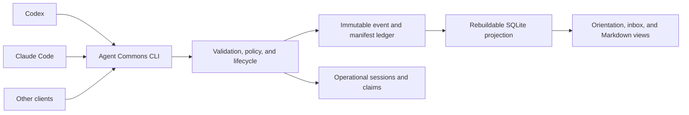

# Architecture

## Product boundary

Agent Commons is a shared operating space for agents working on one project. It
combines a blackboard, work board, review room, and durable project memory. It
does not launch models or decide that agreement between models is truth.

Four information layers remain distinct:

1. **Policy** — objectives, constraints, acceptance criteria, roles, and authority.
2. **Working space** — tasks, proposals, discussions, questions, and handoffs.
3. **Evidence** — immutable artifact revisions and verifiable observations.
4. **Effective truth** — accepted decisions and verified findings until superseded,
   corrected, or invalidated.

Discussion is durable but never promoted implicitly. Review is expert judgment;
verification is a reproducible fact. Model count does not confer authority.

## Deployment topology

MVP-0 supports several processes on one shared filesystem. A managed project has:

```text
.agent-commons/
├── workspace.yaml
├── ONBOARDING.md
├── events/
├── manifests/
├── blobs/                # reserved; raw capture is disabled in MVP-0
└── cache/                 # rebuildable and ignored
```

Operational state is stored below the project's Git common directory:

```text
.git/agent-commons-state/
├── sessions/
├── claims/
├── idempotency-v2/
│   ├── abandonments/
│   ├── reconciliations/
│   ├── migration.json
│   └── scopes/<checkout-and-ref-id>/
│       ├── scope.json
│       ├── ledger-anchor.json
│       └── receipts/
├── canonical-write.lock
└── index.sqlite3         # rebuildable WAL projection
```

Outside a Git checkout, the same operational layout falls back to
`.agent-commons/.state/`, which the generated workspace ignore file excludes
from version control.

Canonical event and manifest files are immutable and Git-friendly. Thread
messages are `thread.replied` events; MVP-0 has no separate message store.
SQLite is a disposable incremental projection and is never authoritative. Remote
multi-host coordination, authentication, notifications, scheduling, and agent
launching are outside MVP-0.

Canonical history belongs to one checkout. Cooperating windows on the same work
therefore point at the same project root. Linked Git worktrees share operational
sessions, claims, and the write lock through the common Git directory, while
their canonical files and receipt recovery are branch-local until the operator
deliberately reconciles them through Git. A receipt scope combines the
per-worktree Git directory with its symbolic HEAD ref (or exact detached commit).
Post-commit receipts are derived from validated canonical events. A per-scope
ledger anchor detects removal or modification after the first local observation
without making operational state authoritative. The complete contract is in
[ADR 0003](adr/0003-ledger-derived-checkout-aware-receipt-recovery.md).



## Universal entities

- workspace and objective, including constraints and acceptance criteria;
- principal, role, session, and declared capability;
- task/work item and temporary claim/lease;
- proposal or critique carried by a typed discussion thread/message;
- artifact and immutable revision;
- review request, review judgment, and verification;
- finding and decision;
- handoff;
- correction, invalidation, and supersession.

References are explicit typed objects, and the service resolves canonical
references before writing them. External context must be registered as artifact
metadata rather than masquerading as a local entity. No dependency is inferred
from a field-name suffix.

## Lifecycle invariants

```text
task:     ready → assigned → active → completed → review → accepted
            │        │          │            │         │        │
            └────────┴──────────┼────────────┼─────────┴──→ reopened → ready
                               ↕            │
                            blocked         └──→ reopened → ready
            ready | assigned | active | blocked ──→ cancelled ──→ reopened

thread:   open → resolved

review:   requested → approved | changes_requested | rejected | abstained

finding:  reported → verified | contested → resolved

decision: proposed → accepted | rejected | deferred → superseded
```

Task assignment is durable history; a claim is only a temporary coordination
lease. `task.completed` means the author considers the work complete,
`task.submitted` moves it to review, and acceptance is a distinct governance
transition requiring a current independent approval as an MVP-0 protocol
invariant. The task projection accumulates work-author sessions from take,
start, block, unblock, and complete transitions. Submission does not replace
that authorship history, and an independent review cannot be completed by any
session in the accumulated set.
Accepting the reviewed task does not stale that approval; reopening or changing
the reviewed subject does. Artifact revisions make reviews and verifications of
earlier revisions stale.

A finding does not have a synthetic `invalidated` lifecycle state. When its
canonical assertion was wrong, the supported maintenance workflow invalidates
the relevant event; replay then removes or rolls back that transition while
preserving the immutable audit history.

`task.accepted` stores a revision-bound review reference. Correcting or
invalidating that review completion makes the old acceptance ineffective, so
replay leaves the task in `review` and permits a new acceptance bound to the
current review revision.

Canonical evidence is stored as `{ref, revision}`, never as a floating entity
reference. The manager accepts the ergonomic `kind:id` input used by the CLI,
resolves its current effective revision, and writes only the bound form. Event
evidence uses the effective correction head (or the root event ID when
uncorrected); manifest evidence uses its content-addressed manifest ID. A later
artifact revision, correction, or invalidation preserves the historical
judgment with `stale: true` but removes it from effective-truth views.

## Security and trust

Agent-supplied content is untrusted data, not an instruction to other agents.
Every write surface is scanned before IDs or idempotency receipts are persisted.
Policies cover credentials and configurable PII/data classifications. Raw source
artifacts are referenced and hashed by default, not copied automatically.

Local identity is coordination metadata, not cryptographic authentication. A
session is registered explicitly with software/model-family, role, capabilities,
and a stable instance identity. MVP-0 does not enforce operator authorization:
roles and capabilities coordinate work but cannot prove authority, and a model
name never grants it.

## Extension boundary

MVP-0 ships one universal software-collaboration domain. Internal registries allow
additional schemas and projections, but a public plugin ABI is deferred until a
second non-trivial domain validates the boundary. Existing specialist workflows
remain independent and may later become optional domain packs.
