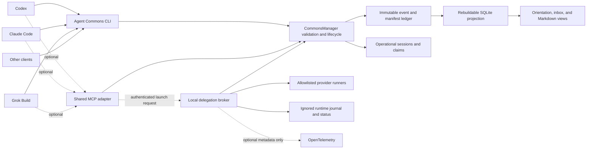

# Architecture

## Product boundary

Agent Commons is a shared operating space for agents working on one project. It
combines a blackboard, work board, review room, and durable project memory. The
file-ledger core does not launch models or decide that agreement between models
is truth. An optional local runtime may execute a bounded delegation through an
operator-allowlisted provider profile; that execution never changes the core's
truth or external-authority rules.

Four information layers remain distinct:

1. **Policy** — objectives, constraints, acceptance criteria, roles, and authority.
2. **Working space** — tasks, proposals, discussions, questions, and handoffs.
3. **Evidence** — immutable artifact revisions and verifiable observations.
4. **Effective truth** — accepted decisions and verified findings until superseded,
   corrected, or invalidated.

Discussion is durable but never promoted implicitly. Review is expert judgment;
verification is a reproducible fact. Model count does not confer authority.

## Deployment topology

MVP-0 supports several processes on one shared filesystem. A managed project has:

```text
.agent-commons/
├── workspace.yaml
├── ONBOARDING.md
├── events/
├── manifests/
├── blobs/                # reserved; raw capture is disabled in MVP-0
└── cache/                 # rebuildable and ignored
```

Operational state is stored below the project's Git common directory:

```text
.git/agent-commons-state/
├── sessions/
├── claims/
├── runtime/              # optional broker state; ignored and non-authoritative
├── idempotency-v2/
│   ├── abandonments/
│   ├── reconciliations/
│   ├── migration.json
│   └── scopes/<checkout-and-ref-id>/
│       ├── scope.json
│       ├── ledger-anchor.json
│       └── receipts/
├── canonical-write.lock
└── index.sqlite3         # rebuildable WAL projection
```

Outside a Git checkout, the same operational layout falls back to
`.agent-commons/.state/`, which the generated workspace ignore file excludes
from version control.

Canonical event and manifest files are immutable and Git-friendly. Thread
messages are `thread.replied` events; MVP-0 has no separate message store.
SQLite is a disposable projection and is never authoritative. Normal reads
currently replay the canonical ledger; writes defer index maintenance, while
`doctor` verifies/synchronizes it and `index rebuild` reconstructs it. Projection
work counters make event/correction/fixed-point cost visible. Remote
multi-host coordination, authentication, notifications, scheduling, and agent
launching are outside MVP-0. MVP-2 may add an optional same-host broker and MCP
adapter without making either mandatory for ledger use.

Canonical history belongs to one checkout. Cooperating windows on the same work
therefore point at the same project root. Linked Git worktrees share operational
sessions, claims, and the write lock through the common Git directory, while
their canonical files and receipt recovery are branch-local until the operator
deliberately reconciles them through Git. A receipt scope combines the
per-worktree Git directory with its symbolic HEAD ref (or exact detached commit).
Post-commit receipts are derived from validated canonical events. A per-scope
ledger anchor detects removal or modification after the first local observation
without making operational state authoritative. The complete contract is in
[ADR 0003](adr/0003-ledger-derived-checkout-aware-receipt-recovery.md).


```mermaid
flowchart LR
    C[Codex] --> CLI[Agent Commons CLI]
    H[Claude Code] --> CLI
    G[Grok Build] --> CLI
    O[Other clients] --> CLI
    C -. optional .-> MCP[Shared MCP adapter]
    H -. optional .-> MCP
    G -. optional .-> MCP
    CLI --> B[CommonsManager validation and lifecycle]
    MCP --> B
    MCP -. authenticated launch request .-> R[Local delegation broker]
    R --> P[Allowlisted provider runners]
    R --> B
    B --> L[Immutable event and manifest ledger]
    B --> S[Operational sessions and claims]
    R --> RS[Ignored runtime journal and status]
    R -. optional metadata only .-> OT[OpenTelemetry]
    L --> I[Rebuildable SQLite projection]
    I --> V[Orientation, inbox, and Markdown views]
```

The broker is an optional execution boundary, not a second domain service.
Canonical lifecycle writes still pass through `CommonsManager`. Broker queue
state, attempts, process handles, heartbeats, cancellation intent, and bounded
diagnostics are operational and may be rebuilt or conservatively reconciled.
The broker resolves one effective state root, embeds it in the child MCP argv
and launch-plan fingerprint, and checks the child session through that same
root before provider startup.
The complete boundary is in
[ADR 0004](adr/0004-optional-local-delegation-runtime.md).

## Universal entities

- workspace and objective, including constraints and acceptance criteria;
- principal, role, session, and declared capability;
- standing agent role and temporary link between two roles;
- task/work item and temporary claim/lease;
- proposal or critique carried by a typed discussion thread/message;
- artifact and immutable revision;
- review request, review judgment, and verification;
- finding and decision;
- handoff;
- delegation, including exact target revision and bounded parent/child lineage;
- correction, invalidation, and supersession.

References are explicit typed objects, and the service resolves canonical
references before writing them. External context must be registered as artifact
metadata rather than masquerading as a local entity. No dependency is inferred
from a field-name suffix.

## Lifecycle invariants

```text
task:     ready → assigned → active → completed → review → accepted
            │        │          │            │         │        │
            └────────┴──────────┼────────────┼─────────┴──→ reopened → ready
                               ↕            │
                            blocked         └──→ reopened → ready
            ready | assigned | active | blocked ──→ cancelled ──→ reopened

thread:   open → resolved

review:   requested → approved | changes_requested | rejected | abstained

finding:  reported → verified | contested → resolved

decision: proposed → accepted | rejected | deferred → superseded

delegation: requested ─→ cancelled (requester cancel or authorized recovery)
                │
                └→ active ↔ input_needed
                       │
                       └→ succeeded | failed | timed_out | needs_operator

agent:      active ↺ reconfigured ──→ retired
                 └── task lifetime expiry ──→ retired (derived, no event)

agent_link: open → closed
```

`delegation.recovered` is an additive canonical event that projects to
`cancelled` only from `requested`. New writes require a local
`delegation:recover` capability and an absent, expired, or closed requester;
replay uses only the immutable event and exact prior revision, never mutable
session liveness. Normal `delegation.cancelled` ownership remains requester-only.
Operational session views distinguish persisted status from effective expiry,
and graceful session close refuses requester-owned non-terminal delegations.

Task assignment is durable history; a claim is only a temporary coordination
lease. `task.completed` means the author considers the work complete,
`task.submitted` moves it to review, and acceptance is a distinct governance
transition requiring a current independent approval as an MVP-0 protocol
invariant. The task projection accumulates work-author sessions from take,
start, block, unblock, and complete transitions. Submission does not replace
that authorship history, and an independent review cannot be completed by any
session in the accumulated set.
Accepting the reviewed task does not stale that approval; reopening or changing
the reviewed subject does. Artifact revisions make reviews and verifications of
earlier revisions stale.

Task completion/submission events preserve floating `artifact_refs` for v1
compatibility and add revision-bound `artifact_bindings`. A stale binding marks
the task dependency stale; the fixed-point projection then stales its review
and removes any acceptance derived from that review.

A finding does not have a synthetic `invalidated` lifecycle state. When its
canonical assertion was wrong, the supported maintenance workflow invalidates
the relevant event; replay then removes or rolls back that transition while
preserving the immutable audit history.

`task.accepted` stores a revision-bound review reference. Correcting or
invalidating that review completion makes the old acceptance ineffective, so
replay leaves the task in `review` and permits a new acceptance bound to the
current review revision.

Canonical evidence is stored as `{ref, revision}`, never as a floating entity
reference. The manager accepts the ergonomic `kind:id` input used by the CLI,
resolves its current effective revision, and writes only the bound form. Event
evidence uses the effective correction head (or the root event ID when
uncorrected); manifest evidence uses its content-addressed manifest ID. A later
artifact revision, correction, or invalidation preserves the historical
judgment with `stale: true` but removes it from effective-truth views.

Projection failures are emitted as structured issues (`code`, `severity`,
`message`, related event IDs, and `repairable`) alongside display warnings.
Integrity gates consume the structured severity. Recovery simulates the exact
maintenance event and admits it only when the structured error measure strictly
improves without a new or larger issue.

A **standing role** (`agent`) is persistent; a **delegation** is one bounded run.
The two are deliberately separate: a fresh child session is the mechanism that
makes review independent, so modelling a run as an instance of a role would
invite inheriting the role's context and reduce independence to a claim about
`session_id`. A run declares which role it acts for through an
`on_behalf_of` event relation rather than a payload field, so the delegation
schema is unchanged and an older reader ignores the binding.

Everything a role is *allowed* to do is derived at read time from the immutable
ledger — the narrowest grant across the role and every creator above it, with a
retired ancestor collapsing the line to `deny`. Nothing is stored and
propagated, so lowering a level takes effect on the next call, including for
work already running. A role's `create_roles`/`retire_roles` grants require a
`turnover_budget` that counts creations **and** retirements below it, because
counted separately a create/retire cycle walks past any headcount ceiling. An
automatically created role must hold a strictly narrower `create_roles` grant
than its creator, which is what terminates the chain. A role bound to a task
lifetime is retired by the projection when that task is accepted or cancelled;
there is no event to forget to write. The full contract is in
[ADR 0009](adr/0009-agents-as-first-class-roles.md).

Independence is decided over **principals**, not sessions: the principals of an
event are its session plus the role that session was running as. One standing
role therefore cannot approve work it authored in an earlier run, and a
principal kind added later is covered at every call site through one function.

A delegation binds `target_ref` and `target_revision` at request time. It cannot
target itself or an ancestor delegation, and a later target change does not
retarget it. Every launched worker uses a distinct Commons session. Delegation
success means only that the provider completed its bounded run; it does not
accept a task, approve a review, verify a claim, promote project truth, or grant
an external side effect. Retry after a terminal outcome creates a new delegation
rather than rewriting the old one.

## Security and trust

Agent-supplied content is untrusted data, not an instruction to other agents.
Every write surface is scanned before IDs or idempotency receipts are persisted.
Policies cover credentials and configurable PII/data classifications. Raw source
artifacts are referenced and hashed by default, not copied automatically.

Local identity is coordination metadata, not cryptographic authentication. A
session is registered explicitly with software/model-family, role, capabilities,
and a stable instance identity. MVP-0 does not enforce operator authorization:
roles and capabilities coordinate work but cannot prove authority, and a model
name never grants it.

The optional broker has a stricter boundary. Launch authority comes from an
operator-managed local grant associated with an authenticated broker connection,
not from a session's self-declared role or capabilities. Callers select a named
profile; they cannot supply arbitrary executables, shell fragments, environment
maps, or credentials. Before `delegation.started`, an inert local exec gate
holds the eventual provider PID without starting provider code. After the
durable start, the gate strips a fixed control frame and replaces itself with
the allowlisted provider, which receives the bounded work instruction as
ephemeral untrusted stdin, not argv or durable state. Effective child authority
and limits can only narrow
the parent grant. The first runtime permits one writable worker per checkout
scope and does not create, switch, commit, reset, or remove Git worktrees for the
user.

Observability is also split by authority. The ledger preserves delegation intent
and outcomes, an ignored local journal supports live status and recovery, and an
optional metadata-only OpenTelemetry sink emits short-lived milestone spans with
correlation attributes. Process completion and canonical finalization are
separate phases, joined by attempt/delegation IDs and a mismatch flag. Queue
wait/depth and terminal-tool call/rejection/completion counts contain no tool
arguments or output. The current slice has no metric instruments or propagated
end-to-end span context.
Telemetry is lossy and never affects replay. Prompts, reasoning, transcripts,
file contents, tool payloads, environment variables, credentials, and raw process
output are excluded by default.

The worker snapshot reader verifies hashes against the frozen raw bytes but does
not make one credential-shaped source line quarantine an entire implementation.
It replaces each blocked line with a stable line-preserving marker and returns
only category/classification metadata; unchanged safe lines remain searchable.
Whole-document policy checks still fail closed if an unsafe pattern survives
redaction. An independent reviewer may inspect existing verifications only for
its exact review target and may record a new verification only against that same
target and revision.

## Extension boundary

MVP-0 ships one universal software-collaboration domain. Internal registries allow
additional schemas and projections, but a public plugin ABI is deferred until a
second non-trivial domain validates the boundary. Existing specialist workflows
remain independent and may later become optional domain packs.

The local UI is a third adapter over `CommonsManager`, beside the CLI and the
MCP server. `agent-commons ui` opens no capability flags: what it registers is
structural, not conditional. A read-only panel (`agent-commons ui
--read-only`) registers zero non-`GET` routes. An operator panel — one with the
means to hold a session of its own — registers the full non-`GET` surface
unconditionally, as the union of four declared tuples
(`MUTATING_ROUTES`, `CATALOG_ROUTES`, `LAUNCH_ROUTES`, `SETUP_ROUTES`), because
FastAPI builds its route table once while the panel's own first-run screen can
create the workspace, write the operator runtime config, and adopt a catalogue
beside it — all while already serving. Whether a registered route can actually
do anything is answered per request, by the handler, with a typed refusal
(`setup_uninitialized`, `launch_not_configured`, the catalogue's own refusal)
rather than by the route being absent. Each route is a thin call into an
existing manager method, so "there is no second write path" remains a property
of the code rather than a convention: removing `CommonsManager.record_event`
breaks every one of them, which is asserted by test, alongside a literal
assertion that the registered surface equals that union — not a value derived
from the same conditions the registration itself used.

The setup member of that union is deliberately fixed to
`POST /api/setup/initialize`, `POST /api/setup/runtime-config`, and
`POST /api/setup/add-discovered-providers`. The first config write is guarded
against replacing a working file. The additive route accepts no input, proves
the current generated file byte-for-byte, and refuses rather than merging any
operator edit.

Provider runners, OpenTelemetry exporters, and an eventual AHP adapter are
replaceable optional edges. None defines canonical entities or bypasses the
manager. Remote multi-host execution remains a later service deployment with a
new authentication, authorization, retention, and distributed-coordination
design.
