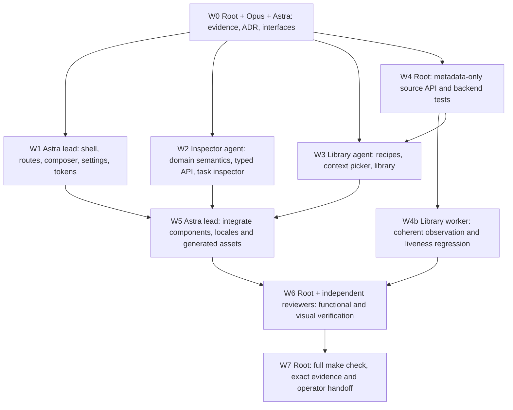

# ADR 0014: Task-first Work workspace and domain-specific UI semantics

- Status: proposed; authorized for branch implementation, pending verification
- Date: 2026-09-07
- Implementation branch: `codex/task-first-ux-pivot`
- Base commit: `329d2f3920753853ce265536d9d3ceb4e35f1f91`
- Baseline includes the uncommitted, independently reviewed September 6 audit
  remediation. This ADR is not canonical task acceptance or a release claim.

## Context and evidence

The user requested a complete UX pivot following the September 6 audit, an
Opus assessment of its screenshots, an Astra-led implementation, and a separate
branch. Work currently presents setup, role creation, task creation, launch,
starter examples and a full context editor before the task tracker. In the
synthetic EN workspace at 1440 × 1000, the tracker heading began at y=5822 in a
5986-pixel document. Returning operators cannot quickly inspect their work.

The existing inspector gives a narrow two-column definition list less room
than the dependency panel. Raw revision metadata precedes task outcomes. The
shared glossary maps evidence `complete` and task `completed` to the same
description, incorrectly describing a new ready task without runs as completed
work. Manual profile choices can have duplicate provider-only names.

The root audit and Astra architecture inspection were supplemented by a
read-only local Opus consultation. The runner reported `claude-opus-5` for the
main assessment. Opus explicitly inspected `01-work-desktop.png` and
`02-task-tracker-ru.png`, and relevant current source. Its substantive advice
is summarized here; raw provider output and transcripts are not retained.
This consultation is design input, not a canonical independent approval.

The synthetic [Work screenshot](../evidence/2026-09-07/ux-pivot-before-work.png),
[inspector screenshot](../evidence/2026-09-07/ux-pivot-before-inspector.png) and
[design-input metadata](../evidence/2026-09-07/ux-pivot-design-inputs.json) retain
that visual baseline without actual operator data.

Opus endorsed task-first navigation, a readable inspector, quieter visual
hierarchy and local recovery. It required visible unknown readiness, exact
state labels, URL-addressable Library tabs and continued access to diagnostic
recovery. Astra checked those choices against existing API and routing limits.

A second read-only Opus assessment inspected seven before/after synthetic
screenshots, including Russian desktop and English narrow layouts. It judged
the information architecture and inspector direction substantially improved,
but requested explicit Task/Readiness labels, distinct readiness wording,
deduplicated freshness warnings, refresh beside the warning, and a visible task
target in Team. Those are implementation requirements below, not a claim of
canonical approval. Density preferences, an attention digest, light theme and
shortcut discovery remain later product work.

## Scope and invariants

This increment delivers the Work UX pivot: Work, Team, Library and Settings;
task-first creation and contextual launch; readable task detail; exact source
selection; meaningful localized states; navigation and recovery continuity.
It builds on current J1/G6 and audit remediation rather than replacing them.

- The immutable ledger is authoritative. UI navigation, filters, selection and
  drafts are presentation state and never advance a task or review.
- Run success, task completion, review approval and accepted work are distinct.
  Evidence completeness and source freshness are separate domains.
- Existing exact revision/CAS, independent review and idempotent retry rules
  remain enforced by existing service boundaries.
- Source catalogs are observations, not launch authorization. Publish, compile
  and launch still validate current exact references.
- No automatic paid canary, widened grant, provider resume, token-cost estimate,
  canonical Team entity, multi-project switch or batch orchestration is added.
- L1/R2 live provider qualification remains open. This branch cannot qualify a
  provider by rendering a ready state or passing a synthetic test.
- The legacy asset and Gallery application remain compatible. Their recovery
  and design preview paths are linked rather than silently removed.

## Decisions

### D1. Persistent task workspace

A persistent navigation rail exposes Work, Team, Library and Settings.
Configured workspaces open on Work; unconfigured workspaces retain the shell
and a clear route to setup. The project name is a label, not a fake switcher:
the server currently binds one repository.

Work contains an attention/filter/search area, task list and selected-task
inspector. Canonical state filters compare actual task state; attention uses
the existing derived attention model. Filtering never fabricates acceptance.
Empty, loading, unavailable and truncated views remain distinguishable.

The inspector prioritizes goal and criteria, state/blocker/next action, result
and evidence, role/provider, launch context/design and run history. Exact
identifiers, revisions, snapshot provenance and dependency-depth advisory are
available in expandable technical detail. Unknown readiness and blocking
facts remain in the primary flow, even when their diagnostics are collapsed.

### D2. URL state, ownership and navigation

Use allowlisted query state on the existing `/work` route. The router owns
destination, exact selected task ID, task filter, Library tab and composer
visibility. Back/forward and refresh restore approved state. Invalid query
values fail to safe defaults; a requested missing task is shown as unavailable
rather than silently replaced with another task.

The auth exchange removes its secret fragment before the first request while
preserving only approved navigation state. Never place task drafts, search
content, credentials or exchange material in URLs. Do not add localStorage.
Use same-origin session restoration for the existing `/gallery` destination.

Keep destination/editor instances mounted or otherwise retain their in-memory
drafts. Explicit navigation must not lose selection or drafts. Full browser
reload is not a promise to persist sensitive draft content.

### D3. Task creation and explicit execution

The task composer asks for title, expected outcome, acceptance criteria and
optional dependencies. A successful `POST /tasks` returns the exact created
identity from its event envelope (`entity_ref.id` and `revision/event_id`).
Select that task immediately; do not search a refreshed list to guess it.

Task creation is available even when no provider is launchable. From the
selected task, choose an existing active role or go to a team recipe. Applying
a recipe creates templates with default-deny grants; hiring creates a role;
starting a run is a separate explicit action. Show roles and permissions
before application. Context and design selectors retain exact binding and
freshness checks, and unavailable prerequisites remain visible before launch.

### D4. Domain-specific state and local recovery

State rendering requires a domain: task, readiness, run phase, evidence,
next action, freshness or capacity. Canonical values keep their spelling and
receive the appropriate EN/RU gloss. Evidence `complete` means complete
evidence data; it does not mean completed work. Every profile option has a
unique accessible label identifying purpose/provider and, where useful, ID.
Rows and inspector labels identify the state domain explicitly. Readiness
`complete` means no remaining work to schedule, not author-reported completion;
readiness `blocked` describes unresolved dependencies. Readiness uncertainty
and stale observations have separate notices so one freshness problem does not
produce several competing warnings. The warning exposes its refresh action.

Mutation failures render beside their action while preserving the shell,
selection and draft. Initial authentication failure may replace protected
content. Unknown request outcomes do not render success. Retry retains the
original immutable body, expected revision and idempotency identity; refreshed
state or subsequent typing cannot silently rewrite an uncertain operation.
Late detail/refresh results cannot replace a newly selected task.
An uncertain run remains visibly bound to its original task and role even
after another task is selected. A retry may not appear to act on the new
selection while submitting the old operation. Context Pack navigation may not
erase a pending uncertain publication or its exact revision/key.

### D5. Library and bounded exact source discovery

Library has independently addressable Templates, Context and Design tabs.
Template descriptions are localized display metadata; profile/skill IDs and
canonical payloads are unchanged. Context supports a structured source picker
and an explicit advanced exact-reference editor. Design links to the existing
Gallery and uses existing verified preview/launch contracts.

Add authenticated read-only `GET /api/work/context-sources` under the existing
opaque API prefix and workspace-read guard. It accepts no body or filtering
parameters. Client search filters a bounded catalog locally.

```json
{
  "schema": "agent-commons.ui.context-sources.v1",
  "state": "ready",
  "sources": [
    {
      "ref": {"kind": "task", "id": "task.<ULID>", "revision": "evt.<ULID>"},
      "label": "Task title",
      "freshness": "current"
    }
  ],
  "truncated": false
}
```

Allowed kinds are artifact, finding, task, thread, verification and decision.
Use one current snapshot; select exact effective revisions and reuse
`ContextPackCommands.validate_sources` for eligibility. Do not require findings
to be promoted or decisions to be accepted when the existing contract does
not. Exclude restricted artifacts and absent authorized manifests. The catalog
does not read artifact files or return paths, manifests, actor/session fields,
source bodies, operator config, provider output or source bytes.

Return at most 256 eligible entries in deterministic kind/ID order, with an
explicit truncation flag. Labels use an allowlist of short metadata fields,
are printable and bounded to 256 UTF-8 bytes, and fall back to the canonical
ID. Fact inputs exclude decisions; decision inputs select decisions only.
Refreshing never upgrades a chosen revision silently. Missing selected sources
in a truncated catalog are described as unconfirmed, not proven nonexistent.
Existing publication/launch checks remain the final authority on races.

Task detail reuses the existing entity endpoint through a strict bounded
frontend allowlist. It exposes truncation rather than inventing missing data.
No new task-detail API or generic source-record transport is needed.

### D6. Visual and interaction contract

Use the existing dark design direction with clearer hierarchy: neutral
surfaces near `#0b1220`, `#131d31`, `#1a2540`; restrained blue for selection,
primary action and focus; amber for attention; accepted-state success
decoration only from canonical acceptance. Avoid nested card borders and
repeated uppercase metadata labels.

Starting implementation values are 4/8/12/16/24/32 spacing, 14px/1.5 body,
13px secondary copy, 16px section headings, 24px page headings, 40px controls,
content-sized list rows (approximately 64–96px with domain labels), roughly
240px rail, 420–480px inspector and 560px form width.
These are visual targets, subject to browser verification rather than fixed
accessibility claims. Keep a 3px visible focus outline and text status cues.

Ordinary text must not wrap mid-word; arbitrary wrapping is limited to code
and long identities. Use single-column definitions at narrow inspector widths.
At narrow breakpoints task detail becomes a full-width selected view with
browser Back support and a **Close details** control, retaining the same query
route. Closing details never changes task lifecycle. Do not require nested
server routes or a new routing dependency. Support arrows/Home/End in lists,
Escape/focus restoration, and shortcuts only outside editable controls.
Explicit destination navigation starts at the top; selecting a task on a
narrow screen scrolls and focuses its inspector. Team names the selected task
before offering a role for it. Dense filter controls may scroll within their
own row on narrow screens without causing document-wide horizontal overflow.

### D7. Canonical observation and runtime liveness

Browser integration exposed a pre-existing backend error: immutable canonical
records older than 60 seconds made an otherwise current tracker permanently
stale. Refreshing the browser could not repair that classification. Fixing
this is required for a usable task-first launch path.

Separate the age of an immutable event from the age of a verified observation.
A coherent canonical read may confirm old unchanged tasks and historical
terminal attempts. It must not refresh the heartbeat of an active attempt,
hide a missing/future timestamp, hide a changed source fingerprint, or erase
truncation/resume gaps. Without valid observation evidence, preserve the
existing conservative behavior. Do not rewrite canonical timestamps or merely
increase the freshness timeout. HTTP and stream cursors must remain monotonic
when freshness changes without a new ledger event.

## Alternatives and tradeoffs

| Alternative | Decision and consequence |
| --- | --- |
| Reorder existing cards only | Insufficient: task identity continuity, local recovery and readable detail are required. |
| New router with `/work/task/:id` routes | Use query state on existing routes to preserve server/packaged compatibility. |
| Project selector from the visual proposal | Deferred: current server has one repository and no switching API. |
| Graph-only Context picker | Insufficient: graph omits finding/thread/decision and does not prove artifact eligibility. |
| Generic entity records for source catalog | Reject: unnecessary raw fields cross the boundary and eligibility spans inconsistent reads. |
| Canonical Team entity / automatic template launch | Reject in this slice: new domain semantics and authority are not needed for task-first UX. |
| Remove old panel or embed it in an iframe | Keep a visible Settings diagnostics link and standalone Gallery. |
| Add light theme / resize library | Defer cosmetic expansion until the complete task journey is verified. |

## Implementation graph and ownership



| Owner | Exclusive write scope |
| --- | --- |
| Astra lead | Work `main.tsx`, `styles.css`, `AppHeader.tsx`, route/composer modules, central `i18n.json`, generated Work assets and shell tests |
| Inspector agent | Work `api.ts`, `contracts.ts`, `TrackerSection.tsx`, tracker state, new inspector/domain presentation modules and dedicated tests |
| Library agent | Context/StarterPack components, new Library/source-picker modules and dedicated tests |
| Root | ADR/plan/contracts/evidence docs; source-catalog backend/read DTO/route and dedicated backend tests |

During integration the root transferred tracker observation implementation
(`server.py`, `tracker_reads.py`, execution plan and work metrics, with dedicated
tests) to the Library worker. The inspector worker owns the bounded Context
Pack uncertain-retry fix; Astra owns final shared copy/style integration.

Workers send paired locale fragments and class requirements to the lead;
only the lead edits the shared locale/style files and rebuilds Work assets.
Agent Commons tasks and exact path claims protect these assignments. The DAG
describes engineering dependencies, not completed/accepted ledger states.

## Verification, rollout and rollback

- Regression: new ready task with no runs and complete evidence in EN/RU;
  distinct task/run/review/acceptance labels and unique profile names.
- Navigation: valid/invalid query, Back/forward/refresh, deleted task, auth
  fragment removal, selected-task race, draft continuity across destinations.
- Journey: empty workspace → create task → inspect exact new identity → choose
  recipe/role → explicit launch; provider unavailable still permits creation.
- Recovery: local refusal and lost response preserve original retry identity,
  body and CAS; stale/unknown snapshots never imply readiness or acceptance.
- Freshness: an idle unchanged task stays usable after a coherent reread;
  genuinely stale active attempts, future data and incoherent observations do
  not become fresh merely because the browser refreshed.
- Sources: all six kinds, exact effective revision, restricted/missing manifest
  exclusion, closed DTO keys, deterministic bounds, truncation and stale retry.
- Browser: synthetic empty, populated, dependency-blocked and review states;
  desktop 1440/1280, narrow viewport, zoom-equivalent reflow and keyboard focus.
  Screenshots prove rendering, not user research or full WCAG conformance.
- Build generated assets reproducibly with repository-pinned Node. Run
  `git diff --check` and the complete `make check`; do not substitute a subset.
- Register exact changed-file hashes and bounded outcomes after source freeze.
  Independent review applies only to that evidence revision.

Rollout is confined to the separate branch. No commit, push, merge, release or
live provider qualification is implied. A rollback restores the pre-pivot
Work sources/assets and source-catalog additions while preserving the earlier
audit remediation. No ledger/schema migration is required.

## Remaining external validation

User testing should verify whether a returning operator can locate a blocker
and next action within ten seconds, create a task without an internal glossary,
and distinguish a finished run from accepted work. These are proposed product
targets. L1/R2 and provider-specific live failures require their own explicitly
authorized qualification, irrespective of this UX increment's test results.
