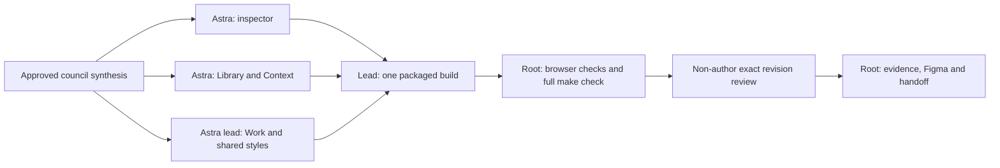

# ADR 0015: Browser-native refinement of the task-first workspace

- Date: 2026-09-07
- Status: proposed for governance; user authorized bounded branch implementation
- Branch: `codex/task-first-ux-pivot`
- Base commit: `329d2f3920753853ce265536d9d3ceb4e35f1f91`, with the prior
  uncommitted audit remediation and ADR 0014 implementation preserved
- Supersedes no ledger decision or earlier evidence revision

## Context and decision inputs

Following ADR 0014, the user requested a design council focused on typography,
color, visual identity and browser usability. Independent first assessments
from Astra, Sol and an Opus consultation were followed by peer critique and
an integrator synthesis. The provider runner reported `claude-opus-5`; the
consultation is design input, not independent implementation approval.
The council inspected the four synthetic `ux-pivot-*-ru.jpg` screens linked
in the [previous browser evidence](../evidence/2026-09-07/ux-pivot-browser-verification.json).

The screen evidence supports an information-hierarchy refinement. It does not
prove that dark colors, shadows or numeric font weights are inherently dated.
The narrow inspector already has **Close details**; a contrary council claim
was rejected against source and screenshots. Inter was declared in CSS, but
its actual use was not established by that declaration alone. The product
should communicate accountable collaboration through task, role, evidence and
safe action rather than decorative AI imagery or a false linear trust score.

The [editable Figma review board](https://www.figma.com/design/5GbVebHulITT4gWLVTmtGh)
contains raster browser captures and editable annotations. It is a visual review
artifact, not a fully editable component library or a live qualification claim.

## Decisions

1. Retain the dark palette and use browser/system font fallback. Keep ordinary
   UI text at 14px and allow 15px long prose with bounded reading width. Reserve
   blue for action/selection/focus, amber for attention and red for refusal.
   Task state, readiness, evidence, freshness, review and acceptance remain
   separate domains with text cues and canonical values plus EN/RU glosses.
2. Work exposes three primary filters: all, attention and active. The remaining
   seven statuses use a labelled native select. Preserve all ten existing query
   values, keyboard selection and the visible current selection. A single
   persistent Refresh control serves toolbar and adjacent freshness feedback;
   warning resolution must not remove the focused control.
3. Group task state, readiness, blocker, responsible role and next safe action
   in the inspector's first region. Unknown/stale state, blocked dependencies,
   disabled-action reasons and evidence meaning stay visible. Use native
   `details`/`summary` for supporting goal/criteria, empty summaries, empty run
   history and technical identity. Existing results and nonempty runs start
   open. Task identity resets disclosure state; routine same-task updates must
   preserve deliberate user disclosure choices. Close restores list/search focus.
4. Library explains a recipe's effect and role composition before longer policy
   details. Applying a recipe, hiring a role and starting a run remain separate
   explicit actions; default-deny grants and consent do not become disclosure-
   dependent. Reduce unnecessary nested borders and constrain prose width.
5. Context sources show readable title and exact-version state first. Full typed
   ID and revision remain in keyboard-accessible details. The selected payload
   retains the original exact reference after catalog refresh. Missing entries
   in a truncated catalog remain unconfirmed. Guided/JSON drafts and uncertain
   publication identity survive navigation; New cannot discard an unknown save.
6. Browser behavior is part of the result: native controls, visible focus,
   document reflow, long Russian text, reduced motion and forced colors. Avoid
   extra routing/state dependencies, font downloads or speculative previews.
   Do not add a density mode or light theme without separate product evidence.

## Ownership and implementation graph

| Work | Owner | Exclusive source boundary |
| --- | --- | --- |
| V0 Design synthesis and integration | Root | ADR, plan, synthetic evidence and Figma board |
| V1 Work and shared presentation | Astra lead | TrackerSection, styles, all i18n and packaged Work assets |
| V2 Inspector | Astra inspector | TaskInspector and focused regression tests |
| V3 Library and exact sources | Astra library | LibrarySection, StarterPacksSection, ContextPacksSection, ContextSourcePicker and focused tests |
| V4 Browser and full gate | Root, lead for corrections | Synthetic browser fixture and exact frozen build |
| V5 Independent review | Non-author reviewer | Exact new source/evidence revision |

Workers send shared style/translation requests to the lead. Only the lead
rebuilds packaged Work assets after source freeze. No backend, legacy asset,
Gallery or immutable state edit belongs to this refinement.

## Validation and release boundaries

Focused tests must cover source selection/disclosure and inspector visibility;
browser checks cover native filter activation, focus continuity, disclosure
activation, narrow layout and drafts. Compare actual packaged output, not a
development-only view. `git diff --check` and full `make check` remain the green
contract. New source hashes and screenshots receive a new evidence revision;
previous task-first evidence remains historical and must not be rewritten.

Passing tests or a visual consultation does not accept tasks, establish release
readiness or close L1/R2. Live six-profile qualification, existing Claude/Grok
failures, Grok transport privacy and retention policy remain separate work.
No live provider canary, commit, push, task completion/submission/acceptance or
automatic truth promotion is authorized by this implementation checkpoint.

The [refinement verification report](../audits/2026-09-07-browser-visual-refinement.md)
records measured results, remaining gaps and exact files. Owner governance,
user testing and full accessibility certification remain independent gates.
