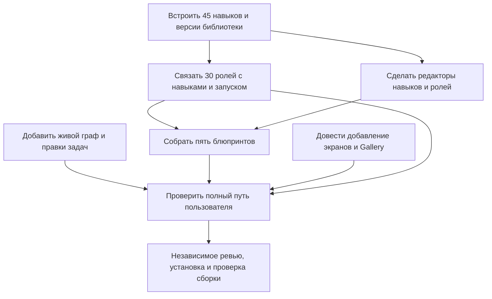

# ADR 0016: Service-owned skills, specializations and an editable live workspace

Status: Implemented; scoped independent source review approved on 2026-09-07.
Branch baseline: `5b44a2b6af5a485181884e691caaf2b07c7e85a4`.
Implementation and local verification do not imply canonical task acceptance,
live provider qualification or a production release.

## User outcome

A newly installed service offers 45 professional skills, 30 specialization
definitions and up to five useful workflow blueprints. The operator can add and
edit skills and role definitions in the browser, hire multiple named instances
of one specialization with independently selected providers/models, create and
adjust a dependency graph, launch a selected task, and inspect its observed run.
Design screens can be added, inspected and assembled into exact Design Packages.
The approved task-first visual direction in ADR 0015 remains the presentation
baseline. Console setup should be exceptional rather than the primary journey.

## Evidence and adaptation

The supplied `role-catalog-2026-09-07` defines 30 roles in eight groups and 45
reachable skill identities. Its earlier Astra/Fable/Grok council assessed static
taxonomy and routing; it did not measure agent execution quality. Three fresh
implementation assessments checked architecture, product and runtime/security
against this checkout. They are independent perspectives, not an additional
multi-provider qualification or a vote establishing truth.

| Source | SHA256 |
| --- | --- |
| `ROLES.md` | `3adfc884f2e16a3a99c03c4395609ceab6157c16053e83684f78c521bcb77d2d` |
| `roles.yaml` | `c17ab504e49d038b0af0e51aec8558c5cd54b23440246d035d44830184595ae1` |
| `council/decision-log.md` | `beb6848e0d36de8a240aafe6152bac1359cac4ca1ca2c6a83486c770fe41b5ca` |

The skill source is the supplied `codex-pro-agent-skills` working tree, not a
provider's home-directory installation. The 45 source entry-file hashes match
the supplied role registry. The package inventories and hashes the full resource
closure; an entry-file hash alone does not bind its references. Only actual
skill resources and applicable license/attribution belong in the product package,
not research transcripts, temporary inventories or provider logs.

The baseline cannot execute these methods through its managed skill path:
`services/delegation_runtime.py::_role_scope` discards legacy operator instruction
text and resolves identities against seven packaged Commons skills. A pure
adapter probe refused all 30 entry methods on each of three providers, without
starting processes. Existing operator catalog limits (64 KiB total, 4,000
characters per instruction) also do not fit the 631,888-byte source catalog.
Existing saved role presets inherit profile/model and therefore are distinct
from provider-neutral specializations.

## Decisions

### Separate definitions, instances and execution

- A skill version is a service-owned method and its allowed resource closure.
- A specialization version describes responsibility, guidance, entry method,
  ordinary and conditional routes, outcomes and boundaries. It grants no tools,
  provider privileges, deployment authority or review independence.
- A hired role is a project instance with its own ID, name, exact specialization
  reference, provider profile, model policy, context policy and existing grants.
- A blueprint is an editable task dependency graph with specialization slots.
  Applying it is explicit; it never starts paid provider work implicitly.

Thus `frontend-engineer` can produce both “Claude Frontender” and “Codex
Frontender” without copying or changing its definition. Saved provider-bound
legacy presets remain supported as saved configurations, separately labeled.

### Ship defaults and version custom content

Bundle all 45 professional skill trees and 30 specialization definitions with
the wheel. Keep the common role contract once and compose it once per run.
Do not load source research files or provider-local skill directories at runtime.

Use exact references of the form `{kind, source, id, version}` where `kind` is
`skill` or `role`, `source` is `builtin` or `custom`, and `version` is a content
digest. Custom content lives in the service's operator-owned library outside
delegated workspaces and operational state directories. The UI has no arbitrary
path/root setting. It creates immutable versions and updates a small index with
CAS and stable retry identity. Editing a builtin creates a custom version/fork;
custom IDs cannot silently shadow builtins. Retain versions pinned by existing
roles across edits and package upgrades. Physical garbage collection is outside
this change; hiding a definition must not invalidate a hired role's content.

Normal catalog, graph, SSE and canonical payloads contain metadata and exact
references. The authenticated private editor can retrieve bounded editable
instruction text. Prompt/skill bytes remain ephemeral launch or editor content,
not public proof artifacts or canonical event fields.

### Roles choose methods from the service

`entry_skill` is the initial method for a broad request. `core_skills` and
`conditional_skills` describe available routes, not an instruction to load all
skills. A localized task may use another allowed primary method. Deliver exact
initial `SKILL.md` content plus a bounded manifest of verified references. Add a read-only worker
tool for approved companion method resources, scoped to the hired role's pinned
definition; it cannot read arbitrary paths, newest versions or other roles'
private resources. Reviewers use this constrained read path without receiving
native filesystem/write authority.

The broker passes the trusted service library root to each generated MCP bridge
through private launch configuration. It does not depend on the worker's HOME
or ambient configuration. All three bridges have real local stdio MCP tests;
these tests do not invoke their provider models. Specialized `agent.created`
uses envelope v2 and semantics floor 5. Legacy role events remain v1.

Separate inventory limits from per-call/per-launch bounds. Reject missing,
changed, unsafe, oversized or unsupported content before attempts/child sessions;
never run a generic agent after a specialization fails to resolve. Keep broker
instructions, budgets, target revisions, profile narrowing and terminal MCP
requirements authoritative. New canonical pin semantics must reject older
readers rather than disappear into ignored free-form extensions. Legacy roles
without pins retain their previous interpretation.

### Browser journey

Within an initialized workspace, Library presents Specializations, Skills,
Blueprints, Context and Design, with search, groups, concise
outcomes and expandable details. “Add skill” accepts a name, description and
method text; “Add role” selects service skills and supplies role guidance.
Mounted editors preserve drafts on locale changes, catalog refreshes and refused requests. An
uncertain mutation retries its original content/version/key, not changed intent.

Hiring chooses specialization, project name, provider, execution purpose and
model independently. The interface explicitly distinguishes an overridden model
from following the configured profile default. Changing provider invalidates an
incompatible model selection instead of silently reusing it. Hire returns the
exact new instance and makes it selectable for a task; launch remains explicit.

### Five blueprint starting points

| Blueprint | Initial outcomes and roles |
| --- | --- |
| Web application | UX contract; API and browser implementation; integration; QA. |
| Mobile application | Platform choice; UX; Swift/Flutter client; integration; QA. |
| Telegram Mini App | Host/auth contract; UI and API; host integration; QA. |
| Grounded AI assistant | Task/data contract; retrieval and interface; integration; AI evaluation. |
| Improve an existing service | Diagnosis; bounded change; regression and relevant security review; result evidence. |

Each apply requires a product brief of at most 4,000 Unicode characters, included
in every created task. All role bindings are checked before the first write.
The first role event binds the full immutable intent; an interrupted apply
resumes with the original key, including after only some roles/tasks were saved.

Blueprints reference the shared role catalog. They do not create five copies of
it or mandatory departments. The operator can rename/add/cancel tasks and alter
dependencies. A mobile client method is selected after the platform decision;
security review is removable when the changed scope does not require it.

### Live editable task graph

Adapt the supplied master-handoff progress-map section: vertical dependency
flow, short action-oriented titles, explicit legend and meaningful counts.
Reuse the current UI palette, with green completion treatment informed by
`#1f9d55` / `#137a40`. Color accompanies text/icons; completed, independently
reviewed and accepted remain distinct facts.

The graph derives from the same canonical task/dependency data and observed run
metadata as the tracker. Existing SSE drives refresh; it is not raw provider
token streaming and must not invent percentages, ETA or success. Clicking a
node opens details. Add-task, edit-text, edit-dependency and cancel actions use
exact revisions and canonical commands. Reject cycles, dangling/self edges and
unsafe changes around active work; retain historical results and stale evidence.
This guard includes active review/verification delegations targeting the task.
Suggested roles appear separately from an actual assignment or observed run.
Rendering is bounded at 128 nodes, then falls back to the list. Completion uses
`#137a40` fill (5.4:1 white-text contrast), with `#1f9d55` as an accent.
“Remove” means a visible cancellation/archive decision, not history deletion.
Provide keyboard operation and a usable narrow-screen/list alternative.

### Design Gallery

Keep canonical Design Packages and verified image previews. Make the first
screen-creation/import path usable in the browser; uploaded content is bounded,
checked and stored as an ordinary source artifact, while canonical records retain
only exact metadata/provenance. No arbitrary path/URL preview endpoint is added.
Publishing, revising, feedback and Work launch binding preserve exact freshness
checks. A screen upload is not design approval or task acceptance.
Input refusals before any write return 422. A later 409 can follow creation of
the import task; the browser retains the original request identity for retry.
Artifact registration verifies the selected image digest and size against the
single generated manifest before recording its canonical reference.

## Implementation ownership and dependencies

| Owner | Exclusive implementation boundary |
| --- | --- |
| Library/runtime worker | Packaged resources, version store, role pins, invocation composition and focused backend tests. |
| Library UX worker | Work Library/hire/editor components, native interactions and frontend regressions. |
| Task graph worker | Graph/editor components, dependency edits, cancellation guards and focused task regressions. |
| Integrator | Shared API registration, constrained skill-read tool, blueprints, Gallery, docs, packaged builds and full verification. |

Coordination parent: `task.0NGD87QY1W66QV9AGQQ6PR13RM`. Task assignment and
implementation evidence do not promote canonical acceptance.

## Acceptance and rollout checklist

- [x] Installed wheel shows 45 professional skills and 30 roles without home-directory skills or seed ledger writes.
- [x] Add/edit a custom skill and role through authenticated UI; stale save, exact retry and builtin fork are correct.
- [x] Two providers hire distinct instances of one exact specialization; skill/role edits do not mutate existing hires.
- [x] Fake invocation receives the specialization once, exact primary resources and permitted companion reads; no authority widening.
- [x] Missing/digest-drift/oversize/traversal/retired references and old-reader semantics fail closed.
- [x] Each of five blueprints produces its bounded editable plan; interrupted apply resumes without duplicates or implicit model launches.
- [x] Live graph updates preserve selection/focus; edit/add/cancel/dependency actions have cycle, active-run, stale and retry coverage.
- [x] Browser creates/imports a screen, publishes a Design Package, previews it and makes its exact revision available to Work.
- [x] EN/RU, keyboard, narrow-screen, empty/loading/refusal/recovery behavior checked on packaged browser assets.
- [x] `git diff --check`, full `make check`, clean wheel installation and independent exact review pass.
- [ ] Actual provider execution is separately qualified within authorized limits; existing L1/R2 and Grok transport privacy gates are not closed by fake-provider tests.

## Verification

The [verification report](../audits/2026-09-07-service-library-verification.md)
records source scope, independent review, installed-package and browser checks,
full-gate results and remaining release boundaries. L1/R2 remain open.
