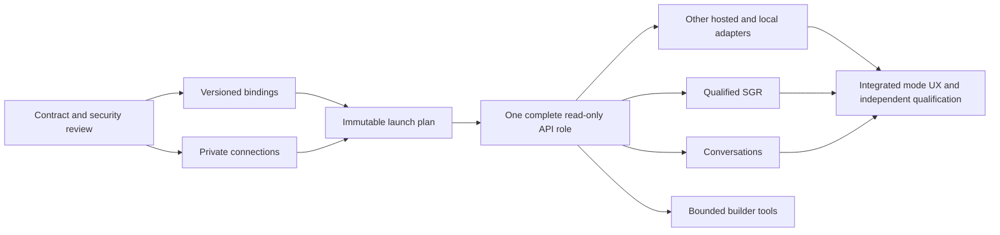

# ADR 0018: Role connections and execution modes

**Status:** Proposed — future direction requested on 2026-09-07; design recorded
on 2026-09-08. Runtime implementation and live qualification are not claimed.

## Decision under consideration

Keep a role's exact specialization / service skill versions independent of its
execution connection. Represent connection kind (`subscription_cli`, `hosted_api`,
`local_api`), provider/protocol, private connection reference, exact model,
execution mode and authority policy as separate typed contracts.

The requested role editor choices are Codex/Claude/Grok subscription, hosted
OpenAI/Anthropic/xAI API, and Local vLLM API. “Codex API” is a working UI label,
not a protocol identity. SGR is unavailable for subscription CLI in this product
mode, and optional for API/local only after capability qualification. Conversational
execution is separate from SGR. Changing a connection must not silently change
authority, downgrade a requested mode or reinterpret existing conversation state.

## Evidence and implications

At `605c0d7c9c5965c0a8303550056d07ce63afa697`, runtime provider/profile enums are
closed CLI sets (`runtime/model.py`); adapters construct subprocess invocations
(`runtime/adapters.py`); capability negotiation advertises no resume or usage
reporting (`runtime/capabilities.py`). Exact launch composition and role scope
validation already precede reservation. Extending a picker alone would claim
capabilities that the execution engine does not implement.

Preserve old schemas and replay. Introduce versioned typed role/delegation
bindings and explicit CLI/API launch-plan variants instead of behavior-changing
free-form `extensions`. Historical events retain their legacy CLI interpretation;
no canonical history rewrite is required. Public evidence contains safe opaque
bindings and bounded status, never endpoint/auth configuration or conversations.

## Proposed implementation sequence

| Stage | Deliverable and gate |
| --- | --- |
| C0 | Review connection/mode/authority schemas, migration fixtures and refusal taxonomy. |
| C1 | Versioned canonical role/delegation bindings with replay and CLI/MCP/UI parity. |
| C2 | Private operator connection/secret resolver and bounded capability DTO. |
| C3 | Immutable API launch plan pinning model, context, library, tool policy and optional schema. |
| C4 | One hosted OpenAI read-only role with bounded tool loop and audited Commons finalizer; usable UI included. |
| C5 | Anthropic, xAI and vLLM adapters, each with independent protocol fixtures and qualification. |
| C6 | Versioned SGR state machine and exact backend/schema qualification. |
| C7 | Private conversations and explicit bounded continuation contract. |
| C8 | Provider/mode-sensitive role editor and truthful setup/recovery states for every enabled slice. |
| C9 | Separately reviewed API builder tools with bounded workspace write/apply/test authority. |

## Execution and safety requirements

An API worker needs a concrete supervised lifetime, exact allowed tool schemas,
authorization on every dispatch, idempotent side-effect receipts, and bounds on
turns, requests, tools, response/context/output size, concurrency and wall time.
HTTP 200, valid JSON and provider prose never replace canonical terminal tools.
Provider-native remote tools are not enabled implicitly. A disconnected request
may still be billable; unknown usage is not zero. Monetary guarantees require
conservative pre-dispatch reservations against a versioned price schedule and
enforceable output bounds. CLI `provider_units` is not an API dollar budget.

SGR uses constrained machine-readable decisions, evidence references, permitted
actions and outcomes, with deterministic transition validation. It does not
collect private chain-of-thought. Ordinary JSON output and post-validation alone
do not prove constrained generation. Qualification binds model, adapter,
endpoint/configuration fingerprint, schema/compiler and tool policy; unsupported
schema features, refusal, truncation or drift fail closed.

For vLLM, deployed version, decoder, model/template, parser and tool-choice mode
matter; an OpenAI-compatible label is insufficient. Primary design references:
[OpenAI structured outputs](https://developers.openai.com/api/docs/guides/structured-outputs),
[Anthropic structured outputs](https://platform.claude.com/docs/en/build-with-claude/structured-outputs),
[xAI structured outputs](https://docs.x.ai/developers/model-capabilities/text/structured-outputs),
[vLLM structured outputs](https://docs.vllm.ai/en/latest/features/structured_outputs/)
and [vLLM tool calling](https://docs.vllm.ai/en/latest/features/tool_calling/).
Reverify exact versions when implementation begins.

Conversation design must specify parent turn/revision, one in-flight turn per
branch, idempotent input acknowledgment, explicit context transfer/compaction,
retention and continuation after failure. A new bounded turn is not native
provider-session reattachment. Private bodies/tool results/provider response IDs
require protected operational storage and authenticated project-scoped reads;
canonical events contain bounded identities and outcomes. Publishing content to
a shared thread remains an explicit action.

## Acceptance and open work

Test historical/new replay, invalid subscription-SGR combinations before writes,
CLI launch parity, malformed/oversized/refused API output, 401/429/5xx/timeouts,
duplicate or unauthorized tools, stale review targets, uncertain delivery/budgets,
conversation isolation, concurrent turns and illegal SGR transitions. Distinguish
implemented, configured, reachable, qualified and launchable in the UI.

This ADR records the requested future direction; the current project-host release
does not depend on it. External credentials, local endpoint/model availability,
spending policy and per-combination live qualification remain later gates. The
independent Astra assessment is source-backed design advice, not runtime evidence.
