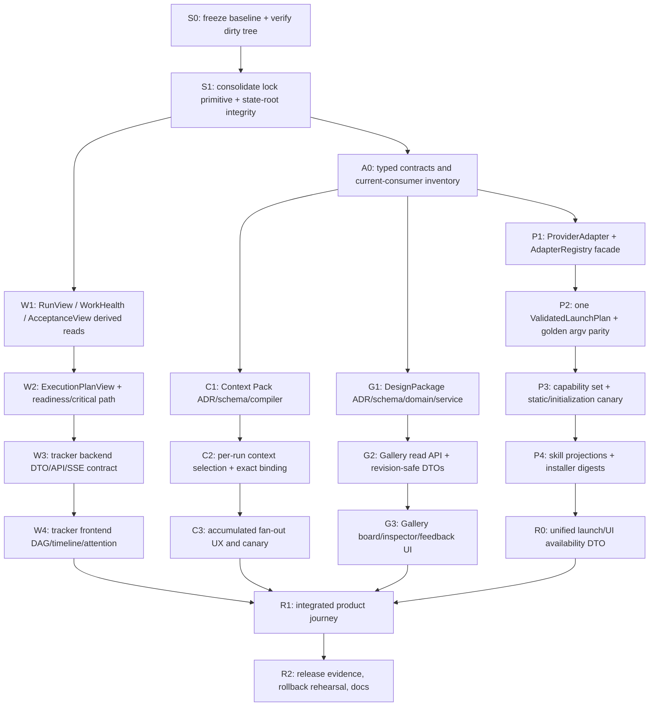

# Agent Commons: программа доведения agent platform до реальной имплементации

**Статус:** implementation programme / decision-ready execution graph
**Дата:** 2026-08-29
**Базовая ревизия кода:** `dd65bdb` (`main`) + явно отмеченные незакоммиченные изменения рабочего дерева
**Владелец программы:** product-architecture lead / operator
**Канонический scope:** provider adapters, Design Gallery, task execution tracker, context branching

Этот документ отвечает на практический вопрос: какие изменения нужны, чтобы
текущая система перестала быть набором честных заглушек и стала рабочей
agent-platform с единым provider-neutral runtime, визуальным пониманием работы
и контролируемым контекстом. Это план реализации, а не заявление о том, что
планируемые функции уже существуют.

Документ собран по текущему checkout, `docs/provider-adapter-architecture-plan.md`
и трём независимым экспертным assessments:

- `docs/reviews/2026-08-29-llm-runtime-implementation-assessment.md` — Fable,
  LLM/runtime architecture;
- `docs/reviews/2026-08-29-product-surfaces-implementation-assessment.md` —
  Opus, product + frontend/design;
- `docs/reviews/2026-08-29-control-plane-security-operations-assessment.md` —
  Opus, technical director / security / reliability.

Важная граница истины: эти документы — независимые входы и evidence для
синтеза. Они не заменяют accepted ADR и не меняют current-product truth. Все
предложения ниже помечены как решение программы, inference или open decision,
пока не пройдут соответствующий gate.

---

## 1. Короткий ответ: что есть сейчас и что реально отсутствует

| Поверхность | Уже работает | Есть только foundation | Пока отсутствует | Вывод |
|---|---|---|---|---|
| Provider adapters | `RunnerProfile`, `CodexRunnerProfile`, `ClaudeRunnerProfile`, broker, MCP wiring, static preflight | provider-specific profile classes уже выполняют часть adapter-поведения | явные `ProviderAdapter`, `AdapterRegistry`, `LaunchPlan`, capability negotiation, skill projections, runtime initialization canary | runtime функционален, но provider abstraction ещё не оформлена и содержит дрейф между pre-validation и реальным запуском |
| Design Gallery | React shell `/gallery`, отдельный CSP, bearer/session handoff, безопасный artifact preview, honest `gallery_data_unavailable` | согласованный план Design Package и feedback через existing thread | Design Package entity/events, publish/revise, gallery read model, визуальные screen cards/board, provenance inspector, feedback UI | это безопасная заглушка и preview foundation, а не галерея дизайнов |
| Task tracker | task lifecycle, dependencies, flat graph, attention queue, attempt metadata, SSE snapshot stream | planned typed `RunView`, `AcceptanceView`, `ReviewLoopGap`, `TaskReadiness` | dedicated plan DAG view, task-centric run timeline, stable derived work health, live phase/progress presentation, queue/capacity panel, cost/token accounting | данные частично есть, но user journey “кто чем занят и что дальше” не собран в один продуктовый surface |
| Context branches | role `fresh`/`accumulated`, fresh isolation semantics, UI selector at role hire, downgrade protection | instruction-composition seam, approved Context Pack plan | actual accumulated working context, Context Pack entity/compiler/fingerprint, per-run context selection, shared baseline for fan-out, resume/checkpoint | `accumulated` сейчас — metadata/semantics, не перенос рабочего контекста; resume пока честно отсутствует |

### 1.1. Что нельзя обещать пользователю до реализации

Нельзя говорить, что система уже показывает:

1. настоящий граф выполнения с прогнозом и live tool-by-tool progress — сейчас
   есть ledger graph, run metadata и SSE snapshots, но нет execution-plan view и
   stream of provider content;
2. полноценную Design Gallery — сейчас `/gallery` сообщает typed refusal и не
   имеет Design Package data;
3. реальное накопление рабочего контекста между runs — `accumulated` записан
   на role, но текущая terminal delegation модель запускает новый child session;
4. resume с checkpoint — после `input_needed` текущий headless runtime не
   reattach-ит provider session и переводит ambiguity в `needs_operator`.

Эта честность — часть UX и security: ложный green status хуже понятного
“функция ещё не доступна”.

---

## 2. Цели программы

### 2.1. Product outcomes

После программы оператор должен за минуты, а не через чтение ledger, ответить:

- какие задачи существуют, какие блокируют другие и что можно запускать сейчас;
- кто (role/provider/profile) выполняет каждый run, на какой фазе он находится,
  что завершилось, что ждёт человека и какое evidence устарело;
- какой Design Package опубликован, из каких revision-bound экранов он состоит,
  откуда взят каждый preview и где оставить feedback;
- запускать роль с `fresh` или с явно выбранным revisioned Context Pack;
- понимать, что именно поддерживает выбранный provider, где есть sandbox,
  какие ограничения бюджета действуют и почему операция отказана;
- получить typed refusal и safe next action вместо тихого fallback.

### 2.2. System outcomes

- один provider-neutral launch contract, без `codex exec`/Claude flags в UI и
  domain flows;
- canonical event ledger остаётся единственным источником project truth;
- operational attempt state и SQLite index остаются disposable/derived;
- процесс не становится canonical success только из-за exit code или provider
  prose;
- все новые semantic events проходят ADR, schema, replay fixture, migration и
  rollback gate;
- first implementation waves не ломают текущие uncommitted remediation changes;
- every provider path is qualified by static preflight **and** real behavioral
  canary before being advertised as launchable.

### 2.3. Не-цели этой программы

- не строим distributed scheduler или hosted multi-tenant control plane;
- не создаём второй параллельный ledger, private run database или отдельную
  truth model для UI;
- не добавляем provider-native resume, пока не доказана identity binding между
  resumed provider session, Commons child session и attempt journal;
- не даём worker-агентам право менять authority, канонический результат или
  provider profile;
- не превращаем provider output, reasoning, transcript или tool payload в
  долговременный продуктовый журнал.

---

## 3. Неподвижные design laws

### 3.1. Источники истины

```text
                    ┌─────────────────────────────────────────┐
                    │ Canonical project truth                 │
                    │ .agent-commons/events + manifests       │
                    │ append-only, schema-validated, Git data │
                    └──────────────────────┬──────────────────┘
                                           │ deterministic replay
                                           ▼
                    ┌─────────────────────────────────────────┐
                    │ ProjectSnapshot / typed read DTOs       │
                    │ derived, rebuildable, revision-bound    │
                    └───────────────┬───────────────┬─────────┘
                                    │               │
                         query/read │               │ UI/SSE
                                    ▼               ▼
                     ┌──────────────────┐  ┌─────────────────┐
                     │ SQLite projection│  │ Product views  │
                     │ disposable cache │  │ Graph/Gallery/ │
                     │ never authoritative│ │ Tracker/Context│
                     └──────────────────┘  └─────────────────┘

   operational only:
   sessions / claims / runtime requests / attempts / receipts / telemetry
   are bounded, private, reconcilable and never substitute for canonical truth.
```

Правило: если UI показывает state, он должен быть трассируем к canonical
revision или к явно labeled operational observation. Если observation устарел,
это отдельный статус, а не silently corrected truth.

### 3.2. Что всегда остаётся владельцем какого поведения

| Обязанность | Единственный владелец |
|---|---|
| Task/review/delegation lifecycle и acceptance | domain lifecycle + `CommonsManager` |
| process group, timeout, cancellation, admission, attempt journal | broker/runtime |
| provider flags, MCP config, skill projection, provider result decoding | `ProviderAdapter` |
| canonical terminal result | scoped MCP terminal tool + domain transition; не process exit и не `decode_result` |
| effective authority / grants / independence | domain role algebra + canonical lineage |
| UI read shape | typed UI DTO/read layer; UI не читает raw ledger и не собирает provider argv |
| provider executable/model/sandbox/budget ceiling | operator-owned profile config; не workspace и не UI |
| secrets and redaction | security policy + bounded runtime diagnostics |

### 3.3. Безопасная асимметрия provider-ов

Codex и Claude нельзя представлять как одинаковые runtime:

- Codex может иметь OS-enforced sandbox;
- Claude builder в текущей конфигурации не имеет OS-enforced boundary и требует
  trusted workspace;
- monetary budget сейчас enforceable только Claude, а `provider_units` — грубая
  admission единица broker;
- MCP tool names and CLI flags имеют разные projections;
- provider exit, stream shape, input/resume semantics и startup behavior могут
  различаться.

`ProviderDescriptor` должен показывать эту асимметрию оператору, а не скрывать
её за общим словом “agent”.

---

## 4. Target architecture

### 4.1. Сквозной путь действия

```text
User action (UI / CLI / MCP)
        │
        ▼
Provider-neutral ActionRequest
        │  task ref, role ref, context selection, skill refs,
        │  purpose, limits, expected revisions
        ▼
LaunchPlanner / DelegationRuntimeService
        │  resolves role, authority, task, operator profile
        ▼
AdapterRegistry.get(provider)
        │
        ├── ProviderDescriptor + CapabilitySet
        ├── typed capability/refusal validation
        ├── SkillProjector → SkillBundle
        ├── provider-aware InstructionCompiler
        └── build once → ValidatedLaunchPlan
                              │
                              ▼
                      LocalBroker / AttemptStore
                      reserve → exec gate → process
                              │
                              ├── bounded provider output
                              ├── Adapter.decode_result (diagnostic only)
                              └── MCP terminal tool / canonical finalization
                                      │
                                      ▼
                              ProjectSnapshot → read DTOs
                                      │
                                      ├── Tracker / Graph
                                      ├── Gallery
                                      └── Context/launch status
```

UI action не знает ни provider CLI, ни argv, ни env, ни MCP JSON, ни profile
executable. Broker не знает product semantics Gallery/Context. Adapter не имеет
canonical write path и не может завершить чужую delegation.

### 4.2. Runtime component map

```text
src/agent_commons/
├── domain/
│   ├── provider.py                 # neutral provider/capability value objects
│   ├── work_state.py               # derived RunView/AcceptanceView/health
│   ├── work_readiness.py           # advisory ready/blocked/critical path
│   ├── context_packs.py            # only after semantic gate H0
│   └── design_packages.py          # only after package ADR/schema gate
├── runtime/
│   ├── adapters.py                 # ProviderAdapter protocol + AdapterRegistry
│   ├── adapter_codex.py            # Codex projection, flags, tool names
│   ├── adapter_claude.py           # Claude projection, flags, tool names
│   ├── capabilities.py             # static CapabilitySet + canary evidence
│   ├── provider_outcomes.py        # bounded diagnostic parser
│   ├── model.py                    # compatibility facade during migration
│   ├── broker.py                   # reserve/gate/run/finalization owner
│   ├── attempts.py                 # operational attempt journal
│   └── preflight.py                # static and real initialization gates
├── services/
│   ├── launch_planner.py           # one action → one ValidatedLaunchPlan
│   ├── context_compiler.py         # revision-bound deterministic context
│   ├── design_packages.py          # publish/revise/feedback commands
│   └── delegation_runtime.py       # current facade, migrated incrementally
├── integrations/
│   └── installer.py                 # neutral skill → provider projections
└── ui/
    ├── read_dtos.py                # frozen, non-authoritative read contracts
    ├── reads.py                    # graph/runs/gallery/context/tracker views
    ├── graph.py                    # existing broad graph + focused projections
    └── server.py                   # auth/routing only; no domain reimplementation
```

Названия — целевая map, не утверждение, что файлы уже существуют. Existing
profile classes остаются compatibility facade до P6; нельзя параллельно завести
вторую модель profiles и постепенно рассинхронизировать её.

---

## 5. Neutral contracts: что именно нужно реализовать

### 5.1. Provider contracts

Целевые frozen value objects (псевдокод; точные Python types фиксируются в ADR
и тестах):

```python
@dataclass(frozen=True, slots=True)
class ProviderDescriptor:
    provider: Provider
    adapter_version: str
    profile_id: BuiltinProfileId
    model: str | None
    sandbox_boundary: Literal["os_enforced", "trusted_workspace", "none"]
    permission_mode: str
    budget_units: tuple[BudgetUnit, ...]
    instruction_transport: Literal["stdin"]


@dataclass(frozen=True, slots=True)
class CapabilitySet:
    provider: Provider
    profile_id: BuiltinProfileId
    adapter_version: str
    mcp: bool
    mcp_tool_names: tuple[str, ...]
    skills: tuple[str, ...]
    input_modes: tuple[str, ...]
    resume_mode: Literal["none", "native-bound"]
    cancellation_mode: Literal["broker", "operator-reconcile"]
    usage_reporting: Literal["none", "bounded-diagnostic"]
    sandbox_boundary: Literal["os_enforced", "trusted_workspace", "none"]


@dataclass(frozen=True, slots=True)
class LaunchPlan:
    task_ref: EntityRef
    role_ref: EntityRef
    delegation_ref: EntityRef
    profile_id: BuiltinProfileId
    purpose: Purpose
    context_binding: ContextBinding | None
    skill_refs: tuple[SkillRef, ...]
    limits: RuntimePolicy
    expected_revisions: ExpectedRevisions


@dataclass(frozen=True, slots=True)
class ValidatedLaunchPlan:
    plan: LaunchPlan
    descriptor: ProviderDescriptor
    capabilities: CapabilitySet
    skill_bundle: SkillBundle
    instruction: CompiledInstruction
    invocation: RunnerInvocation
    plan_fingerprint: str


@dataclass(frozen=True, slots=True)
class ProviderOutcome:
    event_shape_tags: tuple[str, ...]
    terminal_tool_signal: bool | None
    usage_totals: BoundedUsage | None
    diagnostic_code: DiagnosticCode
```

`ProviderOutcome` — только bounded diagnostic evidence. Он никогда не повышает
`failed`/`needs_operator` до `succeeded`; canonical success появляется только
через MCP terminal tool и existing lifecycle transition.

### 5.2. Adapter protocol

```text
describe(profile)                         → ProviderDescriptor
capabilities(profile)                     → CapabilitySet
validate(plan, capabilities)              → ValidatedNeutralPlan | TypedRefusal
project_skills(skill_refs, provider)      → SkillBundle | TypedRefusal
compile_instruction(plan, skill_bundle)   → CompiledInstruction
build_invocation(validated_plan)          → RunnerInvocation
decode_result(bounded_process_output)     → ProviderOutcome
```

На adapter не переносятся `observe`, `provide_input`, `cancel`, `recover`,
canonical transition и ownership. Эти операции принадлежат broker/domain.

### 5.3. Typed refusal taxonomy

| Code | Когда | Что получает пользователь | Durable effect |
|---|---|---|---|
| `provider_unavailable` | executable/profile недоступен или не allowlisted | какой profile надо проверить | no attempt |
| `provider_capability_unsupported` | profile не поддерживает purpose/input/sandbox/tool | конкретная capability и safe alternative | no attempt |
| `skill_projection_unavailable` | skill нельзя безопасно спроецировать в provider | skill id + provider + next action | no attempt |
| `budget_not_enforceable` | выбранная budget unit не enforceable данным provider | ограничение без fake dollar estimate | no attempt |
| `provider_initialization_failed` | real provider стартовал, но не поднял нужную capability в sandbox | failure phase + canary action | terminal attempt failure |
| `provider_terminal_result_missing` | process exited, MCP terminal result отсутствует | run needs operator / inspect attempt | never canonical success |
| `context_pack_unavailable` | requested exact pack/revision/compiler отсутствует | выбрать fresh или исправить pack | no attempt |
| `gallery_data_unavailable` | published packages отсутствуют в build | Gallery empty/unavailable, без demo data | no mutation |

Existing `invalid_result`, `runtime_error`, `launch_failed` не удаляются в одной
волне. Новые diagnostics сначала добавляются как aliases/read labels; изменение
canonical reason code требует отдельного compatibility decision.

---

## 6. Provider adapter implementation graph

### 6.1. Один build, одна fingerprint, один запуск

Текущая важная проблема: invocation строится предварительно в
`services/delegation_runtime.py:1116–1128`, а затем ещё раз в broker с
`child_session_id` (`runtime/broker.py:161–172`). В результате “проверенный” и
реально запущенный argv могут различаться.

Целевой порядок:

```text
resolve role/profile/authority
        │
        ├─ validate neutral plan (no child session, no reserve)
        │
        ├─ allocate exact child session identity
        │
        ├─ compile skills + provider-aware instruction
        │
        ├─ build RunnerInvocation exactly once with child binding
        │
        ├─ calculate launch_plan_sha256
        │
        ├─ reserve attempt / exec gate
        │
        └─ run the exact frozen invocation; never rebuild it
```

Если validation зависит от child identity, она делится на pure neutral phase и
final binding phase. Ошибка pure phase не создаёт child session и не резервирует
attempt. После `ValidatedLaunchPlan` любые изменения — новая plan revision, а не
mutating rebuild.

### 6.2. Capability qualification: три разных gate

```text
G-PRE  static preflight
       provider --help + generated MCP config + catalog/source digest
       no model work, no attempt
          │
          ▼
G-INIT real initialization probe
       exact provider flags/sandbox, one bounded MCP no-op/terminal signal
       provider startup behavior, not just tools/list
          │
          ▼
G-CAN  behavioral canary
       isolated fixture, child session, scoped source, canonical finalization
       process/canonical mismatch must be false
          │
          ▼
G-REAL manually confirmed local launches + release evidence
```

Текущая локальная проверка этой программы сама выявила stale installed MCP
binary: `/Users/dmitrijersov/.local/share/uv/tools/.../agent-commons-mcp` не
совпадал с checkout, а binary внутри workspace запрещён executable-resolution
policy. После source-matched external wrapper оба static preflight прошли. Это
не должно решаться постоянным wrapper workaround: P2 должен сделать source
fingerprint и operator configuration visibly comparable и fail-closed.

Особый decision: для Codex может не существовать бесплатного initialization
probe. Тогда probe остаётся explicit operator-confirmed `provider_units` cost,
а отсутствие canary — причина не рекламировать provider как launchable.

### 6.3. Skills

```text
neutral skill_id + manifest + semantic version
          │
          ├── Codex projection: .agents/skills + tool/command vocabulary
          └── Claude projection: .claude/skills + provider instruction vocabulary
```

Реализованный `EphemeralSkillBundle` содержит:

- allowlisted neutral skill ids;
- exact aggregate source digest;
- provider-specific projection digest;
- provider installer-contract digest;
- bounded projected instruction bytes только в памяти launch;
- typed refusal on missing, unknown, oversized, stale или altered projection.

Packaged installer и launch planner пользуются одним `resources/skills` source. Иначе файл,
который установлен в `.agents/skills`, и skill text, который попал в stdin,
могут незаметно разъехаться. “Bytes identical” — только доказанная
совместимость, не assumption о семантике двух клиентов. Operator catalogue
разрешает выбор identity, но его arbitrary instruction text не входит в launch;
workspace discovery, plugin paths и произвольные provider argv/env не используются.

---

## 7. Task execution tracker: от ledger graph к продуктовой поверхности

### 7.1. Что переиспользуем, не создавая второй store

Уже есть:

- task lifecycle и dependency refs;
- `ui/graph.py:293–462` с nodes/edges и `depends_on`;
- `ui/reads.py:436–513` с attempt/delegation metadata;
- attention queue;
- `GET /api/stream` snapshot SSE;
- graph shedding limits.

Но текущий graph — широкий coordination/entity graph, а не execution-plan DAG.
Нельзя просто назвать существующий graph “tracker” и считать задачу закрытой.

### 7.2. Derived work model

Первая версия не добавляет canonical `run` entity. Она строит typed join:

```text
TaskRecord + dependencies
       + DelegationRecord / target
       + AttemptRecord / phase / bounded diagnostics
       + current Review/Verification state
       + Attention state
              │ deterministic read
              ▼
ExecutionPlanView
  task nodes, dependency edges, readiness, blockers,
  current/recent runs, human gates, stale evidence
```

Целевые DTO:

```text
TaskNodeView:
  task_id, title, state, dependencies, dependents,
  readiness, blockers, stale, awaits_human, counts

RunView:
  task_id, delegation_id, attempt_id,
  role_id, profile_id, provider,
  phase, live, started_at, updated_at, duration,
  diagnostic_code, terminal_tool_signal,
  bounded_usage, process_canonical_mismatch

ExecutionPlanView:
  root_task_id, nodes, edges, critical_path,
  active_count, blocked_count, awaiting_human_count,
  truncated, generated_at, source_revision
```

Collections are immutable tuples internally; `to_wire()` creates fresh JSON
containers. DTOs не должны раскрывать argv, env, raw stderr, prompt, transcript,
tool arguments или credentials.

### 7.3. UI components и journey

```text
Task Execution Dashboard
├── PlanDAGView
│   ├── task state badge
│   ├── dependency edge / blocked reason
│   ├── active-run pulse (text + visual)
│   └── stale / awaits-human badge
├── TaskDrawer
│   ├── criteria and source revisions
│   ├── RunTimeline (current + recent attempts)
│   ├── Acceptance/ReviewLoopGap
│   └── next safe action
├── AttentionPanel
│   ├── needs operator
│   ├── review/acceptance pending
│   ├── config/capability refusal
│   └── stale evidence
└── CapacitySummary
    ├── active / queued / backpressure
    └── provider/profile availability
```

User journey:

```text
create task + dependencies
    → graph shows ready/blocked and why
    → launch one role/provider
    → SSE updates phase metadata
    → timeline joins attempt + delegation
    → human sees review/attention gate
    → accept/reopen/retry is explicit
```

### 7.4. Что tracker пока не имеет права показывать

- “42% выполнено” без a) declared subtask weights or b) observable evidence;
- ETA/predicted completion without historical calibration;
- token/cost totals, если provider не дал bounded usage and unit is not known;
- live tool transcript, если telemetry contract remains metadata-only;
- success from process exit.

MVP показывает phase, timestamps, state, blockers, budget unit/ceiling и
diagnostic. Predictive progress and content streaming are later separate
decisions, not fake fields.

---

## 8. Design Gallery и Design Package

### 8.1. Target data model

```text
DesignPackageRecord
├── package_id
├── producer_task_ref
├── producer_revision
├── package_revision
├── title/description (bounded, safe)
└── screens: tuple[ScreenBinding, ...]
      ├── screen_id / ordinal / title
      ├── artifact_id + exact artifact_revision
      ├── preview_media_type + classification
      └── provenance (who/which task/which revision)
```

`DesignPackage` — canonical semantic entity, если продукт действительно
публикует и revises package. Поэтому для него обязательны новый payload schema,
events, projection, old-ledger replay behavior, feature flag and rollback ADR.
Не надо хранить копию package в frontend или в отдельной Gallery database.

### 8.2. Backend contracts

```text
DesignPackageCommands.publish(draft, idempotency_key)
    → DesignPackageRecord

DesignPackageCommands.revise(package_id, expected_revision, draft)
    → new package revision

DesignGalleryReads.list_for_producer(ref)
    → tuple[GalleryFrameView, ...]

GalleryFrameView:
  screen_id, ordinal, title, preview_url,
  artifact_revision, producer_task_ref,
  stale, preview_status, provenance
```

Routes:

| Route | Contract | Mutation |
|---|---|---|
| `GET /api/gallery` | bootstrap: packages/screens/revision or typed refusal | no |
| `GET /api/gallery/packages` | ordered package views, revision-bound | no |
| `GET /api/artifacts/{id}/preview` | existing hash/type/classification-checked bytes | no |
| `POST /api/gallery/feedback` | screen + body + expected revision + idempotency key; opens existing thread/review discussion | yes, canonical thread |

Gallery must never return a preview URL for an artifact that failed manifest,
hash, classification, symlink, size or replacement checks.

### 8.3. Frontend behavior

```text
Gallery
├── PackageHeader (revision, producer, published time)
├── ScreenBoard
│   └── ScreenCard × N (ordinal, title, preview, stale/provenance badge)
├── InspectorPanel (artifact/provenance/revision)
└── FeedbackForm (thread-backed, expected revision)
```

Required states:

| State | UX |
|---|---|
| loading | `aria-live=polite`, skeleton/status text |
| no package | “No design packages published yet”; CLI/API next step |
| package unavailable in build | existing typed refusal, no demo/mock package |
| screen loaded | ordered cards with title/ordinal/alt text |
| stale artifact | text badge + visual style; color is not sole signal |
| preview refusal | placeholder + safe code/next action; no raw path/leak |
| feedback success | status announcement and exact revision shown |

V1 excludes drag/edit/hotspot, SVG/HTML preview and pixel compare until the
ordered image package and provenance path are proven. Those interactions would
otherwise create a second authoring product before read truth is reliable.

---

## 9. Context branches: fresh, accumulated, and resume

### 9.1. User-facing contract

```text
Start role run
├── Fresh
│   └── new child session; no inherited working context
├── Accumulated (only with exact Context Pack)
│   └── operator selects pack_id + pack_revision; compiler fingerprints it
└── Resume/checkpoint
    └── unavailable until native identity/recovery design is accepted
```

The current role-level `context_mode` remains a default. The run form needs a
per-run `ContextSelection` that is explicit and revision-bound:

```text
ContextSelection:
  mode: fresh | accumulated
  pack_id: optional
  pack_revision: optional
  source_fingerprint: optional
```

`accumulated` without an actual pack must not be presented as “previous chat is
carried over”. It means the role is eligible for accumulated context; the run
still refuses until a valid pack is bound.

### 9.2. Context Pack vertical

```text
ContextPackRecord
├── pack_id / revision
├── summary
├── facts[] (source refs)
├── decisions[] (decision refs/status)
├── open_questions[]
├── constraints[]
└── compiled_fingerprint
```

Flow:

```text
researcher publishes Context Pack revision
        │
        ▼
operator chooses pack for a run
        │ exact CAS + permission + source refs
        ▼
ContextCompiler deterministic bounded output
        │ fingerprint
        ▼
LaunchPlan.context_binding
        │
        ├── Backend child gets same baseline + own task instruction
        └── Frontend child gets same baseline + own task instruction
```

Compiler rules:

- no raw transcript ingestion by default;
- bounded sections and total bytes;
- every fact/decision has a source reference;
- pack revision is immutable;
- changed pack means changed launch fingerprint and fresh review;
- security policy scans pack content before canonical persistence;
- no provider-specific CLI material inside pack.

### 9.3. Resume decision

Resume remains `resume_mode = none` for both providers in first implementation.
Native resume can begin only when all of the following are designed and tested:

1. provider session identity is bound to the same delegation and attempt;
2. child Commons session identity and authority cannot be swapped;
3. restart/reconcile can prove provider termination or liveness;
4. input/cancel/recover are idempotent and revision-bound;
5. credentials/session ids are not persisted in unsafe canonical or UI surfaces;
6. ambiguity still fails closed to `needs_operator`.

Until then `input_needed` is a human gate, not a fake “resume soon” button.

---

## 10. Detailed dependency DAG and critical path

### 10.1. Programme graph



### 10.2. Critical path

```text
S0 → S1 → A0 → P1 → P2 → P3 → P4 → R0 → R1 → R2
```

Это critical path для безопасной provider-neutral launch. Product parallel
tracks могут идти после `S1`:

```text
S1 → W1 → W2 → W3 → W4 ─┐
S1 → C1 → C2 → C3 ──────┼→ R1
S1 → G1 → G2 → G3 ──────┘
```

### 10.3. Work graph по волнам

| ID | Deliverable | Точные границы | Owner | Depends on | Acceptance |
|---|---|---|---|---|---|
| S0 | Baseline freeze | exact `main` revision, current docs, dirty-path inventory, no overlapping claim | architecture lead | — | doctor green; dirty files preserved; baseline hashes recorded |
| S1 | Shared primitive/integrity | consolidate private-dir/lock implementation; verify state-root namespace; no semantic event changes | CTO/runtime | S0 | symlink/nonexistent-parent/concurrency tests; doctor/reconcile green |
| A0 | Contract freeze | consumer inventory, ADR updates, canonical/derived boundary, refusal vocabulary | architect + domain | S1 | accepted ADR; exact module map; no duplicate model |
| P1 | Adapter facade | `ProviderAdapter`, registry, descriptor/capability scaffolding wrapping existing profiles | LLM architect | A0 | imports and profile behavior unchanged; type/golden tests green |
| P2 | Single plan | eliminate double build; bind child identity once; fingerprint exact invocation | runtime | P1 | prevalidated argv == launched argv; no child/attempt on pure refusal |
| P3 | Canary | static preflight, real init probe, behavioral canary, typed startup failures | runtime/security | P2 | Codex + Claude qualified separately; mismatch=false; no false success |
| P4 | Skills | neutral manifest, provider projections, installer/report digests, missing projection refusal | skill/runtime | P3 | projection parity and rollback tests; no secret/raw skill leakage |
| W1 | Work derived views | `RunView`, `AcceptanceView`, `ReviewLoopGap`, health metrics | system design/UI backend | S1 | deterministic joins; bounded DTO; no new run store |
| W2 | Plan/readiness | focused task DAG, ready/blocked/critical path advisory | workflow/domain | W1 | cycles fail; no auto-accept; stale evidence visible |
| W3 | Tracker backend | endpoint/read model contract over graph/runs/attention/SSE | UI backend | W2 | route DTO snapshot and resume-gap tests; no raw provider output |
| W4 | Tracker UI | DAG, timeline, attention, capacity, honest loading/empty/error | product/frontend | W3 + asset claim | keyboard/accessibility; EN/RU; no fake ETA/tokens |
| C1 | Context semantics | Context Pack ADR/schema/parser/compiler/fingerprint | LLM/domain | A0 | old-ledger replay; bounded pack; source refs; rollback flag |
| C2 | Run selection | explicit fresh/accumulated selection and exact pack binding | runtime/UI | C1 + P2 | missing/stale pack typed refusal; fresh behavior unchanged |
| C3 | Accumulated fan-out | same pack baseline to role-specific children, no transcript sharing | product/runtime | C2 + P3 | two-child fingerprint parity; security/eval gate |
| G1 | Design Package domain | package publish/revise, screen binding, event/schema/projection | design/backend | A0 + S1 | manifest/hash/classification checks; no raw artifact path leak |
| G2 | Gallery API | package read DTOs and feedback command over existing threads | UI backend | G1 | exact revision refs; typed empty/stale/preview refusals |
| G3 | Gallery UI | board/cards/inspector/feedback | product/frontend | G2 + asset claim | visual and keyboard QA; no demo data; responsive states |
| R0 | Unified availability | one action → provider-neutral read DTO and capability/refusal panel | architect/UI | P4 + W3 | UI never assembles provider flags; safe provider/sandbox labels |
| R1 | Integrated journey | launch → tracker → review → Gallery/context links | product/release | W4 + C3 + G3 + R0 | end-to-end fixture and real canary evidence |
| R2 | Release | canary, CI, rollback, docs, runbook, metrics | release owner | R1 | all stop-line gates green; independent exact review |

### 10.4. Явное распараллеливание

Без worktrees writable workers нельзя безопасно запускать параллельно в одном
checkout: текущий broker уже правильно отказал на такой попытке. Поэтому:

- read-only reviews могут идти параллельно;
- independent backend tasks могут идти параллельно в separate worktrees,
  provided by operator;
- `src/agent_commons/ui/static/index.html` — строго один owner at a time;
- если separate worktree недоступен, builder waves выполняются последовательно;
- claims — `task:<id>` + самый узкий `path:<path>`, TTL и explicit release;
- parent не редактирует paths, переданные writable worker-у.

---

## 11. Поэтапный implementation backlog

### Wave S: baseline и integrity (stop-the-line)

**Почему сначала:** CTO review нашёл duplicated lock primitive как риск до новых
state-root/ownership semantics. Нельзя добавлять execution features поверх
расходящихся lock implementations.

**Tasks:**

1. сохранить текущий dirty-path manifest, не смешивать его с программой;
2. провести exact inventory всех consumers `RunnerProfile`, `AttemptStore`,
   `ScopedRepoReader`, `delegation_runtime`, `ui/reads`, installer;
3. вынести один tested private-directory/lock helper или доказать, почему
   existing copies должны остаться разными;
4. добавить regression cases для symlink, missing parent, lock identity,
   concurrent writers, stale state and receipt reconciliation;
5. зафиксировать baseline replay/index/doctor metrics.

**Rollback:** только code revert, без canonical event changes.  Если lock
consolidation меняет operational file layout, сначала drain active attempts и
добавить in-memory compatibility reader.

### Wave A: adapter contract без изменения поведения

**Новые компоненты:** `runtime/adapters.py`, `runtime/capabilities.py`, typed
neutral records, `AdapterRegistry`.

**Правило миграции:** Registry wraps existing `CodexRunnerProfile` and
`ClaudeRunnerProfile`; profile constructors and `dataclasses.replace` safety
remain. No source discovery from workspace. No dynamic adapter plugin loading.

**Tests:**

- golden argv/stdin parity for every existing profile;
- profile sandbox/permission invariants after wrapping;
- registry allowlist and unknown-provider refusal;
- no UI DTO contains executable/argv/env;
- no canonical event contains adapter internals.

**Benefit:** one place to add next provider and one place to explain support;
zero product behavior change and low rollback cost.

### Wave B: capability + one launch plan

**Changes:**

- add `CapabilitySet` and `ProviderDescriptor` read surface;
- split pure validation from final child binding;
- compile provider-aware tool vocabulary, fixing Claude-prefixed instruction
  names that do not match Codex exposed tools;
- build invocation once and pass frozen plan to broker;
- introduce typed refusals without widening canonical event schema.

**Acceptance:** exact launched `argv`, MCP args, enabled tools, and instruction
digest equal the validated plan. A refusal does not open child session or reserve
attempt. A provider outcome cannot promote success.

### Wave C: canary and operational qualification

**Static:** current `broker preflight`, but compare source digest, profile model,
MCP binary, flags and catalogs.

**Initialization:** real CLI under exact permissions, minimal action, no
workspace mutation except bounded fixture if needed.

**Behavioral:** `tests/runtime/test_real_stdio_contract.py` style isolated canary
with canonical MCP finalization.

**Release policy:** static green alone means “configuration recognized”; init
green means “provider starts under profile”; behavioral green means “workflow
contract qualified”. UI only offers “launchable” after the last applicable gate.

### Wave D: typed Work model and tracker

**Backend first:** create pure `RunView`, `ExecutionPlanView`, readiness and
health metrics. Keep `GET /api/graph`, `/api/runs`, `/api/attention`, `/api/stream`
as source inputs. Do not add a private RunEventStore (ADR 0008 forbids treating
withdrawn store as current contract).

**Frontend second:** create a separate focused tracker surface. Legacy Board/Runs
remains fallback until parity gate. For static `index.html`, acquire exclusive
claim and make minimal integration; React Work/Gallery can evolve separately.

### Wave E: Context Pack

**ADR required before event/schema:** define facts/decisions/source refs, pack
revision, compiler limits, authorization and old-ledger handling.

**Safe order:** pack read-only fixture → publish/revise backend → compiler
fingerprint → run binding → UI selection → two-child fan-out. `Fresh` remains
default and unchanged throughout.

### Wave F: Design Package and Gallery

**Backend:** package domain/publish/revise/read model/feedback.  **Frontend:**
  board cards, provenance inspector, preview refusal and feedback.  Do not start
  with drag/edit/hotspots; publish/read/revision correctness is the value.

### Wave G: integration and migration

- unify provider availability and context status DTOs;
- link tracker task drawer to Gallery package and Context Pack revision;
- add role/profile/provider/sandbox labels with glossary EN/RU;
- run old ledger fixtures, clean fresh workspace, stale projection, rollback
  rehearsal and exact independent review.

---

## 12. Security model и threat matrix

### 12.1. Assets

| Asset | Risk |
|---|---|
| canonical events/manifests | forged acceptance, source-of-truth corruption |
| provider credentials/config | credential theft, model/profile hijack |
| workspace files | path traversal, symlink escape, destructive builder writes |
| task/role authority | confused deputy, self-review, privilege widening |
| prompts/skills/context packs | instruction injection, secret persistence, cross-task leakage |
| provider output/telemetry | transcript/PII/secret leakage, false success |
| attempt/process identity | PID reuse, replay, blind relaunch |
| UI bearer/session | unauthorized local writes, token exposure |

### 12.2. Invariants and controls

| Invariant | Implementation rule | Gate/test |
|---|---|---|
| adapter cannot write truth | no `CommonsManager`/canonical writer in adapter imports | import boundary + review |
| provider output is untrusted | bounded parser, allowlisted event shapes, no transcript persistence | fuzz/boundary tests |
| profile is operator-owned | config outside workspace, no workspace adapter discovery | path/mode/owner tests |
| argv/env cannot be user-passed | callers provide neutral plan only; adapter resolves allowlisted profile | injection tests |
| reviewer is read-only | fixed profile mode, tool allowlist, no source writes | MCP catalog + behavior canary |
| no false approval | terminal MCP tool + canonical result required | stop-line S1 |
| no self-review | principal-level independence, not session count | stop-line S2 |
| no path escape | descriptor-relative no-follow reader and executable resolution | symlink/TOCTOU tests |
| no credential persistence | security scan before canonical ID/receipt; diagnostics redact | secret fixture tests |
| no ambiguous relaunch | reconcile identity/process/child state; ambiguity → `needs_operator` | crash/recovery matrix |
| no cap bypass | effective limit = min(operator/provider/profile/parent/delegation) | budget/fanout tests |
| no stale acceptance | exact target revision on artifact/review/verification | revision mutation tests |

### 12.3. Residual risks, honest handling

- same-filesystem process can bypass CLI and write files directly: document as
  trust boundary, do not claim it is authentication;
- Claude builder has no OS-enforced sandbox: display this at profile choice and
  require trusted workspace/external isolation;
- PID reuse remains platform-sensitive: record process start timestamp where
  supported and keep `broker stop` diagnostic warning;
- custom project secrets cannot be perfectly detected: allow operator patterns,
  bound telemetry, never claim universal DLP;
- real Codex qualification may consume provider capacity: explicit operator
  confirmation and separate canary evidence.

---

## 13. Performance, cost and scale budget

### 13.1. Budgets to preserve

| Area | Current/control target |
|---|---|
| instruction | ≤1 MiB, stdin-only |
| process output | existing 1 MiB cap; parser works on bounded buffer |
| provider attempt | one live attempt per delegation, bounded wall time |
| queue | bounded FIFO, explicit backpressure, no attempt on queue refusal |
| canonical finalization | p95 ≤5 s, p99 ≤15 s initial objective |
| graph | current shed limits 2,000 nodes / 4,000 edges; truncation visible |
| API DTO | bounded collections and output bytes; no full transcript |
| replay | measure p50/p99 before indexed-read semantics change |
| cost | `provider_units` stays process-attempt admission; `micro_usd` only provider-enforceable |

### 13.2. Adapter overhead budget

The adapter layer must add in-process dispatch, not a new service or process.
Expected overhead is:

- one registry lookup;
- capability/plan validation in memory;
- hash of bounded skill bundle and invocation;
- bounded parse of already captured output.

No network hop, no second persistence store, no extra lock. If a proposal adds
one, it requires a new architecture decision and measured benefit.

### 13.3. SLO/SLI set

| SLI | Initial objective | Stop/alert |
|---|---:|---|
| deterministic broker matrix | 100% | any failure stops release |
| false canonical approval | 0 always | immediate stop |
| process→canonical mismatch | 0 | immediate stop |
| diagnostic coverage | ≥99% abnormal exits | manual-only if lower |
| deadline containment | 100% within deadline + grace | stop provider wave |
| cost visibility where provider supports it | ≥95% | keep metadata only |
| tracker initial load p95 | ≤2 s warm / ≤5 s cold target | degrade to legacy view |
| Gallery first card p95 | ≤2 s warm / ≤5 s cold target | show honest loading/refusal |
| context compiler p95 | ≤500 ms for bounded pack target | refuse oversized pack |
| SSE update freshness | ≤5 s for metadata update target | show last-updated/stale |

Product metrics:

- median time to find blocked task;
- percentage of active runs with understandable next action;
- percentage of launches with known provider/profile/sandbox status;
- Gallery package publish→first feedback time;
- context selection refusal rate and successful pack-bound launches;
- false-progress reports and user “where is the run?” support events.

Instrumentation is metadata-only: ids, phases, durations, counts, bounded
diagnostic codes and fingerprints; never prompt, tool args, transcript, raw
file contents or credentials.

---

## 14. Testing и evaluation graph

### 14.1. Deterministic unit/contract layers

```text
domain invariants
  → adapter golden argv/stdin
  → capability/refusal matrix
  → skill projection/digest
  → work read DTO shape and immutability
  → Gallery artifact/provenance refusal
  → Context Pack parser/compiler/fingerprint
  → UI route/auth/accessibility/string contracts
  → full make check
```

Minimum cases:

- provider unavailable / unknown profile;
- missing capability, unsupported budget, unsupported context;
- MCP catalog digest mismatch, stale source binary, missing tool;
- provider init failure under read-only sandbox;
- valid process exit with no terminal MCP tool;
- terminal tool rejection followed by valid retry within bounded policy;
- double-build regression: validated and launched invocation byte-identical;
- Codex/Claude tool name projection difference;
- skill missing/modified/symlink/rollback;
- task DAG cycle, stale dependency, readiness with human gate;
- graph shedding and `resume_gap` SSE behavior;
- package screen artifact replaced/symlinked/hash mismatch/classification refusal;
- Context Pack oversized, stale revision, missing source, deterministic recompile;
- fresh mode remains isolated; accumulated mode never silently falls back to raw prior transcript;
- secrets in task, feedback, pack, provider stderr, telemetry and UI DTO;
- crash at every boundary: before child, after reserve, after process start,
  before canonical finalization, after provider exit.

### 14.2. Behavioral/real provider gates

Static preflight and behavioral canary are separate signals. For every provider
and model profile intended for release:

1. preflight must pass without model work;
2. initialization probe must show exact profile behavior;
3. behavioral canary must create child session, read scoped source, invoke scoped
   MCP, record canonical result and close child;
4. real local launches must have `process_canonical_mismatch=false`;
5. independent review must inspect exact merged revision.

One Opus or Fable pass does not qualify another model/profile. Use separate
operator-owned profile config and evidence per model.

### 14.3. Agent workflow evaluation

Agent-specific evals measure workflow correctness, not prose quality:

- obey exact task/path scope;
- do not edit unclaimed/unrelated file;
- do not bypass MCP terminal result;
- do not reveal secrets/tool payloads in artifacts;
- report blocker instead of guessing when capability is missing;
- preserve dissent and rejected alternatives in council synthesis;
- distinguish canonical state from process exit;
- produce review with exact revision and reproducible checks.

---

## 15. Rollout, feature flags and rollback

### 15.1. Flags

Use operator-visible flags, not hidden fallback:

```text
provider_adapters_enabled
provider_capability_canary_required
skill_projections_enabled
tracker_execution_view_enabled
context_packs_enabled
design_packages_enabled
gallery_board_enabled
```

When a flag is off, UI renders typed “not available in this build” with safe
next action. It must not silently switch to a different provider or invent data.

### 15.2. Rollback by layer

| Layer | Rollback |
|---|---|
| Adapter facade/P1–P4 | revert code; existing profile classes and launch fingerprints remain compatible |
| Operational runtime | drain active attempts; reconcile; remove only disposable requests/index as documented |
| Tracker DTO/UI | switch off focused surface; legacy graph/runs remains read fallback |
| Context Pack | disable new publish/bind writes; old roles/runs stay fresh; old events replay unchanged |
| Design Package | disable publish/revise; existing package events remain replayable by new binary; old binary boundary documented |
| SQLite | delete/rebuild derived projection; no canonical meaning lost |
| Canonical schema | rollback only to binary that understands current semantics; never reset/delete events |

Every new canonical entity ADR must name:

1. last safe checkout revision;
2. semantics/version floor;
3. feature flag and write disable path;
4. old-ledger replay behavior;
5. in-flight operational state to drain;
6. independent reviewer and restore rehearsal.

### 15.3. Stop-the-line conditions

| Code | Condition |
|---|---|
| S1 | `delegation.succeeded` without canonical terminal MCP tool / false approval |
| S2 | independent review authored by same principal as subject |
| S3 | any deterministic behavioral-contract case fails |
| S4 | validated invocation differs from launched invocation |
| S5 | adapter/provider path writes canonical state or exposes raw secret/transcript |
| S6 | UI reports accumulated/resumable/live/cost semantics unsupported by evidence |

---

## 16. Council/agent operating model

### 16.1. Expert lanes

| Lane | Profile/model policy | Scope | Output |
|---|---|---|---|
| LLM systems architect | Fable for difficult cross-provider/runtime work; Opus for bounded follow-ups | adapters, capabilities, skills, launch plans, provider semantics | exact contracts, failure matrix, canary and migration |
| Product + frontend/design | Opus | Gallery, tracker, context journey, states, accessibility, metrics | product surfaces, DTO/API needs, frontend gates |
| Technical director | Opus for bounded system/security review; Fable if a cross-subsystem proof is needed | canonical/derived, security, reliability, performance, rollback | threat matrix, stop-lines, SLOs, operational gates |
| Implementer | profile selected by capability and isolation; no model name hardcoded in core | one bounded task/path claim | source + tests + evidence |
| Independent reviewer | separate `*-independent-reviewer`, exact revision | changed paths and acceptance | approve/changes requested, no prose-only completion |

Model names live in operator-owned runtime profiles, not in repository code or
UI. A task description may request a role/lane; broker profile and preflight
decide the executable/model. No worker gets raw executable, env, credential or
unbounded prompt through ad hoc delegation arguments.

### 16.2. Writable coordination rules

1. Before delegation: doctor, orient, inbox, active claims, exact revision.
2. Builder gets `task:<id>` + minimal `path:<path>` claims and an explicit
   non-overlap brief.
3. Shared checkout has one writable builder at a time; parallelism requires
   operator-provisioned external worktrees.
4. Parent stops editing transferred paths and does not “help” inside the worker
   scope.
5. Completion means canonical task/delegation state + artifact + checks; exit
   code or provider prose alone is not completion.
6. Independent review is always exact-revision and distinct-principal; changed
   revision makes prior approval stale.
7. Record durable artifact hash and decision/finding separately; do not copy
   private transcripts into the repository.

### 16.3. First implementation team split

```text
Parent architect
├── S1 runtime hygiene (one writer)
├── P1/P2 adapter contract (after S1)
├── W1/W2 derived work views (parallel worktree)
├── C1 Context Pack RFC (read/design first)
└── G1 Design Package RFC (read/design first)

After exact reviews:
├── P3/P4 runtime qualification
├── W3/W4 tracker surface
├── C2/C3 context binding
└── G2/G3 Gallery
```

The parent does not launch three writable builders in the same checkout. This
is not a throughput preference; it is required by the current workspace policy.

---

## 17. Open decisions и recommended defaults

| # | Decision | Recommended default | Why |
|---:|---|---|---|
| 1 | `invalid_result` vs `provider_terminal_result_missing` | keep canonical code; add diagnostic alias/read label first | avoids breaking existing history and UI while making cause clearer |
| 2 | zero-cost Codex initialization probe | do not assume it exists; require explicit provider-unit canary | static MCP success is known insufficient |
| 3 | resume/checkpoint | defer; `CapabilitySet.resume_mode = none` | terminal model and identity/recovery are not ready |
| 4 | context accumulation | only exact immutable Context Pack, never raw previous conversation | reproducibility, security, branch parity |
| 5 | plan DAG storage | derived view over existing task dependencies first | avoids second canonical plan model and proves UX value cheaply |
| 6 | live progress | metadata phase/timestamps first; transcript streaming later and opt-in | avoids leakage and fake completion percentages |
| 7 | Gallery scope | ordered image Design Package + provenance + feedback first | delivers user value without building an editor |
| 8 | parallel builders | separate worktrees or sequential checkout | current broker correctly rejects concurrent writable workers |
| 9 | provider extension | Codex + Claude only until both pass same gates | no capability matrix explosion before baseline is reliable |
| 10 | adapter identity in events | keep adapter version operational/read-only first | avoids canonical schema migration for an internal seam |

Decision owners must accept/reject/defer these explicitly in Agent Commons;
model count or confident prose is not acceptance.

---

## 18. First safe implementation slice

Следующая реализационная волна должна быть маленькой, измеримой и не включать
все четыре UI surface одновременно:

### Slice 0: integrity + derived contract (до feature code)

1. preserve dirty-tree paths and current `docs/provider-adapter-architecture-plan.md`;
2. consolidate/test lock primitive (S1);
3. add exact `ProviderDescriptor`, `CapabilitySet`, `LaunchPlan`,
   `ValidatedLaunchPlan`, `ProviderOutcome` types with no behavior change;
4. add `AdapterRegistry` that delegates to existing profile classes;
5. add golden tests proving old Codex/Claude invocation bytes are unchanged;
6. add one regression test proving `decode_result` cannot upgrade a missing
   terminal MCP result;
7. run `make check`, register artifact, request independent exact review.

### Slice 1: one-build migration

1. make pure plan validation and final child binding explicit;
2. construct invocation once after child identity is known;
3. pass same immutable plan to broker and compute fingerprint from it;
4. keep current broker reserve/exec-gate/finalization sequence unchanged;
5. qualify with fake provider + existing real-stdio contract.

### Slice 2: read-only tracker proof

1. implement `RunView` and `ExecutionPlanView` as derived DTOs only;
2. expose focused read endpoint or typed extension to existing reads;
3. render a read-only task DAG/timeline using existing Work/legacy fallback;
4. do not add cost/ETA/live transcript fields;
5. accept only after accessibility and snapshot/SSE gap tests.

This sequence delivers the first visible improvement while reducing the highest
runtime risk. Gallery write semantics and Context Pack canonical events come only
after their own semantic RFCs, not as speculative UI mock data.

---

## 19. Definition of done

Программа считается реализованной только когда одновременно выполнены все
условия:

### Runtime

- `ProviderAdapter`/registry are the single provider seam;
- Codex and Claude exact plans are golden-tested and canary-qualified;
- static preflight, real initialization and behavioral canary are distinct and
  green for each released profile/model;
- missing capability gives typed refusal before attempt;
- process exit cannot become canonical success;
- skills have provider projections and digests;
- no raw provider data crosses canonical/UI boundary.

### Tracker

- task dependencies form a focused visual DAG with cycle/refusal handling;
- current/recent runs show role/provider/profile/phase/duration/diagnostic;
- attention/review/stale state are visible and actionable;
- SSE freshness and truncation are labeled;
- UI does not invent percentage/ETA/tokens/cost.

### Gallery

- published revisioned Design Package is canonical and replayable;
- ordered screens render with safe artifact preview and provenance;
- empty/loading/error/stale/accessibility states are tested;
- feedback opens revision-bound existing discussion/thread;
- no demo/mock data is presented as a real package.

### Context

- Fresh remains truly isolated;
- Accumulated means exact Context Pack binding, not hidden transcript carry;
- compiler output is bounded, fingerprinted and source-referenced;
- two role branches can share the same baseline without sharing authority or
  mutable working state;
- Resume is either fully identity-bound and recovery-tested or explicitly
  unavailable.

### Operations/governance

- all semantic changes have ADR/schema/replay/migration/rollback evidence;
- `make check` and CI are green on exact merged revision;
- independent reviewer approves exact revision;
- release evidence includes canaries, mismatch=0 and no false approval;
- runbook documents backpressure, reconciliation, rollback and operator next
  actions;
- current product/architecture doc is updated only after implementation, not
  optimistically during planning.

---

## 20. Provenance of this programme

This programme was authored after three bounded Claude workers completed
independently and wrote only their claimed review artifacts:

| Expert | Agent Commons task | Delegation | Result |
|---|---|---|---|
| LLM/runtime architect | `task.3CKP1QJA4S1Z8AMFZ3M8E9MF42` | `delegation.74TX6EDWAK96HBB54CBD88AB1K` | canonical `succeeded`; Fable profile; runtime review |
| Product/frontend/design | `task.4AWK0F35FG8HXYS6AKPZ51V9D0` | `delegation.53MQ2MYEK1AN9VXJ2AQ0TW8DG9` | canonical `succeeded`; Opus profile; product review |
| Technical director/security | `task.6HZHN07HE10SFYVJ90R4Y981XR` | `delegation.287N602BGF1B8VD1CQF9HETDAW` | canonical `succeeded`; Opus profile; control-plane review |

The implementation programme itself is tracked by
`task.5SQYDA5DHVSD8VW73XHCRJ0R02`. The three review artifacts are inputs, not
substitutes for an independent review of this consolidated document. Before
the programme becomes accepted project truth, it must pass exact artifact
registration, independent review and task acceptance.
