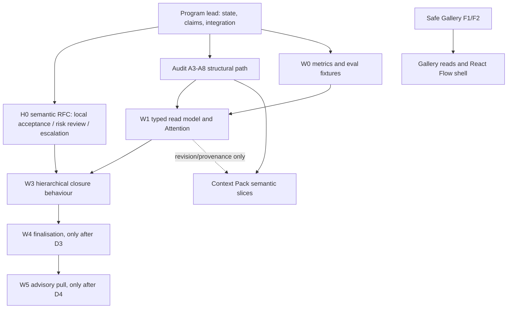

# План команды агентов для ускоренной реализации

**Статус:** предложение к запуску; не авторизует работу агентов само по себе.
**Дата:** 2026-08-25.
**Основание:**
[`architecture-improvement-implementation-plan.md`](architecture-improvement-implementation-plan.md),
принятые `decision.2FFQCGQKQ21VS1MQHNFCQEZWKJ` и
`decision.3JJTDQ7J5RN8846K8FGG9QKAM1`.

## 1. Рекомендация и границы

Собрать **восемь логических ролей**. В текущем in-app Codex доступно четыре
параллельных слота, включая координатора, то есть до трёх Codex worker-agents.
Claude образует отдельный provider pool: к этим трём можно добавить только тех
Claude workers, для которых прошли профильный preflight и budget reservation.
Число **writer-ов** при этом ограничено количеством изолированных worktree и
способностью program lead последовательно прогонять CI; read-only reviewers
могут работать без отдельного worktree. В общем checkout среди всех провайдеров
разрешён **ровно один Git writer**, остальные read-only. Три writer-а допустимы
только когда program lead заранее подготовил
каждому отдельный worktree/branch от одной pinned базы:
результат передаётся только commit-ом, затем наступают quiescence, exact-revision
review и последовательный cherry-pick/integration. Path claim не заменяет эту
изоляцию и не делает незакоммиченные байты безопасными. Claude, запускаемый
через broker profile, требует его preflight; прямой console read-only reviewer
не получает write tools и также не делает shared checkout writer-ом.

Это план **команды, реализующей продукт**, а не разрешение продуктовым агентам
самим рекурсивно нанимать подчинённых. Действующее
`decision.2MZM0KCW3TNCGKWQ58DZ7J3WSV` сохраняет `max_depth=0`; пока отдельный
authority/budget project не отменит его, только program lead запускает
исполнительские окна. Все агенты могут координироваться через задачи, claims,
bounded handoffs и exact-revision reviews.

Продуктовая целевая модель при этом остаётся иерархической:

```text
human owner (pull access to any branch)
  └─ top-level owner agent
       └─ parent owner / lead
            └─ delegated specialist

specialist result → local parent acceptance
                 → independent review only by policy
                 → parent-to-parent escalation only when unresolved
```

## 2. Граф программы и stop gates



| Gate | Что должно быть верно | Что блокирует |
| --- | --- | --- |
| G0 | H0 описывает event/schema, replay, idempotency, compatibility и rollback, authoritative parent binding, one-live-closure state machine, fail-closed `ReviewRequirement` и immediate-parent route; её принимают владелец и независимый reviewer. | Любой W3 write path. |
| G1 | Первый незавершённый audit slice подтверждён по audit-plan; A5/A7 дают требуемые typed task/review/delegation и UI seams; W0 фиксирует reproducible baseline и deterministic graders. | W1 typed read surfaces. |
| G2 | W1 читает состояние детерминированно; Attention прошла human precision sample. | Поведенческий W3. |
| G3 | W3 доказывает local closure, policy review pairing, no self-review и корректную эскалацию. | W4 finalisation и любой `task next`. |
| G4 | D3/D4 приняты отдельно, security/evals зелёные. | W4/W5 соответственно. |

## 3. Роли команды и изолированные результаты

| Роль | Владеет результатом | Разрешённые пути / граница | Старт |
| --- | --- | --- | --- |
| 1. Program lead / integrator | Декомпозиция, decisions, task graph, claims, exact-revision integration, CI. Не пишет feature semantics за другие роли. | coordination records, integration commits | Вся программа |
| 2. Semantic architect + governance | H0: ADR/RFC для local parent acceptance, risk review и upward escalation; старые данные, replay, rollback, typed refusals. | новый ADR / proposal, golden fixture specification | Wave 1 |
| 3. Structural architect | Сначала R-status reconciliation по exact task/review revisions; затем точный первый не принятый slice по порядку audit-plan, без поведения. | один audit module per task | Wave 1 |
| 4. Eval / QA engineer | W0 metric dictionary, sanitised fixtures, L0/L1 graders, regression matrix и release gates. | `tests/evals_harness/`, dedicated test paths, eval docs | Wave 1 |
| 5. Python work-state engineer | W1 frozen read models, `RunView`, work health, reason codes. | `domain/work_state.py`, `services/work_metrics.py` | После G1 |
| 6. Attention UI engineer | Parent queues, human pull reads, typed UI DTO, explanation-first UX. | `ui/attention_queue.py` adapter over `domain.attention.awaits_human()`, `ui/read_dtos.py`, designated React subtree | После W1 contract |
| 7. Context Pack engineer | Уже одобренные F3/F4 slices, context compiler and provenance only. | separate Pack schemas/reducers/services; source classification/effective child grant/redaction gate; no KV-cache extension | После A8 |
| 8. Gallery engineer | F1/F2 conformance/regression, затем F4 role/task/run entry and provenance-bound feedback. | designated Gallery backend and React Flow subtree; no legacy static UI writer overlap | Параллельно, по Gallery gates |

Security/reliability review — не девятая competing write lane: это обязательная
независимая review роль для H0, W3, W4 и preview boundary. Она получает
immutable subject revision и не изменяет его bytes.

## 4. Порядок запуска при лимите в четыре слота

### Wave 1 — подготовить безопасный фундамент

Активны: program lead, semantic architect, structural architect, eval/QA.

- semantic architect не пишет runtime code: выпускает H0 и fixture contract;
- structural architect сначала выпускает R-status reconciliation, затем продолжает только подтверждённый первый не принятый audit slice;
- eval engineer измеряет baseline и готовит deterministic cases без production metric surface;
- program lead принимает только non-overlapping результаты и назначает reviews.

Если у writer-ов нет отдельных worktree, один назначенный writer последовательно
оформляет результаты этих трёх ролей, а две другие роли остаются read-only до
quiescence и exact-revision review.

**Выход:** H0 готова к owner/reviewer decision; R-status matrix фиксирует
точный следующий audit slice и статус A5/A7;
fixtures не меняют production semantics.

### Wave 2 — параллельные read-only и Gallery результаты

Активны: program lead, work-state engineer, Gallery engineer, Context Pack
engineer либо Attention UI engineer — в зависимости от точного A8 gate.

- Work-state и UI никогда не спорят за один DTO: backend сначала публикует
  frozen wire contract, UI потребляет exact revision.
- Gallery не ждёт scheduler или W3; сохраняет только approved PNG/JPEG policy.
- Context Pack не обещает provider KV-cache и не меняет `runtime.yaml`.

**Выход:** G1/G2 или честный typed hold с причиной; F1/F2 и Pack work
доказывают собственные gates независимо.

### Wave 3 — один поведенческий вертикальный срез

Активны: program lead, W3 backend implementer, Attention UI engineer,
independent security/QA reviewer.

W3 выпускается маленькими commits: canonical semantic write, pure projection,
service orchestration, UI adapter, then independent review. Никакого параллельного
изменения тех же event families или lifecycle validators.

**Выход:** G3; только затем планируется W4. Wave 3 уже использует все четыре
слота: новая write-роль стартует лишь после явной паузы/завершения одного
участника и quiescence его worktree. Gallery/Pack/structural работа продолжается
только в отдельном worktree и не одновременно с его review/integration.

## 5. Операционный контракт команды

1. Один task — один проверяемый outcome и один активный writer claim на путь.
   В общем checkout только один Git writer; параллельные writer-ы получают
   отдельные worktree/branches от pinned base и передают только commit.
2. До любого write: `doctor`, bounded orient/inbox, task take/start, narrow claim.
3. Каждый agent передаёт exact commit, changed paths, `make check` evidence,
   remaining risks и request for review; не передаёт raw transcripts или secrets.
4. Structure и behaviour — разные commits. Полный `make check` и GitHub CI
   сериализуются program lead после quiescence, чтобы shared checkout не смешивал
   evidence; integration идёт одним последовательным commit/cherry-pick потоком.
5. Independent reviewer не пишет subject и проверяет immutable exact revision.
6. `src/agent_commons/ui/static/index.html` остаётся single-writer path; ни одна
   из этих волн не получает исключения из `FRONTEND_CONTRACT.md`.
7. При конфликте policy, stale revision, failed gate или пересечении claim агент
   останавливается с typed handoff; он не «договаривается» обходом ledger.

## 6. Метрики командного запуска

Команда считается ускорившей программу только если одновременно соблюдаются:

- доля integration commits, прошедших CI с первой попытки;
- время от готового task до independent review verdict или typed hold;
- 0 конфликтов claims и 0 смешанных structural/behaviour commits;
- W3: 0 self-review, 0 false strict acceptance, 100% policy-required review
  pairing-or-hold;
- Attention: подтверждённая человеком точность на sample, а не число карточек;
- Gallery/Pack: отдельные security and provenance gates, без расширения scope.

Если очередной gate не проходит, program lead уменьшает параллелизм до одного
изолированного remediation task. Rollback всегда отключает новую surface или
semantic path, но не переписывает ledger history.

## 7. Что нужно утвердить перед фактическим запуском

1. Восемь логических ролей и запуск волнами по четыре активных слота.
2. Wave 1 как первая очередь: H0, audit slice, W0 evals, coordination.
3. Право program lead останавливать новые launch'и при красном CI, stale review
   или конфликтующем claim.
4. H0 как единственный путь к W3: ни один agent не меняет `task.accepted`,
   recursion depth или persisted semantics «для ускорения».
