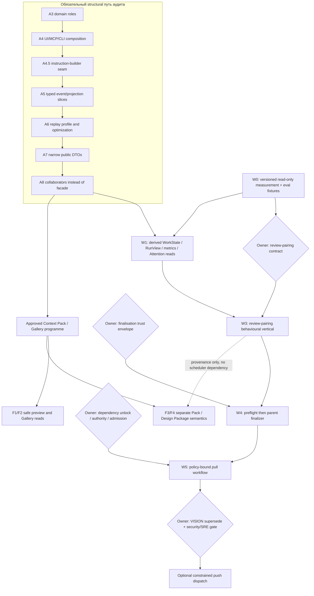

# Техплан: управляемая петля работы поверх ledger

**Статус:** decision-ready план. Он фиксирует порядок исследования и
реализации, но не принимает новые продуктовые или data-semantics решения за
владельца.

**Дата:** 2026-08-25.
**Проверенная граница кода и операционного среза:**
`4844fdbc95adc12ed9b11937d1eb6415f3fb3ba6`; operational metrics сняты
25 августа и должны пересниматься перед каждым KPI-решением.
**Входы синтеза:** только предоставленные владельцем
`codex_architecture_improvement_review.md` и
`claude_architecture_improvement_review.md`, а также три свежих
assessment-отчёта в [`docs/reviews/`](reviews/). Входные review остаются
пользовательскими рабочими материалами и не включаются этим планом в историю
репозитория. Ограничения взяты из действующего аудита кода и
утверждённой программы
[Context Pack / Gallery](context-pack-gallery-implementation-plan.md).

`agent_commons_product_architecture_review.md` намеренно **не использовался**:
он не является источником ни фактов, ни рекомендаций этого документа.

## 1. Ответ и границы

Нужно развивать две независимые продуктовые ставки:

1. **Замкнуть управляемую петлю работы.** Пользователь должен видеть, что
   submitted work либо дошёл до актуальной независимой проверки, либо получил
   объяснимое безопасное следующее действие. Нельзя подменять это новым
   scheduler-ом, provider exit или количеством ролей.
2. **Не потерять ценность общего исследования и визуальных результатов.**
   Утверждённые Context Pack и read-only Design Gallery продолжаются отдельной
   программой с их собственными semantic gates; это не демонстрация автономии
   и не зависимость от scheduler-а.

Первый минимальный вертикальный результат — не «автономная компания», а
**review-pairing loop**: для каждого нового task revision, который по выбранной
политике требует independent review, появляется ровно один актуальный,
маршрутизируемый review request либо typed refusal/hold с понятной причиной.
`completed` при этом не становится `accepted`, а provider completion не
становится review или acceptance.

### 1.1. Что подтверждено, что требует переизмерения

| Утверждение | Статус | Следствие для плана |
| --- | --- | --- |
| Immutable ledger, manifest, exact-revision evidence, fixed-point staleness, independent review и различие `completed != accepted` — текущий фундамент. | Подтверждённый факт. | Сохраняем; новая фича не пишет в обход canonical command boundary. |
| На 25 августа 32 tasks в `review`, из них 0 имеют non-stale `requested` review на exact current task revision. | Подтверждённый текущий срез. | Review-pairing — первый кандидат на пользовательскую вертикаль после решения владельца. |
| `task.submitted` и `review.requested` сейчас две отдельные append-only операции. | Подтверждённый факт. | Любая их сцепка — отдельное behavioural/data-semantics решение, не A3–A8. |
| `Delegation` содержит execution intent, а `Attempt` — process state; task-level join и digest отсутствуют. | Подтверждённый факт. | Первой делаем derived `RunView`; canonical `ExecutionRun` не вводим. |
| 9 из 31 terminal delegations находятся в `needs_operator`; у 6 summary описывает provider exit без canonical terminal result. | Подтверждённый симптом; причина «продуктовый дефект» — inference. | Отдельная финализационная вертикаль после review-pairing, не одна общая автоматика. |
| 46 handoffs открыты; p50 возраста на 25 августа — 18.20 дня. | Подтверждённый текущий срез. | Сначала видимый derived gap; recipient/supersede/expiry не канонизируем без решения. |
| Числа Claude от 24 августа (в том числе возраст review-state) — исторический срез. | Historical/stale. | Не становятся KPI, threshold или capacity plan до versioned re-measurement. |
| В VISION general autonomous scheduler — anti-goal; broker leaf-only и writable work остаётся ограниченным. | Подтверждённый факт/принятая граница. | Только advisory pull в этом плане. Push требует отдельного supersede VISION. |

### 1.2. Не-цели текущего плана

- не создавать `ExecutionRun`, `AcceptancePolicy`, authority scopes, typed
  handoff recipient, scheduler assignment или новые event families без
  отдельного решения владельца;
- не переименовывать `Delegation` в `Run` и не поддерживать dual-write;
- не превращать метрики, Attention или current time в canonical facts;
- не добавлять writable fan-out, shared-checkout parallelism, provider KV-cache
  promise, vector DB, Kafka/Temporal, A2A core или Marketplace;
- не расширять Gallery до visual editing, hotspots, SVG/HTML preview или
  arbitrary media;
- не хранить prompts, transcripts, hidden reasoning, raw tool arguments,
  secrets или unbounded provider output в ledger, metric fixtures или traces.

## 2. Базовые архитектурные правила

### 2.1. Типы данных и источник истины

| Класс | Допустимое место | Примеры | Запрет |
| --- | --- | --- | --- |
| Canonical truth | schema-validated append-only event + manifest ledger | Task, Delegation, Review, Artifact, accepted Decision | Нельзя менять format/meaning в structural refactor. |
| Operational/private state | существующий runtime attempt store | PID, process outcome, reservation, bounded diagnostics | Не становится acceptance или authority. |
| Derived read model | typed pure domain function / service / UI DTO | `RunView`, `TaskReadiness`, `AcceptanceView`, `ReviewLoopGap`, Attention, metrics | Не редактируется пользователем и не требует нового event. |
| Owner-authorised new semantics | отдельный semantic project | review pairing contract, policy, authority, handoff semantics | Нужны decision, schema/event/replay/migration/rollback contract. |

Новые in-memory boundaries — frozen dataclass, `StrEnum` или `TypedDict`, а не
`dict[str, Any]`. Derived results должны пересчитываться из snapshot + явно
переданного `now`; время не записывается как lifecycle event ради ageing.

### 2.2. Facade и composition constraints

Новый feature workflow **не получает** метод в:

- `src/agent_commons/services/manager.py::CommonsManager`;
- root `cli.py` / текущий transitional `cli/__init__.py`;
- `src/agent_commons/mcp/server.py::build_server`;
- `src/agent_commons/ui/context.py::UIContext`;
- legacy `src/agent_commons/ui/static/index.html`.

Одна canonical write boundary остаётся принципом, но это не означает рост
`CommonsManager`: после A8 она должна выражаться узкими collaborators и
композиционными адаптерами. CLI/MCP/UI являются тонкими transport adapters;
они не вычисляют authority, readiness, acceptance или lifecycle.

### 2.3. Единственный граф зависимостей программы

Mermaid ниже показывает зависимости **пакетов работ и owner gates**, а не
введение DAG engine для задач. Обычные task writes уже ацикличны по порядку
создания; поздний `TaskReadiness` остаётся чистым advisory predicate.



`W*` — новая control-plane программа. `P*` — уже утверждённая программа
Context Pack / Gallery. Рёбра из решений означают **stop gate**, а не
предварительно выбранный вариант.

## 3. Целевая карта компонентов и contracts

Имена ниже — target locations, а не утверждение, что все эти файлы уже готовы
на ревизии `4844fdb`. Нельзя обходить эту карту временным методом фасада.

| Область | Целевой модуль | Candidate contracts / methods | Ответственность | Когда |
| --- | --- | --- | --- | --- |
| Derived work vocabulary | `domain/work_state.py` | `ExecutionPhase`, `AcceptancePhase`, frozen `AcceptanceView`, `ReviewLoopGap`, `derive_acceptance_view(...)` | Python domain + software architecture | W1, после typed task/review slice A5 |
| Dependency readiness | `domain/work_readiness.py` | frozen `TaskReadiness`, `ReadinessReason`, `evaluate_task_readiness(task, snapshot, policy) -> TaskReadiness` | Python domain | W5 only; pure, deterministic |
| Derived run join | `domain/work_state.py` or narrow `domain/run_view.py` | frozen `RunView`, `derive_run_view(delegation, attempts, task, reviews)` | Python domain + runtime | W1; no ID/event |
| Metrics | `services/work_metrics.py` | `MetricWindow`, `WorkHealthMetrics`, `measure_work_health(snapshot, observed_at)` | Python backend + ML/evals | W0/W1 |
| Advisory planning | `services/work_planning.py` | `WorkCandidate`, `build_pull_plan(snapshot, policy, now) -> tuple[WorkCandidate, ...]` | Backend + product | W5 only; no write/assignment |
| Review-pair policy | `domain/review_pairing.py` | frozen `ReviewPairingDecision`, `ReviewPairingRefusal`, `decide_review_pairing(...)` | Python domain + product | W3 after owner decision |
| Review-pair orchestration | `services/review_pairing.py` | `ReviewPairingService.pair_or_refuse(...)` over narrow task/review/event ports | Python backend | W3; never a `CommonsManager` method |
| Finalisation boundary | `services/delegation_finalization.py` | `FinalizationEvidence`, `FinalizationOutcome`, `DelegationFinalizationService.evaluate(...)` | Runtime/backend + security | W4 after decision |
| Existing runtime integration | `services/delegation_runtime.py` | composition call into finalisation service only; preserve provider contract until behavioural change is approved | Runtime/backend | W4 |
| Attention adapter | `ui/attention_queue.py` with `ui/reads.py` adapter | frozen card DTO mapping, deterministic grouping/dedup; `list_attention_queue(...)` | Python UI backend | W1; `UIContext` delegates only |
| UI wire types | `ui/read_dtos.py` | `TypedDict` payloads for Work Health, `RunView`, Attention and typed refusal | Backend + frontend | A7/W1 |
| HTTP transport | `ui/server.py`, `ui/security.py` | thin read endpoints; existing mutation routes only after semantic decision | Python UI/backend + security | W1/W3 |
| CLI transport | `cli/work.py` after A4 CLI extraction | read-only `work health`; later `task next --dry-run`; explicit `--workspace` scope | Platform/CLI | W1, then W5; no root-CLI growth |
| MCP transport | `mcp/tools/work.py` after A4 MCP registration split | `register_work_tools(scope)`; no lifecycle rules in tool closure | Platform/MCP | W1; no growth in `build_server` |
| Eval harness | existing public `agent_commons.evals` + `tests/evals_harness/` as permitted by audit | fixture workspace, state graders, trace sanitation, replay regressions | QA + ML/evals + backend | W0 onward |
| Context compilation | `services/delegation_instruction.py`, then `services/context_compiler.py` | approved `CompiledContext` and frozen binding from the separate plan | Runtime/backend + ML/security | P3/F3-F4 only |
| Gallery reads | `services/artifact_content.py`, `ui/reads.py`, React Flow subtree | verified image reader, revision-bound Gallery DTO; existing contracts from Gallery plan | Backend/security + frontend/design | P2/F1-F2 |

### 3.1. Contract rules for the new work plane

1. A `RunView` joins existing `TaskRecord` + `DelegationRecord` + `Attempt`
   state. It cannot be submitted or accepted and cannot manufacture a canonical
   result.
2. `TaskReadiness` is a later pure recommendation for advisory next-work only.
   It is not a DAG project: normal task writes are already acyclic by creation
   order, and review-pairing repair neither needs nor waits for it. It has stable reason codes such
   as `ready`, `unresolved_dependency`, `terminal_dependency_failure`,
   `stale_target` and `policy_unknown`; the first implementation does not take,
   start or delegate a task.
3. `AcceptanceView` exposes what evidence is missing. It preserves existing
   independent-review and stale-evidence predicates rather than creating a
   competing status column.
4. `WorkCandidate` carries the exact task revision, policy version and ordered
   reasons. A pull consumer must re-check these values through the existing
   command path before any write.
5. Worker-supplied finalisation input is untrusted. The parent independently
   verifies known refs, hashes, scope, size, fresh target revision and terminal
   facts. A valid finalisation never equals task acceptance.
6. Any web/CLI/MCP mutation supplies expected revision and idempotency key;
   readers expose typed refusal, empty, stale and unavailable states.

## 4. Delivery phases

### Phase R — finish the governing refactor without feature leakage

**Purpose:** make target seams available, not add control-plane semantics.

The audit records A0–A2.2 as performed and A3–A8 as remaining. This plan does
not silently reclassify their state from current file names; each completion is
confirmed by its own exact-revision review.

| Audit step | Control-plane benefit | Constraint / owner |
| --- | --- | --- |
| A3 `domain/roles.py` | Gives a narrow home for future authority vocabulary. | Do not put authority/admission policy into roles before owner decision. Python domain. |
| A4 composition (UI/MCP/CLI) | Creates locations for Work reads/actions/tool groups. | Do not add control-plane methods to `UIContext`, root CLI or `build_server`. Platform/UI. |
| A4.5 instruction seam | Later lets Context Compiler consume typed input. | Mechanical extraction only: no prompt, `runtime.yaml` or persisted change. Runtime. |
| A5 typed vertical records | Supplies typed Task/Review/Delegation inputs for derived views. | Existing JSON/events round-trip byte-for-byte. Python domain. |
| A6 replay work | Establishes profiled baseline and safe golden-replay workflow. | No semantic migration or performance conclusion before profiling. Software/performance. |
| A7 DTOs | Provides narrow UI/MCP/CLI transport for reads. | Public wire shape stays stable in structural commits. Backend/frontend. |
| A8 collaborators | Lets services be consumed without expanding `CommonsManager`. | New feature API lives in thematic services; facade migration has its own window. Architecture/platform. |

**Exit:** every structural commit is behaviour-neutral, separately reviewed and
green; no W/P code is smuggled into it.

### Phase W0 — evidence, metric contract and hermetic harness

**Smallest safe start; no owner decision required to measure.**

Deliverables:

1. A versioned, read-only metric query and data dictionary: snapshot revision,
   time window, numerator, denominator, exclusion and query version for review
   coverage, `needs_operator` taxonomy, handoff age, objective coverage and
   operator routing load.
2. A sanitised fixture workspace and golden replay corpus. It contains no live
   workspace copy, private worker output, random timestamps or secrets.
3. Deterministic W0 cases: unpaired submitted task, stale request, self-review
   attempt, no-session orient, foreign-session non-borrowing, historical stale
   evidence, duplicate retry and safe provider terminal ambiguity.
4. The narrow read-only orient repair, if independently scoped: it must require
   explicit workspace/session scope, perform zero canonical writes and never
   borrow another session. It is a standalone behavioural fix, not a shortcut
   to a broader CLI feature.
5. Documentation of the first three business-loop contracts, with blank owner
   decision fields rather than implied defaults.

**Owners:** Python backend + QA/ML-evals for query/harness; product/business for
metric purpose; platform for orient; independent reviewer for replay/privacy.

**Exit gate:** each metric has an owner and action; fixtures run in a fresh
workspace; replay equivalence is demonstrated for unchanged behaviour; owner
has selected *which* loop may enter W3. Historical 24-Aug figures never pass
this gate by themselves.

### Phase W1 — derived work health, before automation

**Purpose:** make the existing state understandable and falsifiable without
adding a new canonical ontology.

Deliverables:

- typed `RunView`, `AcceptanceView`, `ReviewLoopGap` and `WorkHealthMetrics`
  over existing projections;
- deterministic read-side metrics and reason-code links to exact subject
  revisions/evidence;
- read-only operator Attention Queue with deduplication and controlled clock;
- low-noise UI/CLI/MCP work-health read surfaces after their A4/A7 seams
  exist. `task next` and dependency readiness remain deferred to W5 and are
  not a prerequisite for repairing the review loop.

**Owners:** Python domain/backend, frontend/design for comprehensibility,
product for metric interpretation, QA/ML-evals for state graders.

**Exit gate:** identical snapshot + policy version + `now` yields identical
results; every attention card gives subject revision, why-now, evidence,
unknowns and next safe action; a blinded sample of at least 20 cards is used
to calibrate precision before it becomes a primary surface. A card is never a
Decision or Acceptance merely because it is visible.

### Phase W3 — one review-pairing closure loop

**Start only after owner decision D1 and reviewer-routing decision D2.**

The implementation is one vertical, not a backlog migration or scheduler:

- formulate `required review` eligibility and independence using existing
  principal/session predicates;
- for an in-scope new revision, create one current request with an eligible
  route **or** return a typed hold/refusal; do not fabricate a verdict;
- make duplicate retries idempotent and stale/revised targets explicit;
- expose unpaired/unroutable state in Attention and a reviewer-facing
  revision-bound queue;
- conduct historical repair only as an operator-confirmed, reversible batch;
  it appends new history and never rewrites or auto-disposes old work.

Two choices exist, and the plan chooses neither:

| Variant | Benefit | Cost / required contract |
| --- | --- | --- |
| A. Composite semantic action | No successful user path can end in unpaired required-review state. | Define event vocabulary/order, retry/crash/replay behaviour, routing/refusal, old-history migration and rollback. |
| B. Two existing actions + idempotent reconciler | Preserves existing event vocabulary and makes recovery explicit. | Intermediate gap remains a product state; define detection cadence, authority to repair, idempotency, user visibility and backlog handling. |

**Exit gate:** 100% of *new, in-scope* required-review transitions are paired
or explicitly refused in deterministic tests and a declared live sample;
false acceptance = 0 and self-review = 0. Disabling coupling must leave ledger
history intact and return only to the prior explicit flow.

### Phase W4 — runtime preflight and bounded finalisation

**Separate security vertical; it is not bundled with W3.**

Order:

1. First improve environment preflight and typed `needs_operator` taxonomy.
2. Only after owner decision D3 add a parent-side finalisation service that
   verifies bounded attestation against independent operational evidence.
3. Invalid, stale, missing, oversized or duplicate reports become safe typed
   failure/Attention outcomes. They never cause an inferred success.

**Exit gate:** no invalid terminal report causes canonical terminal success;
taxonomy coverage is 100%; before broad enablement, 50 observed eligible
terminal cases contain zero finalisation gaps under the selected contract.
Any invalid success disables the feature flag and creates a regression case.

### Phase W5 — policy-bound pull, then only if valuable

After W1/W3/W4 prove the loop, consider a **new, small, pure**
`TaskReadiness` predicate for advisory `task next` and explicit one-shot
human-approved execution. It is not a DAG migration: normal writes already
make the dependency graph acyclic by creation order. This phase requires owner
decisions on what unlocks a dependent task, admission, objective adoption and
authority. It still does not create a background dispatcher and is explicitly
unrelated to the repair of `submit -> review`.

The safe order is:

1. record labelled pull recommendations and human dispositions;
2. evaluate whether `TaskReadiness` reduces off-ledger routing without quality
   regression;
3. introduce the smallest approved canonical policy only if the derived model
   has demonstrated a real shortfall;
4. separately decide any follow-up, quota, agent-generated-task or handoff
   semantics with schema/replay contracts.

**Exit gate:** pull has a deterministic explanation, revision re-check and no
authority escalation; it demonstrably improves declared operator-routing
baseline without hiding/cancelling work to improve the number.

### Phase W6 — deferred constrained push dispatch

This is intentionally outside authorised implementation scope. It requires all
of the following before a task is created:

- an owner decision explicitly superseding the relevant VISION anti-goal;
- authority/admission vocabulary, operator-owned budget/rate/concurrency
  configuration and audit trail;
- isolated worktree lifecycle, path attestation, merge/review ownership and
  recovery (claims alone are insufficient);
- security threat model, kill switch, red-team/negative evals and canary plan;
- sustained review pairing, zero false acceptance, zero stale-target launch and
  the selected finalisation gate.

Push never grants acceptance, extends tools, profiles or filesystem scope, and
must revert to manual/pull with history preserved.

## 5. Decision register — no silent defaults

The following are product/business decisions. A technical writer, assessment or
implementation agent may prepare proposals, but cannot select an alternative.

| ID | Decision for owner | Alternatives to resolve | Why it gates work | Decision owner / consulted lanes |
| --- | --- | --- | --- | --- |
| D1 | What is the review-pairing user contract? | composite action; separate actions plus reconciler; refuse vs hold when route absent | Changes visible task/review semantics, crash recovery and possibly event history. | Product/business; backend, governance, QA |
| D2 | Who may receive/review work and what is independent? | initial routing rules, fallback operator, no-route behaviour | Title/model label cannot infer trust; self-review invariant is product trust. | Governance/product; security, backend |
| D3 | What trust envelope permits parent finalisation? | minimum evidence, reason codes, duplicate/stale handling, human-only cases | Worker report is untrusted; bad choice can falsely claim terminal success. | Runtime/security; product, QA |
| D4 | What does dependency unlock mean? | `completed`, `accepted`, explicit per-policy rule, or no pull yet | Changes readiness and user expectation; an `AcceptancePolicy` field is persisted semantics. | Product/business; domain/backend |
| D5 | Is objective adoption required, optional or out of first-loop scope? | mandatory new work; encouraged; defer | Objectives = 0 is evidence to study, not permission to add gating. | Product/business; UX |
| D6 | Which handoff semantics are real? | recipient types, transfer, supersede, expiry, manual only | Each can require new events/replay rules; ageing visibility alone does not. | Product/governance; backend |
| D7 | What trace privacy/retention is acceptable? | bounded fields, retention/erasure, real-provider canary access | Evals require evidence but must not create transcript storage. | Product/privacy/security; ML-evals |
| D8 | Are Context Pack extensions in scope? | manifest, token policy, cache, Pack diff each separately | They exceed approved Pack MVP; cache must be correct/privacy-safe. | Product; ML/backend/security |
| D9 | Is constrained push dispatch ever desired? | retain pull; approved limited push after gates | It supersedes VISION and adds SRE/security responsibility. | Owner/product; security/SRE/runtime |

For every accepted D1–D9 that changes canonical semantics, open a distinct
semantic project before implementation. Its proposal must name event/schema
vocabulary, old-data handling, replay invariant, compatibility, migration and
rollback. A feature flag is not a substitute for that contract.

## 6. Eval, metrics and release gates

### 6.1. Test pyramid and evidence discipline

| Layer | Scope | Grader and evidence | CI placement |
| --- | --- | --- | --- |
| L0 deterministic domain | run/acceptance views, review-pair policy, metric formula; later readiness | unit/property tests with fixed `now` and frozen typed fixtures | local + presubmit |
| L1 command/ledger | CAS, idempotency, exact revision, replay, no false acceptance | fixture state/event-order assertions; old fixture round-trip | presubmit |
| L2 runtime safety | preflight, bad/missing/duplicate terminal reports, crash/timeout | deterministic fake-provider state checks; race cases run `pass^3` where necessary | post-submit/nightly, critical subset RC |
| UX / Attention | correct owner, evidence, why-now and safe action | written rubric plus blinded human calibration | release candidate/manual sample |
| L3 real provider | optional bounded golden workflow only | ledger/attestation first, human trace audit second; no raw transcript storage | opt-in canary, non-blocking until calibrated |

Each fixture run records only: case ID, harness/schema/code revision, fixture
hash, policy/config version, expected/actual canonical refs, derived state,
typed outcome/refusal, bounded elapsed/resource counters. Prompt body,
reasoning, raw provider args/output and secrets are excluded.

### 6.2. Metric dictionary and guardrails

| Metric | Definition | Type / proposed gate | Owner and failure action |
| --- | --- | --- | --- |
| Required-review pairing coverage | paired current independently-routable requests / all new in-scope required-review revisions | Hard invariant: 100% only after D1/W3 | Workflow owner: hold/refuse bad transition, investigate any gap. |
| False acceptance | accepts without required current independent evidence / all accepts | Hard invariant: 0 | Governance owner: invalidate/disable path, incident review. |
| Self-review / stale launch | prohibited self-review or stale-target launch / all respective attempts | Hard invariant: 0 | Runtime/governance: block/kill switch. |
| Finalisation integrity | valid attested terminal canonical results / eligible terminal outcomes | Hard safety gate: 0 invalid successes; broadening needs 50 observed eligible gap-free outcomes | Runtime/security: disable finaliser and add regression case. |
| `needs_operator` taxonomy completeness | typed reason cases / all terminal `needs_operator` cases | Data-quality invariant: 100% | Runtime: classify before announcing rate improvement. |
| Review disposition latency | request to verdict or typed escalation, p50/p90 | Baseline first; later target is owner-approved, not discovered fact | Product/review owner: make ageing visible, never auto-approve. |
| Attention precision | human-confirmed actionable sampled cards / non-suppressed sampled cards | Calibrate on at least 20; any numeric target is proposed | Product/UX: tune/dedup, do not promote noisy surface. |
| Handoff action health | acknowledged handoffs with valid follow-up ref / handoffs that require acknowledgement | Baseline first | Coordination: surface in Attention; no automatic closure. |
| Operator routing load | manual forensic/routing actions outside next-safe-action flow / accepted or safely closed in-scope work | Must improve vs declared baseline without guardrail regression | Product: hold/revert if work merely moves off-ledger. |
| Objective coverage | in-scope active tasks with valid objective ref / all in-scope active tasks | Diagnostic only until D5 | Product: investigate friction, no autonomous-work target. |

Metrics are aggregate system signals, not an agent or engineer scorecard.
Every dashboard/result publishes sample size, window, query version and known
exclusions. An easy-to-improve activity counter is not a release criterion.

### 6.3. Replay, migration and rollback

Derived W0/W1 changes must preserve canonical replay. For each later approved
semantic change use this ordered contract:

```text
owner decision
  -> event/schema vocabulary and versioning proposal
  -> sanitised golden old-ledger fixtures
  -> parser/serializer round-trip and before/after replay invariants
  -> compatibility/migration plus explicit handling of old records
  -> idempotency/CAS/crash tests and independent exact-revision review
  -> feature flag, operational metric, kill switch and cleanup owner
```

No live workspace is copied into a golden fixture. A6 profiling/optimisation
remains separate from a semantic migration: performance improvement cannot
weaken hash/schema verification or supply an excuse to change event meaning.

## 7. Security, privacy and operational boundaries

| Boundary | Required control | Rollback / owner |
| --- | --- | --- |
| Review coupling | exact revision, current request cardinality, independence predicate, CAS/idempotency | disable coupling; preserve existing history; product/backend |
| Parent finalisation | bounded typed report, hash/path/scope verification, fresh target, size limit, known reason code | feature kill switch on invalid success; runtime/security |
| Attention/metrics | derived read only, injected clock, no automatic remediation, bounded diagnostic fields | hide surface/revert adapter; product/UI |
| Pull planning | dry-run by default, explanation/policy/revision included, write re-check through existing command | remove recommendation surface; backend/product |
| Writable runs | single worker until isolated worktree + attestation + merge owner are approved | retain manual execution; runtime/security |
| Evals/traces | sanitised fixtures and bounded metadata; retention/erasure decision before L3 | stop canary/data collection; ML-evals/privacy |
| Gallery preview | existing PNG/JPEG, current revision, classification and verified-reader contract | disable preview route; no raw URL fallback; security/backend |

## 8. Context Pack and Design Gallery remain a parallel approved programme

This plan does not reopen the decisions recorded in
[the approved programme](context-pack-gallery-implementation-plan.md): Context
Pack and Design Package are canonical revisioned entities; Gallery begins in a
React Flow screen; V1 preview is only current-revision `public`/`internal`
PNG/JPEG; demo and `runtime.yaml` are not product state.

| Programme slice | Current plan status | Relationship to work loop |
| --- | --- | --- |
| F1 verified image preview | Supported as implemented by fact check; must retain its security contract. | Shares artifact revision/classification discipline only. |
| F2 React Flow Gallery shell | Supported as an honest shell returning `gallery_data_unavailable` until Design Package reads exist. | Does not prove work closure or scheduler value. |
| F3 Context Pack semantic slice | Already approved but still a separate schema/event/projection/migration project after A8. | May later supply frozen binding/fingerprint to `RunView`; it does not promise provider KV-cache reuse. |
| F4 Design Package, feedback provenance and compiler | Approved programme work after its own gates. | Feedback V1 can open existing review discussion; automatic task/region annotations need another workflow decision. |
| Manifest, token policy, cache, Pack diff | Proposed extension, not silently added. | D8 plus deterministic selection/leakage/truncation/cache-key evals required. |

Cross-dependencies are intentionally narrow: A5/A7/A8 typed/revision seams,
privacy classification, safe preview and replay discipline help both tracks.
The control plane must not block F1/F2 merely to produce a demo; Gallery must
not borrow scheduler, arbitrary media or editing scope to look more complete.

## 9. Delivery decomposition, ownership and commit order

### 9.1. Work packages for an agent team

| Package | Outcome | Lanes | Preconditions | Isolated path claim |
| --- | --- | --- | --- | --- |
| R-A3…A8 | Remaining audit structural slices | Software architecture, Python domain, platform, UI | audit sequence | one target module per task |
| W0-metrics | Query, metric dictionary, read-only view | Python backend, product, ML-evals | none | `services/work_metrics.py`, docs/eval fixtures |
| W0-harness | Sanitised fixtures and L0/L1 graders | QA, ML-evals, Python backend | metric definitions | `tests/evals_harness/` / test paths |
| W0-orient | Explicit unscoped read-only orient repair | Platform, QA/security | independently scoped owner approval | narrow CLI/service tests |
| W1-domain | Work state/run pure records | Python domain, software | A5 task/review/delegation typed inputs | `domain/work_state.py` |
| W5-readiness | Later advisory `task next` predicate | Python domain, backend, product | D4 and W1/W3/W4 evidence | `domain/work_readiness.py`, `services/work_planning.py` |
| W1-surface | Attention/read DTO and transport reads | UI backend, frontend/design | A4/A7, W1-domain | `ui/attention_queue.py`, `ui/read_dtos.py`, React subtree |
| W3-pairing | Selected semantic review-pair contract | Product, Python backend, governance, QA | D1/D2 plus migration proposal | `domain/review_pairing.py`, `services/review_pairing.py` |
| W4-finaliser | Preflight/finalisation contract | Runtime, security, QA/ML-evals | D3, W0 L2 harness | `services/delegation_finalization.py` |
| P-F1/F2 | Safe preview and Gallery reads/shell | Backend/security, frontend/design | approved programme gates | designated Gallery subtree; no legacy `index.html` |
| P-F3/F4 | Pack/Package semantic slices | Python domain/backend, runtime, security, frontend/design | A8 + existing accepted decisions | separate schemas/reducers/services |

The single-writer claim on `src/agent_commons/ui/static/index.html` remains
mandatory if any future task genuinely touches it. Gallery work uses the React
subtree and does not create an exception to `docs/FRONTEND_CONTRACT.md`:
typed refusals, paired locales, glossary and CSP-safe DOM still apply.

### 9.2. Commit and review protocol

1. First submit W0 measurement/eval documentation and fixtures in separately
   reviewable changes. No semantic feature is mixed into a fixture cleanup.
2. Continue A3–A8 as ordered, behaviour-neutral commits; run `make check`
   before each, then independently review exact revision.
3. Implement W1 pure domain types/tests, then service aggregation, then UI DTO
   and one transport surface. These are separate commits; W1 remains read-only.
4. Stop for D1/D2 before any W3 write path. Create the semantic/migration
   proposal and its tests before implementation.
5. Deliver W3 only after approval; conduct backlog repair in a separately
   authorised batch with its own reports and rollback path.
6. Run W4 only after W3 evidence and D3; preflight and finaliser stay separate
   behavioural commits because their attack surfaces differ.
7. Context/Gallery P-F1/F2 proceeds in parallel only with non-overlapping
   claims. P-F3/F4 keeps separate semantic commits and never changes `runtime.yaml`
   into a feature store.
8. Every commit uses the repository green contract (`make check`), classic
   commit message, no AI attribution and green CI before push. Structure and
   behaviour remain different commits; full gates are serialised when shared
   work is active.

## 10. Conditions to revise this plan

Re-open the ordering only with evidence, not preference:

- a fresh query disproves the review/finalisation loop diagnosis;
- W1 measurements show attention is too noisy or does not change a safe
  operator action;
- derived `RunView` cannot represent a demonstrated retry/worktree/context
  workflow without conflicting historical answers;
- a user-approved Context Pack extension demonstrates material value and
  passes privacy/cache/leakage evals;
- the owner explicitly changes VISION and accepts scheduler security/SRE
  responsibility.

Until then the governing sequence is: **measure → make state legible → close
one loop → validate finalisation → try advisory pull → decide authority → only
then consider constrained dispatch**, while the approved safe Context Pack /
Gallery programme advances on its own gates.
