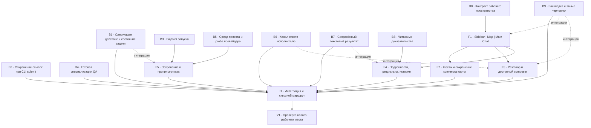

```
Status: completed locally
Owner: historical — October 9 integration
Opened: 2026-10-09   Archived: 2026-10-09
Contract: FRONTEND_CONTRACT; ADR 0026 and ADR 0027
Source boundary: base 9ba5cbd; revision-bound implementation evidence in docs/evidence/2026-10-09/
Superseded by: none (completed local increment)
Archive trigger: independent review and full local make check completed
```

# Карта действий: рабочее пространство Agent Commons

Status: completed locally — реализация и локальная проверка завершены; внешние границы перечислены отдельно
Owner: Opus — исходный дизайн/frontend; Codex — backend, завершение frontend, интеграция и проверка
Opened / Last verified: 2026-10-09 / исходная граница main 9ba5cbd
Contract / Decision: PRODUCT, FRONTEND_CONTRACT; Sidebar | Work Map | Main Project Chat по прямому поручению владельца
Source boundary: отчёт 8–9 октября, журнал, manifest 95 кадров; два первых ответа и две критики
Supersedes / Superseded by: уточняет G8/G9 плана 1 октября; принятые G5/G6/G7 не отменяет / —
Archive trigger: реализованы и проверены пакеты ниже, exact review завершён, остаточные границы переданы владельцам

Целевой результат — рабочее место технического разработчика: узкая навигация слева,
большая карта задач в центре, основной разговор проекта справа. Вкладки подробностей,
команды, результатов, галереи и настроек открываются по запросу. Проектный разговор
не меняет адресата при выборе задачи. Панели можно менять по ширине, сворачивать и
переставлять. Карта остаётся основной поверхностью; мышь, клавиатура и трекпад
управляют одним viewport. [Референс владельца](../../evidence/2026-10-09/astra-opus-council/owner-workspace-reference.png).

Это план **изменений и реализации**, а не объявление готовности. Статусы JSON —
авторский снимок плана, не доказательство приёмки. Формальные задачи реализации
связаны с ним через handoff; текущая плановая задача — `task.0F9YB0W004AQG68SZV261CDZ9H`.

## Основание и вывод консилиума

[Исходный отчёт](../../handoffs/2026-10-08-blizhe-dogfooding-feedback.md),
[журнал](../../evidence/2026-10-08/blizhe-dogfooding/journal.md),
[95 кадров с подписями](../../evidence/2026-10-08/blizhe-dogfooding/manifest.md).
Хеши всех 95 изображений сверены; организатор визуально посмотрел три проблемных
кадра и референс. Участники получили текст, подписи, DOM и исходники, **не пиксели**.
Независимые ответы и одинаковый пакет взаимной критики сохранены
[полностью с provenance](../../evidence/2026-10-09/astra-opus-council/README.md).

Запрошены Astra и Opus. Native lane: `gpt-6-astra`, отдельной provider-attestation нет.
CLI alias `opus` в обоих запусках сообщил `claude-opus-5`; вспомогательный Haiku
не считается третьим участником. Это не утверждение, что запущен Opus 4.6 или
браузерный Opus 5.5 из прежнего отчёта. Model agreement не заменяет тесты.

Оба участника рекомендуют параллельную работу над оболочкой и корректностью
жизненного цикла. При синтезе удалены искусственные жёсткие зависимости от общего
документа ко всем backend-исправлениям; ранняя оболочка не ждёт их завершения.
Вердикт review определяет действие только с учётом точной текущей ревизии,
активного прогона и блокировок. `task`, `run`, `result`, `review`, `acceptance`
остаются разными состояниями. Причина несовпадения счётчика с run проверяется
отдельно: одна найденная строка не доказывает единый корень всех симптомов.

Приняты уточнения: retained bytes обязательны для текстовых результатов;
verification не наследует builder authoring-инструменты; budget API использует
`operator_budget_exhausted`, каноническая причина остаётся `budget_exhausted`;
precheck не заменяет атомарный reserve. Для черновиков выбран явный Save/Restore,
поскольку автоматическое сохранение не было требованием владельца. Исправление
composer не зависит от persistence. WP-29 не обозначает хронологию прогонов.

## Граф исполнения

Сплошная стрелка — реальная жёсткая предпосылка. Пунктир — соединение готовых
частей; он не запрещает параллельную реализацию. Длительности не оценены, поэтому
граф не выдаётся за вычисленный критический путь.



[Машиночитаемый граф](../../evidence/2026-10-09/astra-opus-council/action-graph.json)
содержит тех же исполнителей, зависимости и критерии; отсутствие циклов проверено.

## Пакеты, владельцы и критерии выхода

| Пакет | Исполнитель | Жёсткие предпосылки | Источник / прежняя работа | Изменение и проверяемый выход |
| --- | --- | --- | --- | --- |
| D0 — Контракт рабочего пространства | Opus + Codex | нет | Владелец, G8, WP-18/19/42 | Согласовать три области, вкладки, состояния и главную проектную беседу; поправить ADR 0020 отдельным решением.<br>**Выход:** Проверяемое соответствие Sidebar / Map / Main Chat, без постоянного инспектора. |
| B1 — Следующее действие и состояние задачи | Codex | нет | UX-40, UX-45, G8, WP-22/23 | Матрица server next_action: текущая проверка, активный прогон, stale revision, policy и приёмка.<br>**Выход:** Current independent approved → принять; changes_requested → исправить; active/stale блокировки сохранены. |
| B2 — Сохранение ссылок при CLI submit | Codex | нет | UX-48, G8 | Отсутствие --artifact-ref передаёт None; явная последовательность сохраняет смысл замены.<br>**Выход:** Omission не очищает доказательства; явная очистка отдельно проверена; stale refs отказаны. |
| B3 — Бюджет запуска | Codex | нет | UX-57, WP-22/23 | Общий расчёт union tree/session/provider для precheck и reservation; безопасный DTO остатков.<br>**Выход:** Исчерпание до создания лишней delegation; гонка повторно проверяется атомарно; API operator_budget_exhausted, canonical budget_exhausted. |
| B4 — Готовая специализация QA | Codex | нет | UX-37, G8 | Добавить versioned qa-reviewer; сохранить qa-engineer и закреплённые версии.<br>**Выход:** Новая QA совместима с независимым reviewer, старые агенты не переписаны. |
| B5 — Среда проекта и probe провайдера | Codex | нет | UX-42, UX-43, UX-47, G2/G9 | Отдельные read-only признаки dependencies/toolchain; измеряемый bounded initialization probe; UI действие квалификации.<br>**Выход:** Нет автоматического запуска package scripts; среда отделена от provider qualification; timeout не ослабляет изоляцию. |
| B6 — Канал ответа исполнителю | Codex | нет | UX-52, G8 | Locked/idempotent ensure адресованного task conversation до работы провайдера.<br>**Выход:** Запуск новой задачи не требует предварительно открыть чат; worker видит только адресованные разговоры. |
| B7 — Сохранённый текстовый результат | Codex | нет | UX-38, UX-39, G5/G7/G8 | Bounded inline text/report → retained immutable bytes; exact task/delegation scope; явные complete/submit/finalize.<br>**Выход:** Crash/retry сходится; worker не получает acceptance; verification не наследует authoring tools. |
| B8 — Читаемые доказательства | Codex | нет | UX-44, UX-58, G8 | DTO полного описания и точных result refs с именами/summary/checks, ограниченная пагинация.<br>**Выход:** Все 52 refs доступны; смена task revision между страницами требует обновления; никакого произвольного чтения путей. |
| B9 — Раскладка и явные черновики | Codex | нет | UX-15, Владелец, G8 | Отдельное приватное principal/project/scope operational storage с CAS, квотами, явными Save/Delete.<br>**Выход:** Reload восстанавливает подтверждённый текст; конфликт вкладок не затирается; без browser storage, autosend или reuse attachment reservations. |
| F1 — Sidebar / Map / Main Chat | Opus | D0 | Владелец, UX-46, UX-50, G8 | Полноразмерная карта по умолчанию; узкие переставляемые/сворачиваемые/изменяемые панели; прочее по запросу.<br>**Выход:** 1042×467 и обычный MacBook: карта видна сразу; нет четвёртой постоянной колонки; проектный чат явно отдельный. |
| F2 — Жесты и сохранение контекста карты | Opus | F1 | UX-54, G4/G6, WP-25/27 | Двухосевой pan, pinch вокруг курсора, drag пустого холста, клавиатура/список; отдельные selected/focus/viewport/detail.<br>**Выход:** Закрытие деталей не меняет 9/14 на 14/14; обновление не сбрасывает viewport; жесты локальны карте. |
| F3 — Разговор и доступный composer | Opus | F1 | UX-15, UX-53, UX-55, UX-56 | Встроенный главный чат, явные task/agent scopes, общий session transport; Save/Restore draft после B9.<br>**Выход:** Текстовое поле получает click/Tab в EN/RU после отправки/scroll; ответ не выдумывает ack; чтение страницы не создаёт сообщение. |
| F4 — Подробности, результаты, история | Opus | F1, B8 | UX-39, UX-44, UX-51, UX-58, UX-59, G8 | Подробности как временная вкладка; полное описание, имена результатов, технические refs в disclosure; сортировка времени.<br>**Выход:** Новый QA первый с датой через полночь; нет raw-ID стены; gallery вход по аватару/имени сохраняется. |
| F5 — Сохранение и причины отказа | Opus | B3, B5 | UX-41, UX-43, UX-45, UX-50, UX-56, WP-22/23/30 | Сохранение/подтверждение/ошибка refresh отдельно, типизированный budget, явная qualification CTA, единый словарь.<br>**Выход:** Не повторяет подтверждённый POST; uncertain retry сохраняет identity; настоящая auth ошибка не скрывается. |
| I1 — Интеграция и сквозной маршрут | Codex | B1, B2, B4, B6, B7, B9, F2, F3, F4, F5 | G9 | Один integrator, bundle, scoped handoff→QA return→fix→fresh review→отдельная приёмка.<br>**Выход:** Синтетический цикл и реальный ограниченный canary; точные source/profile/evidence записаны. |
| V1 — Проверка нового рабочего места | Codex + независимый reviewer | I1 | UX-01, UX-32, G9, WP-24/25 | make check, обе TS сборки, wheel/install, browser EN/RU, непустая/пустая gallery, доступность; независимое exact-review.<br>**Выход:** Actual served DOM/screenshots, нет перекрытого composer; review неподвижной границы; физические жесты не приписывать synthetic тесту. |

## Что сохраняет самостоятельную границу

- UX-01: восстановление панели проверяется как отдельный путь; причина прежнего
  остановленного сервера не установлена. Не делать приложение менее защищённым
  ради сокрытия connection refused.
- UX-32: пустая галерея исправна в исходном отчёте. Проверить непустую на новой
  версии; не объявлять старый дефект повторившимся без воспроизведения.
- UX-53: ответ и explicit reading acknowledgement могут расходиться. Нельзя
  рисовать недоставленное подтверждение ради красивой последовательности.
- UX-55: перекрытие textarea доказано DOM, причинная связь с русским языком — нет.
- Временные 0/0 не доказывают потерю данных. WP-20 измеряется отдельно; задержка
  model response не является временем сохранения. Производительность не закрывается
  новым layout или зелёным functional test.
- Текущий writable doctor Commons на возобновлении: ok=true, issues=[], 4305 events;
  исторические stale warnings сохранены. Это отдельная граница от финального
  read-only doctor Blizhe в отчёте, который остаётся исторически верным.
- Linux L1, внешняя среда и исследования с людьми требуют своей среды/наблюдений.
  Локальная проверка macOS не подменяет их. Физический pinch нельзя заявить
  проверенным по синтетическому wheel.
- Blizhe, его незакоммиченные файлы и исчезнувшие чужие worktrees не являются
  областью изменения Commons. CONFIG и исследовательские задачи не принимаются
  массово вслед за девятью приёмками.

## Выполнение и окончательная проверка

Opus создал дизайн и первую реализацию frontend в `oct09-opus-workspace`. После
исчерпания лимита Claude Codex продолжил эту реализацию: устранил ошибки, добавил
интеграцию и поведенческие проверки. Исходная граница Opus и фактическая модель
сохранены в [provenance](../../evidence/2026-10-09/astra-opus-council/opus-frontend-provenance.json).
Codex реализует core/runtime в `oct09-codex-core`, retained text handoff и явную
проверку существующей привязки проекта в `oct09-result-handoff`. Один integrator
переносит изменения, собирает assets и проводит общую проверку. Между review
неподвижной границы и её вердиктом эта граница не меняется.

Проверки: focused lifecycle/storage/concurrency tests; EN/RU frontend behavior и
TypeScript; `make check`; сборки Work/Gallery и wheel; переустановка uv tool после
изменений src и canary точного следующего профиля; browser journey с геометрией
карты, hit-test composer, непустыми результатами и восстановлением контекста.
Подтверждение запроса на изменение проекта само по себе не является его приёмкой.

Результаты исполнения, снимки экрана, точные ревизии и инструкция запуска —
в [отчёте проверки](../../evidence/2026-10-09/astra-opus-council/verification.md).
