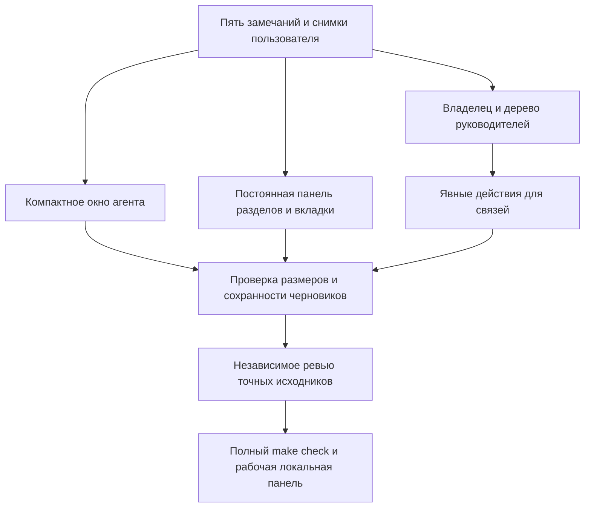

```
Status: completed locally
Owner: Codex — implementation and integration; independent reviewer — verification
Opened: 2026-10-09; Archived: 2026-10-09
Contract: [Frontend](../../FRONTEND_CONTRACT.md), [organization](../../adr/0027-agent-organization-and-method-edits.md)
Source boundary: follow-up to the operator's seven screenshots, after the accepted two-map increment
Supersedes: none
Archive trigger: acceptance criteria, Chrome evidence, independent approval and full make check completed
```

# Компактные настройки и навигация команды



- Вкладки и действия редактора закреплены. Содержимое ограничено шириной окна,
  прокрутка локальная. Черновики и повтор неизвестного результата сохраняются.
- Владелец — переход к существующему главному чату, не фиктивный агент.
  Подчинение берётся только из сохранённого руководителя. Старые роли без
  руководителя соединены пунктиром принадлежности проекту; имя «Lead» не
  изменяет данные. Руководитель вне карты не превращается в пустое значение.
- Кнопки руководителя и связей видны на карточке; общение, передача работы и
  автор создания показываются отдельными слоями и не управляют иерархией.
- «Задачи / Агенты» и управление панелями сохраняют координаты при смене карты.
- Узкая панель разделов остаётся слева при сворачивании и перестановке панелей.
  В панели проектов есть главный чат выбранного проекта; новые чаты не создаются
  без сообщения. Названия разделов: «Роли», «Навыки», «Шаблоны команд».

- Дополнительный отзыв: одинаковые размеры карточек и интервалы автоматической
  расстановки, профессия в заголовке, краткое описание и имя экземпляра ниже;
  общая линия инструментов и пояснения при наведении. Ручные позиции сохраняются.
- Первый масштаб выбирается после загрузки структуры и измерения карточек;
  повторное открытие карты сохраняет пользовательский масштаб.

Проверки записываются в [отдельный отчёт](../../evidence/2026-10-09/navigation-hierarchy/verification.md).
