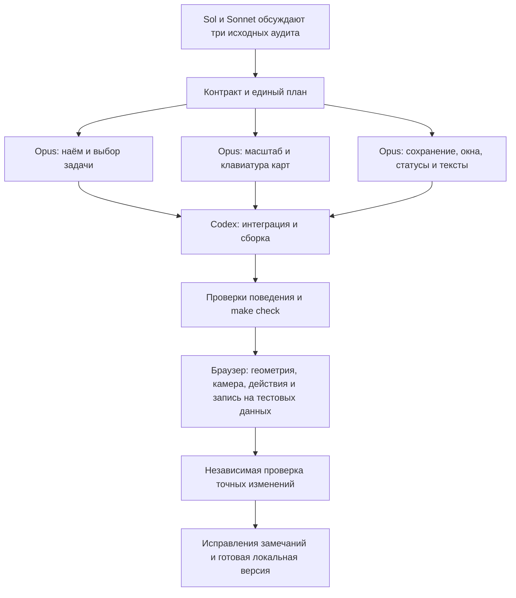

```
Status: completed
Owner: historical — Opus / Codex UX wave
Opened: 2026-10-09   Archived: 2026-10-09
Contract: ../../FRONTEND_CONTRACT.md
Source boundary: exact review v4; ../../evidence/2026-10-09/ux-council-implementation/verification.md
Superseded by: none (local implementation completed)
Archive trigger: built assets, make check, browser evidence and independent code review
```

# Реализация решений дизайн-консилиума

Status: active
Owner: Opus — frontend; Codex — интеграция и проверка
Opened: 2026-10-09; Last verified: 2026-10-09
Contract: [Frontend contract](../../FRONTEND_CONTRACT.md)
Source boundary: [аудит UX-01–19](../../evidence/2026-10-09/design-council/README.md), текущая незакоммиченная сборка
Supersedes: предложения следующей итерации аудита, не его исторические результаты
Archive trigger: реализация, проверка точных байтов и документированные границы приёмки

Пользователь поручил дизайнерам согласовать план и передать фронтенд Opus для реализации. Это одна волна доводки текущего продукта. Полные предложения и обсуждение сохраняются в [пакете консилиума](../../evidence/2026-10-09/ux-council-implementation/README.md). Новый раунд Grok недоступен до 13 октября; учитывается его исходный разбор, свежее согласие не заявляется.

## Граф действий



## Решения и критерии

| ID | Реализация | Приёмка |
|---|---|---|
| UX-01 | Обзорная компактная карта и явный рабочий масштаб около 100%; читаемая немасштабируемая полоса выбранного элемента. Размеры узлов постоянны. На дальнем обзоре не рисовать миниатюрные действия. | 14/40/128 задач, 7/20/50 агентов: обзор, поиск/список, выбранный элемент доступны; действие чтения фокусирует узел. Полные подписи всех 128 узлов в fit не обещаются. |
| UX-02 | Форма найма первой; существующие агенты отдельно в сворачиваемом разделе. Подагент сохраняет prefill руководителя. | Первое поле и начало формы видны на коротком desktop; открытие не пишет данные. |
| UX-03 | «Дать задачу» всегда открывает выбор задачи для агента; прежняя выбранная задача лишь preselect. Поиск, правдивые loading/error/empty. Далее существующая подготовка запуска. | Можно начать с карты агента без выбранной задачи. Нет запуска или назначения от открытия/выбора; pending intent не подменяется другим агентом. |
| UX-04 | Минимальное перемещение viewBox к Arrow/Home/End-фокусу на обеих SVG-картах; preventScroll. | Фокус виден на 33/100/200%; уже видимый узел не двигает камеру. Enter/×/Esc сохраняют контекст. |
| UX-05 | Две честные области: конфигурация General/Permissions/legacy skills и версия методов специализированной роли. Dirty по вкладкам, ясные кнопки, no-op guard. | No-op не делает POST/новую версию; запись одной области не подтверждает другую; CAS, uncertain retry и локальные черновики сохранены. |
| UX-06 | Многострочное условие навыка, exact refs, имя каталога вместо выдуманного перевода slug. | Длинные условия доступны на 800px; историческая версия выбирается; текст не обрезается при записи. |
| UX-07 | Средний composer; prepare-run менять только при измеренном дефекте, один заголовок и ×; большие детали задачи остаются поверх карты. | Нет дубликатов управления, локальная прокрутка, карта и камера стабильны. |
| UX-08 | «Задача сейчас», «Последний прогон / История прогонов»; свежесть с указанием известного источника и действия обновления. | accepted + исторический needs_operator не выдаётся за новое требование. История не скрывается и не переписывается. |
| UX-09 | Отдельно конфигурация пространства и подтверждённая готовность выбранного исполнителя. | failed/unknown остаются таковыми; необязательный профиль не блокирует готовый выбранный. |
| UX-10 | Сохранять центр/масштаб на resize, доступные fit/read/list; компактный toolbar узких окон. | Нет слепого auto-fit или потери ручных позиций. Проверены 1100/1101, 800 и secondary 390; нет document overflow. |
| UX-11 | Инструкции роли в native modal, закрытие возвращает исходный фокус/прокрутку/фильтр каталога. | Проверены первая/последняя карточки, loading/error и поздний ответ. Редактирование библиотеки сохраняет прежний путь. |
| UX-12 | Профессия остаётся заголовком, различающее назначение/имя заметнее вторым уровнем. | Одинаковые профессии различимы; нет выдуманных назначений и изменения геометрии. |
| UX-13 | Контекст агента в доступных именах; видимые hover/focus подсказки; читаемые основные действия и вторичные действия по запросу. | Tab/Esc и меню доступны; tooltip не обрезается, не становится новым постоянным столбцом. |
| UX-14 | Общее несекретное предпочтение ru/en Work и Gallery с защищённым чтением/записью. | Перезагрузка сохраняет язык; недоступное/некорректное хранилище не ломает запуск. Никаких черновиков, ключей и камер в storage. |
| UX-15 | Сохранить пользовательские «Роли» и «Шаблоны команд». Агент — экземпляр роли. «Обновить данные» не называется сохранением; заданные и действующие права различаются. | EN/RU согласованы; canonical refs/enum не переводятся; auto не обещает обход подтверждения. |
| UX-16 | Пустое состояние результатов соответствует всем типам или выбранному фильтру. | Отчёты/сборки/изображения/live не исключаются текстом; empty отличимо от error/loading. |
| UX-17 | Понятная подсказка поля чата, компактное вложение, пояснение подготовки и UNKNOWN. | Существующая возможность записать сообщение при unknown не блокируется; recorded/delivery/response раздельны. |
| UX-18 | Человеческий статус первым на карте, точный canonical value доступен в подробностях. | Не переводить accepted/ready и не менять значение, сохранить технический доступ и цвет принятия. |
| UX-19 | Абзацы/переносы и ограниченная длина строки brief; длинное раскрывается, критерии всегда видны. | Исходный текст сохранён безопасным text DOM, критерии не спрятаны; refresh не сворачивает прочитанный brief. |

## Границы и компромиссы

Сохраняем два движка карт, карточки 264×248, ручные позиции, реальную supervisor-иерархию и пунктир принадлежности владельцу. Порог drawer 1100px не меняется без доказанного дефекта. Окна деталей не становятся боковой колонкой. На overview мелкие действия заменяются доступными действиями выбранного элемента, а не остаются восемью микрокнопками. «Дать задачу» всегда предлагает явный выбор, чтобы старый выбор другой вкладки не направил действие к неожиданной задаче.

Хранение языка — узкое исключение только для несекретного предпочтения; прежний запрет на контент/черновики/секреты остаётся. Имена каталога не сочиняются по slug. Заголовки пользовательского интерфейса «Роли / Шаблоны команд» важнее противоположного предложения первого плана Sol. Сохранение конфигурации честно охватывает общие поля, отдельная запись методов остаётся отдельной операцией.

## Распределение и проверки

Opus — единственный писатель `frontend/work/**`, `frontend/gallery/**`, при необходимости `frontend/shared/**`, исходники и содержательные regression tests. Codex в это время не пишет в checkout. Бандлы `src/agent_commons/ui/static/{work,gallery}` собирает только Codex после окончания работы Opus; backend и canonical schemas не входят в изменение. Existing dirty tree сохраняется, база исходных файлов хеширована.

Обязательны Node24, TypeScript обеих программ, адресные проверки поведения и полный `make check`; затем browser-проверка построенных байтов и независимый разбор точного diff. Изолированные данные используются для записи (наём, настройки, связи, сообщение), без изменения реального Blizhe. Готовность полного provider-run, populated preview и доставки ответа не выводится из UI-тестов; границы сообщаются отдельно. Показатели нагрузки заявляются только после измерения. Точные viewport/activeElement важнее одного скриншота.

Решения финального обсуждения: существующих агентов оставить ниже формы в закрытом disclosure; на рабочей карточке три прямых действия и native disclosure для остальных, без самодельного ARIA menu. Общий locale helper сохраняет прежний fallback en; синхронизация storage events не требуется. Различимость усиливается через имя экземпляра (board-role-identity), не одинаковое библиотечное описание. Общего подтверждения закрытия dirty modal сейчас нет: сохраняем RAM draft lifecycle, не добавляем лишний запрос разрешения.
