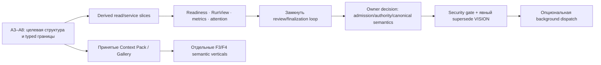

# Corrected control-plane assessment

**Дата:** 2026-08-25
**База проверки:** `4844fdbc95adc12ed9b11937d1eb6415f3fb3ba6`
**Статус:** архитектурная оценка и вход в следующий продуктовый план; это не
решение владельца и не разрешение менять persisted-семантику.

## 1. Граница исследования

Проверены только два исправленных входа:

- `codex_architecture_improvement_review.md`;
- `claude_architecture_improvement_review.md`.

`agent_commons_product_architecture_review.md` намеренно не читался и не был
источником ни одного вывода этого документа. Предложения из двух входов
сверены с кодом на указанном HEAD, актуальными решениями владельца, а также с
`docs/audits/2026-08-18-code-quality/{audit-plan.md,00-code-standard.md,structure-report.md}`.

Поэтому приведённые ниже числа и исторические наблюдения из review-документов
надо воспроизводимо перемерить перед тем, как принимать KPI. Их архитектурные
выводы можно использовать уже сейчас, но не как доказательство текущей
операционной метрики.

## 2. Вывод в одном абзаце

Оба review верно смещают приоритет с «сделать ещё одного автономного агента» к
замкнутой, наблюдаемой петле работы: готовность задачи → попытка исполнения →
проверяемая приёмка → внимание оператора при исключении. Но в текущем продукте
надо провести жёсткую границу. Проекции `RunView`, readiness, attention и
метрики можно вводить аддитивно поверх append-only ledger, без миграции
канонической модели. Напротив, правила admission/authority, получатели и
supersede handoff, задача как носитель policy, новая семантика финализации или
атомарный переход `submitted → review.requested` меняют бизнес-правду. Для
них нужен отдельный decision владельца, схема и replay-контракт; это не часть
A3–A8 и не «маленькая техническая правка».



Это означает: Context Pack и read-only Gallery не следует останавливать в
ожидании control plane, однако их семантические этапы остаются после A8, как
уже закреплено решением владельца.

## 3. Что подтверждено exact HEAD

| Наблюдение | Подтверждение в коде | Практический вывод |
| --- | --- | --- |
| Задача и review request — два действия | `services/tasks.py::submit_task` записывает `task.submitted`; `services/reviews.py::request_review` отдельно записывает `review.requested` | Между ними возможен crash/exit; «атомарность» нельзя заявлять без нового контракта. |
| Зависимости не образуют цикл нормальным путём | `TaskCommands.create_task` принимает `dependencies`; `domain/lifecycle.py` требует, чтобы dependency уже существовала; `task.revised` не меняет dependencies | Граф по записываемому API ацикличен по порядку создания. Но вычисления ready-to-start нет. |
| Start не проверяет dependencies | `domain/transitions.py` разрешает `task.started` из `ready`/`assigned` | Нужен derived readiness predicate и планирование, а не миграция DAG ради самого DAG. |
| Delegation уже хранит intent, Attempt — процесс | `domain/delegation_projection.py`, `runtime/attempts.py`, `ui/reads.py::runs` | Новая canonical сущность `Run` сейчас дублировала бы модель. Нужна read-проекция. |
| Финализация child-run неоднозначна | `services/delegation_runtime.py` создаёт child session; terminal без канонического результата ведёт к `needs_operator` | Нужен явный parent-side finalizer, но основания и последствия требуют контракта. |
| Attention уже derived | `domain/attention.py`, `ui/reads.py` | Можно расширять как read-side; нельзя сделать «старение во времени» записью при replay. |
| Власть сейчас узкая и role-centric | grants проверяются в `domain/lifecycle.py`; у ролей есть create/retire/open-links | Admission/routing/work-authority не существуют как независимая каноническая модель. |
| Read-only orient не работает | `CommonsManager.orient` требует active session, хотя orientation view допускает отсутствие session | Это S bug/UX debt, не повод выдавать неявный доступ к чужой сессии. |
| Ledger уже append-only и schema-bound | `domain/validation.py`, projection/lifecycle и storage path | Не нужен «format epoch» по умолчанию. Любая новая семантика события — отдельная миграция. |
| VISION не разрешает общий scheduler | Принятое направление broker ограничено, а open-ended autonomous scheduler находится среди анти-целей | Pull/операторская координация допустимы раньше. Background push — только после explicit supersede. |

## 4. Принцип проектирования: derived прежде canonical

### 4.1. Допустимая первая волна

Ниже — новая оперативная интерпретация уже существующих фактов. Её можно
сделать typed, immutable и testable, не меняя event JSON или историю:

- `TaskReadiness`: удовлетворены ли известные зависимости, допустимо ли
  предложить задачу для работы;
- `RunView`: join `DelegationRecord`, `Attempt`, task/review и свежего
  диагностического сигнала без нового ID/ledger event;
- `AcceptanceView`: вычисленное состояние «что ещё требуется для честного
  результата», не новое сохранённое поле задачи;
- `AttentionItem` и агрегаты work health: только функция snapshot плюс
  контролируемый `now` на read path;
- `WorkCandidate` для pull-команды/панели: предложение, не assignment;
- `ReviewLoopGap`: диагностический факт, что submitted task не имеет открытого
  independent review request.

Предлагаемые целевые модули не должны идти через растущий фасад:

```text
domain/work_readiness.py      pure rules + frozen typed inputs/results
domain/work_state.py          derived execution/acceptance vocabulary
services/work_planning.py     task-next candidate construction
services/work_metrics.py      aggregation and bounded diagnostics
services/delegation_finalization.py  parent-side evaluation seam
ui/attention_queue.py         panel adapter/read model (UIContext delegates)
cli/work.py                   later narrow CLI group after A4 split
mcp/tools/work.py             later tool registration module after A4 split
```

`TypedDict`/frozen dataclass — граница между этими модулями. Не добавлять
новые `dict[str, Any]`, новые методы в `CommonsManager`, в корневой `cli.py`,
`mcp/server.py::build_server` или панельную логику в `UIContext`.

### 4.2. Недопустимая маскировка нового состояния проекцией

Проекция перестаёт быть безопасной, если пользователю нужно редактировать её
значение, на неё должен опираться audit/replay, либо два разных reader-а могут
получить разный исторический ответ. Тогда это новая каноническая семантика,
а не read-side удобство. В частности, таковы:

- сохранённая `AcceptancePolicy`/`ExecutionState` на Task;
- authority/admission, квоты, обязательные исполнители и routing policy;
- deadline/expiry, который сам меняет статус работы;
- типизированный recipient handoff и его supersede/cancel;
- canonical Run, если он станет независимым от delegation/attempt;
- scheduler assignment или dispatch без оператора;
- новая причинная связь «submit автоматически создаёт review request».

## 5. Оценка предложений из двух review

### 5.1. Objective → accepted loop

**Вердикт: принять направление, изменить порядок.** В коде имеются задачи,
review и делегации, но не замкнутая измеримая модель objective-level outcome.
Нужно начинать не с новой сущности Objective или миграции ledger, а с
проекции: terminal tasks, независимая приёмка, открытые исключения, coverage
критериев. После этого владелец решает, требует ли продукт объективу
канонический lifecycle/authority.

| Что сделать | Где | Владелец | Зависимости |
| --- | --- | --- | --- |
| `AcceptanceView` и coverage метрики | `domain/work_state.py`, `services/work_metrics.py` | software/backend | A5 typed projection, definition of metrics |
| показать gaps в очереди | `ui/attention_queue.py`, later `ui/reads.py` adapter | frontend + backend | A4 UI split, UI DTOs A7 |
| objective-level acceptance | отдельный owner decision + schema proposal | product/business | доказать пользу на derived метриках |

Открытый product choice: в light mode `completed` — честный terminal result,
а `accepted` означает независимую проверку; либо продукт хочет иной
пользовательский смысл. Этот выбор нельзя принять в архитектурном документе.

### 5.2. DAG и readiness

**Вердикт: принять с фактической поправкой.** Нормальный write path уже не
создаёт циклов, поскольку dependency должна быть ранее существующей; но
переход в active не учитывает готовность. Поэтому первая работа — не новый
canonical DAG, а `TaskReadiness` и `task next`.

```text
Task projection + completed/accepted predicates
          │
          ├─ pure TaskReadiness(task, dependency snapshots)
          │       └─ reason codes: unresolved / terminal-failed / ready
          │
          └─ WorkPlanningService → ordered WorkCandidate[]
                                      └─ human/role pulls one candidate
```

`task next` обязан быть advisory pull. Автоматическое `taken`, `started` или
создание delegation является assignment и относится к authority/scheduler
gate. Нужны property/golden tests для invariant: корректная существующая
история даёт те же canonical projections, а readiness — детерминированна при
одинаковом snapshot и `now`.

### 5.3. Derived execution/acceptance state

**Вердикт: принять только как computed vocabulary.** Это хорошая общая
лексика для UI и evals, если кэш или view можно пересчитать из ledger и
attempt store. Нельзя сейчас добавлять `ExecutionState`/`AcceptanceState` как
колонки/fields Task: это создаст две истины рядом с current task/review
lifecycle и потребует событий, миграции, collision rules и replay policy.

### 5.4. Delegation / Run / Attempt

**Вердикт: не вводить canonical `Run`.** Существующая модель уже даёт:

```text
Delegation = намерение и target revision
Attempt    = зарезервированный/запущенный процесс и его причина
RunView    = derived join для UX, метрик и диагностик
```

В `RunView` полезны `attempt_id`, delegation/task/revision refs, process
state, observed outcome, terminal reason и links на evidence. Для retry можно
добавить `RunDigest` в compiled Context Pack, но не отдельную history сущность:
его source-of-truth должен быть существующий snapshot, а delivery — будущий
`services/context_compiler.py` из принятого Context Pack плана. Нельзя
обещать KV-cache reuse до provider-level доказательства совместимости и
measurement hit-rate/latency/cost.

### 5.5. Разорванный review и parent-side finalizer

**Вердикт: высокий приоритет, два независимых решения.**

1. `task.submitted` и `review.requested` сегодня разные append операции.
   Вариант A — новое составное business action/event semantics; вариант B —
   оставить события раздельными и ввести идемпотентный repair/reconciler,
   который выделяет и эскалирует gap. Первый даёт целостность и новые правила
   replay; второй сохраняет историю, но делает промежуточное состояние частью
   продукта. Это owner decision с migration/replay design, а не refactor.
2. `DelegationRuntimeService` должен получить узкий
   `DelegationFinalizationService`/policy seam: собрать evidence, проверить
   latest target revision, выбрать известный reason code и либо завершить,
   либо создать attention. Нельзя «угадать успех» из exit code или текста
   модели. Смысл reason codes, минимального evidence и допустимость auto-close
   — decision владельца; извлечение имеющейся ветки можно сделать отдельно
   после A4.5/A8.

### 5.6. Attention queue и eval loop

**Вердикт: принять раньше scheduler-а.** Уже существует `domain/attention.py`;
расширение должно остаться derived и объяснимым.

| Срез | Тип | Владелец | Ограничение |
| --- | --- | --- | --- |
| `ReviewLoopGap`, stalled attempt, unresolved handoff | pure/derived | Python backend | stable reason code и evidence ref |
| приоритет/группировка очереди | service/read model | backend + frontend | deterministic sort; `now` injected |
| экран attention | UI adapter/panel | frontend/design | не раздувать `UIContext`; React Flow only where graph helps |
| SLA, возрастающие severity, success metric | product/evals | business + ML/evals | сначала определить формулы/приемлемую ошибку |

Время нельзя записывать как событие только ради «старения»: replay должен быть
детерминированным. В UI можно передать timestamp snapshot-а и controlled clock.
Исторические числа из review должны попасть в baseline measurement, не в
hardcoded threshold.

### 5.7. Handoff, admission и authority

**Вердикт: отложить canonicalisation, но сделать видимыми текущие gaps.**
Handoff recipient сейчас строковый, состояние — open/acknowledged. Типы
получателя, ownership transfer, supersede/cancel и time expiry неминуемо
меняют событие и replay. Преждевременная автоматика здесь опасна: агент может
получить власть над чужой задачей лишь потому, что projection считает её
готовой.

До решения можно добавить derived `unroutable/unacknowledged handoff` в
attention. После owner decision проект должен включать:

- vocabulary authority/admission и матрицу «кто может предложить / взять /
  начать / делегировать / закрыть / принять»;
- event/schema/replay proposal, strategy старой истории и golden fixtures;
- запрещённые transitions и audit evidence;
- UI typed refusals, paired localisations и MCP/CLI migration window.

### 5.8. Read-only orientation

**Вердикт: небольшой независимый bug fix.** Исправить так, чтобы orient
явно работал unscoped/read-only над выбранным workspace, используя already
available `views.orientation` behaviour, но не «подхватывал» произвольную
активную сессию. Указание scope/session должно быть явным. Разместить новое
CLI command group только после A4; пока допустим минимальный compatibility
adapter без роста корневого CLI. Нужны тесты no-write и no-session-borrowing.

### 5.9. Migration/replay и golden tests

**Вердикт: принять safeguard, не создавать новый формат по умолчанию.**
Текущее schema validation, replay и `workspace.semantics_required` уже
предоставляют части контракта. Для каждого одобренного нового persisted
поведения обязателен отдельный proposal:

```text
event vocabulary/versioning
→ parser/serializer round-trip old fixtures
→ canonical replay before/after invariants
→ sanitised golden ledger fixtures
→ migration/compatibility and rollback strategy
→ CI gate
```

Golden fixture не должен быть копией живого workspace, содержащей приватные
данные или случайные текущие timestamps. A6 сначала обязан завершить свой
профильный долг; ускорение replay не смешивается с semantic migration.

### 5.10. Scheduler и security gate

**Вердикт: не включать в текущий план реализации.** В VISION нет мандата на
open-ended scheduler. Pull `task next`, human-approved execution и attention
согласуются с ней. Любой background dispatch требует до кода одновременно:

- явного owner decision, который supersede-ит соответствующую анти-цель VISION;
- admission/authority policy, task/revision scope и безопасного отказа;
- isolated worktree lifecycle, repo/claim ownership и cleanup/recovery;
- budget/rate/concurrency limits с trusted operator configuration;
- audit log, kill switch, security threat model и red-team/eval evidence.

Claims — координация намерения, а не Git-изоляция; ими нельзя заменить
worktree/branch ownership. Поэтому «scheduler после attention» — лишь
возможный дальний этап, не обещание.

## 6. Context Pack и Design Gallery: сохранить принятый курс

Уже принятые решения дают самостоятельный путь:

- Context Pack и Design Package — канонические, ревизионные сущности;
- Gallery начинается с read-only React Flow surface;
- preview в MVP — только опубликованные/внутренние PNG/JPEG актуальной
  ревизии, с безопасной проверкой доступа, hash/revision, MIME и размера;
- demo удалено из продукта;
- `runtime.yaml` создаётся при setup единожды; дальнейшая регенерация только
  additively и не делает runtime продуктовым state store.

Control-plane работа усиливает, а не заменяет этот план:

| Возможность | Связь | Когда |
| --- | --- | --- |
| `CompiledContextManifest` с лимитом токенов | помогает `RunDigest` и provenance, но не даёт кэш-переносимость | F3 Context Pack semantics после A8 |
| `DesignPackage` feedback → task | имеет единый evidence/provenance link | F4, с current review/finalization contract |
| gallery attention | «не опубликовано / revision mismatch» как derived warning | после read-only gallery baseline |
| editable screens/hotspots | не вытекают из preview; требуют source-of-truth/authoring decision | отдельный product/design discovery |

Не добавлять в MVP editing, связи экранов, SVG/HTML preview или provider
KV-cache. Они несут другую модель безопасности и авторства и не нужны для
проверки ценности Gallery.

## 7. Совместимость с потоком A3–A8

| Шаг аудита | Как control-plane может удешевить | Чего не делать |
| --- | --- | --- |
| A3 roles | authority vocabulary сможет опереться на уже выделенный domain seam | не встраивать workflow policy в `domain/roles.py` до decision |
| A4 composition/presentation | creates `ui/reads`, `ui/actions`, CLI/MCP tool groups для новых read slices | не наращивать `UIContext`, root CLI или `build_server` |
| A4.5 instruction | даёт seam Context Compiler | не менять prompt/runtime.yaml/persisted payload в structural commit |
| A5 typed domain | естественный дом для readiness, run/acceptance records и typed envelopes | не менять JSON схемы под видом типизации |
| A6 replay | даёт фактическую baseline для golden/replay gates | не смешивать perf rewrite и новую event semantics |
| A7 DTO | безопасная граница UI/CLI/MCP для attention/task-next | не отдавать internal dicts или добавлять новые фасадные API |
| A8 facade migration | потребители смогут получать narrow protocols | не добавлять новые public methods в `CommonsManager` |

Таким образом, derived-slices разумно проектировать сейчас, но реализовывать
либо после соответствующего structural seam, либо через уже вынесенные modules
с compatibility adapter. Семантические изменения не должны «вклеиваться» в
рефакторинговые коммиты: один behavioural intent — отдельный green commit.

## 8. Порядок работ и ответственность

| Фаза | Результат | Основные зоны | Gate / зависимость |
| --- | --- | --- | --- |
| 0a. Baseline | reproducible measurements, metric dictionary, sanitized fixture proposal | Python backend, ML/evals, product | перепроверить historical claims из review |
| 0b. Safe diagnostics | orient no-session bug, reason-code taxonomy tests | software/backend, QA | no write / no session borrowing |
| 1. Derived work plane | readiness, RunView, AcceptanceView, work metrics | Python backend, software architecture | A5/A7 typed records; exact replay invariants |
| 2. Operator attention | queue + advisory `task next` | frontend, backend, design, product | A4 UI/CLI/MCP split; UI contract |
| 3. Close loops | selected review-gap handling + finalization evidence seam | backend, product, QA/evals | owner decisions 1–3 below |
| 4. Authority | admission/authority/handoff semantics, if approved | product, backend, security | explicit schema/migration/replay plan |
| 5. Context/Gallery | approved F3/F4 slices | Python backend, frontend, design, security | A8, existing owner decisions |
| 6. Optional dispatch | constrained scheduler experiment | security/SRE, backend, ML/evals, product | VISION supersede + all security gates |

`Phase 1` и `Phase 5` могут идти параллельно только после A8 и при разных
claims/module owners. Они не должны совместно менять ledger schemas, root
composition modules или `index.html`.

## 9. Решения, которые нужны от владельца до реализации

1. **Light-mode semantics:** является ли `completed` честным terminal outcome
   без независимого acceptance, а `accepted` — только проверенной работой?
2. **Review gap:** вводим новый atomic/composite business action или
   сохраняем две операции и строим idempotent reconciler + attention? Нужны
   правила crash/retry/replay в обоих вариантах.
3. **Finalization policy:** какое минимальное evidence позволяет parent
   закрыть delegation, какие reason codes допустимы, когда только human
   resolution?
4. **Canonical authority/admission:** нужен ли продукту persistence для
   routing/quotas/authority сейчас, или достаточно role grants + advisory
   planning до подтверждённого спроса?
5. **Handoff semantics:** какие получатели, ownership transfer,
   supersede/cancel и expiry являются настоящими продуктовыми состояниями?
6. **Orientation scope:** допускается ли unscoped read-only orient и как
   пользователь выбирает workspace/session явно? Рекомендация: да, без
   неявного session borrowing.
7. **Scheduler:** готов ли владелец явно изменить VISION и принять security/
   SRE ответственность за background dispatch? Рекомендация: нет на этой
   фазе.
8. **Metric contract:** какой north-star, какие guardrails и какой период
   baseline; какие auto-actions запрещены даже при хорошей метрике?

## 10. Required validation for subsequent implementation

- unit/property tests на readiness и RunView с фиксированным `now`;
- old-ledger replay equality и schema round-trip для любой semantic proposal;
- integration test для crash между submit и review request (или выбранного
  composite/repair contract);
- finalizer cases: stale target revision, no evidence, partial evidence,
  duplicate retry, child exit without canonical result;
- attention determinism, reason-code evidence links and typed refusal tests;
- security tests: no cross-session access, no implicit authority escalation,
  no unattended dispatch outside approved scope;
- UI tests по `docs/FRONTEND_CONTRACT.md`, включая paired locales и CSP-safe
  DOM; claim on `src/agent_commons/ui/static/index.html` если он всё ещё
  является затрагиваемым single-writer asset;
- `make check` до каждого отдельного structural/behavioural commit и зелёный
  CI до push handoff.

## 11. Решение для обновлённого общего техплана

В общий план следует включить четыре сильные стороны review, но в следующей
формулировке:

1. **Closed work loop before autonomy:** сначала observable derived loop и
   operator attention, потом только выбранные canonical gaps.
2. **Do not invent Run:** Delegation + Attempt — canonical substrate;
   `RunView` — typed derived product surface.
3. **Plan, do not dispatch:** dependency-aware `task next` — advisory pull,
   пока authority и security не утверждены.
4. **Context/Gallery continue independently:** Pack compiler, provenance и
   read-only Gallery остаются принятым product track, а не становятся
   зависимостью scheduler-а.

Это добавляет сильные стороны двух review, не нарушая target map аудита и не
превращая структурную уборку A3–A8 в незадокументированную миграцию продукта.
