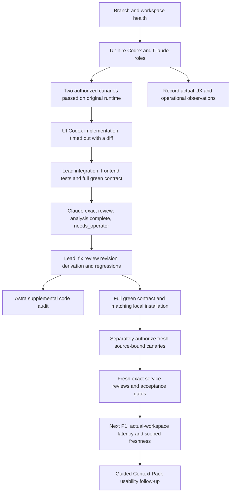

# Service self-improvement dogfood — 2026-09-08

Status: historical self-improvement checkpoint, retained at its original paths.
The [project-native validation](2026-09-08-project-native-collaboration-validation.md)
and [active implementation plan](../project-native-collaboration-implementation-plan.md)
supersede the current-status and permission requests below. The original failures,
reviews, source hashes and remaining-gate checklist are preserved as evidence of
that checkpoint, not instructions to request authorization again.

At the end of this checkpoint, authorized qualification follow-up was in progress. The first pass created
the service team and task. One Codex builder and one Claude independent reviewer
canary passed on the original runtime; their fingerprints became stale after
the finalizer repair below. The UI recorded implementation
delegation `delegation.03RBA9AHCSYDSWTEYB786AWNJN`. Its provider attempt timed out
after leaving a frontend diff. The lead fixed reproduced races in that diff;
the full green contract passed. A real Claude independent review inspected the
frozen result but could not record its verdict because the finalizer confused
the task revision with the review revision. Its canonical outcome is
`needs_operator`; the review remains requested. Nothing is accepted.

## Baseline and execution plan

- Source and initial `origin/main`: `e08488f392936c43d35f1013d6468fe45fa89b00`.
- Initial working tree: clean. Working branch: `codex/service-self-improvement`.
- Use the installed Agent Commons browser UI to hire named roles, create bounded
  tasks, select a worker, and inspect actual outcomes. Native chat subagents are
  not evidence of execution through this service.
- Run one bounded implementation attempt and a separate exact independent review
  when provider qualification permits. Do not infer acceptance from process exit.
- Prioritize problems reproduced in this journey, then improve the guided Context
  Pack editor. Preserve validation, exact versions, retry identity and privacy.
- Finish with focused regressions, `make check`, source/bundle verification and
  an honest report of remaining runtime gates.

## Initial pass: evidence and observations

| Observation | Evidence | Result / consequence |
| --- | --- | --- |
| New branch changes receipt scope | In-repo doctor and receipt status: 3,103 events, zero scoped receipts, zero orphan/conflicting receipts | Diagnosed bootstrap only. Supported plain `receipt reconcile` derived 3,103 receipts; subsequent doctor passed with zero issues. No manual canonical edits. |
| Existing backlog needs reconciliation | Bounded orientation: 12 active, 9 assigned, 31 review, 7 ready tasks; no active claims or running/requested delegations | Historical ownership is not current execution. No foreign task was accepted or normalized. |
| Provider configuration does not imply readiness | Safe `broker profiles` DTO from the existing operator configuration | All six profiles report qualification failed and launchable false. L1/R2 remain unproven. |
| Failed status conflates stale and unsuccessful qualification | Supported qualification reader plus current fingerprint comparison | All six stored receipts were qualified when recorded on September 1–2, but none matches the current runtime fingerprint. This run did not reproduce six failed canaries. The public status collapses stale evidence into failed; present requalification guidance instead of implying a new failed attempt. |
| Non-live preflight passes | Codex builder and Claude independent reviewer: provider help, MCP catalog and initialization handshake passed | Zero provider work processes and zero delegation attempts consumed. This does not supersede failed live qualification. |
| First hire is slow | Team → frontend specialization → Codex builder → Create role | UI remained on Working across several observations. Later it displayed Role created while the role list still said no active roles and the form remained disabled. Distinguish the committed mutation from subsequent refresh. |
| Work stream disconnected during journey | Work displayed retained/stale snapshot and automatic updates disconnected | Existing data remained readable and navigation worked. Continuous live tracking is not established by this run. |
| Read cost is material | One read-only `CommonsManager.snapshot()` under `cProfile`: 32.88 seconds, 262 tasks; event reads 14.80 seconds, projection 17.60 seconds across three passes | Diagnostic sample under profiling and concurrent service/test activity, not a clean latency benchmark. Repeated delegation mapping conversions account for 10.24 cumulative seconds. No raw profile dump retained. |
| Fresh reads can still classify the whole tracker stale | Read-only diagnostic using the production attempt mapping and freshness functions: 62 attempts, 46 coherent terminal joins, 16 other latest joins, zero unmatched attempts; aggregate freshness remained stale with a current canonical observation clock | `work_metrics._freshness` ages non-coherent operational observations; `execution_plan._task_readiness` gives a task without a run the aggregate freshness. This explains why merely refreshing canonical data is insufficient. Exact reconciliation semantics need review; no attempt or canonical state was rewritten. |
| Current graph opens with the whole history | Work showed 261/261 tasks and the large-graph fallback | Search/filter is required before the view is useful for a new small team. |
| Guided Context Pack copy is protocol-heavy | `frontend/work/src/components/ContextPacksSection.tsx`; paired `context_packs_intro`, summary and bounds strings | Proposed follow-up: plain first-step explanation and progressive disclosure, without weakening canonical checks. |

## Risk register and next tasks

- **P1 — runtime gate (reopened by the finalizer repair):** Codex builder and Claude independent reviewer qualified on the original runtime. Their receipts do not qualify the later Python repair; other profiles also remain outside current evidence.
  Run only separately authorized canaries; never bypass qualification or relabel
  configured profiles as ready. Grok remains excluded because its argv instruction
  transport privacy decision is still open.
- **P1 — mutation/refresh coupling (implemented and tested; official review open):** the original `perform` in `frontend/work/src/main.tsx` awaited a full read after a successful write. The branch separates confirmed success from read-only recovery and guards stale reads. Seven behavior cases pass; the failed review finalizer still prevents a canonical approval.
- **P1 — actual-workspace responsiveness:** diagnose slow role creation and stale
  stream separately; CPU observation is not proof of the cause. The service was
  alive and CPU-busy. OS denied stack inspection; no elevated debugger or process
  memory dump was used.
  `UIContext.rebuild_graph`, catalog, launch options and other read surfaces call
  canonical snapshots; measure duplicated work before selecting a cache boundary.
  Any optimization must still detect changed/tampered input and preserve exact
  review/receipt validation. Do not skip integrity checks to improve a benchmark.
- **P1 — freshness scope:** separate a newly verified task's readiness from stale
  unrelated operational history, or expose the actual global recovery blocker.
  Review the 16 non-coherent latest joins before choosing a repair. Preserve
  fail-closed launch/capacity checks and history; do not fake fresh timestamps or
  delete attempts. Add a regression with a fresh no-run task plus an older
  terminal canonical/operational mismatch.
- **P2 — onboarding clarity:** surface provider readiness before a user hires a
  role; reduce mixed-language technical profile/model copy in the default path.
  Distinguish `stale` qualification from an actual failed canary in the closed
  API/UI contract, while keeping both non-launchable until requalification.
- **P2 — graph scope:** provide a useful current-team/work filter and clearer
  large-history entry point. Do not delete historical ledger evidence to hide it.

## Open gates

- The user explicitly authorized one Codex and one Claude canary, each bounded
  to 300 seconds. Both completed successfully; no repeat was made. Other provider
  qualification, six-profile Linux L1, R2 and release remain unproven.
- No new implementation, successful provider task, independent approval,
  acceptance, release or merge is claimed by this preliminary record.
- Record only sanitized outcomes and code/evidence references here: no credentials,
  private operator configuration, raw provider output or task transcripts.

## Prepared service work

- UI-created frontend role: `agent.25GGJJS24HRZD6KX2QNTPYRA8D`,
  revision `evt.01M20GHHTQ08PN0CX49RFBQ1N4`, active, Codex builder,
  linked to the service-owned frontend specialization.
- UI-created task: `task.2K0AN2EZFXR51HS9CFTV2FQCR4`,
  revision `evt.01M20GSYN0ZM7VB4NP9V44BS1D`, ready:
  **Self-improvement: keep confirmed role creation successful during refresh**.
  It is distinct from the older Library presentation tasks: the boundary is
  confirmed-write versus read recovery, reproduced during this journey.
- UI-created independent reviewer: `agent.2B5KDPJ5WYA3NMX107R63QG9FE`,
  revision `evt.01M20H1X9XC0J5FBKTYXH7DSM8`, active, Claude independent-reviewer,
  linked to the service-owned QA specialization. Canonical reads confirmed both
  roles and zero nonterminal delegations. Active standing roles are not running
  provider processes.
- Searching Work for `Self-improvement` reduced 262 tasks to the single new task.
  Selecting the card opened its inspector with canonical `ready` state. The
  retained tracker snapshot was stale and disabled Prepare run; an explicit
  refresh was requested. A connected stream badge alone did not mean fresh data.

### Regression checklist for the first worker

Checked coordinator cases use controlled I/O against the production functions;
they do not claim a new browser end-to-end run. Error sink/copy coverage and a
post-install browser check remain separately identified below.

- [x] Resolve the role-write callback, keep the subsequent workspace GET pending: show the
  confirmed role/result without keeping the mutation form indefinitely busy.
- [x] Reject only the follow-up read: preserve confirmed success and make the
  offered recovery issue reads only. Assert exactly one invocation of the role-write callback.
- [x] Reject the write callback after simulated response loss: retain its original body,
  project client and idempotency key for an identical retry.
- [x] Switch A → B while each phase is pending: no late A result, error or finally
  may clear B's action or overwrite B's role/draft/selection.
- [ ] Return to A with an uncertain mutation: preserve A's original intent; a
  successful mutation followed by a failed refresh must not become uncertain.
- [x] Inspect callers of `perform`: the current shell uses it for role hire and
  setup/runtime initialization. Task review/accept use separate handlers; their
  existing exact-intent API regressions pass. No UI success invents acceptance.
- [x] Rebuild checked-in Work assets with Node 24; run focused tests and
  `make check`; bind the frozen source and bundle to independent review.

The next performance experiment should use a representative synthetic history
as well as a sanitized real-workspace timing, compare cold/warm reads without
concurrent tests, and retain tamper detection regressions. Do not publish the
operator ledger as a benchmark fixture.

## Initial pass: verification and delivery boundary

| Command / check | Result |
| --- | --- |
| Git status, HEAD, origin/main and branch | Initial tree clean; both revisions `e08488f392936c43d35f1013d6468fe45fa89b00`; new branch `codex/service-self-improvement`. |
| In-repo doctor, session show, orient, inbox, task list, claim list | Orientation completed. Branch bootstrap diagnosed and reconciled; doctor returned healthy with 136 historical warnings. |
| Broker profiles and two non-live preflights | Current profiles non-launchable; Codex builder and Claude reviewer preflights passed without provider work. |
| `git diff --check` | Passed before the full check and during documentation work. |
| `make check` with pinned Node 24.20.0 | Passed: locked Ruff checks, both complete frontend harnesses, 2,103 Python tests passed, 13 skipped, two dependency deprecation warnings; pytest elapsed 827.38 seconds. Twelve skips concern withheld automatic grants; one is CI-only. No frontend harness was skipped. |
| UI hire / task creation | Two named roles and one ready task confirmed in canonical reads. No nonterminal delegation exists. |
| Application source / generated assets | Unchanged from the starting revision. No implementation, new package installation, commit, push or merge in this pass. |

The working tree intentionally contains the new audit and one precise row added
to `docs/agent-platform-implementation-program.md`. The local service remains
available on the selected self-improvement task. The existing green contract
does not cover the real-history latency/freshness problems reproduced here.

## Authorized live follow-up

The user approved the two bounded canaries. They ran through the service broker
in isolated fixtures, once per profile. The result is qualification of these
exact host/runtime profiles, not completion of the implementation task.

| Profile | Process duration | Canonical outcome | Terminal calls / completions / rejections | Current fingerprint |
| --- | --- | --- | --- | --- |
| Codex builder, codex-cli 0.145.0 | 92.79 seconds | succeeded, child session closed | 1 / 1 / 0 | yes |
| Claude independent reviewer, Claude Code 2.1.257 | 22.75 seconds | succeeded, child session closed | 1 / 1 / 0 | yes |

Sanitized evidence: [provider canaries](../evidence/2026-09-08/self-improvement-provider-canaries.json).
Neither attempt had a process/canonical mismatch. No raw provider output, prompt,
auth path or private configuration was retained in the evidence.

Settings → Refresh status correctly changed both profiles from the cached
qualification failure to qualified/launchable. The Team → Use for selected task
path opened the launch composer even while the task inspector's Prepare run was
disabled by aggregate stale freshness. This inconsistent presentation needs a
regression and one shared readiness policy; no disabled control was forced.
The UI's current worker limit is 600 seconds (`UILaunchCoordinator._DEFAULT_RUN_LIMITS`),
which is distinct from the approved 300-second canary bound. Expose the run bound
in the composer and support deliberate longer implementation limits as a follow-up.

### Real task submission

Team → Self-improvement · Frontend → Use for selected task → Start run created
`delegation.03RBA9AHCSYDSWTEYB786AWNJN`, requested revision
`evt.01M20JZC2Z7K71QHMN3YAF9KNS`, targeting the exact ready task revision above.
The interface eventually confirmed Run recorded. Server-side preparation took
several minutes before this acknowledgement; no duplicate launch was submitted.
During preparation the recovery panel prematurely displayed Critical attention
required alongside Authentication is ready, with disabled recovery controls.
This is a misleading pending-state presentation, separate from actual auth failure.
The operational attempt store still had only the 62 historical terminal attempts
in the observation before acknowledgement; requested is not proof of provider start.

Follow-up regressions:

- [ ] Show preparation, provider running and finalization separately, including
  elapsed time and the configured run bound. Avoid auth-warning styling while a
  healthy authenticated launch is merely pending.
- [ ] Make Team and task-inspector launch readiness consistent against the same
  exact task; preserve authoritative server checks.
- [ ] Measure launch preparation and request acknowledgement on a representative
  populated workspace, including concurrent tracker reads.

The first implementation attempt is `attempt.2R040N1RZX6CKZYBYGWYH391W2`,
created at `2026-09-08T13:27:03.320025Z`. The supported attempt store reported
running and its process-liveness check returned true. A subsequent canonical
read confirmed delegation active at `evt.01M20KAFXZ736JC5N6RJKSJE9H`.
The UI still showed requested/stale in the intervening observation. This is a
measured propagation gap, not evidence that the provider failed to start.

The pending authentication panel is rendered from `pendingLaunchVisible` with
a ready auth state in `frontend/work/src/main.tsx:1036`, before there is an
authentication failure. Restrict recovery presentation to an actual refusal or
uncertain outcome; retain the pending immutable launch intent internally.
Future live activity should expose bounded lifecycle/phase metadata and useful
next actions, without adding raw provider transcripts to public evidence.

### Contract risk found while the worker runs

**P1, code-supported risk; worker outcome not attributed:** the injected
implementation MCP catalog (`mcp/server.py:149–180`) supplies bounded reads and
delegation outcomes, but no task-take/start/complete, claim acquire/release or
artifact registration operations. The builder instruction requires the normal
task/artifact workflow and injected tools for canonical coordination
(`services/delegation_instruction.py:104–107,151–160`); onboarding also requires
claims. Decide and enforce the supported ownership/result path explicitly, with
a real builder regression from a ready UI task. Do not solve this by silently
widening reviewer authority or bypassing another session's ownership.

The fixed canary (`services/provider_canary.py:266–307`) has its source artifact
registered and task started by the parent before delegation. Its implementation
criterion is reading `answer() == 42`, not producing/editing an artifact from a
ready task. Passing it proves transport and terminal-protocol compatibility; it
does not cover the full UI-created implementation lifecycle.

## Implementation attempt and lead integration

The real UI-created attempt reached `timed_out`. Its process-liveness check
returned false, and the broker subsequently closed its child session. The source
diff and generated Work bundle were present; no successful delegation outcome
is claimed. Full doctor after finalization passed with zero issues and 136
historical warnings. The initial parent reservation had been released before launch; no child-owned
claim was seen in the sampled observations. After process termination the lead
acquired fresh task/source claims through the supported service before integration.

The worker separated refresh errors from mutation errors and added paired locale
copy. Lead inspection found that awaiting the follow-up refresh still returned
its failure as mutation failure, and the delayed `finally` could clear a newer
mutation's busy state. The refresh could also publish stale data over a newer read.
Seven behavior tests executing the actual production coordinator with controlled
I/O reproduced four failures on the worker's bytes. After lead integration all
seven pass. They cover confirmed/pending reads, read-only recovery, exact uncertain
closure retry, competing mutations, explicit refresh and project switching.

The final coordinator returns success at mutation confirmation, starts a detached
read, and uses the existing `ProjectReadRequest` cancellation/generation guard. A
new mutation invalidates earlier reads; refresh recovery preserves the most recent
notice. Existing API retry body/key rules are unchanged. The worker's text-match
regression was replaced by these behavioral tests.

Validation during integration: Work build passed; `git diff --check` passed; all 139 Work and
27 Gallery harness tests passed inside `make check`. The Python suite was still running at that observation; its final result follows below.
No success was manufactured for the timed-out builder, and no review/acceptance
or merge has been recorded for this integrated result.

The builder's final canonical state is `timed_out` at
`evt.01M20KXGP3ZRGT9FX3H1PC6HCW`. Terminal audit counters were 0 calls,
0 completions and 0 rejections. The operational timeout observation was
`2026-09-08T13:37:03.802757Z`; no canonical result refs exist for that attempt.
These facts establish a missing terminal outcome, but do not by themselves prove
which instruction or initialization step consumed the budget.

Final full green contract passed: 139 Work tests, 27 Gallery tests, 2,103 Python
tests passed, 13 skipped and two dependency warnings; pytest took 847.53 seconds.
[Frozen source/bundle hashes and verification](../evidence/2026-09-08/self-improvement-confirmed-refresh.json)
are the exact evidence for the independent review. Source and documentation
writes pause during the review.

## Real Anthropic review and finalization defect

The named Claude role ran through the in-repo Commons broker, using the configured
Claude subscription profile and its default model (no specific Opus/Fable model
identity is asserted). This was an actual working review, separate from its
successful 300-second canary. Its deliberate work budget was 1,800 seconds.

| Evidence | Observed result |
| --- | --- |
| Exact submitted frontend task | `task.2K0AN2EZFXR51HS9CFTV2FQCR4` at `evt.01M20NAQCMXWMY0ZBT8WMT5NP1`; remains in review |
| Review request | `review.029FAJGR57T2Q27TB2XQVW1HSK` at `evt.01M20NCG9B3VWZGMNNZGSNK0QT`; remains requested |
| Claude delegation | `delegation.58BVQTHAWEG8KKS95VYW19XMKG`; terminal `needs_operator` at `evt.01M20PTN64EECKBEP83SWQDHJN` |
| Operational attempt | `attempt.01JGWKP0WRFEX3249A7MXHJCDJ`; process exit 0 after 1,369.98 seconds, with process/canonical mismatch |
| Terminal protocol | 5 calls, 4 rejections, 1 completed needs-operator operation; child session closed |
| Review analysis | Reviewer reported intended approval and matching hashes for all seven frozen files. This is analysis recorded in the delegation outcome, **not an approved review event**. |
| Integrity after finalization | Full doctor passed: zero issues, 136 historical warnings. A sandbox-only SQLite-open refusal was resolved by rerunning the same supported doctor with access to its local state. |

**P1 — confirmed task-target finalizer defect:** `commons_finalize_review` in
`src/agent_commons/mcp/server.py` derived `expected_revision` from the delegation's
`target_revision`. A delegation may legally target either a review or its exact
subject (`domain/lifecycle.py`, `_validate_delegation_request`). For a task-target
delegation the value is a task revision, so `complete_review` refuses it against
the review's distinct revision. Both identical finalization attempts were refused.
Existing finalizer fixtures delegated to the review itself and missed this path.
The repair must derive the original review request revision from the immutable
bound review, including convergence after a lost partial result. Preserve the
separate subject revision and all evidence/independence/quiescence checks.

Claude's non-blocking follow-ups: add explicit action ownership if concurrent
mutations become possible; retain a confirmed notice even outside ready state;
exercise the real error sink/copy branches; reduce the source-slice harness's
coupling to function ordering. The reviewer did not rerun the full suite or build;
those remain the lead's executed verification. Bundle/source correspondence was
not independently established by bounded minified-source search. Rebuild/hash
comparison remains a delivery check, rather than treating partial search as proof
of either a mismatch or correctness.

The UI shows this Claude run under the task's history. New runtime code must obtain
fresh source-bound qualification before a new live run. The two already authorized
canaries are consumed; do not repeat them or reuse an old receipt for changed code.

### Finalizer repair on the branch

Task `task.64Z9RGK58YFMR6GP9CBG3QPMFA` tracks the distinct runtime defect.
Finding `finding.76KS3GHQZBWAC1NEMPGYPARSN4` remains provisional. Three new
hermetic cases failed on the previous implementation: task-target initial
finalization and lost-response convergence with and without restarting the MCP
server. The review-target counterparts passed. After deriving the causal request
revision from the frozen bound review (or its original expected revision after
partial completion), all 24 worker-scope tests passed in 101.83 seconds.

An additional native Astra read-only audit found no actionable issue in the
runtime/test diff. It explicitly checked causal versus effective revision and
partial convergence. This is supplementary code review, not a canonical service
approval and not a replacement for the real Claude run.

The new runtime source hash is
`e8a5d2a9c354e685b7f2e588cd15e2ea0c8a07af41c36f6391bccd3ecd7eaff5`.
The earlier canary JSON's current-fingerprint flag describes its observation
before this runtime edit; both receipts now refer to the older source hash.
Non-live preflight against the still-installed old MCP refuses source-contract
mismatch for both profiles: tool-name inventories and initialization handshakes
pass, and no provider work process or delegation attempt is consumed.

A separate Node 24 build into a temporary directory reproduced all three frozen
Work asset hashes and sizes exactly. The local wheel contains the matching
frontend and 174 Python files identical to the branch; zero private-state paths
were found. Temporary repository build output was removed after packaging.
The prepared wheel SHA-256 is
`964a7152587ba1819933c3844148c0ea95de5ba96f2e7451384801d2726b78f6`.
Dependencies for local installation are exported from `uv.lock` with UI/MCP
extras. Installation and the final full-check outcome are recorded below when
completed; no release or merge is implied by package preparation.

### Verification and local delivery after repair

The second complete `make check` passed after the Python repair: Ruff check and
format check, 139 Work tests, 27 Gallery tests, **2,107 Python passed / 13 skipped /
2 dependency warnings**, in 865.71 seconds for pytest. The 13 skips retain the
same withheld automatic-grant and local-CI explanations as before. `git diff
--check` passes. No source change followed this green contract.

The installed local package was replaced with the verified wheel using UI/MCP
constraints exported from `uv.lock` and Python 3.14. Only the package changed;
its dependency set was preserved. Before shutdown the listener, command and
repository cwd were explicitly verified and no nonterminal provider attempt
remained. Automatic approval review initially refused a weaker PID-only check;
the stronger read-only identity check enabled the scoped graceful restart.

The in-repo UI is running again on loopback port 8787. Installed MCP and branch
source hashes match. Both Codex-builder and Claude-reviewer non-live preflights
now pass, including source contract and initialization handshake, with zero new
model work processes or delegation attempts. The HTTP-served Work JS has the
frozen expected hash. A new authenticated browser tab loaded this project and
shows the actual Claude `needs_operator` outcome in the task and run history.
This is an installation/read smoke check, not a replay of the mutation scenario.

[Finalizer evidence](../evidence/2026-09-08/self-improvement-review-finalizer.json)
binds the repair, reproduction, checks and local installation. Frontend source
and its earlier frozen proof remain byte-identical. Working tree is dirty with
the intended branch changes; HEAD and origin/main remain
`e08488f392936c43d35f1013d6468fe45fa89b00`. No commit, push, merge, acceptance or
release occurred.

### Remaining gates and owners

- [x] Lead: separate confirmed mutation from read recovery; seven coordinator
  regression cases and matching built assets.
- [x] Lead: reproduce and repair task-target finalization; 24 scoped-worker
  tests, full green contract and supplementary Astra code review.
- [x] Lead: install matching local package, verify source/served asset hashes and
  non-live preflight for both configured service-team profiles.
- [ ] Operator: separately authorize fresh Codex-builder and Claude-reviewer
  canaries for the new runtime, one each up to 300 seconds. The earlier two
  authorized attempts have been consumed. A pending question is not permission.
- [ ] Broker/reviewer: after qualification, launch new exact independent reviews
  for the frontend and finalizer tasks. Do not reopen/relabel the old terminal
  attempts or translate intended approval into an approved review event.
- [ ] Lead/operator: satisfy acceptance and Git delivery gates before merge.
- [ ] Next implementation: fix populated-workspace read latency, aggregate stale
  status leaking into fresh-task readiness, and builder task/artifact ownership
  contract. Expose configured run duration and useful lifecycle phases in UI.
- [ ] UX follow-up: retain confirmed notices outside ready state, cover real error
  sink/copy branches, and perform post-install mutation/browser checks.
- [ ] External verification: six-profile authenticated Linux L1 and R2 remain open;
  Grok transport/privacy decisions and untested profiles remain outside this run.
