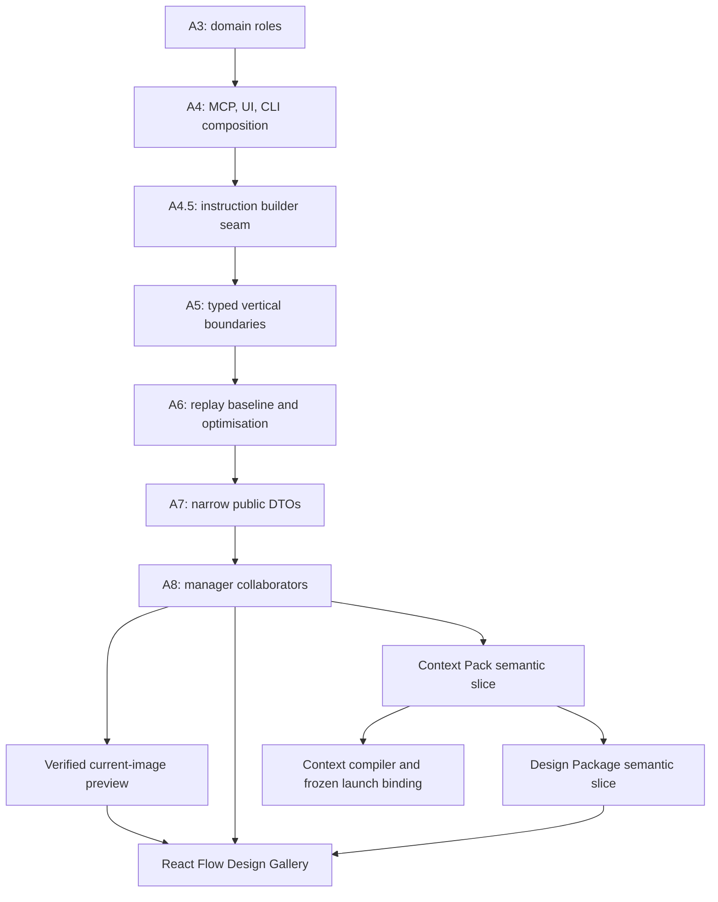

# Context Pack и Design Gallery: утверждённая программа реализации

**Статус:** утверждённый техплан; реализация идёт по отдельным structural и
behaviour/data-semantics коммитам.

**Основание:** аудит качества кода
`docs/audits/2026-08-18-code-quality/`, целевая карта из
`structure-report.md` и решения владельца от 2026-08-22.

## 1. Принятые решения

| Решение | Запись | Следствие |
|---|---|---|
| Context Pack и Design Package — канонические revisioned сущности | `decision.2ASFCETB9SMAXTVQ5PXRFJYRXW` | Нужен отдельный semantic vertical slice: schema/event, validation, projection, lifecycle и migration. Это не A3–A8. |
| Gallery — первый экран React Flow | `decision.0A252PQN9QH7HZCBF4ZDF8BR8X` | Миграция идёт screen-by-screen; legacy static SPA не получает Gallery. |
| Preview: `public` и `internal` | `decision.50RSN30Q2Q1QW7QYHXX4BZJDHQ` | `restricted`, `pii` и `secret` всегда получают typed refusal. V1 — только PNG/JPEG текущей ревизии. |
| A4.5 — seam для instruction composition | `decision.0E25PERWJMD1PGRHS3K4B6QQZR` | Сначала механическое выделение builder; Context Pack injection приходит отдельным поведением. |

Не переоткрываются: демо не является продуктовым источником данных
(`decision.2ZTHNGPQVMHZ5RF614HQPWCKYV`), а `runtime.yaml` не служит хранилищем
feature-state (`decision.1A08MD6B8TXRWVNX00DJZD98DY`).

## 2. Пользовательский контракт

### Context Pack

Researcher публикует ревизию упорядоченного, проверенного набора: summary,
facts, decisions, source refs и open questions. Пользователь создаёт Backend и
Frontend от одной ревизии. Каждый запуск получает immutable binding на неё и
регистрирует fingerprint скомпилированного общего baseline.

Это гарантирует одинаковую **каноническую основу**, а не побайтное равенство
всего provider prompt: системная инструкция и role/task-specific обвязка могут
различаться. Provider prefix/KV cache — необещаемая внутренняя оптимизация.
Transcripts и скрытое reasoning в Pack не попадают.

### Design Gallery

Product designer публикует Design Package с revisioned порядком экранов и
ссылками на точные ревизии артефактов. В первом React Flow экране пользователь
видит карточки/board экранов и их provenance, открывает безопасный image preview
и создаёт feedback. V1 не содержит hotspots, SVG/HTML preview, исторический
pixel-compare или визуальное редактирование.

## 3. Архитектурный граф и gates



Структурные A3–A8 сохраняют event names, schema names, JSON bytes и replay
semantics. Pack/Package начинаются только отдельным owner-approved behavioural
проектом: у них появляются собственные event types, reducers, validators и
migration contract. Нельзя прятать эту семантику в `extensions`, task description
или неименованный relation predicate.

## 4. Целевая карта компонентов

| Слой | Целевой модуль | Контракт | Владелец |
|---|---|---|---|
| Domain roles | `domain/roles.py` | role lineage, grants и policy наследования | Python domain / архитектура |
| Context Pack domain | `domain/context_packs.py` | frozen `ContextPackRecord`, `ContextPackBinding`, parser/validator | Python domain |
| Design Package domain | `domain/design_packages.py` | `DesignPackageRecord`, ordered `ScreenBinding`, revision-bound refs | Python domain |
| Services | `services/context_packs.py`, `services/design_packages.py` | publish/revise/get/list и controlled role creation | Python backend |
| Artifacts | `services/artifacts.py`, `services/artifact_content.py` | artifact commands и verified current-content reader | Backend + security |
| Runtime | `services/delegation_instruction.py`, затем `services/context_compiler.py` | typed instruction build, deterministic compiled context | Runtime/backend |
| UI backend | `ui/reads.py`, `ui/actions.py` | typed read models и user workflows | Python UI |
| UI transport | `ui/server.py`, `ui/security.py` | thin routes, auth/CSP only | Backend + security |
| React surface | новый React Flow frontend subtree | Gallery board, inspector, feedback, shared strings/glossary | Frontend + design |
| MCP / CLI | `mcp/tools/*.py`, `cli/*.py` | scoped tools and command groups | Platform |
| QA | targeted domain/service/runtime/UI tests | compatibility, security and end-to-end evidence | QA / independent reviewer |

`CommonsManager`, root `cli.py`, `mcp/server.py::build_server` и `UIContext`
не получают новый feature workflow. После A8 потребители используют narrow
collaborators (`manager.artifacts`, `manager.context_packs`,
`manager.design_packages`), а composition roots только регистрируют их.

## 5. Типизированные contracts

Новые границы используют frozen dataclass или `TypedDict`; generic
`dict[str, Any]` не является feature boundary.

```text
ContextPackCommands.publish(draft, idempotency_key) -> ContextPackRecord
ContextPackCommands.create_roles_from_pack(request) -> CreateRolesResult
ContextCompiler.compile(binding, launch) -> CompiledContext
ArtifactContentReader.read_current_preview(artifact_id) -> ArtifactPreview
DesignPackageCommands.publish(draft, idempotency_key) -> DesignPackageRecord
DesignPackageCommands.revise(package_id, expected_revision, draft) -> DesignPackageRecord
DesignGalleryReads.list_for_producer(ref) -> tuple[GalleryFrameView, ...]
DesignFeedbackActions.open_feedback(request) -> ThreadRef
```

`CompiledContext` содержит только renderable text, fingerprint и
revision-bound source refs. Телеметрия хранит fingerprint/размер, но не prompt
body. Binding фиксирует revision: публикация Pack v2 не меняет запущенный или
уже созданный от v1 run.

## 6. V1 image-preview security contract

`GET /api/artifacts/{id}/preview` не принимает filesystem path. Сервер:

1. разрешает artifact через manifest и текущие grants;
2. открывает путь descriptor-relative, с no-follow semantics;
3. требует regular file, проверяет byte cap, SHA-256, MIME magic и pixel cap;
4. разрешает лишь PNG/JPEG c classification `public`/`internal`;
5. возвращает `Cache-Control: no-store` и `X-Content-Type-Options: nosniff`;
6. даёт typed refusal при symlink, подмене, исчезновении или stale revision.

React client получает байты авторизованным `fetch`, создаёт Blob URL и отзывает
его при закрытии inspector. В CSP добавляется только `blob:` для `img-src`.
SVG, HTML, raw file URL и browser-visible token в V1 запрещены.

## 7. Порядок доставки и разделение коммитов

| Волна | Содержание | Граница |
|---|---|---|
| R1 | A3, A4, A4.5 | Только mechanical moves, characterization tests, `make check` на каждый commit. |
| R2 | A5–A8 | Typed in-memory slices, replay work, DTO/collaborator migration; старый JSON byte-for-byte. |
| F1 | Artifact verified reader и preview route | Behaviour-only; нет новых canonical entities. |
| F2 | React Flow foundation и Gallery shell | Первый migrated screen; использует typed read DTO и safe preview. |
| F3 | Context Pack semantic vertical slice | Новый event/schema/projection/migration контракт в отдельных commits. |
| F4 | Design Package, feedback provenance и Context compiler | Revision-bound screen order, frozen launch binding, role fan-out. |

Feedback V1 открывает существующий `review_discussion`; автоматическое создание
task и region-level annotation отложены до отдельного workflow decision.

## 8. Влияние на оставшийся аудит

| Шаг | Что удешевляет фича | Чего нельзя делать раньше |
|---|---|---|
| A3 | Один home для context/role lineage policy | Не добавлять inheritance в `agents.py`/UI/runtime. |
| A4 | Реальные потребители UI/MCP/CLI seams | Не раздувать `UIContext`, root CLI и `build_server`. |
| A5 | Хорошие first consumers для typed records/refs | Не вводить generic payload maps. |
| A6 | Gallery повышает ценность быстрых snapshot reads | Не маскировать feature read paths под replay optimisation. |
| A7 | DTO для React, MCP и CLI | Не выдавать projection internals публично. |
| A8 | Пакеты становятся доказательным consumer collaborators | Не добавлять методы в `CommonsManager`. |

## 9. Тесты и evidence

- Structural commits: characterisation snapshots, import compatibility и полный
  `make check` до каждого commit.
- Pack: parser/serializer compatibility, stale CAS, frozen v1/v2 binding,
  equal baseline fingerprint для двух child-runs, reviewer isolation.
- Package: deterministic screen order, producer/task provenance и stale refs.
- Preview: traversal, symlink, replacement, fake MIME, oversized/pixel-bomb,
  auth/classification/headers, Blob revoke and no token URL.
- React: paired locale/glossary checks, typed refusal/empty/stale states,
  packaging/build and accessibility tests.
- Каждый behaviour commit отдельно проходит independent review на exact revision;
  push завершается только после зелёного CI.

## 10. Первый запуск команды

Запущены три непересекающиеся structural tasks:

1. `task.05Q8ZW3WB18HRG5NAK8DG3MG0H` — A3 `domain/roles.py`.
2. `task.79VTZMP8A03H48E03JK4A7JH4F` — A4 UI reads/actions split.
3. `task.62M1D8R7GQ7X78Y3D309G031D4` — A4.5 instruction composition seam.

После них создаются отдельные tasks для MCP, CLI, artifacts, React foundation и
semantic vertical slices. Один writer владеет любым конкретным frontend screen;
legacy `index.html` не меняется для Gallery.
