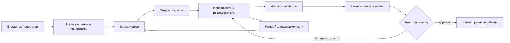
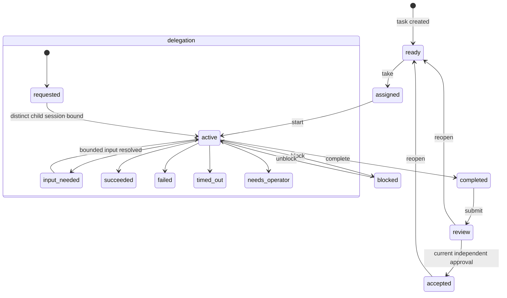
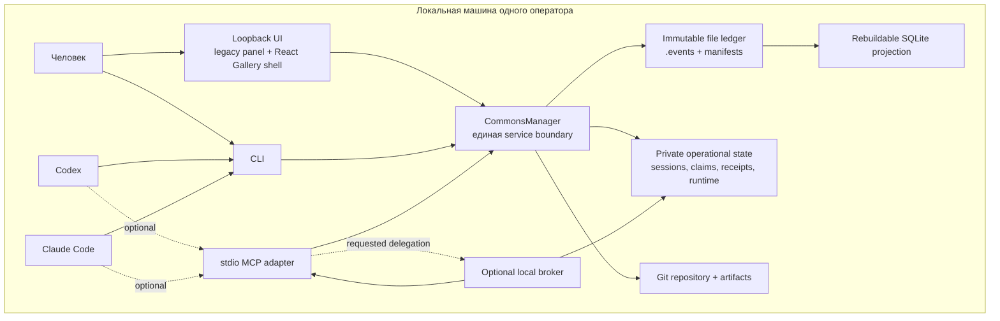
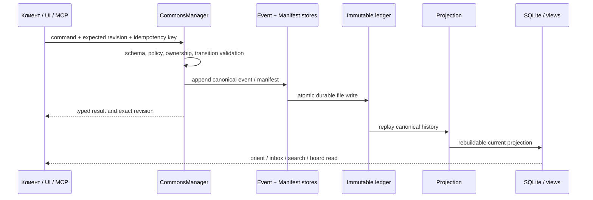
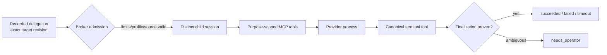
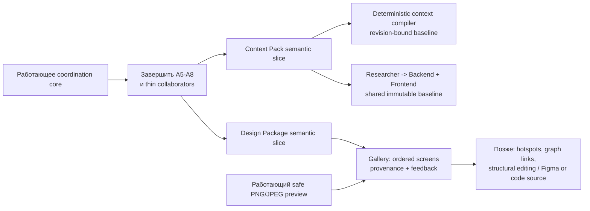

# Agent Commons: текущее состояние продукта и архитектуры

**Срез репозитория:** `a96b195` (`Introduce Frozen Artifact Projection Record`), 24 августа 2026 года.
**Назначение страницы:** дать человеку, новому участнику команды или новому агенту одну
честную карту продукта: какую проблему он решает, что уже работает, как устроен и что
согласовано, но ещё не является функциональностью.

Это описание опирается на исходный код, тесты, документацию и реестр решений в этом
репозитории. Оно не является отчётом об использовании у клиентов: здесь нет придуманных
рыночных цифр, adoption-метрик или заявлений о production-ready статусе.

## Коротко для владельца продукта

**Agent Commons — локальное общее рабочее пространство для команды людей и AI-агентов,
работающих над одним репозиторием.** Оно сохраняет не чат, а проверяемую память о работе:
кто что делает, какие файлы заняты, что было проверено, какое решение принято и что надо
передать следующему окну агента.

Сегодня продукт уже даёт четыре практические ценности:

1. **Сокращает повторное погружение в контекст.** Новое окно Codex, Claude Code или другого
   клиента читает `orient`, inbox, задачи, решения и handoff, а не восстанавливает историю по
   переписке.
2. **Делает параллельную работу видимой.** Задачи, зависимости, временные claims и роли
   показывают пересечения до того, как несколько участников начнут менять один путь.
3. **Отделяет утверждение от доказательства.** Выполненная задача, независимый review,
   verification, finding и owner decision — разные сущности с привязкой к точной ревизии.
4. **Позволяет запускать ограниченную локальную работу агентов.** Опциональный broker запускает
   только заранее разрешённые provider-профили и не превращает успешный выход модели в
   автоматическое принятие результата.

Главное ограничение текущей версии: это **локальный, однопользовательский, файловый продукт**.
Он не заменяет Git, CI, issue tracker, систему учётных записей или человека, который даёт
разрешение на внешний эффект. Подробнее — в [видении](VISION.md),
[архитектуре](ARCHITECTURE.md) и [threat model](THREAT_MODEL.md).

## Что уже есть, что выполняется, что запланировано

| Область | Статус | Что пользователь реально получает сейчас |
| --- | --- | --- |
| Совместная память и управление работой | **Работает** | Objectives, задачи, сессии, claims, треды, handoff, поиск, orientation и inbox через CLI, MCP и локальную панель. |
| Governance и доказательства | **Работает** | Ревизионные artifacts, reviews, verifications, findings, decisions, staleness и явная граница `task.accepted`. |
| Роли и ограниченные делегации | **Работает** | Постоянные роли с наследуемыми ограничениями, одноразовые delegation runs и независимость review от автора. |
| Локальная UI-панель | **Работает** | Board, conversation/attention, каталог ролей, first-run setup, локальные записи через тот же service boundary. |
| Опциональный broker | **Экспериментально** | Разрешённый локальный запуск Codex/Claude-профиля с лимитами, preflight, canary, попытками и fail-closed recovery. Это ещё не beta/production promise. |
| Image preview артефактов | **Работает как узкий V1** | Авторизованное превью только текущего PNG/JPEG артефакта классов `public` и `internal`; опасные типы и подмена файла получают typed refusal. |
| React Design Gallery | **Основание готово, данных нет** | Доступен отдельный экран `/gallery`, локализация и безопасная сессия. Он намеренно показывает «данные недоступны», а не фальшивые макеты. |
| Code-quality refactoring | **В процессе** | Вынесены несколько тематических seams и typed/frozen slices; полная целевая модульная карта ещё не достигнута. |
| Context Pack | **Утверждённый план, не реализован** | Нет канонической сущности, события, compiler-а и launch binding-а. Нельзя честно обещать наследование общего исследовательского контекста. |
| Design Package, board с экранами и feedback | **Утверждённый план, не реализован** | Нет публикации упорядоченного набора экранов, связей, comments/feedback workflow, hotspots или визуального редактирования. |

Два последних направления приняты решением владельца как отдельные канонические,
revisioned сущности: `decision.2ASFCETB9SMAXTVQ5PXRFJYRXW`. Это **не** скрытая настройка
текущих artifacts и не часть механического рефакторинга. Полный контракт и порядок работ — в
[плане Context Pack и Gallery](context-pack-gallery-implementation-plan.md).

## Для кого и какую работу упрощает продукт

| Участник | Его задача | Что даёт Agent Commons |
| --- | --- | --- |
| Владелец продукта / оператор | Сформулировать цель, принять спорное решение, видеть фактический статус | Objectives, decisions, attention, board, проверяемые review/evidence и typed refusals вместо «кажется, что всё готово». |
| Координатор / product manager | Разделить работу и не потерять зависимости | Tasks, lifecycle, claims, handoffs, открытые треды и срез `orient`. |
| Разработчик или исследователь | Взять ограниченную часть работы и передать результат дальше | Роль, задача, точный artifact, discussion и handoff вместо пересказа всего чата. |
| Независимый reviewer / QA | Проверить ровно тот результат, который был заявлен | Точный `target_revision`, evidence bindings, scoped source reader, независимость авторства и staleness при изменении. |
| Designer | Зафиксировать визуальный результат как артефакт | Уже может зарегистрировать revisioned artifact; полноценный Design Package и Gallery-поток — следующий продуктовый этап. |
| Агент-провайдер | Выполнить один ограниченный запуск | Отдельная child session, фиксированная цель и лимиты, purpose-specific MCP catalog; provider prose сама по себе ничего не принимает. |

Схема описывает governance-цикл, а не обязательную бюрократию для каждого небольшого
изменения. В `light` режиме работа может честно закончиться на `completed`; `accepted` всегда
требует актуального независимого approval. См. [протокол](PROTOCOL.md) и
`decision.2FFQCGQKQ21VS1MQHNFCQEZWKJ` в реестре решений.

## Продуктовая модель: не чат и не автономная фабрика агентов

Agent Commons сохраняет **ключевые проверяемые факты**, а не полные диалоги и скрытое
рассуждение модели. Его модель состоит из четырёх слоёв:

| Слой | Примеры | Для чего нужен |
| --- | --- | --- |
| Policy | objective, constraints, роли, acceptance criteria | Задаёт рамку и полномочия. |
| Working space | task, thread, proposal, handoff, claim | Делает текущую совместную работу координируемой. |
| Evidence | artifact revision, verification | Привязывает проверяемое утверждение к конкретному материалу. |
| Effective truth | accepted decision, verified finding, accepted task | Даёт краткий актуальный ответ, пока связанная ревизия не устарела, не исправлена и не инвалидирована. |

Сообщение, согласие нескольких моделей или завершение provider-процесса не перепрыгивают между
этими слоями. Такой принцип сохраняет полезное несогласие и не позволяет модели самой выдать
себе полномочие. Основание: [VISION.md](VISION.md), [ARCHITECTURE.md](ARCHITECTURE.md) и
[ADR 0002](adr/0002-explicit-truth-promotion.md).

### Ключевые сущности и их состояние

- **Task** — единица работы; авторское `completed` не равно принятому результату.
- **Claim** — expiring координационная аренда ресурса; это не право Git-владения.
- **Artifact** — идентичность и неизменяемые revision metadata; обычно содержимое не копируется
  в ledger, а хэшируется и связывается с ним.
- **Review / verification** — профессиональное суждение и воспроизводимый факт; оба привязаны к
  точной ревизии, а не к плавающему названию файла или задачи.
- **Decision / finding** — явно promoted project truth с причиной, evidence и возможным dissent.
- **Standing agent role** — долгоживущая «штатная» роль; **delegation** — один ограниченный
  запуск. Их намеренно не объединяют, чтобы роль не маскировала зависимость reviewer-а от автора.

Полная таблица переходов и правила stale evidence находятся в
[архитектуре](ARCHITECTURE.md#lifecycle-invariants) и в доменных модулях
[`domain/lifecycle.py`](../src/agent_commons/domain/lifecycle.py),
[`domain/transitions.py`](../src/agent_commons/domain/transitions.py) и
[`domain/projection.py`](../src/agent_commons/domain/projection.py).

## Как система устроена

### Контекст системы

**Одна бизнес-граница.** CLI, UI и MCP не записывают собственные варианты сущностей: они
проходят через `CommonsManager` и его тематические command-модули. Именно здесь проверяются
schemas, политика безопасности, exact-revision CAS, lifecycle и idempotency. Код:
[`services/manager.py`](../src/agent_commons/services/manager.py),
[`cli/__init__.py`](../src/agent_commons/cli/__init__.py),
[`mcp/server.py`](../src/agent_commons/mcp/server.py) и
[`ui/server.py`](../src/agent_commons/ui/server.py).

### Данные: от immutable history к быстрому представлению

Есть два разных хранилища, и их нельзя путать:

1. **Каноническое.** `.agent-commons/events/` и manifests — append-only история, которая
   попадает в Git. Она является источником истины.
2. **Операционное.** В Git common directory лежат sessions, claims, idempotency receipts,
   local runtime и SQLite. Это локальная координация и ускоряющие/восстанавливаемые данные, не
   проектная история.

`doctor` проверяет canonical history и может синхронизировать disposable SQLite projection;
`index rebuild` восстанавливает её. Receipt recovery защищает от неясного состояния между
канонической записью и локальным idempotency receipt. См. [ADR 0001](adr/0001-file-ledger-with-sqlite-projection.md),
[ADR 0003](adr/0003-ledger-derived-checkout-aware-receipt-recovery.md),
[`storage/`](../src/agent_commons/storage) и [`index/sqlite.py`](../src/agent_commons/index/sqlite.py).

### Адаптеры и границы

| Поверхность | Что делает | Чего не делает |
| --- | --- | --- |
| CLI | Полный операторский интерфейс: init, session, task, role, artifact, review, decision, broker, support и maintenance. | Не создаёт вторую модель данных. |
| MCP | Строго ограниченный stdio tool catalog для агента, включая worker-scoped чтение репозитория и terminal outcome tools. | Не даёт произвольный shell, filesystem или расширение authority. |
| Local UI | Первичный продуктовый интерфейс: board, conversation, attention, setup, каталог, runs и actions. | Не считает деньги «потраченными», не рисует успех до ответа сервера и не хранит transcript. |
| Optional broker | Запускает лишь записанную delegation по allowlisted profile с лимитами и recovery. | Не принимает задачи, review или решения за человека; не становится remote scheduler. |

Публичный CLI-каталог можно увидеть в `agent-commons --help`; его группы реализованы в
[`src/agent_commons/cli/`](../src/agent_commons/cli). Purpose-specific MCP наборы и ограничения
worker-а определены в [`mcp/server.py`](../src/agent_commons/mcp/server.py), а контракт запуска —
в [ADR 0004](adr/0004-optional-local-delegation-runtime.md).

## Функциональная карта

### 1. Инициализация и диагностика

- `init` создаёт/безопасно обновляет workspace и onboarding для поддержанных клиентов.
- `support`, `doctor`, `receipt`, `index` и `views` делают состояние объяснимым и
  восстанавливаемым.
- `orient`, `inbox` и `search` дают следующему окну компактный срез вместо полного replay чата.
- State root может задаваться как точный root или как operator-owned base с namespace по
  workspace ID; смешение разных workspace fail-closed.

Источник: [README](../README.md), [QUICKSTART](QUICKSTART.md),
[ADR 0005](adr/0005-state-root-isolation.md) и
[`cli/workspace.py`](../src/agent_commons/cli/workspace.py).

### 2. Координация и организация команды

- Создание objectives, задач, dependencies и lifecycle transitions.
- Явные session identities и короткоживущие claims, чтобы видеть пересечение работы.
- Discussion threads: вопрос, предложение, critique и ответ роли; handoff передаёт точный
  контекст, предупреждения и следующий шаг.
- Standing roles: name, profile, skills/tools, lineage, lifetime и effective grants; временные
  links между ролями создаются и закрываются как история, не удаляются.

Источник: [USER_WORKFLOWS](USER_WORKFLOWS.md),
[`services/tasks.py`](../src/agent_commons/services/tasks.py),
[`services/roles.py`](../src/agent_commons/services/roles.py),
[`services/threads.py`](../src/agent_commons/services/threads.py) и
[`services/handoffs.py`](../src/agent_commons/services/handoffs.py).

### 3. Доказательство результата и принятие решения

- Artifact registration/revision создаёт стабильную identity и фиксирует content metadata/hashes.
- Review target привязан к current exact revision; независимый reviewer не может принять работу,
  которую он авторизовал как автор.
- Verification связывает утверждение с точным evidence; decision и finding обладают отдельными
  lifecycle и не становятся effective truth неявно.
- При изменении или invalidation evidence связанные judgment/acceptance становятся stale, а не
  исчезают из истории.

Источник: [PROTOCOL](PROTOCOL.md), [ARCHITECTURE](ARCHITECTURE.md#lifecycle-invariants),
[`services/artifacts.py`](../src/agent_commons/services/artifacts.py),
[`services/reviews.py`](../src/agent_commons/services/reviews.py),
[`services/decisions.py`](../src/agent_commons/services/decisions.py) и
[`domain/revisions.py`](../src/agent_commons/domain/revisions.py).

### 4. Ограниченная автоматизация

Broker действует только после записи delegation. Его admission берёт минимум из operator,
provider/profile, parent и delegation limits. Worker получает узкий каталог MCP-инструментов и
точный target revision; успешный process exit без canonical terminal tool остаётся недостаточным.
Операционные выводы ограничены и санитизированы, а prompts, reasoning, raw stdout, credentials и
tool arguments не сохраняются.

Это важная, но ещё **экспериментальная** часть. До релизного статуса должны быть пройдены
поведенческие canary на macOS/Linux, серия hermetic runs и реальные локальные запуски без
`process_canonical_mismatch`; это закреплено в
`decision.558YVVEX7D1BTEBERNBPT14XY2` и
[BROKER_OPERATIONS](BROKER_OPERATIONS.md). Реализация: [`runtime/`](../src/agent_commons/runtime),
[`services/delegation_runtime.py`](../src/agent_commons/services/delegation_runtime.py) и
[`mcp/scoped_repo.py`](../src/agent_commons/mcp/scoped_repo.py).

### 5. Пользовательский интерфейс и безопасные previews

UI запускается только на `127.0.0.1`; writable panel владеет своей операторской session, а
`--read-only` не создаёт её и не регистрирует mutating routes. Первые настройки и provider
discovery используют typed refusal, а не исчезающие URL: UI может честно сказать
`setup_uninitialized`, `launch_not_configured` и другой конкретный код.

Доступ браузера устроен так:

1. В fragment открываемого URL попадает короткоживущий одноразовый opaque exchange code.
2. Legacy panel и React Gallery стирают fragment до первого data request и обменивают код на
   `HttpOnly`, `SameSite=Strict` cookie.
3. Сервер отдаёт высокоэнтропийный process-specific API base; cookie ограничен этим путём, поэтому
   обычный `/api` на другом loopback-порту его не получает.
4. API base хранится только в `sessionStorage` данной origin/session, а не в URL, localStorage или
   Authorization header.

Это локальная защита от случайного переиспользования на другой loopback-службе, а не замена
многопользовательской аутентификации. Реализация и контракт:
[`ui/security.py`](../src/agent_commons/ui/security.py),
[`ui/server.py`](../src/agent_commons/ui/server.py) и [FRONTEND_CONTRACT](FRONTEND_CONTRACT.md).

Безопасный `GET .../artifacts/{id}/preview` не принимает filesystem path. Он разрешает artifact
через manifest, проверяет текущий источник, тип файла, size/pixel limits, magic bytes и SHA-256;
разрешены только PNG/JPEG `public`/`internal`. Symlink, stale/replaced file, SVG/HTML, `restricted`,
PII и secret content fail closed с typed code. Код:
[`services/artifact_content.py`](../src/agent_commons/services/artifact_content.py),
[`tests/services/test_artifact_content.py`](../tests/services/test_artifact_content.py) и
[`tests/ui/test_artifact_preview.py`](../tests/ui/test_artifact_preview.py).

### 6. Состояние Design Gallery

Первый мигрированный React Flow экран находится в [`frontend/gallery/`](../frontend/gallery) и
пакуется в [`ui/static/gallery/`](../src/agent_commons/ui/static/gallery). Это отдельное
приложение рядом с legacy single-file panel, с собственным CSP и парной EN/RU локализацией.

Однако Gallery **пока не является доской дизайнов**. `GET /gallery` запускает настоящий React
shell, затем его backend bootstrap осознанно возвращает `409 gallery_data_unavailable`: опубликованных
Design Package ещё нет. На canvas нет sample screens, связей, drag/edit, hotspots, feedback или
выдуманной demo-data. Это проверено в [`tests/ui/test_react_gallery.py`](../tests/ui/test_react_gallery.py)
и зафиксировано в [FRONTEND_CONTRACT](FRONTEND_CONTRACT.md#incremental-react-flow-migration).

## Карта модулей

| Слой | Текущие модули | Ответственность |
| --- | --- | --- |
| Core | `core/ids.py`, `refs.py`, `canonical.py`, `schema_registry.py` | Typed IDs/references, canonical JSON/hash и schema registry. |
| Domain | `domain/lifecycle.py`, `transitions.py`, `projection.py`, `snapshot.py`, `roles.py`, `attention.py`, typed envelope/record модули | Чистые правила состояний, parsing, replay и read-modelы. |
| Storage | `storage/events.py`, `manifests.py`, `atomic.py`, `idempotency.py`, `receipt_recovery.py` | Immutable canonical write, manifests, atomicity и crash-safe receipts. |
| Coordination | `coordination/sessions.py`, `claims.py` | Local session/nonce и expiring resource claims. |
| Services | `services/{tasks,roles,delegations,artifacts,reviews,findings,decisions,threads,handoffs}.py` | Тематические commands поверх общего manager boundary. |
| Runtime | `runtime/`, `services/delegation_runtime.py`, `services/communication.py` | Local broker, attempts, policy, safe process boundary и bounded operational communication. |
| Read performance | `index/sqlite.py`, `views.py` | Rebuildable SQLite projection, orientation/inbox/search и human-readable views. |
| Adapters | `cli/`, `mcp/`, `ui/` | Перевод входов пользователя/агента в один сервисный контракт. |
| Product assets | `ui/static/index.html`, `frontend/gallery/`, `ui/static/gallery/` | Legacy panel и постепенно мигрируемые React screens. |
| Tests and quality | `tests/`, `docs/audits/2026-08-18-code-quality/` | Characterization, security, contract and end-to-end проверки; план реструктуризации. |

Целевая карта намеренно ещё дробнее: после завершения аудита `CommonsManager`, root CLI,
`mcp/server.py::build_server` и `UIContext` должны остаться тонкими композиционными фасадами, а не
получать новые feature workflows. См. [structure report](audits/2026-08-18-code-quality/structure-report.md)
и [audit plan](audits/2026-08-18-code-quality/audit-plan.md).

## Качество, рефакторинг и честный статус технического долга

Рефакторинг ведётся как отдельная программа A0–A8. Его правила важнее скорости: persisted event
format не меняется в structural commits, behaviour и structure не смешиваются, а `make check`
(Ruff + format + полный pytest через locked `uv`) — единственное значение «зелёного дерева».

Наблюдаемый прогресс по commit history этого среза:

| Участок | Подтверждённые шаги | Что из этого следует, а что нет |
| --- | --- | --- |
| A3/A4/A4.5 | `784ead9` roles, `a455200` UI reads/actions, `38c8f43` scoped repo reader, `7f91803` CLI package, `e4134a1` instruction composition | Появились полезные seams; это не означает, что каждый composition root уже тонкий. |
| A5 | Typed envelopes `7a3e0f7`…`9a1beae`, frozen projection records `df5ba8b`…`a96b195`, `d1661de` TransitionSpec | Typed in-memory границы становятся реальными; работа по всем семействам и adapters ещё продолжается. |
| A6 | `503d37f` profile и `27b6eaa` streamed verified rows | Есть измеренная оптимизация allocation, но она была разрешена узким исключением до полного A5; повторное профилирование после A5 обязательно. |
| A7 | `8225f1c` UI DTO и `d71b066` deep-freeze | UI-local slice защищён от shallow mutation; широкий manager → MCP/CLI/UI DTO migration ещё впереди. |
| A8 | Нет завершённого продуктового перехода к narrow collaborators | Новые feature методы не должны возвращаться в разбираемые фасады. |

Исключение A6 и его ограничение зафиксировано в `decision.1MWJ0V2QPQWXEARJQ4Y93WZX5A`. Текущие
активные/непринятые задачи и незакоммиченные изменения намеренно не считаются завершённой частью
этой карты: у них нет той же устойчивости, что у commit + green check + review.

## Одобренная следующая продуктовая волна

### Context Pack — будущий контракт

Пользовательская цель: исследователь публикует ревизию summary, facts, decisions, source refs и
open questions; Backend и Frontend создаются от **одного frozen baseline**. Два child-run получают
одинаковую каноническую основу и fingerprint compiled context, а затем расходятся по role/task
обвязке. Это не обещание общего KV-cache провайдера и не требование побайтного совпадения всего
prompt-а; provider cache остаётся внутренней, необещанной оптимизацией.

Для этого потребуются собственные events/schemas/validators/projection/lifecycle/migration,
`ContextPackRecord`, binding к launch и `ContextCompiler`. Скрытое reasoning и transcripts в Pack
не попадут. Полный typed contract — в [implementation plan](context-pack-gallery-implementation-plan.md#5-типизированные-contracts).

### Design Package и Gallery — будущий контракт

Product designer будет публиковать revisioned упорядоченный список экранов, каждый с привязкой к
точной revision артефакта и provenance. Gallery сможет показать board/inspector, безопасное preview
и textual feedback, связанный с соответствующим результатом.

Следующие вещи **не входят в V1**: SVG/HTML preview, history pixel compare, auto-created task из
comment, hotspots, переходы между экранами и визуальные micro-edits. Редактирование становится
надёжным только при структурированном source-of-truth или интеграции с Figma/кодом, поэтому его
нельзя обещать вместе с read-only gallery.

## Безопасность, границы доверия и нецели

| Граница | Что обеспечивается сейчас | Что не обеспечивается / не обещается |
| --- | --- | --- |
| Локальный оператор | Loopback-only UI, Host/Origin checks, short-lived cookie handoff, private state directories. | Remote accounts, shared multi-user authorization и cryptographic identity. |
| Каноническая память | Immutable events, exact revisions, idempotency, stale evidence propagation и repair-oriented doctor. | Хранение всего чата, prompt-а или private chain-of-thought. |
| Роль и агент | Объявленные capabilities, lineage и effective narrow grants как координационный контракт. | Самостоятельное право модели deploy/publish/erase data или менять внешние системы. |
| Broker/provider | Allowlisted executable/profile, task binding, limits, child session, scoped tools, fail-closed recovery. | Произвольный command execution, незаметный recursive swarm или готовность broker-а к production. |
| Artifact preview | Manifest/hash/type/classification checks и no raw filesystem path from browser. | Render arbitrary HTML/SVG, доступ к secret/PII content или полноценный design editor. |

Необходимые ограничения и причины описаны в [THREAT_MODEL](THREAT_MODEL.md),
[ARCHITECTURE](ARCHITECTURE.md#security-and-trust) и [FRONTEND_CONTRACT](FRONTEND_CONTRACT.md).

## Зоны ответственности следующей команды

| Роль | Зона ответственности | Нужное решение или результат |
| --- | --- | --- |
| Product owner | Value, границы V1, переход к F3/F4, acceptance semantics | Подтверждает schema/event semantics Context/Design Pack, UX feedback и будущие edits. |
| Product manager / business | Пользовательские сценарии и измерение результата | Формулирует baseline и target для time-to-orient, duplicate work, review cycle, handoff usefulness; текущих чисел нет. |
| Software architect | Порядок A5–A8 и ownership boundaries | Не допускает feature logic в `CommonsManager`, root CLI, `build_server` или `UIContext`. |
| Python domain/backend | New canonical entities, validators, projection, migrations и service collaborators | Реализует Context Pack / Design Package отдельными behavioural commits после соответствующего gate. |
| Runtime/backend | Compiler и launch bindings | Гарантирует frozen revision/fingerprint без хранения provider prompt/transcript. |
| Security/backend | Artifact content reader, browser session, CSP/classification policy | Расширяет preview только после отдельной модели угроз и tests. |
| Frontend + design | React Flow gallery, visual hierarchy, paired locales, accessibility | Не подменяет отсутствие Design Package демо-карточками; позже реализует inspector/feedback. |
| MCP/CLI platform | Narrow commands/tools и migration windows | Сохраняет contracts, scoped authority и backward-compatible migration. |
| QA / independent reviewer | Characterization, security and exact-revision review | Проверяет no schema drift, stale behavior, malicious files, auth boundaries и end-to-end journeys. |
| SRE / operator | Local profiles, broker qualification, CI and state hygiene | Проверяет canary/release evidence; не объявляет broker готовым без зафиксированных критериев. |

## Как читать и поддерживать эту карту

| Вопрос | Первичный источник |
| --- | --- |
| Зачем продукт существует и чем не является | [VISION.md](VISION.md) |
| Точная модель данных, lifecycle, storage и trust boundaries | [ARCHITECTURE.md](ARCHITECTURE.md) |
| Команды и первый ручной workflow | [README](../README.md), [QUICKSTART.md](QUICKSTART.md), [USER_WORKFLOWS.md](USER_WORKFLOWS.md) |
| Формальное promotion-to-truth поведение | [PROTOCOL.md](PROTOCOL.md), [ADR 0002](adr/0002-explicit-truth-promotion.md) |
| Broker и evidence gate | [BROKER_OPERATIONS.md](BROKER_OPERATIONS.md), [ADR 0004](adr/0004-optional-local-delegation-runtime.md) |
| UI/CSP/i18n/session rules | [FRONTEND_CONTRACT.md](FRONTEND_CONTRACT.md), [`ui/`](../src/agent_commons/ui) |
| Context Pack / Design Gallery roadmap | [context-pack-gallery-implementation-plan.md](context-pack-gallery-implementation-plan.md) |
| Текущая архитектурная перестройка | [audit-plan.md](audits/2026-08-18-code-quality/audit-plan.md), [structure-report.md](audits/2026-08-18-code-quality/structure-report.md) |

При обновлении этой страницы следует сначала сверить exact source revision, registry decisions и
актуальные tests. Новый feature нельзя переносить из раздела «одобренный план» в «работает» только
по наличию идеи, UI-макета или provider prose: нужны реализованный контракт, проверка и
revision-bound review.
