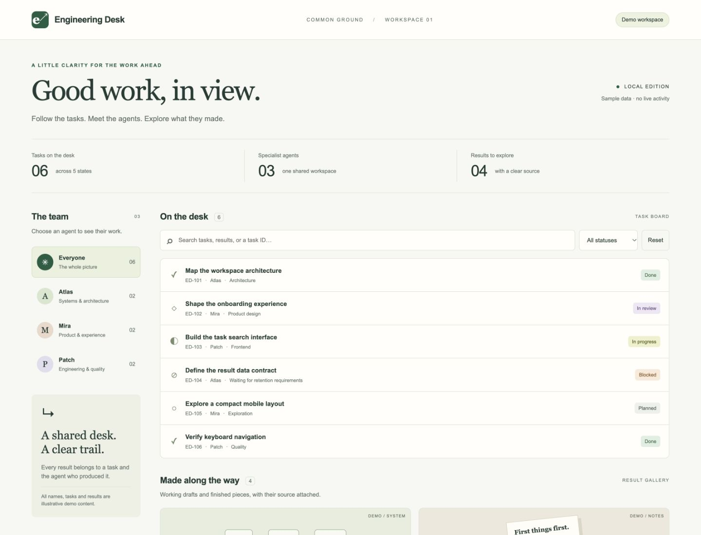
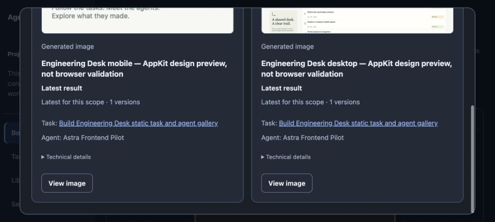

# Проверенный продуктовый запуск Astra

[Полный отчёт](REPORT.md), [происхождение](provenance.json),
[реальный broker outcome](retry-broker-result.json) и
[независимые проверки](independent-browser-checks.json).

[Frontend и точные исходники](engineering-desk.zip) содержат каталог `product/`
с 19 исходными файлами и build, без преобразования байтов. Это отдельный
проверочный продукт с явными demo data, не новая часть Commons. Файлы внутри
архива соответствуют [manifest](product-files-manifest.json) и
[списку разрешённых материалов](safe-artifact-list.json). Архив удерживает
самостоятельный пример отдельно от исполняемого кода и проверок основного проекта.

Сборка после распаковки: `python3 product/build.py`; проверки —
`python3 product/check.py`, существующий Node должен быть в PATH.
Серверы проверки остановлены. Отчёт сохраняет временные пути исходного прогона;
`product/` из него находится в архиве.

Два опубликованных PNG — явно подписанные AppKit design previews; фотографии
браузера в этом каталоге — отдельная независимая проверка HTML и Commons UI.
Первый provisioning failure сохранён в `attempt-1/`; повтор разрешил
координатор в пределах исходного запроса владельца. G5/G7 этим пилотом
не приняты: автоматическое хранение builds/версий и exact-output review
реализуются отдельным пакетом.
