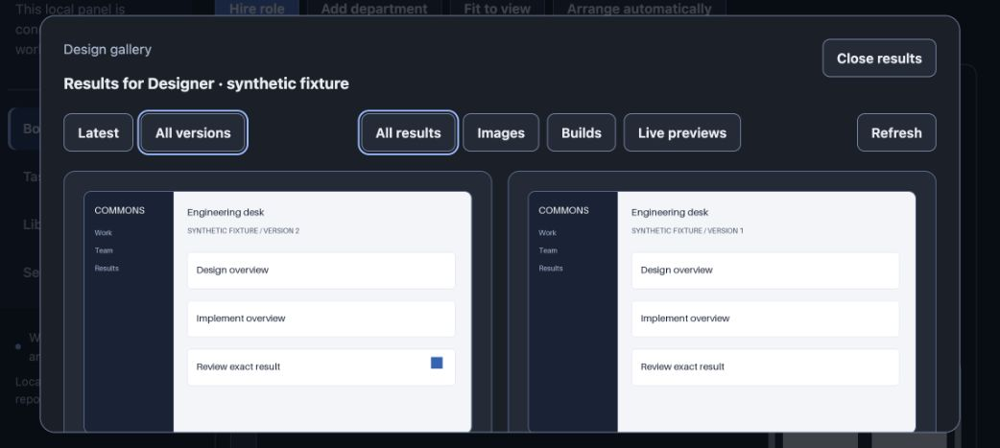

# Проверка галерей и структуры в настоящем Chrome

Проверялся локальный Work UI с отдельным synthetic workspace в
`/private/tmp/commons-product-e2e-20261001`. Designer и Frontend, задачи,
две PNG-версии и небольшой HTML/CSS/JS build созданы детерминированной фикстурой,
а не моделью. Настоящий Astra frontend pilot сохранён отдельно в
[предыдущем evidence](../../council/after-login/product-pilot/REPORT.md).
Проверки ниже выполнены через реальный Chrome; это не снимки макетов.

## Подтверждено

- Нажатие значка Designer открывает его галерею. All versions показывает обе
  версии; обе картинки действительно загружены, `naturalWidth=960`,
  `naturalHeight=600`. Исходный PNG удалён до запуска UI. После остановки и
  повторного запуска сервера обе версии доступны из retained content.
- У v2 есть отдельный ожидающий exact-result review; у v1 его нет. Текущий
  task review ожидает проверки независимо от обеих image versions. Эта
  проверка сделана до настоящего reviewer-run и не заявляет его результат.
- У Frontend доступен фильтр Builds и Download build. Реальный скачанный ZIP
  имеет SHA-256 `6e661b42bc1edd1c2563edeee14e0d57c6580e51f212970a4629ddcab05c2b78`,
  совпадает с зарегистрированным артефактом и содержит manifest и четыре файла.
  Событие download в automation tool истекло по timeout, но файл появился;
  проверялись именно его bytes. HTTP security headers отдельно покрыты route
  tests; браузер не дал сохранённого снимка заголовков.
- Structure показывает component → frontend task → nested task; отдельная
  Package delivery task зависит от frontend, но не является его ребёнком.
  Поиск nested task сохраняет видимыми предков (3 из 5 задач).
- Через UI родитель nested task изменён с frontend на component, затем
  восстановлен. Отображение изменилось 3/5 → 2/5 → 3/5; отдельная dependency не
  изменилась. После этого скрипт проверил реальное состояние ledger и hashes.
- EN/RU, узкий экран с фактической CSS-шириной 320 px, dialog, Esc и возврат
  фокуса проверены. Горизонтального overflow на узком экране не обнаружено.
  На desktop клавиатурная навигация графа меняла фокус между реальными задачами.

## Исправление, найденное этим проходом

После restart на том же origin сохранённый opaque API prefix получал 404.
Клиент ошибочно считал это допустимым legacy endpoint и не использовал новый
код входа. [Исправление reconnect](../reconnect/UI_RECONNECT_REPORT.md) требует
успешного authenticated `/setup` на том же prefix прежде, чем признать legacy
session действительной. После rebuild тот же Chrome tab без очистки storage
принял новую ссылку, открыл Work и обе сохранённые картинки. Authentication
сервера не ослаблялась. Screenshot ниже снят после этого успешного повторения.

## Ограничения

Chrome пользователя имел zoom 110%; responsive проверки сверялись с реальной
CSS-шириной DOM, а не с размером PNG. В narrow viewport автоматический pointer
click по agent icon дважды не активировал галерею, тогда как Enter сработал;
desktop pointer click сработал. Независимая проверка источника не нашла
перехватывающего drag/pointer handler. Причина narrow automation остаётся
неустановленной: этот pointer-сценарий не объявляется успешно проверенным.

UI не исполняет скачанный HTML в своём authenticated origin. Просмотр живого
приложения относится к отдельному live-preview URL; наличие ZIP не доказывает
его browser execution. Синтетический ZIP не является доказательством качества
реальной работы разработчика. Настоящие artifact-review результаты, когда они
появятся, фиксируются отдельными canonical IDs и не меняют этот исходный отчёт.

Дополнительные изображения: [структура](hierarchy-final-ru.png),
[поиск с предками](hierarchy-search-ru.png), [изменение родителя](parent-edit-ru.png),
[узкий экран](hierarchy-320-ru.png), [build на узком экране](build-320-ru.png).
Проверки bytes и отношений: [download](download-verification.json),
[ledger после UI edits](after-edit-verification.json).
