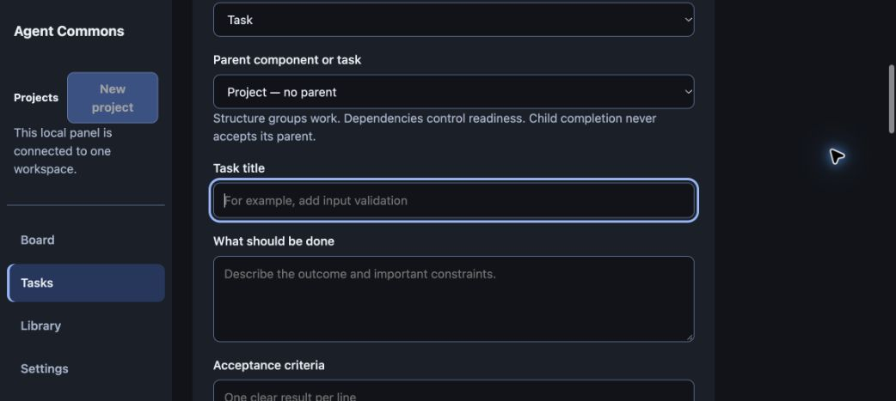

# Task composer confirmation regression

The final G6 integration review identified a real omission in the confirmed
submission comparison: task kind and parent were sent but absent from the
current-draft comparison, so successful submissions kept stale input.
The production comparison now normalizes all submitted fields consistently.

Eight executable production-handler tests pass; three reset cases fail on the
baseline. Concurrent title, kind and parent edits remain preserved, as do
uncertain requests and another project’s draft. See
[regression evidence](../hierarchy/integration-regressions.json).

Real Chrome created a component under an existing component. Reopening New task
showed an empty title, default Task kind and no parent. The synthetic regression
task was subsequently cancelled through the UI with its history retained;
"Saved to the task history" and Cancelled were observed on the final snapshot.
The temporary server was stopped after verification.

The final image/build review statuses were separately observed after the actual
Astra reviews: v2 Approved, v1 without a review, and current task review still
awaiting. [Screenshot](exact-review-statuses-en.png) and
[canonical evidence](../artifact-reviews/REPORT.md) preserve those distinct facts.
