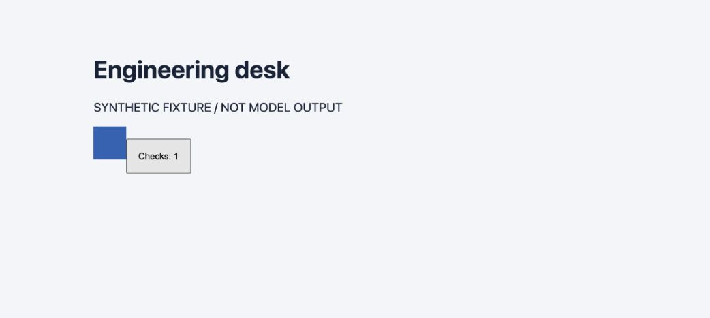

# Downloaded build local execution smoke

The exact ZIP downloaded through the Frontend gallery was extracted into a new
temporary directory. Its SHA-256 remained
`6e661b42bc1edd1c2563edeee14e0d57c6580e51f212970a4629ddcab05c2b78`.
The five entries were manifest, HTML, CSS, JavaScript and PNG.

A separate loopback static server on port 50155 served only the extracted tree.
This origin had no Commons API or authenticated session. Actual Chrome displayed
Engineering desk, the explicit synthetic-fixture label and the blue image.
A pointer click changed the button from Checks: 0 to Checks: 1, verifying that
the downloaded JavaScript executes with relative assets after extraction.
The page styles were visible. This is a synthetic transport/runtime smoke;
quality of actual provider-produced frontend is evidenced by the separate Astra pilot.

