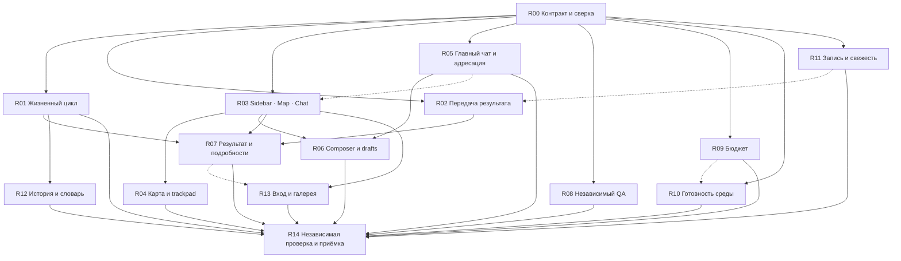

Независимая линия Astra: запрошенная конфигурация — `gpt-6-astra`; отдельной аттестации фактической модели от провайдера у этого ответа нет. Чужих ответов я не видел. Основание — общий пакет на `9ba5cbd5962b74a80423138174de153418fc683c`, включая отчёт, журнал, подписи изображений и фрагменты исходников. Пиксели мне не предоставлены, поэтому собственной визуальной проверки не заявляю. Это предложение для консолидации, ещё не принятое решение проекта.

Рекомендую вести исправление двумя связанными направлениями: **сразу сделать рабочее пространство Sidebar | Work Map | Main Project Chat и одновременно замкнуть передачу результата → независимую проверку → человеческую приёмку**. Полная перестройка оболочки без исправления жизненного цикла оставит прежние тупики внутри нового интерфейса. Длительная работа только над backend отложит именно то рабочее место, которое теперь явно попросил владелец.

По отчёту система уже принесла практическую пользу: зависимости соблюдались, уточнения доходили до исполнителей, независимые проверки возвращали содержательные замечания, старые результаты сохранялись. Девять приёмок относятся к ограниченным задачам Blizhe. Они не принимают интерфейс Commons, весь план улучшения или production. Главный установленный недостаток Commons — владелец не может надёжно закончить нормальный рабочий маршрут без знания внутренних команд.

В представленном коде есть три особенно конкретные точки вмешательства. В `execution_plan.py:461–467` действие из acceptance заменяется действием из run. Это согласуется с повторным Request review после approved, но исправление требует таблицы приоритетов, а не простого обмена двух строк. В `tasks.py` уже предусмотрено сохранение доказательств при `artifact_refs=None`, тогда как значения по умолчанию и CLI передают пустую последовательность. В `TaskInspector.tsx` результаты представлены идентификаторами, а список прогонов фильтруется и выводится без локальной сортировки. Порядок upstream из этих выдержек целиком не установлен.

Остальные границы важно сохранить. Язык не доказан причиной перекрытого composer. Lazy creation разговора — гипотеза о SEARCH-C, а не установленный корень UX-52. Краткое состояние 0/0 не доказывает потерю задач. Отказ загрузки файла относится к разрешениям браузерного инструмента. UX-32 сейчас не воспроизводится для пустой галереи; непустая в этом проходе не проверена. Задержки ответа агента нельзя использовать как измерения скорости сохранения.

Целевое пространство должно открываться сразу на карте. Слева — узкая сворачиваемая и изменяемая по ширине навигация: проекты, настройки, провайдеры, навыки, специализации. В центре — непрерывный рабочий холст на доступную высоту. Справа — главный разговор проекта с исходным запросом и сохраняемой историей контекста. Выбор задачи не должен незаметно заменять этот разговор другим. Разговор задачи открывается явно, с названием и областью действия, во вкладке или дополнительной панели.

Инспектор, результаты, файлы и галерея появляются по запросу. Закрытие подробностей возвращает прежнюю ветку, выделение и положение карты. Миро здесь задаёт расположение и жесты; его брендинг и функциональность копировать не требуется. На коротком окне вроде 1042×467 оболочка должна сокращать второстепенные панели, а карта оставаться рабочей поверхностью. Конкретные стартовые ширины — проверяемое дизайнерское решение Opus, а не число, которое можно вывести из отчёта.

Для исполнения предлагаю следующие **15 ограниченных пакетов**. Номера R — метки этого предложения, а не второй независимый backlog. После сверки каждый пакет должен ссылаться на существующую каноническую задачу или быть оформлен как её конкретное продолжение.

1. **R00 — договориться о новой оболочке и границах работ. P1; Codex, дизайн согласует Opus.**

   Источники: `PRODUCT.md`, `FRONTEND_CONTRACT.md`, действующие планы G/WP/C. Зафиксировать переход от прежнего board home к доминирующей карте, определить Main Project Chat, состояния панелей и единый словарь. Обновить только документы, владеющие соответствующими фактами; историю прежних поставок сохранить.

   Жёстких предпосылок нет; мягкая — дальнейшая сверка реализации. Приёмка: таблица «требование владельца → существующий пакет → конкретное изменение → доказательство», отдельный перечень непроверенного. Все UX-ID имеют адрес, принятые G5/G6/G7 не объявлены незавершёнными целиком. Новая схема оболочки не меняет авторитет задач, review и acceptance.

2. **R01 — правильное следующее действие и согласованное состояние работы. P1; Codex.**

   Покрывает UX-40/45 и часть UX-39; продолжает G8, WP-22/23. Швы: `services/execution_plan.py`, tracker DTO и потребители DecisionCard. Задача, прогон, результат, проверка и приёмка остаются отдельными сущностями. На карточке можно написать «идёт прогон», сохранив техническое состояние задачи ready, но нельзя одновременно предлагать новый запуск как нормальный следующий шаг.

   Жёсткая предпосылка — R00; мягкая — будущий R07. Приёмка: current independent approved предлагает принять; changes_requested — исправить; устаревшее одобрение не разрешает приёмку; старый needs_operator не перекрывает новое решение. Проверить комбинации свежести, активного процесса, нескольких прогонов и конфликтующей ревизии. Клиент исполняет серверное решение, не вычисляет собственную приёмку.

3. **R02 — поддержанная передача текстового результата. P1; Codex.**

   Покрывает UX-38/39/48; расширяет существующую работу G5/G7/G8. Швы: `services/tasks.py`, CLI, scoped MCP в `mcp/server.py`, сервис регистрации результатов и UI transport. Исполнитель передаёт ограниченный manifest файлов, краткий результат и точные ссылки; оператор при необходимости завершает передачу уже сохранённого кандидата через интерфейс.

   Жёсткая предпосылка — R00; мягкие — R01 и R11. Отсутствующий параметр сохраняет текущие доказательства; явное очищение требует отдельной понятной операции. Приёмка: повтор идентичной передачи не создаёт дублей; crash/retry сходится; stale или подменённые байты отклоняются; пустой или недоступный комплект выявляется до запуска QA. Builder не получает права принять задачу или писать произвольные файлы. Исправление handoff не требует повторной оплаты уже выполненной реализации.

4. **R03 — новая основная оболочка. P1; Opus.**

   Покрывает запрос владельца, UX-46/50; продолжает G8, WP-18/19/42. Швы: оболочка `frontend/work`, навигация, контейнер карты, существующий проектный разговор. Создать три основные области, убрать постоянный инспектор, сделать боковые панели сворачиваемыми и изменяемыми по ширине. Настройки и библиотека открываются по запросу.

   Жёсткая предпосылка — R00; мягкая — R05. Приёмка: после входа карта видна без прокрутки страницы; основной чат подписан областью проекта; технические списки отсутствуют на первом экране. Изменение ширины, закрытие панели и переход к результату сохраняют контекст карты и фокус. Проверить RU/EN, короткое окно, обычный экран MacBook и клавиатуру. Проектная навигация не запускает модель.

5. **R04 — управление картой на MacBook. P1; Opus.**

   Покрывает UX-54 и часть UX-46; развитие G4/G6, WP-25/27. Двумя пальцами пользователь перемещает холст по обеим осям; pinch изменяет масштаб относительно курсора. Жест над разговором прокручивает разговор, над картой управляет картой. Нужны мышь, клавиатурные команды, доступные zoom controls и список задач.

   Жёсткая предпосылка — R03; мягкие — R01/R12. Разделить viewport, выбранную задачу, выбранную ветку и открытость деталей. Приёмка: закрытие инспектора не превращает 9/14 в 14/14; пользовательские pan/zoom не сбрасываются обновлением данных. Поиск и фильтрация выполняются до ограничения 128 узлов. Проверить 1/20/128/304 задачи, длинные названия, diamond и скрытые зависимости; реальные жесты — на Mac trackpad. Structure и Dependencies сохраняют разные значения связей.

6. **R05 — главный разговор и гарантированный канал исполнителю. P1; Codex, интерфейс Opus.**

   Покрывает требование постоянного проектного контекста и UX-52. Швы: сервисы разговоров, подготовка запуска, адресация MCP `commons_list_my_threads`/`commons_reply_thread`. Главный разговор хранит исходный запрос и сообщения проекта; разговоры задач имеют собственную область. Перед стартом проверяется существование доступного адресованного канала обязательного ответа.

   Жёсткая предпосылка — R00; мягкие — R02/R03. Приёмка: новая задача запускается без предварительного ручного открытия разговора; исполнитель находит нужный канал и передаёт ответ; чужие разговоры недоступны. Отсутствующий канал объясняется до provider work. Постоянная история не означает передачу модели бесконечного transcript: контекст запуска ограничен, имеет явную область и источники. Сообщение само по себе не начинает новый прогон.

7. **R06 — доступный composer и устойчивые черновики. P2, обязательный для рабочего чата; Opus и Codex.**

   Покрывает UX-15/53/55. Швы: ConversationPanel, layout/scroll, память черновиков и отдельное серверное operational storage. Сначала устранить перекрытие поля и выхода кнопок за нижнюю границу. Для переживания reload добавить серверное приватное сохранение черновиков с привязкой к проекту и области, ограничением объёма, удалением и защитой от конфликтующих вкладок.

   Жёсткие предпосылки — R03/R05; мягкая — R11. Приёмка: обычный pointer click попадает в textarea после отправки, прокрутки и переключения языка; Tab достигает composer. Черновик не оказывается в URL, localStorage или sessionStorage и не отправляется автоматически. После reload восстанавливается только подтверждённо сохранённая версия. Ответ и отдельное acknowledgement показываются независимо: отсутствующий ack не подделывается ради красивой последовательности.

8. **R07 — читаемый результат и подробности по запросу. P1; Opus, DTO делает Codex.**

   Покрывает UX-44/58; продолжает G8 поверх G5/G7. Швы: `TaskInspector.tsx`, закрытый DTO подробностей, результатные карточки. На первом уровне показать название результата, краткое изменение, отчёт, diff, проверки, ограничение проверки и вердикт. Идентификаторы, hashes и точные ревизии остаются в раскрываемых деталях.

   Жёсткие предпосылки — R01/R02/R03; мягкая — R11. Приёмка: набор из 52 доказательств доступен полностью через ограниченную пагинацию, а не только первые 32; полный текст задачи открывается рядом без похода в diagnostics. Каждый файл имеет проверяемое происхождение. Проверка текущей задачи не превращается в одобрение старой версии output. Недоступные и изменённые файлы явно обозначены; прочтение отчёта не выдается за независимое выполнение команд.

9. **R08 — пригодная встроенная независимая QA-специализация. P1; Codex, отображение Opus.**

   Покрывает UX-37; продолжает G8 и каталог. Швы: `services/worker_eligibility.py`, версии специализаций, UI найма. Минимальный шаг — поставить совместимую версионированную специализацию reviewer с правильным назначением. Замена суффиксной эвристики явными метаданными должна быть отдельным ограниченным изменением совместимости, если потребуется.

   Жёсткая предпосылка — R00; мягкая — R10. Приёмка: встроенного QA можно нанять на independent-reviewer без ручного копирования; несовместимый профиль объяснён до записи. Unknown и stale qualification не становятся eligible. Новая версия каталога не переписывает закреплённые версии уже нанятых агентов и не расширяет полномочия reviewer.

10. **R09 — бюджет как понятная причина отказа. P1; Codex, интерфейс Opus.**

    Покрывает UX-57; продолжает WP-23/G8. Швы: `runtime/attempts.py`, `ui/launch.py`, availability/readiness DTO. Добавить закрытый безопасный код исчерпания лимита, показать лимит и оставшиеся разрешённые запуски в соответствующей области. Квалификация exact profile и возможность конкретного следующего запуска должны отображаться отдельно.

    Жёсткая предпосылка — R00; мягкая — R11. Приёмка: известное исчерпание 24/24 выявляется до обычной попытки запуска; гонка между предварительной проверкой и reservation всё равно безопасно отклоняется. Отказ не маскируется под auth или process startup. Увеличение лимита остаётся явным действием оператора; повторных автоматических платных прогонов нет. Provider units не подписываются денежными расходами.

11. **R10 — готовность окружения и понятная проверка провайдера. P1; Codex, интерфейс Opus.**

    Покрывает UX-42/43/47. Швы: `runtime/launch.py`, provider availability, setup и подготовка запуска. Разделить доступность CLI/auth, no-model initialization, qualification, зависимости проекта и доступность канала. Проверки среды должны исполняться в контексте будущего worker; наличие Node или dependencies на хосте само по себе недостаточно.

    Жёсткая предпосылка — R00; мягкие — R05/R09. Приёмка: отсутствующие зависимости и несовместимая закреплённая версия объяснены до реализации; установка не начинается скрыто. Настройка initialization timeout имеет границы и измеряемый результат; наблюдение 6,34 секунды не превращается в универсальный норматив. В Settings есть явная ограниченная проверка с указанием возможного расхода. Sandbox, credential mode и fingerprint не ослабляются.

12. **R11 — сохранение, свежесть и измерение задержек. P1 для корректности, P2 для ускорения; Codex и Opus.**

    Покрывает UX-41/50 и наблюдения UX-44/45; продолжает существующий WP-20 и mutation contract. Отделить «идёт запись», «запись подтверждена», «обновление не удалось» и «результат неизвестен». Убрать ложный auth recovery из обычного saving. Сохранять последнюю проверенную историю с понятной датой актуальности, блокируя только действия, требующие свежего состояния.

    Жёсткая предпосылка — R00; мягкие — R02/R09. Приёмка: lost response сохраняет исходную idempotency identity; refresh после подтверждённой записи не повторяет POST; отказ не стирает draft. Server idempotency проверяется транспортом, отдельно от disabled-кнопки. Для WP-20 провести сопоставимый idle benchmark; существующая цель ≤1 секунды остаётся открытой до измерения. Нельзя ускорять ценой пропуска проверки целостности.

13. **R12 — хронология и словарь. P2; Opus, серверные поля при необходимости Codex.**

    Покрывает UX-51/56/59; продолжает WP-30/G8. Швы: `TaskInspector.tsx`, tracker runs, единый `i18n.json`, PRODUCT и руководства. История получает явно выбранную хронологию, отдельную отметку текущего прогона, дату при переходе через полночь и визуальный разделитель имени/состояния. Подзадача не называется зависимой задачей.

    Жёсткая предпосылка — R01; мягкие — R03/R07. Приёмка: смешанный порядок из V38 исправлен на синтетическом наборе с одинаковыми timestamps, отсутствующим временем старта и переходом суток. Сортировка не опирается на локализованную строку даты или предполагаемый смысл ID. «Разговор» либо иной согласованный термин меняется у единого владельца и в обеих локалях; пользовательский текст не переводится.

14. **R13 — вход, восстановление и проверка галереи. P2; Codex и Opus.**

    Покрывает UX-01/32; продолжает WP-18/28 и проверку G3. Швы: запуск панели, project shell recovery, навигация к output/gallery. Для остановленного сервера нужен поддержанный путь открытия/перезапуска на уровне launcher; неработающий HTTP-процесс не способен показать собственную веб-ошибку. Архивирование должно объяснять судьбу файлов и активного run.

    Жёсткая предпосылка — R03; мягкие — R07/R10. Приёмка: cold start, refresh, истёкший обмен доступа, остановка сервера и восстановление проходят отдельными сценариями. Проверить пустую и непустую галереи, историческую версию, недоступный preview. UX-32 закрывается как проверенная граница, без выдуманного исправления. Неизвестная причина прежнего завершения панели остаётся неизвестной, если новое исследование её не установит.

15. **R14 — интеграция и реальный маршрут владельца. P1 для поставки, release gate G9; независимый Codex reviewer и оператор.**

    Швы: frontend bundle, wheel, installation/MCP, browser journeys и evidence. Жёсткие предпосылки — все пакеты, включённые в заявляемую поставку; мягкие — внешние исследования, не подменяющие локальную проверку.

    Приёмка: `make check`, TypeScript, сборка единственным интегратором, wheel smoke; после изменений `src/**` — удаление disposable `build/`, переустановка uv tool и квалификация следующего exact profile в разрешённом бюджете. На неподвижной ревизии независимый reviewer проверяет доказательства. Затем владелец проходит реализацию, возврат с замечанием, исправление, fresh review и отдельную приёмку через UI. Старое approval не переносится. Mac trackpad, обе локали, reload и потеря ответа входят в проход; непроверенные Linux L1/R2 и human gates остаются явно открытыми.

Зависимости ниже обозначают необходимость готового контракта или результата. Пунктир — полезный порядок интеграции, который не должен останавливать независимую подготовку:

Первый проверяемый инкремент — **R00 + R01 + R03**: новая рабочая поверхность уже видна, а задача с существующим точным approval предлагает правильное действие. Затем ранняя обязательная связка **R02 + R05 + R07 + R08** закрывает нормальный путь нового результата. R04 следует сразу за оболочкой; trackpad нельзя оставлять последней косметической доработкой. R09/R10 готовятся одновременно, но следующий реальный платный запуск проходит их применимые проверки.

Блокирующая цепочка сквозного завершения — R00 → R02 → R07 → R14; цепочка рабочего пространства — R00 → R03 → R04 → R14. Дополнительная цепочка общения — R00 → R05 → R06 → R14. Это структурные зависимости, **не вычисленный критический путь по времени**: сопоставимых оценок длительности нет. WP-20 не должен задерживать исправление приёмки и оболочку, пока его текущая производительность позволяет проверяемую работу.

Распределение следует новому поручению владельца: Opus проектирует и реализует frontend; Codex делает сервисы, CLI/MCP, runtime, контракты и проверки. Параллельное проектирование возможно сразу; параллельная запись требует разных checkout и непересекающихся claims. В одном checkout остаётся один writer. Во время независимого review дерево и ledger неподвижны; frontend assets собирает один интегратор.

Для сверки backlog: G4/G6 продолжаются в R04, G5/G7 — в R02/R07, G8 — в оболочке и прикладных исправлениях, G9 — в R14. WP-20 сохраняет собственные измерения; WP-18/19, 22/23, 24/25, 27/28, 30/42 получают конкретные привязки выше. WP-29 и C5/C6 следует сверить по существующим задачам и evidence: пакет не содержит оснований закрыть их или заново реализовать целиком. Старые completed и результаты исследовательских задач не принимаются массово.

Окончательная проверка должна показать владельцу три различимых факта: исполнитель передал результат, независимый reviewer оценил точную версию, человек принял её. Удобная карта и постоянный главный чат делают этот путь доступным; сохранённая ревизионная дисциплина делает его достоверным.
