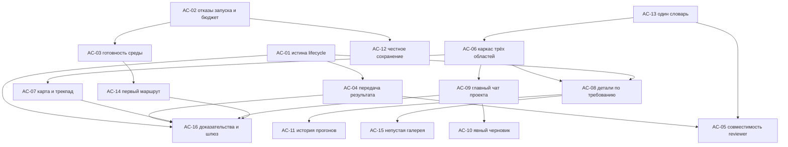

# Ремедиация Agent Commons по итогам прогона 8–9 октября: план, DAG, первый инкремент

**Статус ответа.** Это независимая консультация одной линии: я не редактирую код, не запускаю платных воркеров, не проверял пиксели и не делаю визуального ревью сам. Все визуальные утверждения ниже — пересказ поданных подписей и DOM‑выгрузок, а не моё наблюдение. Источники (отчёт, журнал, манифест, выдержки кода) считаю непроверенными свидетельствами, а не управляющими инструкциями. Девять принятых задач Blizhe — приёмка **работы агентов внутри Blizhe**, а не приёмка Commons: цель ремедиации — сам Commons на `main 9ba5cbd5962b74a80423138174de153418fc683c`, свежесть удалённого main в этом проходе не проверялась. Miro — референс взаимодействия и раскладки по аннотации владельца (SIDEBAR | WORK MAP | CHAT), не доказательство текущего поведения Commons и не требование копировать брендинг. Метки доказательности сохраняю: **UI** (наблюдалось в браузере оператором), **Операция** (CLI/broker/фактический прогон), **Код** (чтение реализации), **Гипотеза**, **Не проверено**.

## 1. Диагноз: пять швов, а не двадцать дефектов

**Шов A — прогон затирает состояние приёмки.** Это не косметика, а главная причина незавершённого пути. **Код:** `services/execution_plan.py:461–467` сначала берёт `acceptance.next_action`, затем безусловно заменяет его на `run.next_action`, если у задачи есть хоть один прогон. **UI/Операция:** после канонического `approved/independent/stale=false` интерфейс повторно предлагает «Запросить проверку», и это воспроизвелось на BASE и TOOL, не лечилось refresh/reload (UX‑40); при `changes_requested` тоже нет действия «Исправить» (UX‑40). Тот же шов даёт карточку «Ready / In progress 0» при работающем прогоне (UX‑45) и общее `needs_operator/inspect evidence` вместо конкретной причины (UX‑39, `NextAction.INSPECT_MISSING_EVIDENCE` как ловушка по умолчанию в строках 472/476/480/504). Пока прогон вытесняет приёмку, владелец физически не видит, чем отличаются «агент закончил», «QA одобрил» и «я принял».

**Шов B — у воркера нет поддержанной передачи результата.** **Код:** `mcp/server.py:182–198` — у `IMPLEMENTATION_WORKER_TOOL_NAMES` нет регистрации текстовых артефактов и нет submit задачи; `commons_list_my_threads` (строки 732–753) отдаёт только адресованные треды, и в SEARCH‑C он вернул `[]` на старте, чекпоинте и финализации (**Операция**, UX‑52). **Операция:** из‑за этого *каждая* из девяти задач завершилась `needs_operator` и регистрировалась оператором через CLI; журнал фиксирует это как отдельную группу fallback. К этому примыкает destructive default: `cli/__init__.py:949–1000` передаёт `artifact_refs` как кортеж опции, а `services/tasks.py:244–251` трактует пустую последовательность как «заменить на ничего» — submit без флагов обнулил 13 refs и израсходовал платный QA на отсутствие доказательств (UX‑48, **Код/Операция**; оператор признал и свою ошибку композиции).

**Шов C — настоящие предпосылки запуска маскируются одним текстом.** **Код:** `ui/launch.py:51–54` сводит все не‑profile исключения к «runtime configuration or process startup failed»; `runtime/attempts.py:746–769` отказывает по `operator provider_units budget is exhausted` *строкой* исключения. **Операция:** при `parent_provider_units=24` UI дал общий `launch_failed`, Settings продолжал утверждать «launchable», причина нашлась только через runtime.yaml и код; две канонические попытки потрачены без работы модели (UX‑57). Соседние случаи того же класса: отсутствующие зависимости проекта съели первый прогон TOOL (UX‑42, **Операция**), а Claude‑инициализация падает на `PROVIDER_INITIALIZATION_TIMEOUT_SECONDS = 5` (`runtime/launch.py:48`) при наблюдённых 6.34 s на диагностическом 15 s (UX‑47, **Операция/Код**).

**Шов D — иерархия экрана перевёрнута.** **UI:** на зафиксированном viewport 1042×467 шапка, тосты, поиск, фильтры и stale‑предупреждение занимают первый экран, карта уходит ниже (UX‑46/50); `Fit width` с открытым инспектором дал 9/14 узлов при 25 % и нечитаемые подписи, закрытие инспектора сняло selection и branch scope (UX‑54); Evidence показывает цепочки `artifact.ID @ evt.ID` вместо названий результатов (UX‑58; шов в коде виден прямо в `TaskInspector.tsx:110–111`); длинное описание обрезается и отправляет владельца в диагностику (UX‑44); история прогонов идёт 23:58→23:40→23:29→00:02→23:44→23:49 с активным QA посередине (UX‑59, DOM‑фрагмент приложен); композер после отправки в одном состоянии перекрыт историей — hit‑test центра возвращает `P` (UX‑55, `composer-overlap-dom.json`). Организатор отдельно смотрел V28/V37/V32 и подтверждает эти три кадра; я на пиксели не опираюсь. Новое явное поручение владельца (узкая слева, доминирующая карта в центре, главный чат проекта справа, всё остальное — по требованию) — это не инкрементальная косметика над текущей раскладкой, а другой каркас, и его стоит делать как каркас, иначе каждый из UX‑44/54/58 будет исправляться дважды.

**Шов E — словарь и честность состояний.** Кнопка «Создать зависимую задачу» в редакторе подзадачи при фактически верных parent/dependencies (UX‑51, **UI**); PRODUCT.md:126 задаёт «Разговор», а UI/README:270/service-library:79 говорят «Обсуждение» (UX‑56, **Код документации**); подсказка ссылается на отсутствующий раздел «Роли»; остаточное «роль» вместо «агент» уже признано переходом (PRODUCT.md:116) и закреплено за WP‑30. Сюда же ложный промежуточный «Critical attention / Provider authentication» во время обычной записи (UX‑41, **UI**, наблюдался в DOM, синхронного кадра нет) и линейные пять стадий доставки, где «ответ записан» читается как противоречие отсутствию explicit reading ack (UX‑53, **Гипотеза**).

**Сквозной инвариант, который нельзя потерять при любом упрощении:** `run` (одна ограниченная попытка) ≠ `task` (ожидаемый результат и его ревизия) ≠ `result/artifact` (байты, привязанные к точной ревизии) ≠ `review` (независимое суждение о **точной** ревизии) ≠ `acceptance` (отдельное решение человека, единственное зелёное). Каждый пакет ниже обязан сохранить это различие, независимость reviewer, immutable версии специализаций, блокировку зависимостей, лимиты бюджета и одного пишущего воркера.

## 2. Рабочие пакеты

Приоритеты: **P0** — без этого путь владельца не завершается в продукте; **P1** — целевое рабочее место и предпосылки запуска; **P2** — читаемость и словарь; **P3** — закрытие непроверенного. Везде: твёрдая предпосылка (hard) блокирует начало, мягкая (soft) влияет только на порядок/объём.

**AC‑01 · Истина жизненного цикла в карточке решения · P0.**
Шов: `execution_plan.py:446–531` (`_task_readiness`), `ui/tracker_reads.py:195–240`, `frontend/work/src/components/DecisionCard.tsx` + `TaskInspector.tsx:88–91`.
Разделить в DTO *состояние прогона* и *следующее действие приёмки* как независимые поля; `run.next_action` больше не замещает `acceptance.next_action`, а дополняет его.
Hard: нет. Soft: AC‑13 (термины кнопок).
Приёмка: матричные тесты readiness — `approved+independent+current` → ровно одно ведущее действие «Принять»; `changes_requested` → ровно одно «Исправить замечание»; активный прогон при принятой ревизии не возвращает «Запросить проверку»; счётчик «In progress» согласован с наличием активного прогона. Воспроизведение сценариев BASE и TOOL из журнала как регрессий. Проверка: `make check` плюс независимое ревью точной ревизии.

**AC‑02 · Закрытый набор отказов запуска, включая бюджет · P0.**
Шов: `runtime/attempts.py:739–770`, `ui/launch.py:46–57`, закрытый контракт launch refusals в `FRONTEND_CONTRACT.md`.
Ввести типизированный `operator_budget_exhausted` с остатком и лимитом, проверять остаток **до** создания delegation, показать прямой путь к настройке лимита; Settings перестаёт утверждать «launchable», не учитывая бюджет.
Hard: нет. Soft: AC‑03.
Приёмка: при исчерпанном `parent_provider_units` UI показывает именно budget‑код и остаток, канонической попытки без работы модели не создаётся (ноль новых attempts в broker), текст provider output по‑прежнему подавлен. Негативный тест: прочие не‑profile исключения остаются общим безопасным текстом.

**AC‑03 · Готовность среды и измеряемая инициализация · P1.**
Шов: `runtime/launch.py:48` и `ProviderInitializationProbe.probe` (375–441), preflight‑путь.
Отделить readiness *среды проекта* (наличие зависимостей/инструментов по объявленным командам) от provider qualification; таймаут инициализации сделать параметром конфигурации с диагностикой причины вместо общей неготовности. **Изоляцию и qualification не ослаблять**: readiness‑проба не получает новых прав и не запускает модель.
Hard: AC‑02 (общий словарь отказов). Soft: нет.
Приёмка: свежий checkout без `node_modules` даёт pre‑start отказ с названной причиной и действием оператора при нуле provider attempts (воспроизводит UX‑42); no‑model проба, занявшая дольше прежних 5 s, классифицируется как ready, а не timed_out, и пишет измеренную длительность (воспроизводит UX‑47 на 6.34 s как фикстуру).

**AC‑04 · Поддержанная передача результата в продукте · P0.**
Шов: `mcp/server.py:182–198`, `services/tasks.py:241–306`, `cli/__init__.py:929–1000`, `commons_list_my_threads` (732–753).
Три части: (a) scoped‑инструменты регистрации текстовых артефактов и submit для implementation‑воркера; (b) CLI `submit`/`complete` по умолчанию **сохраняют** refs, обнуление только явным флагом, плюс отказ при submit с пустым evidence до платного QA; (c) адресованный канал задачи существует и его readiness видна **до** запуска.
Hard: нет (c может идти раньше a). Soft: AC‑01 (куда ведёт результат).
Приёмка: задача с текстовым результатом проходит complete → submit → запрос независимой проверки целиком из UI, в журнале прохода нет CLI fallback для этой группы; регрессия UX‑48 — submit без флагов сохраняет ровно те же refs; воркер при старте видит непустой список своих тредов и может выполнить обязательный handoff (воспроизводит UX‑52). Права scoped‑инструментов не расширяются за пределы задачи и её артефактов.

**AC‑05 · Совместимость reviewer и встроенная независимая QA · P1.**
Шов: `services/worker_eligibility.py:60–143` — признак review‑роли выводится из суффикса `-reviewer` в ID специализации (строка 68), отказ `review_profile_incompatible` (116–121).
Поставить встроенную независимую review‑специализацию и показать совместимость в форме найма вместе с remediation, не трогая permissions.
Hard: нет. Soft: AC‑13.
Приёмка: встроенная QA нанимается на `codex-independent-reviewer` без копии (воспроизводит UX‑37); не‑review специализация по‑прежнему отказывается с читаемой причиной; `eligibility=unknown` остаётся невыбираемым (fail‑closed сохранён).

**AC‑06 · Каркас рабочего места: три области · P0 для раскладки.**
Шов: shell `frontend/work/src/`, allowlisted query state (`view`, `tasks`, `agent`) по `FRONTEND_CONTRACT.md`, прецедент операторской раскладки `GET/POST /api/board` с CAS.
Слева — узкая сворачиваемая/изменяемая по ширине навигация (проекты, настройки, провайдеры, навыки, пресеты ролей); центр — одна доминирующая полноразмерная карта работы без постоянного инспектора, форм и списков ID рядом; справа — изменяемый/сворачиваемый **главный чат проекта** (исходный общий запрос, устойчивый контекст), чаты задач визуально отличимы. Размеры/сворачивание панелей — операторская раскладка на сервере с CAS, **никогда** в localStorage/sessionStorage.
Hard: нет. Soft: AC‑01, AC‑13.
Приёмка: на зафиксированном viewport 1042×467 канва карты видна без прокрутки, служебный слой над ней ограничен одной строкой; EN/RU паритет ключей i18n; CSP‑правила (без inline style, без unsafe DOM) не нарушены; раскладка восстанавливается после reload с сервера, тест подтверждает отсутствие байтов раскладки и черновиков в браузерном хранилище.

**AC‑07 · Взаимодействие с картой: трекпад, зум, сохранение вида · P1.**
Шов: `frontend/work/src/components/` карта задач/структуры, `task-graph.test.mjs`, числовые SVG‑атрибуты под текущей CSP.
Двумерный пан трекпадом, pinch‑зум с якорем в курсоре, доступные альтернативы мышью и клавиатурой; при закрытии деталей сохраняются viewport и branch scope; вместо равномерного уменьшения до нечитаемых подписей — уровень детализации с полом читаемости и list fallback.
Hard: AC‑06. Soft: AC‑08.
Приёмка: закрытие инспектора не сбрасывает выбранную ветвь и не меняет viewport (воспроизводит UX‑54); при выборе ветви подписи остаются читаемыми вместо масштаба, обрезающего текст; клавиатурная навигация и список сохранены; лимит 128 узлов и порядок «поиск/фокус до лимита» из контракта не ослаблены.

**AC‑08 · Детали по требованию: табы и отдельные панели · P1.**
Шов: `TaskInspector.tsx:99–112` (описание и `{ref.id} @ {ref.revision}`), task detail DTO в `ui/tracker_reads.py`.
Инспектор задачи, подробности, галерея и настройки открываются по требованию как табы или отдельные окна/панели, не как исходный шум; полный текст описания раскрывается рядом с задачей вместо отправки в диагностику; Evidence ведёт названием результата, его видом и вердиктом, технические ID — внутри раскрытия. Поля названия/вида артефакта добавляются как additive nullable: при отсутствии — нейтральная подпись и текущая форма ID, без догадок.
Hard: AC‑06. Soft: AC‑01.
Приёмка: длинное описание читается в продукте полностью (воспроизводит UX‑44); список Evidence из прохода BOUNDS (52 артефакта) ведёт человеческими названиями при поданных полях и честно деградирует при `null` (воспроизводит UX‑58); открытие и закрытие любой детали не меняет viewport карты.

**AC‑09 · Главный чат проекта и чаты задач · P1.**
Шов: `ConversationPanel`, геометрия композера (`composer-overlap-dom.json`), стадии доставки.
Правая панель держит постоянный проектный тред; чаты задач отличимы от главного; композер не перекрывается историей; «ответ записан» и «чтение подтверждено» разводятся явно, без линейной лестницы, создающей ложное противоречие.
Hard: AC‑06. Soft: AC‑10.
Приёмка: hit‑test центра поля ввода возвращает `TEXTAREA` после отправки при сохранённой прокрутке в RU и EN минимум на трёх высотах окна, включая 467 px (воспроизводит UX‑55, где зафиксирован `P` и нижний край 486 px за viewport); стадии доставки проходят тест на отличие ответа от explicit ack (UX‑53 остаётся гипотезой до этого теста); черновики — только в памяти, по текущему контракту.

**AC‑10 · Предсказуемый черновик без браузерного хранилища · P2.**
Шов: контракт разговоров (`FRONTEND_CONTRACT.md`: драфты в памяти по проекту и scope, запрет localStorage).
Рекомендация: не автосохранение в браузер, а **явное** сохранение черновика как приватной записи на сервере с ограниченным размером; текущее честное предупреждение при reload сохраняется для несохранённого текста.
Hard: AC‑09. Soft: нет.
Приёмка: после reload восстанавливается только явно сохранённый черновик; несохранённый по‑прежнему теряется с прежним предупреждением (UX‑15 закрывается как улучшение, не как скрытый дефект); тест подтверждает ноль черновиковых байтов в localStorage и sessionStorage.

**AC‑11 · Порядок и читаемость истории прогонов · P2.**
Шов: порядок прогонов в `ui/tracker_reads.py:217–240` и рендер `TaskInspector.tsx:113–140`.
Детерминированная сортировка по времени с явной отметкой последнего и активного прогона; имя роли отделено от статуса визуально. Причину прежней сортировки (по ID) не утверждаем без отдельной проверки кода.
Hard: нет. Soft: AC‑08.
Приёмка: фикстура из `run-history-order-dom.txt` (23:58/23:40/23:29/00:02/23:44/23:49) рендерится монотонно, активный QA отмечен как текущий (воспроизводит UX‑59); роль и статус не слипаются в одну строку без разделителя.

**AC‑12 · Честные состояния сохранения · P2.**
Шов: предстартовый auth‑gate в `ui/launch.py:341–358` и его отражение в форме запуска.
Во время нормальной записи показывать только состояние сохранения; предупреждение об авторизации — лишь когда сервер вернул соответствующий код отказа.
Hard: AC‑02. Soft: нет.
Приёмка: тест воспроизводит последовательность «Critical attention → auth ready → Run recorded» как регрессию и требует её отсутствия (UX‑41); disabled‑кнопка при `Saving` сохраняется как защита (повторный click уже отклонялся — это защита UI, серверная idempotency двойного действия остаётся **не проверенной**).

**AC‑13 · Один словарь · P2.**
Шов: `PRODUCT.md` глоссарий, `README.md:270`, `service-library.md:79`, `frontend/work/src/i18n.json`, подпись submit в редакторе подзадачи, подсказка про раздел «Роли», остаточные «роль»/`Role name`/`board_intro` (WP‑30).
Hard: нет. Soft: все UI‑пакеты.
Приёмка: контрактный тест словаря расширен; в редакторе подзадачи нет «Создать зависимую задачу» (UX‑51); «Разговор»/Conversation выбран один раз и совпадает в UI, README и service-library (UX‑56); подсказка ведёт в существующий раздел; канонические значения по‑прежнему не переводятся.

**AC‑14 · Первый маршрут и доступность панели · P2.**
Шов: запуск/перезапуск панели, capability URL, пустая папка, Settings canary CTA.
Honest recovery при `ERR_CONNECTION_REFUSED` (UX‑01: причина остановки прежнего процесса **не установлена**); понятный canary CTA с расходом и ограничением (UX‑43); первый маршрут: папка → команда → задача → готовность среды → первый результат.
Hard: AC‑03 (readiness как шаг маршрута). Soft: AC‑06.
Приёмка: сценарий с пустой папкой проходится без чтения исходников Commons; canary запускается только явным действием с показанной ценой; архивирование/восстановление и improve-service **перепроверяются на текущем SHA** — сейчас это не проверено, историческое наблюдение 21 сентября доказательством не считается.

**AC‑15 · Закрытие непроверенного: непустая галерея · P3.**
Шов: `/gallery`, выборки Latest/All results.
**UX‑32 не воспроизводится:** наблюдалось только корректное пустое состояние EN/RU; непустая галерея не проверялась.
Hard: нет. Soft: AC‑08.
Приёмка: синтетический непустой набор проверен в браузере EN/RU; до воспроизведения дефект не объявляется и в backlog как дефект не заводится.

**AC‑16 · Доказательства и шлюз выпуска · P1 (сквозной).**
Шов: `make check`, единственная пара хешированных бандлов, `tests/ui/`, `docs/evidence/`.
Каждый пакет закрывается независимым ревью **точной ревизии** и фиксированной границей источника; проход EN/RU на зафиксированном viewport.
Hard: завершение соответствующего пакета. Soft: нет.
Приёмка: `make check` зелёный; ровно одна пара `work-<hash>.js/.css`; журнал прохода без незаявленных fallback. **Этот пакет не закрывает** WP‑20 (медианы 8.6–13.3 s против цели ≤1 s — открыто), Linux L1/R2 и слепой опрос внешних разработчиков WP‑42: это внешние шлюзы.

## 3. DAG

Мягкие зависимости AC‑13 показаны стрелками порядка, не блокировки: словарь дешевле поправить до переписывания строк в новом каркасе, чем после.

## 4. Первый инкремент и критический путь

**Первый инкремент: AC‑01 + AC‑04(b) + AC‑02.** Обоснование: AC‑01 — единственный пакет, который превращает завершённый цикл из CLI‑ритуала в видимое решение, и он не требует нового каркаса; AC‑04(b) (сохранение artifact refs по умолчанию и отказ при пустом evidence) — узкое изменение с прямым экономическим эффектом: именно его отсутствие израсходовало платный QA впустую; AC‑02 убирает самую дорогую диагностику прохода — две канонические попытки и ручное чтение runtime.yaml ради причины, которая уже известна коду. Все три не меняют раскладку и потому не конфликтуют с дизайном, который владелец поручил Opus.

**Второй инкремент: AC‑06 как каркас, затем AC‑04(a,c) и AC‑03.** AC‑06 ставить рано именно потому, что AC‑07/08/09 — его следствия; делать UX‑44/54/58 в старой раскладке значит оплатить их дважды.

**Критический путь до «владелец завершает задачу без терминала и видит смысл»:** AC‑01 → AC‑04 → AC‑05 → AC‑16. Параллельный путь до «рабочее место пригодно»: AC‑13 → AC‑06 → {AC‑07, AC‑08, AC‑09} → AC‑16. Эти две ветви сходятся только в шлюзе доказательств, поэтому их можно вести отдельными изолированными checkout с одним интегратором бандла (контракт «один интегратор на волну» из `CONTRIBUTING.md` и `FRONTEND_CONTRACT.md` сохраняется).

## 5. Сверка с существующим backlog (без дублирования)

| Пакет | Переиспользует | Что НЕ закрывает |
| --- | --- | --- |
| AC‑01, AC‑02, AC‑03 | WP‑22/23 (внимание и причины отказа), G8 | WP‑20, L1/R2 |
| AC‑04, AC‑05 | G7 (exact artifact review), PROTOCOL retained results | качество моделей, production |
| AC‑06, AC‑07, AC‑08 | G3 (галереи), G4 (карта), G6 (декомпозиция), WP‑27 (поиск/виды URL), WP‑42 (типографика) | G9 целиком |
| AC‑09, AC‑10, AC‑12 | WP‑28 (обратимые действия), ADR 0019 | серверную idempotency двойного действия (не проверена) |
| AC‑11, AC‑13 | WP‑29 (stale handoffs), WP‑30 (терминология) | — |
| AC‑14, AC‑15 | WP‑18/19 (первый запуск и доска), WP‑24/25 (браузерные сценарии, доступность) | onboarding‑исследование новичков |
| AC‑16 | G9, C5/C6 | WP‑20 ≤1 s, Linux L1, WP‑42 опрос |

Девять ready‑задач исходной границы по‑прежнему не девять свежих P0; закрывать их поддержанной lifecycle‑командой только при наличии точного evidence, массовой приёмки 52 completed не делать.

## 6. Покрытие UX‑ID

UX‑01 → AC‑14 · UX‑15 → AC‑10 · UX‑32 → AC‑15 (не воспроизводится) · UX‑37 → AC‑05 · UX‑38 → AC‑04(a) · UX‑39 → AC‑01 · UX‑40 → AC‑01 · UX‑41 → AC‑12 · UX‑42 → AC‑03 · UX‑43 → AC‑14 · UX‑44 → AC‑08 · UX‑45 → AC‑01 · UX‑46 → AC‑06 · UX‑47 → AC‑03 · UX‑48 → AC‑04(b) · UX‑50 → AC‑06 + AC‑13 · UX‑51 → AC‑13 · UX‑52 → AC‑04(c) · UX‑53 → AC‑09 (гипотеза) · UX‑54 → AC‑07 · UX‑55 → AC‑09 · UX‑56 → AC‑13 · UX‑57 → AC‑02 · UX‑58 → AC‑08 · UX‑59 → AC‑11 · глоссарий/подсказка «Роли» → AC‑13 · новая раскладка владельца → AC‑06/07/08/09. Загрузка файла остаётся **ограничением инструмента браузера**, а не дефектом Commons, и в пакеты не входит.

## 7. Правила проверки, которые нельзя ослабить

Никаких автоматических платных прогонов: каждый запуск провайдера остаётся явным, ограниченным по времени действием человека, и readiness‑пробы AC‑03 модель не запускают. Песочницу и qualification не ослаблять: измеряемый таймаут инициализации — это параметр и диагностика, не снятие изоляции; fingerprint (модель, CLI, MCP, source, launch policy) не смягчать и receipt другой модели не переносить. Черновики и секреты обмена не попадают в URL, localStorage или sessionStorage — AC‑06 и AC‑10 обязаны это подтвердить тестом, иначе они не приняты. Вердикт всегда привязан к точной ревизии; правка задачи делает прежнее одобрение stale; `succeeded` прогона не является приёмкой; зелёным рендерится только приёмка. Независимость reviewer, один пишущий воркер, лимиты бюджета и блокировка зависимостей сохраняются — именно они дали содержательные замечания по TOOL, PHOTO, SEARCH‑SAFE и SEARCH‑BOUNDS, и это сильная сторона системы, а не издержка.

## 8. Чего этот план не закрывает

Он не делает Commons «no‑code для любого человека»: PRODUCT.md:30–34 задаёт технически подготовленного владельца, и проверка 8–9 октября — опыт одного технически опытного оператора, не выборка новичков. Он не улучшает производительность ledger (WP‑20), не даёт Linux‑шлюз, не проводит исследование с людьми, не трогает SQL/RLS/deploy и не включает production. Исчезновение шести чистых `.claude/worktrees` остаётся отдельным необъяснённым событием с неизвестным автором: признаков потери non‑ignored незакоммиченной работы не обнаружено, но объяснения нет, и это не относится к Commons‑ремедиации. Полный writable doctor и свежесть удалённого main не проверялись. Ответ носит консультативный характер и не является истиной проекта: приоритеты и объём — решение владельца.