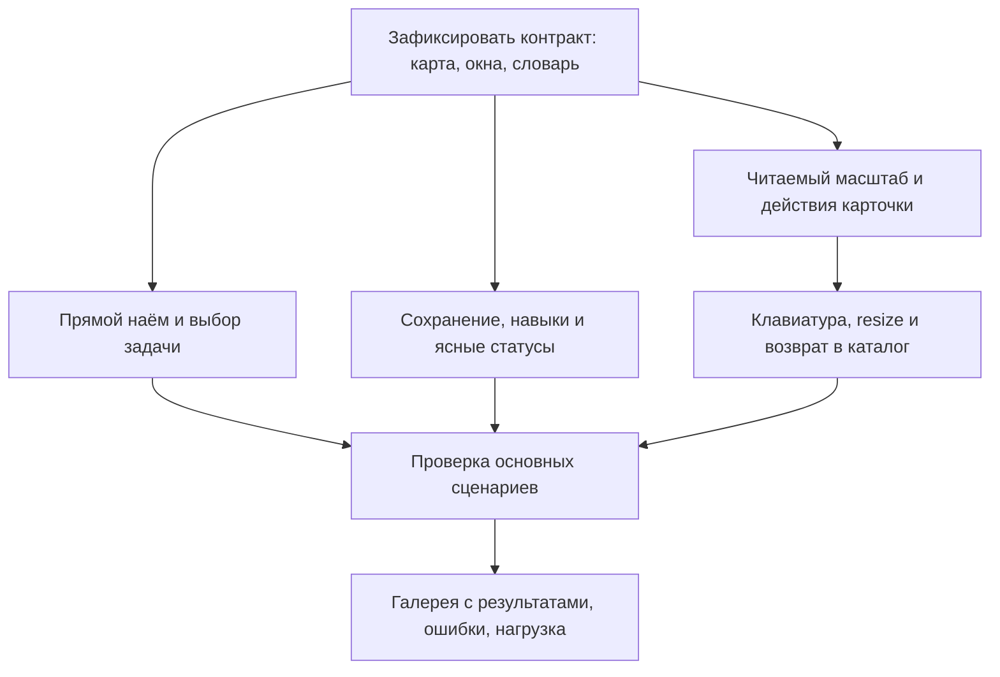

# Независимый дизайн-аудит Agent Commons — 9 октября 2026

Три независимых первых разбора: GPT-6.1 Sol, Claude Sonnet 5.5 и Grok в режиме Expert, который официальный журнал продукта связывает с Grok 4.7. Организатор проверил существенные утверждения по исходникам и в Chrome. Это аудит интерфейса текущей сборки, а не подтверждение исправлений или готовности всех серверных сценариев.

**Вывод:** оболочка и окна уже собраны достаточно устойчиво для разбора задач техническим пользователем. Следующее улучшение должно затронуть рабочие действия и читаемость карты: обзорный масштаб, наём, назначение задачи и клавиатурную навигацию. Подтверждённых P0 в просмотренных состояниях нет. Успешные записи, запуск исполнителей, заполненная галерея и нагрузка этим аудитом не удостоверены.

## Как проходила проверка

- Проверена обычная сборка на `127.0.0.1:8794`, проект Blizhe, 7 агентов и 14 задач. Зафиксированы загружаемые `work-PxYvY7EH.js` и `work-CpKWf9wd.css`.
- Все участники получили одинаковые 25 свежих PNG, DOM, последовательность действий и замороженные 183 файла исходников, тестов и контрактов. Первые ответы не содержали мнений коллег или ожидаемого вердикта.
- Захват сделал организатор в одной Chrome-сессии. Независимы интерпретации трёх моделей, **не три браузерных прогона**. Отдельные контексты не исключают общих ошибок.
- Размеры CSS viewport: 1434×642, 1100×700, 800×600 и 390×675. Основное окно Chrome работало с пользовательским масштабом 80%; его нельзя считать отдельной проверкой всех браузерных масштабов. При override PNG содержит дополнительное тёмное поле за пределами CSS viewport; это не переполнение сайта.
- Заморожены текущие байты рабочей копии, включая незакоммиченные изменения. Git HEAD `9ba5cbd5962b74a80423138174de153418fc683c` сам по себе не описывает проверенный код. [Манифест исходников](source-manifest.json), [архив исходников](source-snapshot.zip), [манифест первого пакета](base-evidence-manifest.json).
- После первых ответов выполнены дополнительные проверки клавиатуры, возврата из инструкции роли и геометрии карточек. Все получили одинаковый пакет анонимных ответов A/B/C и [дополнение](peer-supplement.md). Исправления выводов сохраняются отдельно; первоначальные ответы не переписываются.

## Участники и происхождение ответов

| Метка | Запрошенная модель | Подтверждение и способ запуска | Полный первый ответ |
|---|---|---|---|
| A | GPT-6.1 Sol | Отдельный агент с `model=gpt-6.1-sol`, новый контекст. Отдельный runtime ID моделью не предоставлен | [Sol](sol-first.md) |
| B | Claude Sonnet 5.5 | Claude CLI, `claude-sonnet-5-5` подтверждён `modelUsage`, инструменты только чтения | [Sonnet](sonnet-first.md), [метаданные](sonnet-first-provenance.json) |
| C | Grok 4.7 | Новый чат grok.com, Expert; связь с 4.7 подтверждается [официальным журналом 3 октября](https://grok.com/release-notes/oct-03-2026). Точный backend ID отдельного ответа не раскрыт | [Grok](grok-first.md), [метаданные](grok-web-provenance.json) |

Grok CLI не дал мнения: после устранения проблем локальной песочницы запрос завершился HTTP 402, баланс Grok Build исчерпан. Успешный веб-запуск заменяет эту неудавшуюся попытку и считается одним участником. Настройки безопасности расширения не изменялись: архивы загружены штатным диалогом macOS. У Sonnet CLI предупреждение о неизвестном локальному каталогу имени не помешало запросу; итоговый `modelUsage` подтверждает точную модель. Вспомогательный Haiku в метаданных CLI не считается участником.

Веб-память аккаунта Grok не отключалась: использован новый разговор с инструкцией не обращаться к другим чатам. Это ограничение изоляции. Для второго раунда модели могли узнать собственный текст; собственное повторное согласие не считалось дополнительным свидетельством. [Анонимный пакет](candidates-anonymous.md), [раскрытое соответствие](candidate-mapping.json).

**Второй раунд частичный:** получены [полная рецензия Sol](sol-critique.md) и [полная рецензия Sonnet](sonnet-critique.md). Grok получил запрос взаимной проверки, но вернул недельный лимит до 13 октября и не дал рецензии: [состояние](grok-critique-status.json), [снимок](grok-peer-limit.png). Его первый независимый ответ сохранён и включён в синтез; отсутствующая взаимная рецензия не подменяется другим участником. Уточнение источника raw enum после общего пакета дополнительно передано Sol; организатор проверил первичный код сам.

## Что уже хорошо

1. **Общая композиция соответствует запросу:** тонкая панель разделов, проекты слева, карта в центре, главный чат справа. Вкладки «Задачи / Агенты» находятся рядом; нет возврата к прежней смеси всех панелей.
2. **Деталь задачи не сжимает карту.** Рамка карты до, во время и после окна совпадает: примерно 817.8×435.9. Это доказательство стабильности геометрии; точные pan/zoom до/после отдельно не измерялись. [Измерения](task-modal-geometry.json).
3. **Настройки агента стали компактнее.** Общий каркас четырёх вкладок, предсказуемое нижнее действие, локальная прокрутка. «Основное» помещается и при 800 px. [Экран 03](screenshots/03-settings-general-ready.png), [экран 22](screenshots/22-settings-800.png).
4. **Карточки одинакового размера, инструменты на одной линии.** Все 7 карточек имеют CSS-размер около 264×248; все 6 элементов верхней панели — одинаковые верхнюю координату и высоту около 32 px. У действий присутствуют разные краткие `title`. [Измерения](agent-card-geometry.json).
5. **Модальные окна используют общий native dialog**, закрываются по Esc и возвращают фокус. Настройки и компактный чат проверены наблюдением. Защита от случайного закрытия кликом по фону полезна для форм.
6. **Loading и empty различимы:** настройки, детали задачи и результаты переходят из загрузки в содержимое или честное пустое состояние. Пустая галерея в этой проверке загрузилась успешно.
7. **Готовность не угадывается:** неизвестная доступность действительно названа неизвестной, неподтверждённый исполнитель не объявляется готовым.
8. **Есть основа доступности:** именованные кнопки, вкладки, клавиатурные разделители, списковые альтернативы карт. Это не полная сертификация доступности.
9. **В снятых размерах нет горизонтального переполнения документа**; `scrollWidth == width`. Собственное панорамирование canvas и обрезание узлов внутри карты — другой вопрос.
10. **Текст решения полезно структурирован:** результат, ответственный и следующий шаг видны раньше технических идентификаторов. Единые монохромные иконки и спокойная палитра поддерживают рабочий характер интерфейса.

## Реестр замечаний после проверки оснований

Приоритеты: P1 — мешает основному рабочему сценарию; P2 — заметное неудобство или дефект; P3 — доводка. «Код» означает подтверждённую реализацию, но не исполненный сценарий записи. Подробные шаги, исходные формулировки и компромиссы сохранены в полных ответах.

| ID | Приоритет / основание | Проблема и влияние | Предлагаемое изменение / компромисс | Доказательство и исходные пункты |
|---|---|---|---|---|
| UX-01 | P1, наблюдение | При fit 33–38% задачи становятся схемой с почти нечитаемым текстом. Агентские карточки при текущем масштабе около 46% теряют читаемость и размер действий | Обзорное представление с коротким именем/статусом, отдельный читаемый рабочий масштаб. Цена — меньше деталей одновременно | [08](screenshots/08-tasks-dependencies.png), [12](screenshots/12-task-structure.png), [геометрия](agent-card-geometry.json); A-01, B-03, C §4 |
| UX-02 | P1, наблюдение + код | «Нанять роль» открывает сначала длинный список существующих агентов; форма найма ниже первого экрана | Сразу форма найма; назначение существующего агента отдельным явно названным действием. Цена — отдельный путь выбора | [07](screenshots/07-hire-dialog.png), main.tsx:1875; A-02, B-01; C-11 затрагивает фокус |
| UX-03 | P1, DOM + код | «Дать задачу» зависит от выбранной на другой карте задачи; причина disabled не показана | Открывать выбор задачи либо объяснять точную причину недоступности. Пикер добавляет UI, но делает действие самостоятельным | [DOM 01](01-agents-desktop-ru.dom.txt), ProjectBoard.tsx; A-08, B-02, C-04 |
| UX-04 | P1 для клавиатурного сценария, воспроизведено | При 100% и End активный узел SVG оказывается ниже видимой карты. Фокус меняется, viewBox — нет | Минимальное перемещение камеры, когда keyboard-фокус ушёл за рамку. Не двигать карту при обычном обновлении данных | [26](screenshots/26-keyboard-end-100.png), [измерения](keyboard-map.json); A-09 повышен из гипотезы |
| UX-05 | P2, код; запись не выполнялась | Одинаковое «Сохранить изменения» имеет разную область на вкладках; обычный no-op и запись методов ведут себя по-разному. Dirty-состояние недостаточно ясно | Явная область сохранения и несохранённые изменения по вкладкам; не создавать новую версию без изменений. Сохранить честную раздельность серверных операций | AgentSettings.tsx:27–54, agentSettings.ts:93; A-07 |
| UX-06 | P2 для условия, наблюдение + код | Условие применения навыка — длинный текст в однострочном поле; названия части навыков выглядят как slug | Читаемый редактор условия и согласованные названия каталога. Компонент уже выводит `s.name`: сначала проверить данные, не подменять поле вслепую. Цена — немного больше высоты | [04](screenshots/04-settings-skills.png), AgentSettings.tsx; A-05, C-05 уточнён рецензией A |
| UX-07 | P2, наблюдение | «Новая задача» наследует очень широкое окно, форма занимает левую часть, заголовок и закрытие дублируются | Один заголовок/закрытие, ширина по содержимому. Детали по-прежнему поверх карты, как просил пользователь | [11](screenshots/11-new-task.png); A-04, B-04/17 — частично, без боковой панели |
| UX-08 | P2, наблюдение; причина состояния требует уточнения | Текущая принятая задача, исторический needs_operator и предупреждение об устаревании читаются как противоречивый сигнал | Развести «сейчас» и «история», назвать устаревший источник и способ обновить. Не стирать исторические значения | [DOM 10](10-task-detail-settled.dom.txt), [DOM 08](08-tasks-dependencies.dom.txt); B-05, C-09 |
| UX-09 | P2, наблюдение | «Рабочее пространство и исполнители настроены» соседствует с неуспешной или отсутствующей проверкой отдельных профилей | Раздельная сводка конфигурации и фактической готовности выбранного исполнителя. Не блокировать весь проект из-за необязательного профиля | [DOM 16](16-environment-settings.dom.txt); B-09, C-08 |
| UX-10 | P2, наблюдение | При изменении размера окна сохранённая камера оставляет существенную часть карты за рамкой; при 390 px тулбар занимает много места | Сохранить рабочую точку, дать заметное вписывание в новое окно; компактные действия/список на узкой ширине. Без безусловного auto-fit после каждого resize | [21](screenshots/21-agents-800.png), [23](screenshots/23-agents-390.png), [24](screenshots/24-tasks-390.png); A-03, B-11, C-10 |
| UX-11 | P2, воспроизведено | «Открыть инструкции» переносит под весь каталог из 32 ролей; явного возврата к выбранной карточке нет | Деталь по запросу с возвратом к исходной позиции/фокусу. Не заставлять вручную прокручивать весь каталог обратно | [28](screenshots/28-role-instructions-settled.png), [DOM](28-role-instructions-settled.dom.txt); A §4 |
| UX-12 | P2, наблюдение | Агентов одной профессии трудно различать: назначение находится в мелкой второй строке | Сохранить профессию заголовком, усилить различающее назначение/короткий суффикс. Не возвращать служебное имя вместо профессии | [01](screenshots/01-agents-desktop-ru.png); B-07, C-03 |
| UX-13 | P2, DOM + код | Много одинаково названных icon-кнопок и tab stops; native title не даёт видимой помощи при keyboard focus | Контекст агента в доступных именах, подсказки при focus/hover, выбрать прямые действия и меню. Меню добавляет клик; полный screen-reader проход ещё нужен | ProjectBoard.tsx, Icon.tsx; A-08, B-12, C-03 |
| UX-14 | P3, код | Work/Gallery начинают с EN; выбранная локаль не сохраняется явно | Сохранённый общий выбор языка. Общебраузерное предпочтение распространяется на проекты — это осознанный компромисс | Work main.tsx:293, Gallery main.tsx:156; A-10 |
| UX-15 | P2, наблюдение | «Роль/агент/специализация», «Обновить · сохранить черновик», автоматическое право с обязательным подтверждением требуют расшифровки | Единый словарь; явно отличать обновление данных, удержание локального черновика и запись. Права показывать как заданные и действующие, не скрывать ограничения | [03–06](03-settings-general-ready.dom.txt), [13](13-roles-library.dom.txt); A-06, B-16/18, C-06/07 |
| UX-16 | P3, наблюдение | Пустое состояние результатов перечисляет только изображения/живые интерфейсы, хотя есть отчёты и сборки | Общее empty или текст выбранного фильтра. Это правка текста, не доказательство неисправной галереи | [18](screenshots/18-agent-results-settled.png); A-11, C-13 |
| UX-17 | P3 композиция; P2 ясность следующего шага | Поле главного чата без видимого приглашения, длинная кнопка вложений переносится, UNKNOWN слабо объясняет путь к запуску | Компактная кнопка вложений с именем, подсказка в поле, точные состояния. Не выдумывать причину UNKNOWN и не запрещать запись сообщения без active-получателя | [01](screenshots/01-agents-desktop-ru.png), ConversationPanel.tsx; B-08, C-01 — вывод о блокировке отклонён |
| UX-18 | P3, композиция, не ошибка перевода | В режиме структуры видны raw accepted/ready рядом с локализованными объяснениями | Обсудить перенос canonical value в технические подробности; сам код не переводить. Это выбор уровня деталей | [12](12-task-structure.dom.txt); TaskHierarchy.tsx:40 → DecisionCard.tsx:13–15; B-06 |
| UX-19 | P2 плотность текста | Длинный ожидаемый результат задачи воспринимается как стена текста | Сохранить абзацы/критерии, раскрывать длинный brief. Не скрывать важные критерии проверки по умолчанию | [10](screenshots/10-task-detail-settled.png); B-22, C-09 |

## Спорные решения: что не превращаем автоматически в баг

| Вопрос | Основания за текущее решение | Цена / альтернатива | Итог аудита |
|---|---|---|---|
| Большое окно поверх карты | Прямое требование пользователя; карта не сжимается, фокус управляем | На время скрывает окружение; простые формы могут быть уже | Сохранить принцип. Предложение B-04 вернуть боковую деталь отклонено; геометрию отдельных форм исправлять |
| Drawer при ≤1100 px | Даёт карте полезную ширину | Нельзя одновременно видеть чат; вариант — сначала скрывать проекты | C считает P1, B спорным P2, A — компромиссом. Порог сам по себе не баг; проверить 1100/1101 и реальные окна перед изменением |
| Камера после resize | Сохраняет выбранное место | Часть графа скрывается | Помощь с восстановлением обзора; автоматическое вписывание каждого resize не принято |
| Карточки 264×248 | Предсказуемый лейаут и равные отступы | Мелкие действия при уменьшении; усечение текста | Сохранить геометрическую дисциплину, пересмотреть содержимое и масштаб |
| Заголовок-профессия | Прямое требование пользователя | Несколько инженеров имеют одинаковое название | Различать назначение второй строкой/суффиксом, не отменять заголовок-профессию |
| Владелец и пунктирные связи | Показывают принадлежность проекту, не выдумывают руководителей | Линии за карточками могут выглядеть как иерархия | B-14 — риск прочтения, не доказательство неверной модели. Нужны легенда/выделение; не назначать руководителя по названию роли |
| Все действия прямо на карточке | Быстро мышью для опытного пользователя | Много шума и остановок клавиатуры | Меню для вторичных действий — кандидат для проверки, не обязательное скрытие всех кнопок |
| Отсутствие закрытия по фону | Защита черновиков от случайного клика | Нужно Esc/× | Сохранить; доказательства потери черновика при закрытии нет |
| Два движка карт | Уже реализованы разные модели отображения | Различаются жесты/контролы масштаба (B-15) | Унифицировать пользовательское поведение; переписывать оба движка сейчас не обосновано |
| Светлая/тёмная тема, контраст | Спокойная палитра и единые токены | Светлая тема не осмотрена, мелкий текст проблемен | Не объявлять контраст плохим по впечатлению: #b6b6b6/#252525 ≈7.56:1; это расчёт пары токенов, не полный аудит цветов |

Дополнительные пункты B-13, B-19…21, B-23…24 и C-11…12 сохранены в исходных отчётах: плотность статуса у края, disabled-контраст, повторный глиф, визуальный зазор счётчиков, начальный фокус найма, рамки фильтров, накопление CSS-переопределений и масштабирование DOM. Не все являются подтверждёнными дефектами. Наличие контента ниже сгиба — обычная прокрутка; одинаковый глиф может быть допустим; количество элементов не доказывает торможение. `scrollHeight > clientHeight` у карточки с выступающими handles также не доказывает переполнение текста.

По приоритету UX-04 сохраняется разногласие: Sol оставляет подтверждённый дефект на P2, Sonnet допускает P1/верхний P2; организатор ставит P1 **для клавиатурного сценария** как потерю видимого активного узла. По UX-13 Sonnet предлагает P3 для целевой аудитории, Sol требует сначала живую проходку. В сводке P2 относится к различимости имён и помощи при фокусе; предположение о числе нажатий не выдано за выполненный тест.

## Исправления неверных выводов

- **«Чат не принимает сообщения» не доказано.** В первых кадрах поле пустое. `ConversationState.canSubmit` требует непустой текст; `canWrite` допускает ещё не созданный разговор. UNKNOWN не является запретом записи. C-01 и предложенное условие `active` для Send не принимаются. Не проверены ни успешная отправка, ни её отказ.
- **«Все отступы снова неровные» не доказано.** Текущие размеры и toolbar измерены как одинаковые. Для автоматической раскладки код задаёт `nodesep=48`, `ranksep=72`; старые ручные позиции сохраняются. Аудит не нажимал «Расставить автоматически» и не менял расположение.
- **«Иерархия уже проверена полностью» слишком сильное утверждение.** В этой реальной команде руководители не назначены; пунктир владельца не проверяет дерево руководителей и изменение связей.
- **Сохранение рамки карты не доказывает точное сохранение камеры**, а native dialog и отдельные корректные Escape не доказывают всю доступность.
- **Пустые результаты — не сломанная галерея.** У выбранного агента выборка успешно пуста. Отдельная Gallery и populated preview не открывались.
- **Raw accepted/ready действительно есть, но русский перевод также есть.** Sonnet во втором раунде не установил источник; организатор проследил `TaskHierarchy → TaskState → DecisionCard`, где код и human gloss выводятся намеренно. UX-18 — вопрос плотности и первого уровня текста, а не поломка словаря.

## Предлагаемая последовательность следующей работы

Это предложения аудита, не автоматически утверждённый backlog и не выполненные исправления.

Критерии приёмки ближайшей итерации:

1. При открытии найма первый экран содержит начало создания; назначение существующего агента явно отдельно. «Дать задачу» можно выполнить без угадывания скрытого выбора другой карты.
2. При 14/40/128 задачах и 7/20/50 агентах обзор остаётся осмысленным, рабочий масштаб позволяет читать название и выполнить главное действие. Не обещать все полные карточки одновременно.
3. Arrow/Home/End всегда оставляют активный узел в кадре; Enter открывает нужную задачу; Esc возвращает фокус и рабочую точку. Resize не сбрасывает ручную камеру без причины.
4. Одно окно — один заголовок/закрытие; у вкладок видны несохранённые изменения; условие навыка читается целиком; no-op не создаёт новую версию.
5. Принятая задача, исторический прогон, свежесть данных, конфигурация и готовность исполнителя имеют разные ясные подписи. UNKNOWN остаётся неизвестным до получения оснований.
6. Выполнить отдельный разрешённый прогон с записями на тестовых данных: сообщение/вложение, наём, назначение/смена руководителя, связь, сохранение и конфликт, запуск, реальные результаты всех типов. Добавить светлую тему, browser zoom, вложенные окна, screen reader, длинный чат, ошибки сети и нагрузку. До этого не заявлять полную эксплуатационную готовность.

## Материалы наблюдений

[Последовательность 28 захватов](steps.json), [метод и границы](capture-notes.md), [общая инструкция моделям](shared-brief.md). Первые 25 кадров входят в общий независимый пакет; 26–28 и геометрия добавлены для проверки гипотез. Репозиторий продукта, его конфигурация, реальные задачи и агенты в ходе аудита не изменялись; записаны только материалы проверки и координационные записи.

Проверка документации: `tests/contract/test_documentation_map.py` — 5 passed. Полный `make check` заново не запускался: поведение продукта не менялось, и аудит не заявляет новую зелёную сборку. [Манифест итоговых материалов](manifest.json) закрепляет точные версии отчётов, кадров, метаданных и исходного архива.
