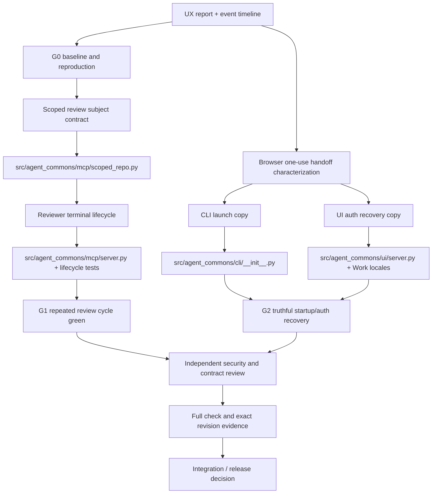

# План remediation по UX-прогону 2026-08-28

Статус: executable plan, подготовлен на `main` `dd65bdb`.

Область этого плана — два блокера из свежего пользовательского прогона:

1. повторное ревью после `Send back to work` не может записать терминальный
   вердикт и оставляет задачу в `review — waiting`;
2. автоматически открытый браузер молча потребляет одноразовый Work URL, а
   последующий экран ошибки предлагает снова открыть уже использованный URL.

Остальные находки отчёта (индикатор `/work`, модели и бюджет, дубли профилей,
сброс языка, усечение карточек, качество мобильного лендинга и Starter Pack)
остаются отдельным backlog и не являются условием этого remediation.

## 1. Входные данные и установленный диагноз

### 1.1. Наблюдаемое поведение

Свежий прогон повторил сценарий:

```text
builder -> review request -> reviewer approved
       -> Send back to work -> builder revises
       -> Send for review -> reviewer never reaches a terminal verdict
```

После возврата сценарий воспроизведён трижды: два раза с Codex reviewer и один
раз с Claude reviewer. Платформенный результат каждый раз был
`needs_operator`/`invalid_result`, а первичная причина —
`LifecycleConflictError: delegated workspace changed after reviewer snapshot
creation`. Запасной операторский путь не маскирует проблему: он заканчивается
`ValidationError: details withheld`. В результате второй `review.completed` не
появляется, карточка остаётся ожидающей, а `Accept` справедливо не принимает
работу.

Отдельно подтверждено, что стартовая страница печатает одноразовый URL и
одновременно автоматически открывает его в default browser. Browser harness
может потребить код до того, как пользователь увидит нужную вкладку. После
этого экран отказа говорит открыть напечатанный URL ещё раз, хотя такой код
уже нельзя повторно обменять.

### 1.2. Причина первого блокера

В `ScopedRepoReader` снимок reviewer строится по результату
`git ls-files --cached --others --exclude-standard`. В пользовательском
репозитории canonical Agent Commons ledger находится в tracked каталоге
`.agent-commons/events`.

Reviewer должен иметь read-only provider permissions и не должен менять subject
работы. Однако терминальные lifecycle-вызовы легитимно записывают canonical
events: `review.completed`, `delegation.succeeded`, а при ошибке —
`needs_operator`. Эти служебные записи попадают в общий файловый снимок.
Следующая проверка `assert_unchanged()` видит уже созданный системой ledger и
ошибочно принимает его за изменение reviewer subject.

Это объясняет обе части сигнала:

- первый вердикт сохраняется, но последующий `delegation.succeeded` может
  конфликтовать с только что записанным событием;
- в повторном цикле любой canonical event между terminal calls делает snapshot
  устаревшим ещё до нового вердикта.

Правильная граница неизменности — предмет ревью, а не журнал его жизненного
цикла. Удалять проверку tamper или разрешать reviewer писать в subject нельзя.

### 1.3. Причина второго блокера

Механизм one-use exchange и очистка fragment до восстановления сессии — часть
правильной security-модели и не меняются. Проблема в handoff contract и recovery
copy:

- CLI сообщает URL, но не сообщает достаточно явно, что default browser будет
  открыт автоматически и может сразу потребить ссылку;
- `--no-browser` существует, но его назначение не вынесено в момент запуска;
- небезопасная подсказка после consumed/expired кода предлагает повторить старый
  URL вместо остановки панели, нового запуска и нового URL.

## 2. Целевое состояние и инварианты

### 2.1. Граф компонентов и зависимостей



### 2.2. Security и lifecycle invariants

| Инвариант | Что обязано остаться истинным |
|---|---|
| Subject immutability | Изменение tracked/registered файла предмета после snapshot блокирует read и terminal action. |
| Ledger liveness | Canonical events, записанные платформой во время lifecycle, не считаются изменением предмета ревью. |
| Exact revision | Reviewer и terminal commands работают только с теми task/review/delegation revisions, которые были выданы при их создании. |
| Independent reviewer | Reviewer остаётся read-only на уровне provider runtime и MCP policy; расширение scope не превращается в write access. |
| One-use auth | Код короткоживущий, одноразовый, не сохраняется и не переиздаётся через UI. |
| Browser truthfulness | Пользователь заранее знает про auto-open и знает, как безопасно выбрать другой browser. |
| Recovery truthfulness | После consumed/expired кода предлагается только новый запуск панели и новый Work URL. |
| Schema stability | Canonical event schemas, public DTO и facade не растут без отдельного контракта. |

## 3. Роли, ownership и границы изменений

Роли — логические, а не приглашение поднимать рекурсивную swarm. В общем
checkout одновременно пишет только один implementation agent; остальные
работают read-only или ждут его handoff.

| Роль | Ответственность | Допустимые пути |
|---|---|---|
| Program lead | Держит этот граф, принимает gates, не смешивает backlog и фикс. | `docs/feedback-remediation-plan-2026-08-28.md`, task/review records |
| Lifecycle implementer | Исправляет subject scope и повторный terminal lifecycle; добавляет регрессии. | `src/agent_commons/mcp/scoped_repo.py`, `src/agent_commons/mcp/server.py`, `tests/mcp/test_worker_scope.py`, связанные lifecycle tests |
| Handoff implementer | Исправляет только startup/auth copy и тесты CLI/Work. | `src/agent_commons/cli/__init__.py`, `src/agent_commons/ui/server.py`, Work locale/contract tests |
| Evaluation lead | Воспроизводит старый failure, гоняет focused tests и полный `make check`. | read-only весь checkout; writes только в test artifacts по claim |
| Independent reviewer | Проверяет exact revision, subject tamper, provider read-only и отсутствие schema/facade growth. | read-only весь checkout; terminal review через Commons |
| Release owner | Проверяет diff, CI, commit boundary и rollback decision. | Git metadata и release evidence после принятия review |

Нельзя одновременно делегировать два write-capable worker в пересекающийся
checkout: это само создаст изменения, которые snapshot не сможет отличить от
ошибки reviewer.

## 4. Исполнительный граф и gates

```text
C0 lead: task active + claims + clean baseline
  |
  +--> W0 reproduction / contract test design
  |       |
  |       +--> W1 lifecycle implementation ----------------+
  |                                                        |
  +--> W2 browser handoff implementation -----------------+--> W3 focused tests
                                                           |
                                                           +--> G1/G2
                                                                 |
                                                                 v
                                                            W4 independent review
                                                                 |
                                                                 v
                                                            W5 full check + release
```

### Gate G0 — baseline

- `main` остаётся на `dd65bdb` до начала реализации;
- исходный feedback report и raw event timeline доступны только как evidence;
- воспроизведение зафиксировано тестом или проверяемым сценарным протоколом;
- claims выданы на каждый изменяемый путь;
- нет активной конкурирующей записи в этих путях.

### Work W1 — subject scope и повторный review

1. Выделить canonical/operational Agent Commons state из reviewer subject
   snapshot. Минимальная граница — `.agent-commons` ledger; `.git` и
   чувствительные служебные пути не должны становиться читаемым review subject.
2. Сохранить существующие проверки абсолютных путей, `..`, sensitive names,
   secrets и registered artifacts.
3. Не принимать событие из ledger как доказательство, что reviewer изменил
   subject; при этом не ослаблять digest check для subject file.
4. Добавить hermetic regression, где между двумя terminal lifecycle calls
   меняются только canonical events и цикл проходит.
5. Добавить соседний regression, где меняется реальный `src/app.py`/registered
   artifact и `repo_read`, `complete_review` или terminal call fail closed.
6. Пройти полный цикл: первая пара review/delegation, `Send back to work`,
   revision, новый review с новой exact revision, новый verdict и успешный
   delegation terminal state.

Ожидаемый результат — не специальный bypass для повторного ревью, а правильная
изоляция системного ledger от предмета, который защищает snapshot.

### Work W2 — browser handoff и recovery

1. При обычном `agent-commons ui` явно напечатать перед/рядом с URL, что панель
   откроется в default browser и что sign-in code одноразовый.
2. Рядом указать: для выбора browser запустить с `--no-browser`, затем открыть
   новый напечатанный Work URL ровно один раз.
3. Сохранить auto-open как default product decision; не заменять его молчаливым
   `--no-browser` и не хранить exchange code.
4. Для consumed/expired exchange изменить safe next action на: остановить
   локальную панель, запустить её снова, открыть новый Work URL один раз в этом
   browser.
5. Синхронно обновить EN/RU Work copy и contract tests. Не показывать raw code в
   логах или error payload сверх уже существующего URL handoff.
6. Проверить, что fragment по-прежнему очищается до restore/exchange и что
   повторный exchange остаётся отказом.

### Gate G1 — lifecycle

Обязательная матрица:

| Сценарий | Ожидание |
|---|---|
| Reviewer читает неизменённый subject | read разрешён |
| Canonical event появляется после snapshot | reviewer terminal lifecycle не получает spurious conflict |
| Tracked subject файл изменён | read/terminal action отклонён с typed conflict |
| Registered artifact изменён | exact digest check отклоняет действие |
| First review approved | `review.completed` и delegation terminal success записаны |
| Work returned and revised | старая approval stale, новая review получает новую revision |
| Second review approved | второй `review.completed` появляется, delegation закрывается, task выходит из waiting |
| Reviewer provider не поддерживает MCP capability | типизированный отказ без `details withheld`-маскировки |

### Gate G2 — auth handoff

Обязательная матрица:

| Сценарий | Ожидание |
|---|---|
| Default launch | UI auto-opens; terminal явно сообщает об этом и one-use коде |
| User chooses another browser | `--no-browser` печатает URL без auto-open и объясняет one-use handoff |
| Code exchanged once | текущая сессия восстанавливается; fragment очищен |
| Code reused/expired | отказ без переиздания и без предложения открыть старый URL |
| Fresh recovery | stop/restart выдаёт новый URL, новый exchange проходит один раз |
| JSON/CLI contract | существующие поля и exit semantics не ломаются без обоснованного изменения |

### Gate G3 — independent review и полный check

- reviewer читает exact task/review/delegation revisions;
- reviewer отдельно подтверждает, что ledger exclusion не допускает subject
  writes и не расширяет provider permissions;
- focused tests проходят;
- `make check` проходит целиком через locked environment;
- diff не содержит изменения `index.html`, если они не нужны для этого
  remediation, и не добавляет feature methods в `CommonsManager`, root CLI или
  `UIContext`;
- Git/CI evidence сохранены до release decision.

## 5. План делегирования

### Делегация A — implementation

Один write-capable worker получает task `task.03K47JY0J17WMN0RHAP67J6C63` и
claims на W1 и W2. В instruction должны быть только bounded acceptance
criteria этого task; worker не трогает старый plan, чужие artifacts, legacy
static UI и не создаёт новых workers. Он обязан сначала прочитать onboarding и
текущие claims, затем:

1. добавить regression для ledger-only mutation и subject tamper;
2. исправить lifecycle scope;
3. исправить CLI/server/locales copy;
4. прогнать focused tests;
5. вернуть task reference и перечисление изменённых файлов без commit/push.

Если worker обнаруживает, что W1 и W2 требуют несовместимых API-решений, он
останавливается после evidence, а не расширяет scope самостоятельно.

### Делегация B — independent review

После W1/W2 и focused checks открыть независимое review ровно на текущую
revision. Reviewer не получает право записи в source checkout и работает с
read-only provider policy. В review instruction явно указать две обязательные
проверки:

- повторный lifecycle после `Send back to work` не конфликтует с canonical
  ledger, но реальный subject tamper по-прежнему блокируется;
- auto-open/`--no-browser` и consumed recovery copy правдивы, one-use auth не
  ослаблена.

Reviewer обязан записать terminal verdict через штатный Commons lifecycle. Сам
факт успешной записи `review.completed` недостаточен: проверяется также
`delegation.succeeded` и отсутствие застрявшего `review — waiting`.

## 6. Тестовый и эксплуатационный контракт

### Минимальные focused проверки

- `tests/mcp/test_worker_scope.py`: ledger-only mutation, subject mutation,
  registered artifact mutation;
- lifecycle test: first review -> return -> revision -> second review;
- CLI UI command tests: default auto-open text, `--no-browser` text, JSON
  compatibility;
- Work app contract tests: consumed/expired copy, fragment clearing, one-use
  exchange.

### Ручная smoke-проверка после тестов

1. В чистой временной папке запустить `agent-commons ui` без `BROWSER` override.
2. Убедиться, что terminal объясняет auto-open до того, как пользователь
   выбирает вкладку.
3. Повторить с `--no-browser`, открыть URL вручную один раз.
4. Попробовать старый URL повторно и проверить truthful recovery message.
5. Через UI создать работу, получить первое approved, отправить на доработку,
   внести изменение, отправить на review снова и дождаться нового approved.
6. Убедиться, что карточка больше не остаётся в `review — waiting` из-за
   служебного event write.

Секреты, exchange codes и содержимое пользовательского landing не попадают в
плановые artifacts или логи проверки.

## 7. Rollback и решение о выпуске

Rollback выполняется только возвратом feature diff к последней проверенной
ревизии; canonical event history не переписывается и не удаляется. Если
lifecycle regression не проходит, release блокируется: нельзя временно
обходить conflict флагом, разрешать reviewer write или принимать старую
approval как новую. Если не проходит только copy test, можно отдельно откатить
текстовый handoff patch, сохранив lifecycle fix, но повторный review всё равно
не выпускается без полного G1.

Решение `ship` допустимо только когда одновременно выполнены G1, G2 и G3.
Фраза «почти» не считается закрытием: критический сценарий — именно второй
review после возврата, а не успешный первый review.

## 8. Доказательства завершения

В task/review record должны быть связаны:

- исходный report и event timeline как evidence;
- список claims и фактический diff;
- focused test output;
- полный `make check` output и CI run;
- independent review с exact target revision;
- финальный lifecycle sequence с двумя `review.completed` и двумя
  успешными delegation terminal states;
- краткое сравнение с feedback: что закрыто, что сознательно оставлено в
  backlog.

Это превращает UX-сигнал в проверяемый граф: evidence -> contract -> bounded
implementation -> independent review -> release gate.
