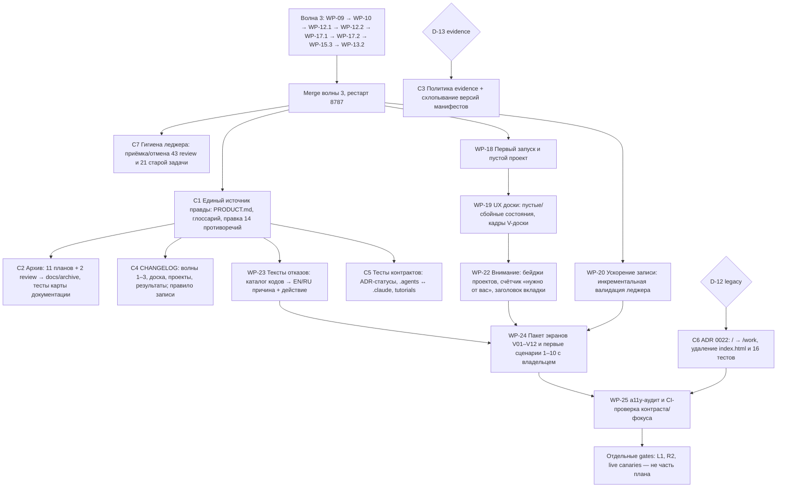

# План: консолидация репозитория и волна 4 UX

```
Status: active                        # решения D-12…D-19 приняты владельцем 2026-09-18
Owner: координатор (Claude Fable), сессия session.8f29684ae9824337a0f29a9ea73fdae9
Opened: 2026-09-18                    Last verified: 2026-09-18
Contract: ADR 0019, 0020, 0021, 0022; docs/FRONTEND_CONTRACT.md; docs/THREAT_MODEL.md
Decision: repo/legacy-panel-retirement, repo/evidence-retention, docs/language-policy,
          docs/archive-location, perf/write-path-target, ledger/hygiene-pass-2026-09,
          ux/wave-order-instrumentation-first, repo/skills-mirror (ids в таблице ниже)
Source boundary: 43b7d8f (main); ветка docs-consolidation; тег archive/2026-09-pre-consolidation
Supersedes: docs/handoffs/2026-09-09-ux-improvement-plan.md (как список направлений);
            раздел «Текущая работа» docs/agent-platform-implementation-program.md
Superseded by: none
Archive trigger: все пакеты волны 4 и C1–C7 приняты или явно сняты; docs/README.md
                 ссылается на один активный план
```

Основание: [аудит репозитория и документации от 18 сентября](../audits/2026-09-18-repository-and-documentation-audit.md)
(карта кода, покрытие фидбэка, противоречия, манифест очистки) и
[фидбэк UX-эксперта от 9 сентября](../handoffs/2026-09-09-ux-expert-dogfooding-feedback.md).
План продолжает [технический план закрытия UX](2026-09-09-ux-closure-tech-plan.md):
его волна 3 не переоткрывается, её порядок и briefs остаются в силе.

## Что показал разбор

Продукт уже другой, чем описывают документы: проект открывается на доске
(ADR 0020), трекер — вкладка «Задачи», Starter Packs удалены, blueprints семь,
у задач появилась каноническая цель (ADR 0021), строки сведены в один реестр.
При этом:

1. Из 13 UX-наблюдений закрыто 2, почти закрыто 2, частично 5, в работе 1
   (WP-09), не начато 3 — и это ровно три пункта первого приоритета фидбэка:
   UX-02 (выбор исполнителя), UX-08 (инспектор), UX-11 (карточка решения).
   UX-12 получил обратную связь при ожидании, но не ускорение записи:
   62–64 % времени `task_create` уходит на двойную валидацию леджера, и у этой
   проблемы нет владельца после решения не фиксировать p50/p95.
2. Ни один кадр V01–V12 и ни один из десяти пользовательских сценариев не
   выполнены. Все evidence трёх волн — JSON-манифесты; протокол review требует
   EN/RU/узкие скриншоты, но никто их не сдавал. Метрики раздела 9 неизмеримы
   без инструментирования (WP-17 стоит последним).
3. Документация противоречит коду в 14 местах (K1–K14 аудита). Самое опасное —
   `AGENTS.md` и `FRONTEND_CONTRACT.md` объявляют UI-asset'ом legacy-панель
   `index.html`, которую продукт внутри проекта даже не отдаёт. Живой backlog
   не связан с картой документации; 11 завершённых планов лежат рядом с
   активным; одно определение продукта повторено семь раз в семи вариантах.
4. Леджер накопил операционный долг: 43 задачи в `review` (медиана 12 дней),
   21 задача до программы висит `active/assigned`, ~60 stale review в
   `doctor`. Это тот же «готово имеет много смыслов», но уже про команду.

Мои дополнения к фидбэку (в нём не было): первый запуск сервиса без проектов;
качество текста типизированных отказов; доска как домашний экран без единого
UX-кадра и сценария; внимание вне открытой вкладки (ничего не сообщает «агент
остановился и ждёт вас»); a11y как проверяемый gate; общий паттерн
undo/restore; поиск по агенту/цели и сохранённые виды; выведение legacy-панели
из продукта как самый большой единичный выигрыш очистки (540K + 16 тестов +
устаревшее правило одного писателя).

## Целевой результат

**Для пользователя.** Первый запуск объясняет, что делать, когда проектов нет.
Открыв проект, человек за секунды видит: что делает команда, где нужен он и что
дальше — на доске, во вкладке «Сейчас», в инспекторе и в карточке решения.
Выбор исполнителя идёт от специализации к доступным исполнителям с честными
возможностями. Ожидание записи не путается с зависанием и в разы короче.
Каждый отказ объясняет одну причину и одно действие. Слова первого уровня —
из одного глоссария, одинаково в UI EN/RU и в документах.

**Для репозитория.** В дереве — только актуальные файлы: код, тесты, один
активный план, ADR, контракты, руководства, `CHANGELOG.md` как структурированная
история. Завершённые планы и review — в `docs/archive/` с штампом статуса;
evidence хранится по явной политике. Каждый факт о продукте живёт в одном
документе; остальные ссылаются. Контракты проверяются тестами
(индекс ADR по статусам, зеркало навыков, карта документации по фактическим
путям).

## Граф реализации



Три потока идут после merge волны 3 и не пересекаются по путям:
консолидация (C1–C7) трогает `docs/**`, `README.md`, `AGENTS.md`,
`CONTRIBUTING.md`, `tests/contract/**` и `.agents/`; волна 4 UX трогает
`frontend/work/**` и `src/agent_commons/ui|services|domain/**`; C6 и WP-20 —
backend. Правило одного пишущего воркера на checkout сохраняется: параллельные
пакеты ведутся в отдельных worktree и вливаются по очереди.

## Пакеты работ

Исполнители по сложившейся схеме: Opus = `claude-builder` (frontend/дизайн,
единственный сборщик Work-asset); Terra = `codex-builder` по
`profiles-terra.yaml` (backend/DTO); Grok = `grok-builder` (механика, профили);
Astra = `codex-independent-reviewer`; Claude reviewer — для Terra. Координатор
выполняет документацию и леджер сам. Каждый запуск ≤60 минут, brief
самодостаточен, claims держит координатор, CLI из sandbox не запускается.

### Поток C — консолидация репозитория и документов

| Пакет | Исполнитель / review | Содержание | Критерии приёмки |
| --- | --- | --- | --- |
| C1 Единый источник правды | координатор → Astra | Новый `docs/PRODUCT.md` (позиционирование, целевой пользователь, глоссарий RU/EN из §5 аудита). Правка K1–K14: `AGENTS.md` → указатель на `CONTRIBUTING.md` + `FRONTEND_CONTRACT.md`; `FRONTEND_CONTRACT.md` переписан Work-first, legacy — приложение; `README.md`, `ROADMAP.md`, `docs/README.md`, `docs/user/*` — доска, Tasks/Agents, семь blueprints, без чисел тестов; индекс ADR по статусам файлов; заголовок статуса (7 строк) у активного плана | grep по «five blueprints/пять», «Work, Team», «~7000», «no npm» пуст; `docs/README.md` — таблица «тема → один документ» со ссылкой на активный план; `make check` зелёный |
| C2 Архив как место | координатор → Astra | `docs/archive/plans/` и `docs/archive/reviews/`; перенос 13 документов из раздела 4.B аудита со штампом статуса, содержимое побайтно; правка входящих ссылок; `test_documentation_map.py` переписан под фактическую структуру; `docs/reviews/README.md` — новые пути при тех же хэшах; тег `archive/2026-09-pre-consolidation` до переноса | Нет битых ссылок (тест проверяет все `.md`); в `docs/` верхнего уровня не остаётся документов со статусом completed/historical |
| C3 Политика evidence | координатор; решение D-13 | `docs/evidence/README.md`: что кладём (интеграционный манифест волны, последняя версия манифеста пакета, скриншоты только доказательного поведения), формат, когда каталог даты закрывается; схлопывание цепочек `-vN` по решению | Правило записано; `doctor` без новых предупреждений; ссылки на удалённые версии заменены на тег |
| C4 CHANGELOG как история | координатор | Записи за волны 1–3, доску (ADR 0020), проекты (ADR 0017), результаты (ADR 0019), удаление Starter Packs, Grok в первом запуске (K9); правило: каждый merge добавляет запись; архивируемый план даёт одну строку | Unreleased отражает `git log` до `43b7d8f`; `CONTRIBUTING.md` требует запись |
| C5 Контракты в тестах | Terra → Claude | Тест: статус каждого ADR в индексе совпадает с строкой `Status:` файла; тест: `.agents/skills` побайтно равен `.claude/skills` (или генерация из одного источника); `tutorials/*` переписаны под UI либо архивированы с правкой `test_tutorial_contract.py`; `artifacts/` в `make clean` | Тесты падают на намеренной порче; `make check` зелёный |
| C6 Вывод legacy-панели | Terra → Claude; решение D-12 | ADR 0022; `/` отдаёт redirect на `/work` (или явную страницу «панель перенесена»); удаление `ui/static/index.html`, `read_spa`, 16 тестов `read_spa`; правило одного писателя уходит из контракта; CSP-nonce путь остаётся только у Work | `agent-commons ui` открывает Work; wheel не содержит `index.html`; `make check` зелёный; THREAT_MODEL обновлён |
| C7 Гигиена леджера | координатор под авторством владельца; решение D-17 | Разовый проход: девять R-задач с одобренными review — принять; остальные `review` — принять или переоткрыть с причиной; 21 pre-programme `active/assigned` — отменить как superseded с ссылкой на WP; stale review и два decision с устаревшим evidence — `event invalidate`/перепривязка (B-02); orphan manifest — invalidate; 104 handoff — acknowledge | `doctor` без warnings о stale review; `task list --state review` содержит только задачи моложе 7 дней; orient показывает реальную текущую работу |

**Ход C7 (18–19 сентября).** Принято 23 задачи с одобренным review на текущей
ревизии. Три задачи с формально одобренным review (`task.5PB4V1924…`,
`task.5Y22M96J…`, `task.753NYMD5…`) сервер отказался принимать: «requires a
current approved independent review» — у них reviewer не независим от авторов
или одобрение относится к другой ревизии. Первая закрыта административно;
две другие **исключены**: на их текущей ревизии уже висит старое неприменённое
событие `task.accepted` (`doctor`: «acceptance event … is stale and was not
applied»), и попытка reopen создала конфликт параллельных переходов — событие
`evt.01M2V4GDKY3KWC0MHM6R9CPFGT` инвалидировано, `doctor` снова `ok: true`.
Урок: перед reopen/cancel проверять, нет ли у задачи неприменённых переходов на
той же ревизии; для этих двух нужен отдельный targeted repair владельца.
Итог прохода (20 сентября, `doctor` ok): принято 23 задачи, закрыто
административно 22 (в том числе две с устаревшими неприменёнными приёмками —
по решению владельца 20 сентября их события `task.accepted` инвалидированы),
отменено как superseded 21 (все pre-programme `active` и `assigned`); в `review`
остались три задачи — план консолидации (эта работа) и две свежие. Подтверждены
33 handoff: адресованные всем и `role:operator` (последние — из одноразовой
operator-сессии, разрешённой владельцем). 73 handoff адресованы ~30 старым
ролям и закрытым сессиям (`merge-cleanup-integrator`, `independent-reviewer`,
`role:maintainer`, `session.…`); их подтверждение потребовало бы выступать от
имени каждой роли и в разрешение не входило — они остаются открытыми до
отдельного решения. Предупреждения `doctor` о stale review/verification не
трогались: это факты о старых ревизиях, а не ошибки; два decision с устаревшим
evidence и orphan-манифест требуют адресного repair владельца.

### Поток W4 — волна 4 UX

Оставшиеся пакеты волны 3 (WP-10, WP-12.1/12.2, WP-13.2, WP-15.3, WP-17.1/17.2)
идут по плану 9 сентября; здесь — только новые пакеты и одна перестановка.

| Пакет | Исполнитель / review | Содержание | Критерии приёмки |
| --- | --- | --- | --- |
| Перестановка | координатор | WP-17.1/17.2 (локальные счётчики) выполняются до WP-24, иначе сценарии с пользователем не измерить | WP-17 принят до первой сессии с пользователем |
| WP-01 Диагностика устаревшего CLI | Terra → Claude | `doctor` различает «установленный CLI старше схем леджера» и повреждение; стабильный код и следующее действие | Тест на `unknown schema` из старого клиента даёт код `cli_outdated`, не `ledger_corrupt` |
| WP-18 Первый запуск и пустой проект | Opus → Astra | Экран сервиса без проектов: одно объяснение, одна кнопка «Создать/подключить»; после создания — пустая доска с двумя действиями «Выбрать шаблон команды» / «Нанять агента»; провайдер не настроен — честное состояние, не блокер создания | Кадры V01, V03 сняты EN/RU/узкий; keyboard-путь; без localStorage |
| WP-19 UX доски | Opus → Astra | Пустые и сбойные состояния доски: конфликт ревизии раскладки, превышение лимита узлов, потеря файла раскладки → автораскладка; кадры доски добавляются в пакет экранов как V13–V14; сценарий 11 «найти агента, дать задачу, открыть результат с доски» | Все состояния покрыты тестами `board-state`; кадры сняты; ничего не двигает canonical lifecycle с клиента |
| WP-20 Ускорение записи | Terra (backend) → Claude; Grok — повтор бенчмарка | Инкрементальная валидация: кэш проверенного префикса леджера по (event count, sha) внутри write-lock, повторная полная проверка только при расхождении; отдельно — чтение receipts один раз на запись. Цель — инженерная (D-16), не продуктовый SLO | `benchmark_work_mutation.py`: warm `task_create` ≤1 с на 3 206 событиях (сейчас 33 с) при неизменных инвариантах; тесты повреждения кэша → полная проверка; `doctor` неизменен |
| WP-22 Внимание вне вкладки | Opus → Astra | Бейдж «нужно от вас N» на строке проекта в сайдбаре и в `<title>`; строка «Сохраняется в другом проекте» из матрицы состояний; счётчик читается из одного snapshot, без polling-шторма | DTO additive; отсутствие поля → бейдж не рисуется; тесты EN/RU/a11y (live region без churn) |
| WP-23 Тексты отказов | Terra (каталог) + Opus (рендер) → Astra | Каталог typed refusal codes (409/422/broker) → одна причина + одно действие EN/RU в реестре строк; bounded stderr — в раскрытии, не в первой строке; правило длины и тона в `FRONTEND_CONTRACT.md` | Каждый код из каталога имеет строку в обеих локалях (тест); неизвестный код → нейтральная строка, не пусто |
| WP-24 Пакет экранов и первые сценарии | координатор (съёмка через in-app browser на синтетическом проекте) + владелец как первый участник | V01–V14 EN/RU/узкий с указанием commit, asset, viewport, шагов; сценарии 1–10 с владельцем и одним внешним участником; baseline метрик раздела 9 через WP-17 | `docs/evidence/<дата>/screens/` с README; отчёт `docs/audits/<дата>-usability-round-1.md`; список дефектов → задачи |
| WP-25 a11y как gate | Opus → Astra | Аудит контраста/фокуса/порядка/имён на наполненных экранах; node-тест на контраст токенов (ratchet) и на фокус после мутаций; исправления | Ноль нарушений AA на текстах; CI падает при регрессии |
| WP-27 Поиск и виды | Opus → Astra (после WP-09) | Фильтры по агенту и цели, нечёткий поиск по названию, сохранённый вид в allowlisted URL | Сценарий «7 из 9» из UX-07 находит 9 |
| WP-28 Undo/restore как паттерн | Terra + Opus (низкий приоритет) | Единый контракт archive/restore для задач, агентов, blueprints и рамок доски; один компонент подтверждения | Все обратимые операции используют один паттерн и один текст |
| WP-30 Слово «агент» вместо «роль» в оставшихся строках UI | Opus → Astra (замечание review плана, 20 сентября) | В реестре строк `frontend/work/src/i18n.json` переименовать пользовательские тексты, где нанятый экземпляр ещё называется «роль»: `Role name`/«Название роли», `Create role`/«Создать роль», `role_model_help` («именованной роли»), `board_intro` («нанимайте роли») и все строки с тем же смыслом в обеих локалях; ключи и canonical-значения леджера (`agent`, `role_id`) не меняются; руководства EN/RU обновляются той же партией | grep по «роль»/«role» в user-facing значениях `i18n.json` даёт только упоминания специализации и леджера; тест паритета EN/RU зелёный; словарный тест контракта запрещает новое слово «роль» для нанятого агента; кадры формы найма и доски EN/RU |
| WP-29 Устаревание handoff без живого адресата | Terra → Claude (решение владельца 20 сентября) | Handoff, адресованный роли, у которой нет активной сессии дольше N дней, или закрытой сессии, получает состояние `stale` в проекции и не попадает в inbox; operator-сессия может переадресовать или подтвердить его явно; правило записано в `docs/PROTOCOL.md`; история не переписывается | 73 открытых handoff июля–сентября уходят из inbox всех текущих ролей без записей «от имени» чужих ролей; тесты проекции на оба пути (stale и переадресация); `doctor` без новых предупреждений |

## Решения владельца (приняты 18 сентября 2026)

Владелец ответил на запрос координатора 18 сентября; все восемь решений
записаны в леджер как accepted со ссылкой на этот план.

| ID | Вопрос | Решение | Canonical decision |
| --- | --- | --- | --- |
| D-12 | Legacy-панель `index.html` | Вывести: ADR 0022, redirect `/` → `/work`, удаление asset и 16 тестов | `repo/legacy-panel-retirement`, decision.719S9ZV8HZ9G9YNR4WV02KGAQK |
| D-13 | Evidence | Интеграционный манифест волны + последняя версия манифеста пакета; старые версии — только в теге `archive/2026-09-pre-consolidation`; политика в `docs/evidence/README.md` | `repo/evidence-retention`, decision.0R0KX5QG0BYBSGHJXPYXH9GEQ2 |
| D-14 | Язык документов | Контракты и ADR — EN (0020/0021 получили EN-резюме); планы/аудиты/handoff — RU; руководства — EN и RU | `docs/language-policy`, decision.1VD06WKYZSS7R3J4FJWMPCQ2Z1 |
| D-15 | Архив — место | `docs/archive/{plans,reviews}`, штамп статуса, содержимое побайтно | `docs/archive-location`, decision.53MWND3SQNX2S58N12YDKWJWY5 |
| D-16 | Стоимость записи | Инженерная цель WP-20: warm `task_create` ≤1 с на 3 206 событиях; продуктовый SLO не фиксируется | `perf/write-path-target`, decision.46WMB9XKCDJ87HD58PGQZHXWVG |
| D-17 | Гигиена леджера | Разовый проход C7 под авторством владельца | `ledger/hygiene-pass-2026-09`, decision.1H8KMRVD0A45BAXS1A1D9DYF6J |
| D-18 | Порядок волн | WP-17 до WP-24; WP-13.2 последним в волне 3 | `ux/wave-order-instrumentation-first`, decision.2FSV7F0M7M1628BAB9GXNFVRXR |
| D-19 | Зеркало навыков | Оба каталога остаются, тест на дрейф | `repo/skills-mirror`, decision.3ZHZ9B75A4T62D745J8HTS0JMY |

Ранее принятые решения 8.1–8.8, D-9…D-11 и `ux/latency-thresholds` не
переоткрываются.

## Порядок и границы

1. **18 сентября (решение владельца «начать сейчас»):** C1, C2, C4 и черновик
   ADR 0022 выполняются в отдельном worktree `agent-commons-docs-consolidation`
   на ветке `docs-consolidation` от `main`; C7 идёт параллельно в леджере.
   Основной checkout не трогается: волна 3 держит claims на `frontend/work/**`
   и незакоммичена. Файлы, которые правит волна 3 (`docs/FRONTEND_CONTRACT.md`
   — три строки о `objective_id`, `docs/plans/2026-09-09-ux-closure-tech-plan.md`,
   `docs/THREAT_MODEL.md`), сливаются при merge; контракт уже содержит эти
   строки.
2. **Порядок merge (решение владельца 20 сентября):** сначала волна 3, затем
   PR #14 `docs-consolidation`; конфликты в `docs/FRONTEND_CONTRACT.md` и в
   руководствах разрешает координатор консолидации в документационной ветке,
   не трогая код волны. **После merge волны 3:** merge PR #14, затем C3 (удаление
   устаревших версий манифестов), C5 (тесты контрактов) и C6 (ADR 0022 в коде,
   Terra); параллельно WP-20 (Terra, отдельный worktree).
3. **Затем:** WP-30 (переименование «роль» → «агент», короткий пакет Opus) →
   WP-18 → WP-19 → WP-22 → WP-23; WP-17 до WP-24.
4. **Не в этом плане:** L1/R2, live canaries, API/SGR (ADR 0018) — отдельные gates.

## Риски

| Риск | Как закрываем |
| --- | --- |
| Перенос документов ломает ссылки и тесты | Один коммит на перенос + правку ссылок; тест на все `.md`-ссылки; тег до переноса |
| Удаление legacy-панели ломает скрытый сценарий | ADR 0022 перечисляет маршруты; redirect вместо 404; smoke wheel в CI |
| WP-20 меняет инварианты леджера | Кэш только ускоряет проверку и никогда её не заменяет при расхождении; `doctor` и golden replay неизменны; independent review Claude |
| Массовая приёмка в леджере скрывает реальные незакрытые работы | C7 принимает только задачи с approved review на текущей ревизии; остальное — reopen с причиной |
| Волна 4 снова уходит в манифесты без экранов | WP-24 — отдельный пакет с владельцем; кадры — критерий приёмки WP-18/19/22 |
| Документы снова расходятся с кодом | Факты о продукте живут в одном месте и проверяются тестами (C5); заголовок статуса с `Last verified` |

## Чек-лист

- [x] Проверить doctor, orient, inbox, tasks, claims; зарегистрировать отдельную сессию.
- [x] Составить карту кода, манифест очистки, список противоречий, покрытие фидбэка.
- [x] Удалить локальные игнорируемые кэши (`.playwright-mcp`, `benchmarks/__pycache__`).
- [x] Получить решения D-12…D-19 (18.09, записаны в леджер).
- [x] Тег `archive/2026-09-pre-consolidation` на `43b7d8f`; worktree `docs-consolidation`.
- [x] C1: `docs/PRODUCT.md`, README, AGENTS, CONTRIBUTING, ROADMAP, FRONTEND_CONTRACT,
      ARCHITECTURE, руководства, индекс ADR, EN-резюме ADR 0020/0021, `docs/evidence/README.md`.
- [x] C2: 18 планов и 13 review/аудитов перенесены в `docs/archive/`, ссылки и тест карты.
- [x] C4: CHANGELOG дописан за август–сентябрь; правило записи в CONTRIBUTING.
- [x] ADR 0022 (черновик, принят владельцем; реализация — C6).
- [x] `make check` в worktree на Node 24 зелёный (2620 python, 14 документированных
      пропусков, оба frontend-набора, ruff); новые тесты `test_repository_mirrors.py`.
- [ ] PR `docs-consolidation` (по команде владельца: коммит, PR, CI).
- [ ] Merge волны 3 и рестарт 8787 (по команде владельца); merge `docs-consolidation`.
- [ ] C7 под авторством владельца; `doctor` без stale-предупреждений.
- [ ] C3, C5, C6 после merge.
- [ ] WP-20 (Terra) параллельно; бенчмарк до/после.
- [ ] WP-17 → WP-18 → WP-19 → WP-22 → WP-23 → WP-24 → WP-25; кадры V01–V14.
- [ ] Первая сессия с пользователем; отчёт; backlog дефектов в задачи.
- [ ] Архивировать этот план по триггеру из заголовка.
