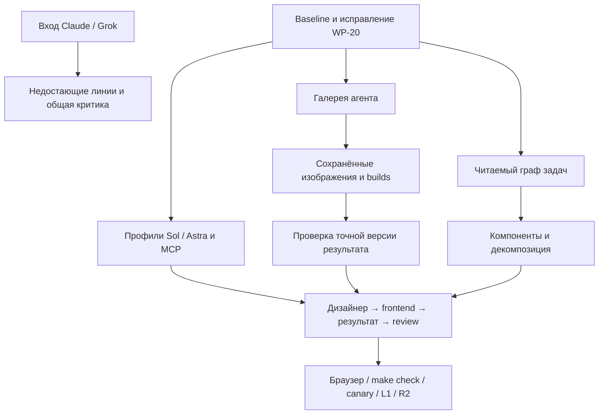

# План: GPT-6, галереи агентов и граф разработки

```text
Status: active; консилиум 5/5, Astra pin, G5/G6/G7 и make check проверены; G1/G2, G5/G7 и G6 accepted после независимого review; WP-20/L1/human gates открыты
Owner: product-completion-lead; task.5KX5GZJSWZY9N6GBND09FX1223 (G1/G2)
Opened: 2026-10-01; Last verified: 2026-10-01
Contract: PRODUCT.md, FRONTEND_CONTRACT.md, BROKER_OPERATIONS.md; запрос владельца 2026-10-01
Source boundary: aa9d373 плюс исходные рабочие изменения; ../evidence/2026-10-01/council/source-boundary.json
Supersedes: none; дополняет действующие планы новой продуктовой целью и миграцией
Archive trigger: пакеты ниже проверены и приняты, внешние blockers закрыты либо явно сняты владельцем
```

Этот документ владеет последовательностью исполнения запроса 1 октября. Он не
обнуляет [волну 4](2026-09-18-consolidation-and-wave-4-plan.md) и
[технические пакеты UX](2026-09-09-ux-closure-tech-plan.md): их номера и
канонические задачи переиспользуются. Архивные планы объясняют прошлые решения,
но не создают новые обязательства. Подробные исходные мнения и критика доступны в
[завершённом консилиуме](../evidence/2026-10-01/council/after-login/README.md).

## Результат, который должен увидеть владелец

Технически сильный разработчик открывает проект, видит агентов и работу команды.
Нажатие на имя/значок агента открывает его собственные результаты. У дизайнера
видны макеты, у frontend-инженера — опубликованные изображения и доступные
приложения. Принадлежность определяется подтверждённым автором результата,
а не названием специализации. Из результата можно перейти к задаче и увидеть
точную версию, автора, прогон и состояние проверки.

Карта задач объясняет зависимости, позволяет искать и выделять связанную часть
большого проекта, менять масштаб и открывать инспектор. Декомпозиция и
зависимость — разные отношения: «часть компонента» не означает «ждёт другую
задачу». Приёмка, проверка, выполнение и запуск остаются различными фактами.
Зелёный означает только принятую работу.

Главный критерий рабочего состояния — воспроизводимый путь:
дизайнер → две версии макета → frontend build → собственные галереи агентов →
граф → проверка точной ревизии → решение владельца. После изменения задачи и
перезапуска приложения историческая работа не превращается в новую, старое
одобрение не переносится, недоступный preview честно обозначен.

## Что уже сделано, а что нельзя считать готовым

На исходной границе `doctor` проверил 4 212 событий и 418 манифестов без ошибок.
173 предупреждения требуют разбора по актуальности, а не массового удаления.
304 задачи распределены так: 173 accepted, 52 completed, 69 cancelled, 9 ready,
1 review. Completed не эквивалентно принятому результату. Активных сессий и
claims до начала этой работы не было, но оставались одна active и одна requested
делегация из прошлых запусков; состояние процесса надо проверять отдельно.

| Область | Подтверждённая основа | Остаток |
| --- | --- | --- |
| Core/storage | Неизменяемая история, revision-aware review/acceptance, восстановимые проекции, idempotency, claims | WP-20 own-append/RLock интегрирован и проверен Grok; полная задержка 8,6–13,3 с ещё выше цели; устаревшие предупреждения не равны дефектам |
| Runtime | CLI-адаптеры Codex/Claude/Grok, scoped MCP, preflight, canary, stop reasons; WP-40/41 accepted; авторизация Claude/Grok восстановлена | Astra frontend-run и итоговая квалификация подтверждены, постоянный pin установлен; Linux L1/R2 остаётся внешним gate |
| Board | React Flow, карточки агентов, связи, раскладка, разговоры, переход к задачам; постоянный вход в личную галерею независимо от счётчика | Два настоящих worker images и frontend проверены; новый retention/build/review сценарий также проверен отдельно |
| Outputs | Выборка по task/producer agent, проверка image bytes, история метаданных, временные live URLs; визуальные карточки, фильтры, переход в задачу и provenance | CAS-байты, ZIP builds и exact-result review интегрированы; замечания review исправлены, Chrome и реальные artifact reviews прошли |
| Task Tracker | Сейчас/Карта/Все, dependency DAG, редактирование, readiness, инспектор, review/acceptance; поиск/масштаб и подграф до лимита 128 | Component/parent-child и отдельная карта структуры интегрированы; legacy wire-shape и очистка формы исправлены и проверены |
| Library/context | Навыки, специализации, blueprints, pinned skills/context packs | Актуальность preset eligibility и каталога проверять по текущему коду; не возвращать удалённые Starter Packs |
| UX wave 3 | WP-02…17 в основном приняты; WP-15.2 уже accepted | Старое упоминание WP-15.2 как хвоста в плане не основание реализовать его заново |
| Wave 4 | WP-40/41 закрыли прежние run-path проблемы | WP-18/19/20/22/23/24/25/27/28/29/30/42 и C5/C6 сверять с реализацией; никаких автоматических приёмок |

WP-20 особенно важен: в рабочем дереве уже есть lock-scoped verified ledger view
и bulk receipt loading. План от 23 сентября отстаёт от файлов. Вместо второго
исполнителя на ту же задачу — точечная проверка, устранение найденных дефектов,
benchmark и независимое review. Текущая цель ≤1 с на 3 206 событиях остаётся
инженерным gate; прежние 33 с не выдаются за новое измерение.

## Где записан опыт и как им пользоваться

| Источник | Что извлекать | Ограничение |
| --- | --- | --- |
| `finding list` | Наблюдавшийся дефект, доказательства, урок | Даже reported/non-stale finding может описывать уже исправленный код; нужна сверка |
| `decision list` | Принятые ограничения и альтернативы | Сообщение или голосование не заменяет decision |
| `docs/handoffs/` | Контекст, незавершённые действия, прошлые отказы | Handoff не доказательство поставки |
| `docs/evidence/`, `docs/reviews/` | Точную проверенную границу и независимость | Старое review не покрывает новую ревизию |
| `docs/audits/`, `docs/archive/` | Мотивы, ошибки и отвергнутые дорогие подходы | Не копировать исторические P0 в текущий backlog без воспроизведения |
| AGENTS/CONTRIBUTING/FRONTEND_CONTRACT | Уроки, ставшие рабочими правилами | Один владелец факта, ссылки вместо копий |

Уроки, уже применённые в этой работе: использовать CLI checkout, выбирать
зарегистрированный state root, сохранять исходные правки, не путать законченный
процесс с terminal outcome, не запускать review на движущемся checkout,
проверять обе стороны строгого DTO, запускать закреплённый Node, не применять
старый MCP wheel после правок `src/**`. Прежняя коллизия provenance объясняет,
почему сохраняются полные независимые ответы, а отсутствующие модели не
заменяются вымышленными голосами.

## Выбор модели и миграция

Для первого перехода рекомендован **GPT-6 Astra** на **Codex CLI 0.159.3**: эта
комбинация прошла отдельные builder и independent-review canaries с одним
корректным terminal outcome в каждом. GPT-6.1 Sol остаётся кандидатом для
ограниченной реализации и снижения стоимости. На новом CLI первый Sol canary
завершился needs_operator, следующий диагностический — успешно; причина первого
расхождения не установлена. Такой результат не даёт объявить протокол устойчивым.

Первоначальная гипотеза консилиума была Sol для реализации / Astra для review.
Для первого эксплуатационного шага Astra имеет также проверенный настоящий
frontend pilot. Новые canaries на объединённом коде обнаружили у Astra builder
тот же класс terminal mismatch: недоступный CLI и затем подмену state-root
пользовательским login shell. Это дефекты окружения/onboarding, а не доказанный
недостаток модели. Исправление передаёт точный контекст запуска явно. Причина
прежнего первого отказа Sol ретроспективно не установлена. Малые canaries
проверяют совместимость и не позволяют ранжировать качество или устойчивость
Astra против Sol; для этого нужен одинаково подготовленный project eval. Возможности Astra описаны в
[официальном руководстве](https://developers.openai.com/api/docs/guides/latest-model).
Официальное описание Sol рекомендует его для сложной разработки при меньшей
стоимости; проверка на собственных задачах обязательна.
[OpenAI: GPT-6.1 Sol](https://developers.openai.com/api/docs/models/gpt-6.1-sol).

Проект запускает CLI; прямого OpenAI API в текущем runtime нет. `model` уже
проходит валидатор и передаётся в `--model`. Поэтому миграция начинается с
точного pin в **операторском** YAML, а не с переписывания backend на Responses:

```yaml
profiles:
  codex-builder:
    # Остальные существующие executable/MCP/permission поля сохраняются.
    model: gpt-6-astra
  codex-independent-reviewer:
    model: gpt-6-astra
```

Это фрагмент изменения существующих профилей, не самостоятельный runtime file.
Пин профиля действует только при отсутствии модели у самого нанятого агента:
`roles.role_model()` читает `extensions.model`, а
`delegation_runtime._profile_for()` подставляет её поверх профиля. Поэтому
переход включает инвентарь **эффективных моделей агентов**, явный выбор для
каждой запускаемой роли и проверку фактической launch-конфигурации. Исторические
запуски и принятые результаты не переписываются.

Проверка пяти активных ролей этого проекта после восстановления входов не
обнаружила `extensions.model`: сейчас они наследуют профиль. Два Codex-агента
используют `codex-builder`; существующий независимый reviewer — Claude. Поэтому
пин Astra reviewer сам по себе не переводит Claude-роль на Codex: для пилота
нужна отдельная явная роль, без переименования истории. Снимок роли и ревизии —
[agent-model-inventory.json](../evidence/2026-10-01/council/after-login/agent-model-inventory.json).

Qualification fingerprint включает модель, CLI, MCP, source и launch policy,
но хранилище сейчас держит один JSON на profile ID. Проверка другой модели того
же профиля заменяет предыдущий receipt. Для одиночного пилота достаточно
последовательно квалифицировать точную следующую конфигурацию. Для устойчивого
одновременного использования нескольких моделей потребуется отдельное изменение
ключа хранения и тесты; ослаблять fingerprint или переносить receipt другой
модели нельзя.

Текущий код не имеет поля reasoning effort в profile: не добавлять туда
неподдерживаемый YAML. Для управляемого effort нужен отдельный типизированный
контракт, allowlist, CLI mapping, тесты и изменение qualification fingerprint.
Сейчас при переходе сохраняются штатные настройки CLI и границы профиля.

Последовательность переноса:

1. Снять hash исходников, executable, profile и текущих qualification receipts;
   зафиксировать модель профиля и override каждого участвующего агента.
   Сохранить предыдущий YAML для rollback; не менять credentials/billing mode.
2. Установить CLI 0.159.3 в отдельный версионированный операторский каталог
   (версионированная постоянная установка проверена), сохранив старый executable
   для rollback. В отдельном candidate YAML pin Astra builder и reviewer. Проверить `broker preflight`
   каждого профиля: help, scoped snapshot, MCP handshake и точный каталог.
3. После изменений Python удалить только disposable `build/`, переустановить
   uv-tool из этого checkout и повторить preflight. Старый installed MCP уже
   дал отказ `mcp_tool_contract_failed` при новом candidate profile; это не
   свидетельствует о качестве модели.
4. Один bounded live canary на профиль, затем один настоящий небольшой
   frontend-run с публикацией результата и terminal outcome. Успех прямого
   подагента Codex не квалифицирует Commons broker.
5. Переключить действующий операторский профиль на квалифицированную Astra
   после прохождения gates, сохранив предыдущую конфигурацию для отката.
   Перед последующим переходом на Sol сравнить модели на одинаковых задачах ниже. Не переписывать модели исторических задач и принятых результатов.
6. При регрессии вернуть предыдущий профиль и проверить его receipt на текущем
   source fingerprint; старый receipt автоматически не становится актуальным.

Если позднее будет отдельный API-адаптер: Astra/Sol требуют Responses для tools,
не поддерживают `none`/`minimal`; `low` — начальная замена этих уровней.
Sampling-параметры при reasoning удаляются. Это отдельная будущая миграция,
не требование к текущему CLI.
[OpenAI: migration](https://developers.openai.com/api/docs/guides/latest-model#gpt-6-astra-update-api-and-model-parameters).

| Project eval | Проверяемое поведение | Gate |
| --- | --- | --- |
| DTO → parser → UI | Аддитивное поле и обе локали | Нет отказа строгого parser, неизвестные поля не получают authority |
| Receipt/retry | Потеря ответа, exact retry, конфликтующий legacy tombstone | Честный отказ/сходимость без false ok |
| Graph/UI | 1/20/128/304 задач, длинные названия, diamond, cycle | Читаемый подграф, клавиатура, accepted отдельно |
| Build → output | Реальный файл/build, публикация, завершение MCP | Проверяемый результат + один terminal outcome |
| Независимое review | Посеянный дефект точной ревизии | Дефект обнаружен, verdict привязан, нет ложного approval |

Метрики: first-pass success, пропущенные дефекты, вмешательства, wall time,
terminal mismatch, фактическая стоимость только при доступном измерении.
Provider units — число запусков, не деньги. Luna остаётся опцией для ограниченной
механики после eval; переводить на неё весь runtime не предлагается. Claude
сохраняется для независимой проверки и UX, Grok — для ограниченных пакетов после
повторной проверки terminal-контракта. Публичные benchmark-цифры не заменяют эти
измерения и здесь не выдумываются.

## Реестр блокеров и конкретные пакеты

| Пакет | Приоритет / зависимость | Действие и критерий выхода |
| --- | --- | --- |
| G0 Baseline + WP-20 | Корректность проверена; performance открыт | Полный make check и review прошли; исправлены legacy abandonment и resolved-path cache. Диагностические замеры не подтверждают ≤1 с |
| G1 Авторизация и пять участников | Завершён | Пять независимых первых ответов и пять общих критик получены; оригиналы, идентичности, восстановленные попытки и разногласия сохранены. Это не приёмка продукта |
| G2 Pin GPT-6 + broker | Astra закреплена в двух Codex-профилях; rollback сохранён | CLI 0.159.3, canaries builder/reviewer и реальный frontend-run с terminal 1/1/0, двумя worker images и настоящей галереей. Первая provisioning-неудача сохранена. Sol требует отдельного ограниченного eval |
| G3 Вход и интерфейс галереи | Реализован и проверен ограниченный UI-пакет | Имя/аватар → gallery при 0/ошибке count; verified thumbnails, type/history filters, задача и provenance; EN/RU, узкий экран, Esc/focus, stale/failed честно. Долговечность отдельно в G5 |
| G4 Карта для текущих задач | Реализован и проверен ограниченный UI-пакет | Поиск, zoom/fit, focus малого подграфа при >128 общих задачах, зависимости по серверу, нейтральный completed, list fallback. Декомпозиция отдельно в G6 |
| G5 Долговечный результат | Accepted после независимого exact-revision review; task.01V3HM0QMDRQGQXG4NW914W1BV | Неизменяемые CAS image bytes и ограниченный статический ZIP build с manifest; скачать и открыть локально. Hosted preview — отдельная возможность. Проверка после удаления оригиналов/restart; quota refusal без автоматического удаления |
| G6 Настоящая декомпозиция | Accepted после независимого exact-revision review; task.0HPFPQHVQ4VNTV08PR3Y6SBBVJ | ADR 0024: component/parent-child отдельно от dependency; semantics floor 7, CAS edits, cycle/orphan/correction проверки; project→component→task, поиск/ветка/клавиатура; legacy wire-shape сохраняется |
| G7 Review результата | Реальный image/build provider gate прошёл на source 9b3368df; вместе с G5 | Exact artifact revision отдельно от task review; scoped MCP читает image pixels и все UTF-8 entries build, manifest/пропущенные чанки не позволяют finalize. Бинарные assets подтверждаются hashes; динамический визуальный тест отдельно |
| G8 Developer UX | P2; G3/G4 | WP-30 терминология, WP-27 поиск/URL-виды; раскрываемые IDs/hashes, блокеры и шаг восстановления, связь задача→diff/tests/output; без вымышленных затрат/процентов |
| G9 Release evidence | P0 gate выпуска | Build parity обеих UI, make check, wheel smoke, browser journeys, canary exact model/source; L1 на реальном authenticated Linux, R2 evidence; человеческая приёмка отдельно |



В native Codex Sol получает ограниченные frontend/backend пакеты; Astra —
архитектуру, storage и независимую проверку. Fable — сверку программы и синтез,
Opus 4.6 — UX-критику, Grok 4.7 — механические пакеты с проверкой terminal outcome.
Это распределение для доступного состава, а не приписанные сравнительные
результаты моделей. Параллельные изменения идут только в отдельных копиях;
интегратор один, review смотрит неподвижную точную границу.

## Остаток прежних планов

C1/C2/C3/C4 и C7 сверяются по фактическим docs/ledger: основная консолидация уже
есть, но её существование не закрывает C5/C6 и не означает отсутствие stale
записей. WP-18/19 — первый запуск и доска; WP-22/23 — внимание и причины отказа;
WP-24/25 — браузерные сценарии и доступность; WP-28 — обратимые действия;
WP-29 — stale handoffs; WP-42 — типографика и компоненты. Они включаются в G8/G9
по проверенным дефектам и своему номеру, без дублирующих задач.

Девять ready задач исходной границы не являются девятью свежими P0. WP-20,
WP-29, L1/R2 релевантны явно; старые задачи audit/evals/DAG/gallery-review надо
сопоставить с уже поставленным кодом и закрыть supported lifecycle-командой
только при наличии точного evidence. Один старый review и 52 completed не
принимаются массово. Orphan active delegation нельзя объявить отменённой,
пока завершение процесса и полномочия recovery не подтверждены.

## Что не может закрыть один локальный запуск

Входы Claude Code и Grok Build восстановлены через Google в Chrome после
явного разрешения владельца на показанные права. Они больше не блокируют
консилиум. Настоящий Linux canary требует доступного authenticated Linux host.
Слепой опрос внешних разработчиков из WP-42 требует реальных участников.
Согласие моделей и локальная автоматизация не подменяют эти доказательства. Остальная
инженерная работа продолжается независимо; состояние каждого gate отражается
в [evidence](../evidence/2026-10-01/council/README.md).

## Измерения и реализованный пакет 1 октября

Интерфейсы G3/G4 реализованы и собраны: постоянный вход в галерею, карточки,
фильтры и provenance; поиск/масштаб/подграфы. Браузерная проверка использовала
синтетические данные и реальные компоненты; это не end-to-end запуск провайдера.

WP-20: прежние исправления legacy abandonment и resolved-path cache сохранены.
Дополнительно интегрирована проверка собственного append без второго полного
schema-read прохода и RLock, не допускающий ложный nested write чужого потока
того же manager. Сравнение task_create на одинаковой большой фикстуре дало
12,86 → 8,55 с (cold), 12,82 → 8,62 с (warm); это только одна нагрузка.

Независимый настоящий Grok-прогон (запрошен `grok-4.7`, reported
`grok-4.7-build`) выполнил неизменённый large benchmark, 3 206 событий,
по два повторения шести операций. Медианы 8,6–13,3 с; цель ≤1 с не достигнута.
Материального дефекта целостности не найдено. Полный `make check` Grok не
повторял. Другие изолированные тесты шли одновременно: это диагностический
прогон, а не idle release benchmark. Полный ответ, точные hashes, попытки и
ограничения — [Grok verification](../evidence/2026-10-01/product-completion/wp20/grok-verification/handoff.md).

G5/G6/G7 объединены в checkout. Две ошибки legacy wire-shape G6 исправлены
без изменения старых golden fixtures. Независимое review G5 выявило медленную
policy-проверку длинного build entry и конфликт identical retry исторической
image-публикации; оба дефекта исправлены и повторно проверены. Полный первый
прогон дал 2821 passed и четыре старых ожидания удаления image history. Теперь
истинный legacy-путь и retained-путь покрыты раздельно, включая missing/tampered
CAS и запрет подмены source/старой версией; 147 focused tests прошли.

Реальный Chrome проверил галереи, две сохранённые image versions после удаления
оригинала/restart, скачанный ZIP, EN/RU, hierarchy edit/restore, отдельные
зависимости и клавиатуру. Найденный stale-prefix reconnect исправлен и
повторён в том же tab без очистки storage. Narrow pointer automation остаётся
неподтверждённой, хотя Enter и desktop click прошли.
[Browser evidence](../evidence/2026-10-01/product-completion/browser/REPORT.md).

Настоящий Astra reviewer на объединённом source `9b3368df…` прочитал PNG pixels
и отдельно все текстовые файлы static build. Оба exact artifact verdict approved,
по одному terminal completion без rejection. V1 не получила approval V2,
task review остался requested. Binary appearance/browser execution build не
приписаны статическому reviewer.
[Artifact review evidence](../evidence/2026-10-01/product-completion/artifact-reviews/REPORT.md).

Следующий ограниченный WP-20 increment убрал избыточный initial raw read и
внешний snapshot при явном пустом evidence. Complete/submit имеют один полный
проход; 422 tests и независимые 76 tests/дополнительные probes прошли. На
shared-host шесть нагрузок дали около 11–12 с; без matched baseline этому
increment не приписывается процент ускорения. Цель ≤1 с открыта. Профиль
отделяет schema traversal/construction, policy scan, receipt scans и path
freshness; быстрый небезопасный cache не вводится.
[Измерения и следующий шаг](../evidence/2026-10-01/product-completion/wp20/followup/followup-report.md).

Итоговый installed MCP переустановлен из checkout с uv.lock: source
`bcb3d978…` и все собранные UI assets совпадают. Отдельный wheel установлен в
новое окружение: 684 файла совпали, оба entry point работают. Финальные Astra
builder/reviewer canaries на постоянном CLI 0.159.3 прошли с terminal 1/1/0,
62,07 и 67,72 с. Это проверка совместимости, не сравнительный benchmark моделей.
Предыдущие попытки сохранены. Полный итоговый `make check` прошёл: 2852 Python, 429 Work и 27 Gallery tests; 14 явных skips. Astra закреплена в операторских Codex builder/reviewer профилях, остальные настройки сохранены.
[Общий отчёт](../evidence/2026-10-01/product-completion/REPORT.md).

## Полезная глубина для технического разработчика

Следующие возможности дополняют базовую читаемость, а не заменяют её экраном
внутренних терминов. Реализация привязана к указанным пакетам, без параллельного
второго backlog.

| Возможность | Конкретная польза | Критерий и пакет |
| --- | --- | --- |
| Результат рядом с diff и проверками | Из карточки макета/frontend перейти к изменённым файлам и подтверждённому тестовому прогону | Ссылка на точный source hash; старый CI не маркирует новый diff зелёным; G5/G7/G8 |
| Объяснение блокировки | Видеть, какая зависимость, claim, проверка или провайдер мешает следующему шагу | Один подтверждённый источник причины и доступное действие; WP-22/23 в G8 |
| Управление моделью и попыткой | Выбрать модель, ограничить запуск, отличить ожидание очереди от исполнения | Отображается effective profile/model; неподдержанный effort не принимается; G2/G8 |
| Управление областью изменений | Параллельные инженеры работают в независимых checkout; координатор видит пересечения файлов | Claim и source fingerprint доступны, конфликт нельзя скрыть автоповтором; G8 |
| Виды карты | Разделить «что из чего состоит» и «что чего ждёт», сохранить понятный маршрут к задаче | Типы связей различимы; parent/component не выводится из названия или dependency; G6 |
| История решений и исправлений | Понять, почему выбран подход и какая прежняя ошибка учтена | В задаче доступны привязанные finding/decision/review и их актуальность; WP-29/G8 |
| Клавиатурная работа и поиск | Быстро найти задачу, агента, результат без сотен карточек на экране | Один понятный поиск в контексте, focus/Esc, deep link и list fallback; WP-24/25/27 |

Не показывать придуманную стоимость, скорость, проценты готовности или
«критический путь» без длительностей и подтверждённого графа. Даже при технической
аудитории экран должен объяснять решение: детали версии раскрываются у результата,
а причина отказа — у действия, которое отказало.

Реальный ограниченный
[продуктовый run](../evidence/2026-10-01/council/after-login/product-pilot/README.md)
после provisioning-исправления прошёл: frontend, два worker artifacts,
terminal 1/1/0, независимый браузерный проход и настоящая галерея Commons.
После G5/G6/G7 выполнены переустановка MCP, новая квалификация Astra и отдельная
проверка скачанного ZIP в Chrome с работающим JavaScript. Это поддерживает
первый эксплуатационный pin Astra; сравнительный eval Sol остаётся следующим
ограниченным экспериментом, а не неподтверждённым улучшением по умолчанию.

Квалификация G1/G2 имеет независимое canonical approval Astra CLI: review
`review.0RB0BM15Z1175KR168M8D8PFKP`, exact task revision
`evt.01M3VNFEN170HSHTPNM33EQPYM`; delegation succeeded, terminal 1/1/0.
Она покрывает frozen council/pilot evidence, а не новые G5/G6/G7 или выпуск.
[Граница approval](../evidence/2026-10-01/council/after-login/qualification-final-review.json).

L1: Docker daemon на этом Mac недоступен; проектный authenticated Linux target
в доступной конфигурации не найден. Локальный контейнер не заменяет требуемый
отдельно подготовленный Linux host. [Проверка доступности](../evidence/2026-10-01/product-completion/linux-gate-availability.json).

## Зафиксированная приёмка

G1/G2, G5/G7 и G6 приняты поддержанным lifecycle после независимых одобрений.
Astra rollout принят решением `decision.7RF4BM25M5MATB12Q530WHK8BR`;
альтернатива Sol и пределы сравнительных выводов сохранены. Это не закрывает
WP-20, Linux L1 или исследование с людьми и не принимает исторические completed
задачи автоматически. [Итоговые записи](../evidence/2026-10-01/product-completion/canonical-finalization/README.md).
