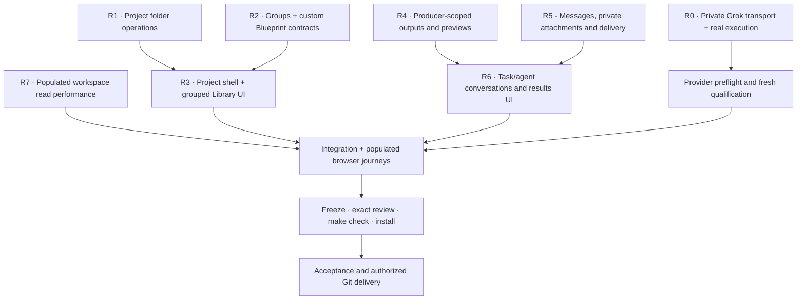

# Project-native collaboration implementation plan

Date: 2026-09-08. Branch: `codex/service-self-improvement`.
Base: `e08488f392936c43d35f1013d6468fe45fa89b00` (also local origin/main at orientation).
Working tree already contains the documented self-improvement repairs; preserve
them. Doctor at entry: healthy, zero integrity issues, 136 advisory warnings.
No release or exact-review completion is implied by this plan.

Product contract: [ADR 0019](adr/0019-project-native-collaboration-and-outputs.md).
This is the active implementation sequence for the operator's latest UX request.
The [current validation record](audits/2026-09-08-project-native-collaboration-validation.md)
owns the latest verification and remaining delivery gates. Checkpoints below
retain their historical source boundaries. Implementation or live qualification
does not by itself close a canonical task or approve this branch.

2026-09-09 review handoff: all nine implementation tasks are now submitted to
independent `review`, with explicit operator authorization; none was accepted.
The state table below remains a historical implementation checkpoint. Current
review bindings, the subsequent runtime-refresh correction and open delivery
gates are recorded in the
[review and delivery checkpoint](audits/2026-09-09-project-native-review-delivery.md).

## Work graph and ownership

| Work | Accountable owner / execution | Acceptance and evidence | State |
| --- | --- | --- | --- |
| R0 | Astra lead; bounded runtime preparation; actual Grok broker qualification | No prompt in argv or disk; fixed stdin endpoint; failed gate does not release payload; real terminal MCP outcome | Implemented and macOS-qualified at fingerprint `f35c5fe0…`; task remains active: `task.6J4R6XAAC6D0R6CJKBRR48NDXY` |
| R1 | Grok backend worker through Commons; lead integrates host/UI | Create/connect with inferred name, typed path, supported native chooser; filesystem identity checks; no destructive folder removal | Implemented in source; real Grok succeeded; browser acceptance open |
| R2 | Lead and bounded backend preparation | Durable groups without changing pinned skill instructions; versioned custom blueprint CRUD/apply with graph validation and retry recovery | Integrated; installed browser create/apply/archive passed; exact review and acceptance open |
| R3 | Single frontend owner through Commons | Compact sidebar/ellipsis; accessible hidden labels; groups/search/editors; simple Context copy; no generic Library Design | Integrated; Codex R3A succeeded, grouped Library visually inspected |
| R4 | Backend worker through Commons | Per-screen producer filters, correct agent provenance, latest/stale semantics, scoped output counts and separate-origin preview descriptors | Integrated; default-state tests passed; scoped Results browser verification open |
| R5 | Backend/runtime worker through Commons | Attachment metadata and private bytes; 10 images, 15 MB/file; task/agent addressability; truthful delivery; real media consumption where advertised | Integrated; actual provider image consumption unproven |
| R6 | Same frontend owner after R3 | Draft-safe project/task/agent chat, attachment controls and validation, conditional scoped Results links, keyboard/mobile behavior | Integrated; task chat contains actual Grok replies |
| R7 | Bounded performance worker; Grok where capability permits | Field reads avoid whole-projection serialization; immutable semantics preserved; representative populated read measurements | Grok attempt remains needs_operator; verified read cache integrated (0.32 s warm); cold mutation latency remains open |
| Integration/review | Astra lead, Claude independent reviewer, Codex/Grok verification | Exact artifacts after write freeze, full green contract, actual UI journeys, fresh source-bound runs and verified installation | Open |

Model names above are intended allocation, not evidence of execution. Record
actual profile/model/attempt/outcome separately. The native preparation agents
are supplementary; they do not satisfy the requested service dogfood. Workers
edit only their claimed paths. Parent owns task transitions and artifact
registration when the worker MCP profile does not expose those operations.

## Checklist

Checked items record bounded implementation evidence, not task acceptance.

- [x] R0 and current runtime fingerprint qualified by actual Grok execution on macOS.
- [ ] Codex and Claude used on current bounded tasks; final outcomes recorded.
- [x] Sidebar has one search, one create/connect action and per-project menus.
- [ ] Folder connect/create preserves identity checks and usable path fallback.
- [x] Skills grouped; custom Blueprint create/apply/archive verified in installed UI.
- [ ] Complete installed custom-group and Blueprint edit/recovery journeys.
- [ ] Library contains reusable resources; Context is explained as project input.
- [ ] Task and agent results contain only their own accessible outputs.
- [ ] Live frontend preview has explicit producer, origin, lifetime and readiness.
- [ ] Project/task/agent conversations are discoverable and draft-safe.
- [ ] Images and files obey limits and private scoped storage/access rules.
- [ ] Provider media delivery is tested; queued messages never appear read early.
- [ ] Populated workspace remains responsive during polling and concurrent work.
- [ ] Both languages, keyboard, focus, narrow layout and empty states verified.
- [ ] Full `make check`, exact independent review and installed-wheel check pass.
- [ ] Existing finalizer and confirmed-refresh reviews are resolved on exact bytes.
- [ ] Git merge/cleanup occurs only after integration and acceptance gates.

## Existing evidence and risks

The prior dirty-tree boundary passed 139 Work, 27 Gallery and 2107 Python tests
(13 documented skips). It does not establish green status after this wave.
Prior actual Claude review ended `needs_operator` because of a now-repaired
task/review revision bug; it did not approve the change. Prior Codex builder
timed out after leaving a partial diff. See the
[dogfood audit](audits/2026-09-08-service-self-improvement-dogfood.md).

Entry risks at the original boundary: Grok argv privacy, ambiguous media/run
delivery, cross-producer result mixing, slow populated projections and missing
exact review; flat skills, absent custom Blueprint flow and confusing navigation.
Current dispositions belong in the validation record linked above.

Authorization on 2026-09-08 permits additional Codex/Claude/Grok runs without a
total count cap. Per-attempt limits and private-data boundaries remain. This
supersedes the old handoff's pending-canary-permission note, not its evidence.

**Linux qualification L1 remains unproven; release-evidence R2 remains open.**
Release R2 belongs to the broader programme; this plan's R2 is Library authoring. Current macOS experiments cannot close
Linux six-profile qualification, receipt-scope integrity or independent release
review. API/local-model/SGR expansion remains the separate future ADR 0018 scope.

## Source-of-truth updates and cleanup

Update precise current-state passages after evidence exists; preserve historical
audits as historical. Supersede Library → Design instructions in both user
guides when scoped Results ships. Update ADR index, frontend contract and API
documentation with actual new behavior. Do not remove immutable state, raw-edit
manifests or rewrite historical outcomes to make the plan appear complete.

- R1: `task.0J1BKNDK3TP58RQA96G4CBRE0H` — canonical task created; acceptance remains open.

- R2: `task.6XMT2PEZS5SDWBE3ZB8ES1S95G` — canonical task created; acceptance remains open.

- R3A: `task.4Q1WTPAP884D1JAG5GX8Y1MWQB` — canonical task created; acceptance remains open.

- R4: `task.591KMGYHCAEHMAJC2WZ2ET1V3H` — canonical task created; acceptance remains open.

- R5: `task.3SDZD4Z61PCKERKT09PFYE8MMY` — canonical task created; acceptance remains open.

- R7: `task.7V9NEEMZ8QPVZH4EYZDDTY722X` — canonical task created; acceptance remains open.

## First runtime checkpoint

Grok builder, Codex builder, Claude builder and Claude reviewer all passed real
isolated canaries at source SHA-256
`6e592ada489a01fa677922ff530fedaeb616bee2a899d498111c1a1a1b78729c`.
Each recorded one terminal completion, zero terminal rejections and a closed
child. [Safe evidence](evidence/2026-09-08/project-native-provider-canaries.json).
This proves the Grok fixed stdin endpoint works on this host; it does not close
Linux L1, media delivery or product acceptance.

Initial full `make check`: 139 Work and 27 Gallery passed; Python 2122 passed,
13 skipped, one missing ADR-index entry failed. The index was corrected and all
four documentation-map tests then passed. Repeat the full gate after integration.

Actual worker preparation exposed a pre-start catalog mismatch: a selected
packaged commons-start identity was absent from the operator selection catalog.
The refusal occurred before any provider attempt; qualification alone did not
prove a particular configured role could launch. Keep this distinction in UX.

## Integration checkpoint: 2026-09-08, current work still open

- **R3A actual service execution:** Codex delegation
  `delegation.7XBPV7EP9S524STBG346P3BVAK`, attempt
  `attempt.7W5PYE6NWHMFA0SHAQHGPTDT3C`, canonical outcome `succeeded`;
  process exit 0 in 826.25 seconds. Compact sidebar source changes are present.
  This is not acceptance or proof that the installed UI contains the changes.
- **R3B:** `task.4V87W14RHVYYX86591MAPN5CSN`. Grouped skills, custom groups,
  custom Blueprint editing and legacy Design navigation redirect are integrated
  in source. Supplemental scratch validation passed 152 Work tests on Node
  24.20.0. Real transport review found and corrected the archived Blueprint query
  allowlist rejection. The integrated Work suite now passes 186 tests.
- **R6:** `task.3DX84XZHS5VSK4D7S98GPZT5NM`. Conversation domain/HTTP/MCP and
  scoped frontend chats are integrated. The HTTP integration suite passes 68
  tests including immutable retry, exact attachment access and readonly routing.
  The full Work frontend suite passes 186 tests. This is hermetic evidence;
  provider image consumption and the installed UI remain unproven.
- **Grok R7:** actual service attempt `attempt.7RAGP5N6X1CXMQ6AJ4EWGTNSK4`
  exited 0 after 717.81 seconds, but did not call the terminal MCP tool. Canonical
  outcome is `needs_operator` (`terminal_tool_not_called`), not success.
  Its projection field-read changes are present; 39 focused tests passed.
  A representative readonly snapshot completed in 10.08 seconds; this is a
  single observation, not a controlled before/after performance benchmark.
- **R2 backend review corrections:** custom Blueprint content now respects the
  operator content gate; ordinary readers receive metadata summaries. Retained
  exact built-in versions no longer depend on the currently packaged ID list.
  Supplemental corrected-overlay tests: 32 passed. All five built-in hashes
  were independently compared with HEAD and unchanged.
- **R4:** scoped image output API, per-screen producer filtering, conditional
  frontend Results and private live-preview registration are integrated. The
  worker publisher binds its authenticated task and reports readiness without
  claiming reachability. Installed browser journeys remain open.
- **R5 storage:** private message binding indexes, safe discard, nonempty file
  validation and full bounded PNG/JPEG decoding integrated. Pillow 12.3.0 was
  added through uv with the lockfile updated. Supplemental storage tests: 100
  passed; upload operation recovery and receiving outside the lock are integrated.

Dogfood observations to retain in the final audit:

1. A qualified provider profile does not imply a role's selected skill IDs are
   resolvable. The bootstrap role selected `commons-start` before its operator
   catalog metadata existed; launch refused safely before provider start.
2. A single checkout admits one writable provider worker. Parallel launch of
   Claude/Grok alongside Codex was refused; queued work remains requested.
   Independent preparation can continue, but writable runs must be serial or
   use properly provisioned isolated worktrees.
3. Provider qualification and installed MCP code are source-bound. Editing Python
   between qualification and launch correctly produces a pre-start refusal.
   Installation, qualification and launch need a stable source boundary and a
   clear recovery explanation in the UI.
4. Mocked frontend transports did not expose the Blueprint query allowlist bug.
   Real WorkApi transport tests and populated browser journeys are required.

Integration findings after the checkpoint:

- MCP preflight caught a new-tool registration/runner allowlist mismatch before
  provider start. Purpose-specific conversation/preview tools now match the
  implementation/verification catalog without widening independent review.
- Private attachment drafts/uploads and preview advertisements have a separately
  pinned HTTP route surface. Canonical conversation creation/messages remain
  covered by the mandatory CommonsManager.record_event write-path invariant.

## Populated browser checkpoint and remaining blockers

The follow-up full `make check` ran all stages: 186 Work tests, 27 Gallery tests,
2451 Python tests passed, 13 previous skips, **3 Python failures**. The failures
were a purpose-independent instruction paragraph changing the independent-review
contract and two first-run Blueprint-detail route gates. Both defects were fixed;
48 focused tests passed. This is **not** a full green result for the subsequent
changes. Folder-host integration passed 10 tests; conversations, latency and HTTP
integration passed 70 tests after the self-delivery fix. Repeat the full gate.

Actual service R1 execution: Grok delegation
`delegation.6FZY6R45HKX0724PP1FWN1AB2T`, exact final revision
`evt.01M214D5VSP2746Q0CPY5QDZ78`, canonical `succeeded`, process exit 0 after
1310.26 seconds. It implemented folder inspect/connect/picker behavior and
reported into the task conversation. The lead integrated the HTTP route and UI.
The task remains active pending exact review and acceptance.

At that checkpoint Claude authentication reported ready, but an actual diagnostic run
reported a provider usage limit. The unlaunched Claude R1 delegation was
cancelled before Grok took over. Claude independent review was externally blocked at that checkpoint;
additional permission is not the blocker. Historical successful Claude canaries
do not qualify this changed source. Do not retry in a loop or switch billing modes.

Browser observations on the populated workspace:

- Compact sidebar, per-project ellipsis, Agents navigation and dark project
  dialog are visible. Skills display 45 built-ins in collapsible groups;
  specializations show 30 entries; five built-in Blueprints and New blueprint
  are visible. These observations do not prove every creation/apply path.
- Task chat contains actual Grok replies. A synthetic media draft was not sent:
  the Chrome automation extension refused file access. Browser file upload and
  actual provider image/file consumption remain unqualified; hermetic HTTP/MCP
  tests prove the bounded transport contract only.
- Replaying 3183 events still costs roughly 10 CPU seconds per snapshot. Multiple
  unnecessary conversation replays and concurrent graph polling compound into
  unacceptable waits. Existing-thread reads now avoid the canonical write lock,
  request-local attachment reads reuse one snapshot, and typing works while the
  chat connects. Safe read coalescing remains part of R7, not an optional polish.
- Old inconsistent run attempts incorrectly made all task actions stale. The
  correction evaluates each task's observation freshness independently while
  preserving global/run warnings; 33 focused Python tests passed.
- Agent-authored messages were queued back to their own run. Recipient derivation
  now excludes the author session while retaining other addressed workers.
- Default in-checkout operational state may be refused by the private media and
  preview stores. Verify a normally created project, not only fixtures with an
  explicit external state root; this is a release-blocking integration check.

At that checkpoint the browser served the checkout and the installed wheel lagged.
The later installed checkpoint below supersedes that installation status.
Doctor with normal local-state access: healthy, zero integrity issues, 3183 events,
355 manifests, 136 advisory warnings. A sandbox-only index-open refusal disappeared
with access to the same derived local index; no canonical repair was performed.

## Installed checkpoint after recovery and storage integration

- Installed Python source matches checkout fingerprint
  `f35c5fe05ff340989be417a70e73daa102a81795c69a88e504ebecb4c0bc552e`.
  Work assets are `work-CEMJyPpv.js` and `work-BuAI-tN9.css`.
- All six configured Codex, Claude and Grok builder/reviewer profiles succeeded
  in fresh real macOS canaries: one terminal completion, zero rejections, closed
  child session each. The prior Claude quota refusal is historical; no billing
  mode was changed. Exact safe outcomes are in the provider evidence JSON.
- Verified-byte readonly snapshot coalescing reduces a representative warm read
  to 0.32 seconds (cold 10.67 seconds, graph rebuild 1.36 seconds). Writers and
  explicit fresh reads remain uncached. Canonical changes still require replay.
- A normally created project now resolves private collaboration storage outside
  its checkout. HTTP and MCP use the same resolver. Synthetic default-state
  integration proves text, real PNG upload/download, image MCP and acknowledgement.
- Conversation history loads newest 50 with explicit older-page access and a
  visible 2,000-row memory bound. Expired unbound drafts can be replaced only
  after the server proves no message was committed; ambiguous sends stay frozen.
- Generated task images have exact artifact/producer provenance and separate
  `artifact_image` Results. Publishing does not complete the task or promote the
  image to an accepted Design Package. Live previews remain a separate kind.
- Actual installed browser journey created a new folder project, a bilingual
  custom Blueprint with an exact specialization, a Claude-profile role and its
  task, then recorded a message in that task's conversation. No run was silently
  started. The test Blueprint was archived after the journey.
- Full `make check`: 214 Work and 27 Gallery tests passed; Python 2541 passed,
  13 intentional skips and one exact API-signature fixture failure. The added
  source-path guard is now reflected in that fixture; 29 artifact/publisher tests
  pass. Repeat the full gate after the final UX corrections. No green, independent
  approval, acceptance, merge or release is claimed at this boundary.
- Native chooser automation did not complete a real selection; manual-path
  creation is verified. Provider media consumption and scoped Results browser
  verification remain separate pending checks. Linux L1/release R2 remain open.

Final frontend correction opens task goals, omits absent summaries, moves canonical
state/action codes into Technical details, and suppresses a global warning only
for the proven optional-capacity-only gap. Actual task/run evidence gaps remain
visible. TypeScript/build passed; the full green contract is being repeated.

## Post-review evidence checkpoint

The frozen 158-file source manifest and the earlier pending-check paragraphs
remain historical evidence. At Python fingerprint `f35c5fe0…` and Work bundle
`work-CEMJyPpv.js`, the subsequent full `make check` passed: 2542 Python tests,
13 documented skips, two existing warnings; Work and all 27 Gallery tests passed.
An independent Node 24.20.0 scratch build reproduced JS, CSS and HTML exactly.
The first Claude review requested changes; its missing-bundle inference was
contradicted by that build proof and positive feature markers. It also exposed
incomplete/redacted repository-search coverage and a PNG/JPEG decoder-format
constraint that needed tightening. The original review outcome is preserved.

Real f35 media runs demonstrated Codex image generation/publication, Claude
existing-image publication and Grok existing-image publication with a semantic
color-label match. All three consumed the addressed image/file and acknowledged
the message. Claude generation ended `needs_operator`; Grok strict label scoring
remains non-passing. These are separate observations, not blanket provider
qualification or proof that Claude/Grok can run build commands.

[Post-review evidence](evidence/2026-09-08/project-native-post-review-checkpoint.json)
retains the bounded outcomes. Search-coverage, decoder, live-preview lifetime and
historical artifact-image corrections follow the f35 checkpoint. Their final
source fingerprint, full gate, installation and independent review must be
recorded before task acceptance or Git delivery. Installed Results/preview and
keyboard/mobile checks remain scoped evidence requirements. No task is accepted
by this update; the earlier R7 `needs_operator` outcome remains unchanged.

## Final verification checkpoint — 2026-09-09

The current a5ba8bf source passed full `make check` (2586 Python tests, 13 documented
skips), six fresh Codex/Claude/Grok canaries, exact clean-wheel installation and
independent frontend rebuild. Actual browser verified preview navigation after
delegation success and historical image viewing after task completion. Installed
custom groups and Blueprint version editing also passed. See the
[final evidence](evidence/2026-09-08/project-native-final-validation.json).
Exact independent review and task acceptance remain pending at this checkpoint;
provider native-command limits and Linux L1/release R2 remain open.
