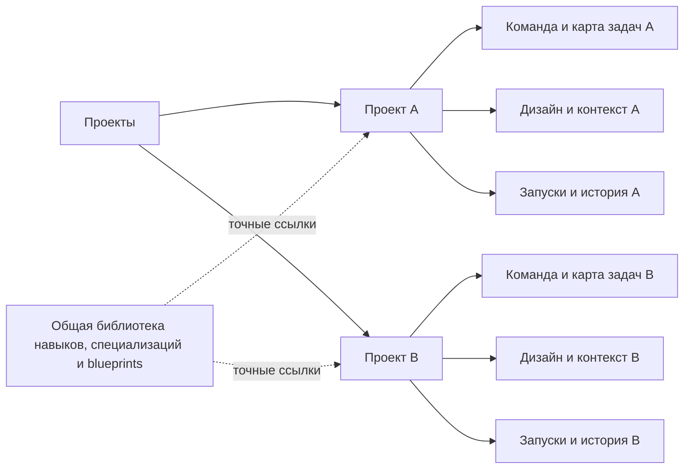
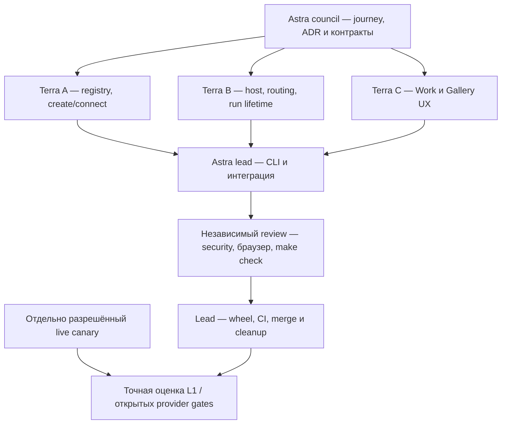

# Проекты как верхний уровень Agent Commons

Статус: реализация разрешена и начата 2026-09-08 на
`codex/project-workspaces-program`. Registry, host и frontend прошли scoped
independent review; полный `make check` и двухпроектный browser journey пройдены,
проверенный wheel установлен. Git delivery проверяется отдельно, L1/R2 остаются
открытыми. Владелец: implementation lead. Архитектурный контракт —
[ADR 0017](adr/0017-project-scoped-service-host.md); live-запуски требуют отдельного
явного разрешения.

## Пользовательский результат и основание

Оператор ведёт несколько независимых продуктов в одном сервисе. Он создаёт
проект, описывает задачу, при желании выбирает blueprint и получает отдельную
команду, карту работы и дизайн-галерею. Затем переключается между проектами,
понимая, где работают агенты и куда попадёт следующее действие.

Основание — прямой запрос пользователя и проверка исходников на
`605c0d7c9c5965c0a8303550056d07ce63afa697`. Это evidence потребности одного
оператора, а не исследование массового спроса. Детали ниже — проектное
предложение (`external extension`); результаты реализации и проверки находятся в
[отчёте](audits/2026-09-08-project-workspaces-verification.md).

На исходном baseline `UIContext` привязан к одному `repo`; CLI создаёт одного
`ProjectSessionOwner`, а `frontend/work/src/main.tsx` показывает название проекта
как подпись. [ADR 0014](adr/0014-task-first-workspace-ux.md) прямо откладывает
multi-project switch. [ADR 0005](adr/0005-state-root-isolation.md) уже задаёт
изоляцию state root, а [ADR 0016](adr/0016-service-library-and-live-workspace.md)
разделяет общую библиотеку и экземпляры ролей проекта. Их контракты сохраняются.

## Навигация и принадлежность данных

В левой панели — список проектов с поиском и кнопкой **Новый проект**.
Название и статус текущего проекта постоянно видны. Карта агентов и задач
находится внутри выбранного проекта; добавление агента не создаёт новый проект.

| Уровень | Что ему принадлежит |
| --- | --- |
| Сервис | Установленные и пользовательские определения навыков/специализаций, шаблоны проектов, приватный список подключённых проектов. |
| Проект | Именованные агенты и выбранные профили/модели, задачи и зависимости, Gallery/Design Packages, Context Packs, обсуждения, reviews, результаты и история. |
| Прогон | Точная задача, роль, версии контекста/дизайна, ограничения, полномочия и наблюдаемый исход. |

Общие определения используются по точным ссылкам. Изменение библиотеки не
перепривязывает существующих агентов. Глобальный список проектов не копирует
task text, изображения, переписку или provider output. Профиль подключения можно
переиспользовать только с прежними workspace-specific проверками перед запуском.

## Создание и ежедневная работа

1. **Новый проект**: имя, новая рабочая папка или подключение
   существующего репозитория. Путь выбирается/проверяется в UI; терминал не должен
   быть обязательным шагом. Первая реализация: поле абсолютного пути и отдельные
   проверка/подтверждение; native picker может быть последующим улучшением.
2. Создать пустой проект и открыть его раздел blueprints. Оператор может остаться
   с пустым проектом или выбрать один из пяти шаблонов. До применения показать
   роли, задачи и зависимости; дать уточнить brief и исполнителей.
3. Описать результат в brief выбранного blueprint и применить его план в уже
   созданном workspace с устойчивой retry identity.
   При частичном результате показать созданный проект и возможность продолжить
   тот же запрос. Создание проекта, команды и запуск модели остаются отдельными
   действиями. Отсутствие провайдера не мешает создать пустой проект.
   Если процесс прервался между инициализацией workspace и её durable milestone,
   показать неоднозначный результат с сохранёнными именем/путём и явным переходом
   к проверке и подключению существующего проекта. Автоматически присваивать
   появившийся workspace исходной операции нельзя (ADR 0017).
4. Открыть собственную карту проекта. Внутри доступны Работа, Команда, Дизайн,
   Контекст и настройки проекта; из них виден переход к общей библиотеке.
5. Переключение A → B сохраняет раздельные черновики и выбор. Агенты A продолжают
   работу; поздний ответ или SSE A не меняет интерфейс и данные B. Вернувшись в A,
   оператор видит актуальный исход его прогонов. Остановка — отдельное действие.
6. Переименование меняет отображаемое имя. Архивирование убирает проект из
   обычного списка с возможностью вернуть его; оно не удаляет файлы/ledger и не
   означает прекращения процесса. Активная работа должна оставаться обнаружимой.

## Контракт изоляции и архитектурные решения

Каждый независимый проект получает собственный workspace и canonical history.
Linked worktrees одного workspace не становятся новыми проектами автоматически.
Подключение того же workspace повторно не должно дублировать проект или writer.
Новый проект не создаётся копированием operational state либо immutable ledger.

[ADR 0017](adr/0017-project-scoped-service-host.md) выбирает единый локальный host
с изолированными project contexts. Проектный launcher с отдельными UI-процессами
остаётся альтернативой при доказанной потребности в независимой crash boundary.
Выбранный вариант требует доказать маршрутизацию и жизненный цикл. Отдельные вкладки
существующего CLI остаются совместимым fallback, но не закрывают создание и
переключение проектов через UI. Фильтр над одним общим ledger не обеспечивает
запрошенную изоляцию и не подходит.

Приватный registry связывает разрешённый проект с workspace/repository identity.
Запросы, writer sessions, claims, run ownership, caches, retry keys и streams
должны разрешаться в конкретном проекте до чтения/записи. Имя проекта или
переданный клиентом путь не дают полномочий. Work/Gallery deep links сохраняют
проектную привязку; секреты и черновики не попадают в URL/localStorage.
Политики папок, повторного подключения и фоновых процессов определены в ADR.
Фоновые задачи продолжаются при смене проекта и закрытии вкладки, пока работает
host; переживание остановки самого сервиса и provider reattachment не заявляются.

## Проверки и риски

- Проверочный journey: создать A из web-blueprint, B из Telegram-blueprint,
  изменить задачу и добавить экран в A, переключиться в B и обратно. Все записи
  остаются в своих проектах; общий навык доступен обоим.
- Задержать ответ, SSE и retry из A до перехода в B; открыть несколько вкладок,
  повторить создание после потери ответа, перезапустить host. Ноль записей и
  раскрытий данных между проектами — обязательный инвариант.
- Проверить пустой список, загрузку, недоступную папку, повторный workspace,
  отказ доступа, отсутствующий provider и частично созданный blueprint.
  Не скрывать проект за бесконечным spinner и не выдавать timeout за доказанный
  отказ операции.
- Сохранить утверждённые цвета, шрифты и статусы. Проверить RU/EN, клавиатуру,
  фокус после переключения, Back/Forward и узкий экран. Недоступный проект должен
  предлагать понятное восстановление без исчезновения навигации.

| Риск | Как закрыть |
| --- | --- |
| Value: навигация понятна одному оператору, но не проверена на других сценариях | Проверить создание и переключение двух реальных по структуре тестовых проектов с пользователем. |
| Usability: общая библиотека путается с командой и дизайном проекта | Проверить, может ли оператор до нажатия назвать проект назначения действия. |
| Feasibility: поздние ответы, shared caches или sessions смешивают проекты | Backend/QA проверяют подмену project ID, задержанные ответы и восстановление до UI acceptance. |
| Viability: каждый проект держит дорогой процесс или требует ручной поддержки | Runtime owner измеряет idle resources и задаёт lifecycle/retention; сохраняет single-project fallback. |

Product metric — успешное создание второго проекта до первой редактируемой
задачи без CLI и путаницы назначения; бизнес-цель — меньше установочных и
координационных препятствий при работе над несколькими продуктами. До rollout
измерить время первого полезного действия и cached/cold switch на малом и большом
ledger, согласовать бюджет задержки. Локальная диагностика хранит агрегаты ошибок
и времени, без содержания проектов. Красивый экран сам по себе не закрывает gate.

## Граф реализации и владельцы

| Шаг | Владелец / canonical task | Статус и критерий |
| --- | --- | --- |
| 1. Baseline и вход | Astra lead | HEAD/origin `605c0d7…`; doctor без integrity issues. До начала были три плановых правки. |
| 2. Совет и ADR | Lead + два независимых Astra; Fable запрошен | Два source assessment и peer critique получены. Fable source-sharing отклонён auto-review; отдельное согласие ожидается. Полного четырёхмодельного consensus не заявляем. |
| 3. Registry / создание | Terra A, `task.5JSNBFYD2SBY7593QDA5MSVK9E` | Реализовано; v5 прошёл независимый review и 27 целевых тестов. Общий release gate ещё открыт. |
| 4. Host / API / lifetime | Terra B, `task.7XDH8023BDMHWSFS51Z053N2MF` | Реализовано; v3 прошёл независимый review; полная проверка включает реальную CLI-привязку сокета. |
| 5. Браузерный UX | Terra C, `task.2FQ0VW24V2J0866GM5G8WKT2VR`; исправления `task.7D9HNAQ60G192XA1ECKRR64DGY` | Scoped review v3/v4 одобрил callback/retry/SSE исправления. Финальный browser journey из 12 шагов пройден, включая публикацию Design Package и отсутствие чужих задач/экранов. |
| 6. Интеграция и выпуск | Astra lead, `task.5K83Z3A8EC62Q04W69MXSXQ691` | Green contract, exact independent source review, browser journey и установленный wheel проверены. Git delivery требует green PR/main CI; не является L1 qualification. |
| 7. Реальный Codex canary | Operator authorization + lead | Одна попытка до 300 секунд ещё не запущена: auto-review требует отдельного разрешения. Это предел теста, не всех рабочих задач. |
| 8. API/local/SGR | Будущая волна, [ADR 0018](adr/0018-role-connections-and-execution-modes.md) | Зафиксированы структура, граф и gates. Исходный запрос на будущее сохраняется; работающие API-режимы сейчас не заявляются. |

Исполнители запущены через встроенную collaboration-среду Codex с запрошенной
моделью `gpt-5.6-terra`; это не проверка Commons broker. Модель совета —
`gpt-6-astra`, lead синтезирует и проверяет интеграцию. Provider-reported identity
от collaboration API не получена. Claude/Grok execution не подменён фиктивными
успешными делегациями.

## Чек-лист завершения

- [x] Проверить actual Git, doctor, orientation, inbox, tasks и claims.
- [x] Создать отдельную ветку, конкретные задачи и распределить владельцев.
- [x] Зафиксировать ADR, HTTP/state/lifetime contracts и будущую API-волну.
- [ ] Получить Fable assessment после разрешения передачи конкретных файлов;
  передать скриншоты только после отдельного разрешения их состава.
- [x] Завершить registry, host и scoped Work/Gallery; проверить интеграцию.
- [x] Пройти двухпроектный browser journey, delayed-response/SSE и recovery gates.
- [x] Полный `make check` (Work 132 / Gallery 27 / Python 2103), воспроизводимые
  assets и независимый exact source review.
- [x] Собрать и установить проверенный wheel, открыть рабочий сервис пользователю.
- [ ] Провести разрешённый one-shot canary и отделить его результат от six-profile L1.
- [ ] После green CI выполнить разрешённый merge и проверить main CI.
- [ ] Cleanup только подтверждённых временных/generated дублей; canonical history,
  чужие изменения и значимые evidence не удалять.

API/local/SGR — отдельное [будущее направление](ROADMAP.md#future-role-connections-sgr-and-conversations),
не prerequisite для проектного UX. L1/R2 и явное разрешение live canaries
остаются самостоятельными gates.
