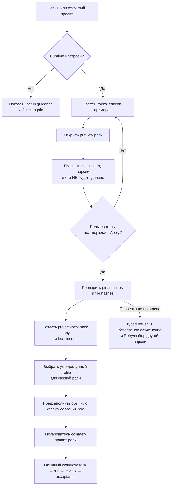
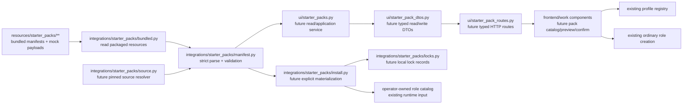

# Starter Packs: безопасный путь от примеров к управляемой интеграции

**Статус:** утверждённый продуктовый flow и технический план. Этот документ не
означает, что внешние skills уже скачиваются, что роли уже созданы или что UI уже
умеет применить pack. В первом срезе появятся только два bundled mock-пака и их
строгая локальная валидация. Внешняя библиотека skills, сетевое обновление,
материализация файлов и UI-применение — следующие, отдельно проверяемые срезы.

**Аудитория:** product owner, implementer, reviewer и будущий maintainer.

## 1. Решение и границы

Agent Commons будет давать новому проекту не пустой экран, а видимый каталог
готовых примеров — **Starter Packs**. Это не запущенные агенты и не скрытая
глобальная установка. Пользователь видит, из чего состоит пример, выбирает его,
а затем создаёт обычные редактируемые роли с выбранными локальными профилями.

Принятые ограничения:

- pack выбирается пользователем и живёт в проекте, а не молча меняет глобальный
  каталог Codex или другие проекты;
- внешний источник никогда не означает «взять `main`/`latest` и исполнить всё,
  что там сейчас лежит»;
- применение не устанавливает программы, не меняет provider profiles, grants,
  budgets или credentials и не запускает делегации;
- Starter Pack — **не** запись canonical ledger и не замена существующего
  persisted role template (`template: true`);
- для каждого материализованного pack сохраняется pin, hashes и возможность
  проверить/откатить версию.

Так человек может сразу изучить реальные примеры ролей и начать работу, не
получая неявных прав или неповторяемой конфигурации.

## 2. Термины и различия

| Термин | Что это для пользователя | Техническая граница |
| --- | --- | --- |
| **Starter Pack** | Набор примеров skills и ролевых сценариев, доступный в новом проекте. | Проверяемый локальный manifest и ресурсы; сам по себе не создаёт событий. |
| **Blueprint** | Сценарий команды: какие роли нужны и зачем. | Набор предзаполненных параметров обычного создания role. |
| **Role template** | Сохранённый в продукте шаблон роли для последующего использования. | Уже существующая сущность с `template: true` в canonical history. |
| **Profile** | Настроенный оператором способ запуска конкретного provider. | Принадлежит локальной runtime configuration; pack его не создаёт и не расширяет. |
| **Skill** | Короткая инструкция, прикрепляемая к роли. | Доходящий до runtime текст берётся только из проверенного operator-owned catalog. |
| **Materialization** | Явное копирование подтверждённой версии pack в проект. | Будущий записывающий шаг с lock-файлом, hashes и rollback. |

Главное: blueprint помогает заполнить форму, template сохраняет уже принятую
роль, а profile определяет, можно ли её запустить. Их нельзя смешивать.

## 3. Что появится сначала: два честных mock-примера

Первый deliverable не подключается к GitHub и не выдаёт полноценную библиотеку
за установленную. Он поставляет две маленькие, видимые в каталоге записи:

| ID | Название в UI | Роли blueprint | Ограничение |
| --- | --- | --- | --- |
| `starter.feature-delivery.mock` | «Разработка фичи (пример)» | Implementer → Independent reviewer | Не создаёт роли автоматически; reviewer независим от исполнителя. |
| `starter.product-discovery.mock` | «Исследование продукта (пример)» | Researcher → Product reviewer | Не принимает продуктовые решения за человека. |

Обе записи явно помечаются «пример», используют fresh context, не содержат
grants, не расширяют tool allowlist и не выбирают provider profile. У каждой
роли — короткая bounded instruction, а не встроенная полная копия чужого
`SKILL.md`.

### 3.1. Default Role Catalogue — что именно будет «заполнено по умолчанию»

Список ролей в первом проекте не должен выглядеть пустым. Вместе с двумя
Starter Packs Work показывает их роли как **default-visible role cards**:
Implementer, Independent reviewer, Researcher и Product reviewer. Карточка
объясняет задачу роли, skills, ограничения и связь с blueprint; действие
«Использовать как основу» открывает обычное создание роли с предзаполненными
значениями.

Эти карточки не являются уже созданными agents, не появляются в Board как
работники и не являются `template: true` пока пользователь явно не сохранит
созданную роль как template. Поэтому первый экран одновременно даёт понятные
примеры и не загрязняет project history фиктивной командой.

### 3.2. Definition of done для mock-среза

В этом срезе допустимы только следующие возможности:

1. bundled registry читает два ресурса из дистрибутива;
2. manifest валидируется и безопасно отдаёт typed in-memory model;
3. invalid/oversize/tampered ресурс fail-closed;
4. тесты доказывают, что нет сетевого доступа, записи проекта, создания роли,
   запуска, изменения profile/grant/tool policy или событий ledger.

Пока не сделаны отдельные срезы, нельзя утверждать, что пользователь уже может
нажать Apply, получить локальную копию или обновить pack.

## 4. Пользовательский flow: целевое состояние



Пример: пользователь выбирает «Разработка фичи». Экран говорит: «Будут
подготовлены две роли: Implementer и Independent reviewer. Ничего не будет
запущено; Claude/Codex и права доступа не изменятся». После Apply система
спрашивает существующий совместимый profile для каждой роли. Только затем
открывается обычная форма роли — пользователь может изменить название, skills
и описание до создания.

### 4.1. Что пользователь должен видеть при проблеме

| Состояние | Сообщение и следующее действие |
| --- | --- |
| Runtime ещё не настроен | «Сначала настройте доступный инструмент. Pack не будет применён». Показать существующий безопасный setup guidance и **Check again**. |
| Нет совместимого profile | «Пример не меняет ваши профили. Выберите уже настроенный профиль или настройте его отдельно». |
| Проверка источника не прошла | «Эта версия пакета не прошла проверку и не применялась». Дать Retry или выбрать сохранённую версию; не показывать путь, stderr или секрет. |
| Pack уже применён | Показать его version/pin и варианты «Использовать эту версию», «Проверить обновления» или «Откатить» (когда эти функции будут реализованы). |

## 5. Граф компонентов и владение



### 5.1. Модули, контракты и зона ответственности

| Модуль | Ответственность | Владелец | Состояние |
| --- | --- | --- | --- |
| `integrations/starter_packs/manifest.py` | Typed models, strict parser, limits, digest/ID validation; не читает сеть и не пишет проект. | Python backend / security | Mock foundation. |
| `integrations/starter_packs/bundled.py` | Читает только packaged resources и передаёт bytes в validator. | Python backend | Mock foundation. |
| `resources/starter_packs/**` | Два mock manifest/payload ресурса. | Product + technical writing | Mock foundation. |
| `integrations/starter_packs/source.py` | Resolve только указанного release tag/commit, проверяет manifest/file hashes и совместимость. | Python backend / security | Будущее. |
| `integrations/starter_packs/install.py` | Составляет preview и после explicit confirm атомарно materialize project-local copy. | Python backend | Будущее. |
| `integrations/starter_packs/locks.py` | Читает/пишет lock record, хранит прошлую известную версию для rollback. | Python backend / release engineering | Будущее. |
| `ui/starter_pack_dtos.py` | Узкие `TypedDict`/frozen dataclass DTO на границе UI. | Backend + frontend contract owner | Будущее. |
| `ui/starter_packs.py` | Read/application service pack; не добавляет методы в `UIContext`. | Python backend | Будущее. |
| `ui/starter_pack_routes.py` | Роуты с typed refusals, auth и CSRF/host checks через существующий server composition root. | Python backend / security | Будущее. |
| `frontend/work/*` | Каталог, preview, confirm, выбор profile и понятные fallbacks. | Frontend + design | Будущее. |
| Внешний `codex-pro-agent-skills` release | Публикует совместимый verified source. | Владелец skills-библиотеки / release engineering | Будущее, вне Agent Commons. |

Новые modules размещаются по целевой карте аудита: `integrations/` — для
внешнего пакета и безопасной установки, `ui/reads`/actions style — для UI
adapter. Они не добавляют новых методов в `services/manager.py`, `ui/context.py`,
монолитный CLI или `mcp/server.py::build_server`; не трогают static
`index.html`, persisted event schemas или ledger semantics.

### 5.2. Узкие будущие API (не часть текущего mock-кода)

Имена ниже — предлагаемые границы для реализации, а не уже существующий public
API. Они должны принимать/возвращать typed records, а не `dict[str, Any]`.

| Граница | Предлагаемые операции | Инвариант |
| --- | --- | --- |
| `manifest.py` | `parse_manifest_bytes(bytes) -> StarterPackManifest`; `validate_manifest(manifest) -> None` | Парсинг не имеет side effect и отвергает неизвестные/дублирующие поля. |
| `bundled.py` | `list_bundled_packs() -> tuple[StarterPackManifest, ...]`; `get_bundled_pack(pack_id) -> StarterPackManifest` | Только package resources, stable order, ровно два mock-пака в P1. |
| `source.py` | `resolve_pinned_source(request) -> ResolvedPackSource` | Никогда не принимает branch/floating URL как verified result. |
| `install.py` | `plan_materialization(source) -> MaterializationPreview`; `materialize_confirmed(preview, confirmation) -> InstalledPack` | Planning не пишет; write происходит только после explicit confirmation и полной повторной проверки bytes. |
| `locks.py` | `read_lock(project_root) -> StarterPackLock \| None`; `write_lock(install) -> StarterPackLock`; `plan_rollback(lock) -> MaterializationPreview` | Lock отражает ровно проверенные bytes и не заменяет role/template history. |
| UI adapter | `list_packs() -> StarterPackListRead`; `preview_pack(id) -> StarterPackPreviewRead`; `apply_pack(request) -> ApplyPackResult` | Read и write разделены; write нельзя вызвать без confirmation token/состояния preview. |

Для P2 предполагаются новые тематические HTTP routes под Work API, но их точные
path/name утверждаются вместе с действующим Work route contract. Не следует
добавлять их в CLI, MCP или расширять старый UI API «на всякий случай».

## 6. Контракт manifest

Имя формата: `agent-commons.starter-pack.v1`. Он должен иметь закрытую схему:
неизвестный ключ — ошибка, а не «сохраним на будущее».

Минимальная модель в памяти:

| Поле | Правило |
| --- | --- |
| `format` | Ровно `agent-commons.starter-pack.v1`. |
| `id` | Namespaced stable identifier (`starter.*` для bundled mock; внешний publisher имеет свой namespace). |
| `version` | Версия пакета, не неявный `latest`. |
| `title`, `summary` | Ограниченные plain-text строки для preview. |
| `blueprints` | Уникальные ID; каждая роль содержит name, purpose, fresh context и bounded skill refs. |
| `runtime_instruction` | Не больше 4 KiB после UTF-8 encoding; не произвольный полный skill file. |
| `files` | Относительные безопасные пути, SHA-256 и размер каждого будущего materialized payload. |
| `source` | Для внешнего пакета: repository identity, immutable tag/commit и release metadata; для bundled — package resource identity. |
| `compatibility` | Явный compatible Agent Commons range для будущего external source. |

Глобальные limits: manifest и все его данные максимум 64 KiB, одна
`runtime_instruction` максимум 4 KiB. IDs не дублируются; relative path не
может быть абсолютным, содержать `..`, переходить через symlink или покидать
разрешённый root. `hash mismatch`, duplicate field/ID, oversized bytes, invalid
UTF-8 или неизвестная schema version возвращают typed refusal до открытия
untrusted payload для runtime.

## 7. Безопасность и trust boundary

```mermaid
sequenceDiagram
    participant U as Пользователь
    participant UI as Work UI
    participant AC as Agent Commons
    participant P as Проверенный pack
    participant O as Operator role catalog
    U->>UI: Preview / Apply
    UI->>AC: typed request + explicit confirmation
    AC->>P: parse, size/path/hash validation
    alt valid, future explicit installation
        AC->>AC: materialize project-local copy + lock
        AC->>O: copy only verified bounded instructions
        AC-->>UI: prefilled roles; no run
    else invalid or unsupported
        AC-->>UI: typed refusal, no files/events/profile change
    end
```

Security invariants:

1. **No implicit execution.** Ни content pack, ни preview не исполняют shell,
   HTML, external instructions или provider calls.
2. **No privilege widening.** Pack не выдаёт grants, tool allowlist, profile,
   model, executable, token/budget или credential. Роль использует только
   выбранный оператором уже доступный profile и действующие policy checks.
3. **No global mutation.** Materialization будущего pack идёт в project-local
   target, а не в `~/.codex`, не в другой workspace и не в репозиторий skills.
4. **Pin before trust.** `main`, branch name, floating URL и mutable release
   label недостаточны. До записи проверяются declared commit/tag, manifest hash
   и hash каждого file.
5. **Fail closed, explain safely.** UI получает stable error code и короткое
   действие, но не local paths, URL credentials, raw stderr, config contents
   или полные untrusted payloads.
6. **Role materialization stays ordinary.** Созданная роль проходит обычные
   validation, policy, task/review/acceptance rules; Starter Pack не даёт
   обхода независимого review.

Отдельно: текущий runtime доверяет operator-owned catalog и имеет практический
лимит около 64 KiB на catalog/4 KiB на одну instruction. Поэтому нельзя
импортировать полные `SKILL.md` из внешнего репозитория прямо в runtime, даже
если пользователь нажал Apply. Будущая интеграция выбирает заранее указанную,
ограниченную и проверенную проекцию.

## 8. План реализации и независимые проверки

| Срез | Зависимости | Результат | Проверка и владелец |
| --- | --- | --- | --- |
| P0: design record | Это решение | Этот документ и owner gates. | Product owner + architecture reviewer. |
| P1: bundled mocks | P0 | `manifest.py`, `bundled.py`, два ресурса и hermetic tests. | Python backend writer; security reviewer проверяет parser mutations, path/size/hash errors; QA проверяет отсутствие сети/записей. |
| P2: read-only UI catalogue | P1 и frontend Work foundation | DTO/read service/routes + preview; никаких Apply/write. | Backend+frontend writers на разных claimed paths; independent UX/accessibility/security review. |
| P3: explicit materialization | P1, owner release policy | `source/install/locks`, confirm screen, project-local copy и atomic rollback. | Security + release engineer review, failure-injection tests, rollback drill. |
| P4: role prefill | P3 и profile compatibility contract | Profile choice и prefilled ordinary create-role form. | Product/design + frontend + backend; workflow E2E: no profile => no create; cancel => no writes. |
| P5: external publisher | Ваша подготовка release policy | Pinned `codex-pro-agent-skills` source, update view/changelog/rollback. | Skills-repo owner, supply-chain/security reviewer, integration test against published fixture. |

Каждый срез — отдельный небольшой commit и exact-revision independent review.
Структурные и поведенческие изменения не смешиваются; перед commit — serial
`make check`, перед integration/P3 — отдельный clean-worktree verification.

### 8.1. Обязательные тесты

- unit: closed-schema parse, duplicate keys/IDs, empty/invalid fields, 4 KiB and
  64 KiB boundaries, hash mismatch, traversal/absolute path and symlink;
- component: bundled registry returns exactly two mock packs and never touches
  network/filesystem outside package resources;
- integration: typed refusal and safe copy for missing profile/invalid lock;
- future UI E2E: preview → confirm → select profile → prefilled role; cancel,
  refusal and retry leave roles, ledger, runtime and profile files unchanged;
- release: fixture of a signed/pinned published release accepts only matching
  manifest/files; a changed `main` without matching pin is rejected;
- regression: no automatic launch; parent/task acceptance rules still require
  the normal review workflow.

## 9. Внешняя библиотека: release и обновления

До P5 владелец `codex-pro-agent-skills` готовит:

1. лицензию и publisher identity;
2. SemVer/release tags или immutable commit publishing policy;
3. changelog с breaking changes и migration notes;
4. compatibility range для Agent Commons;
5. manifest и file hashes release artifact;
6. security owner и процедуру отзыва скомпрометированной версии.

Будущий update flow:

```text
Check for updates
  → получить только declared release metadata
  → сравнить pin/version/hashes/compatibility
  → показать changelog и изменившиеся roles/skills
  → пользователь подтверждает конкретную версию
  → materialize новой project-local копии
  → сохранить прежний lock как rollback candidate
```

Если compatibility/hashes не сходятся, обновление не применяется. Existing
созданные роли не переписываются: пользователь сравнивает изменения и по
желанию применяет их в новых/отредактированных обычных ролях.

## 10. Связь с программой рефакторинга

Эта фича сознательно не тянет разбираемые фасады. Она размещается в новых
`integrations/starter_packs/*` и, позднее, узких UI adapters. Это:

- **не удорожает A3**: packs не меняют доменную роль и пока не делают role
  template событием;
- **не блокирует A4 UI**: P2 ждёт уже намеченный read/action seam вместо нового
  метода `UIContext`; routes добавляются тематическим модулем через текущий
  composition root;
- **не меняет A4 CLI/MCP**: для product flow CLI/MCP adapters не нужны;
- **опирается на A5/A7**: будущие UI границы сразу используют typed DTO и не
  добавляют `dict[str, Any]`;
- **не касается A6**: pack registry не участвует в ledger replay;
- **не начинает A8 раньше времени**: создание ролей пока зовёт уже существующий
  compatibility surface; позже можно переключить только адаптер на
  `manager.roles` в разрешённое migration window.

Следовательно, P1 можно вести параллельно с независимыми structural tasks. P2+
должны стартовать лишь после проверки их конкретного UI seam и без захвата
`ui/context.py`, `services/manager.py`, `cli.py`, `mcp/server.py` или static
`index.html`.

## 11. Открытые owner gates

Следующие вопросы нельзя решать неявно в коде:

| Gate | Нужное решение владельца | Почему оно блокирует |
| --- | --- | --- |
| D1 | Где именно хранить project-local materialized pack и lock (внутри `.agent-commons/` или рядом, с точным lifecycle/backup policy). | Это определяет ownership, atomicity, privacy и rollback. |
| D2 | Уровень подтверждения внешнего source: commit-only, signed tag, или оба. | Это security/release contract, а не UI preference. |
| D3 | Точный список default skills и их коротких runtime projections после подготовки библиотеки. | Нельзя угадывать содержимое/лицензию и тащить полный upstream text. |
| D4 | Какие default roles показываются при первом запуске и какие локали/брендинг у них есть. | Это product positioning и onboarding UX. |
| D5 | Политика compatibility/deprecation для pack version и созданных по ней roles. | Нужна до первого external update, чтобы не ломать пользовательские проекты. |

До этих решений mock registry безопасен и полезен как учебная основа, но не
должен перерастать в скрытый installer.

## 12. Критерии успеха продукта

После P4 измеряем не число загруженных skills, а путь пользователя:

- доля новых проектов, которые дошли от setup до первой созданной роли;
- время от первого открытия Work до первой принятой задачи;
- доля preview → confirmed materialization и доля отмен без ошибочной записи;
- доля ролей, для которых сразу найден совместимый profile;
- review rejection/rework и `needs_operator` у задач, начатых из blueprint;
- setup blockers и обращения в поддержку по packs;
- security signal: ноль успешных materialization при hash/path/compatibility
  failure и ноль запусков без явного действия пользователя.

Если pack повышает количество созданных ролей, но не сокращает время до
качественно принятой работы или увеличивает небезопасные конфигурации, его
состав и flow нужно пересмотреть.
