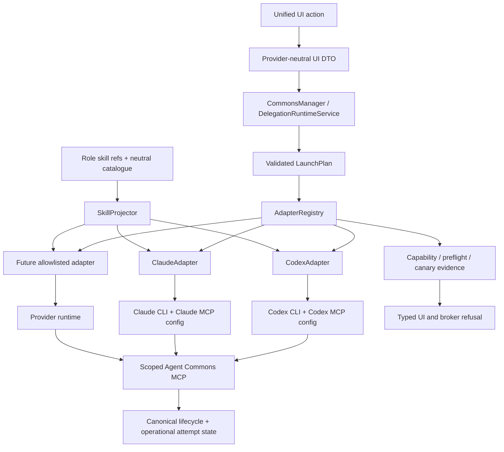

# План provider-neutral runtime и provider-specific projections

Статус: design plan, подготовлен 2026-08-29 на `main` `dd65bdb`.
Связанный follow-up task: `task.2V7NT6H48CE9X4BCMHFXW2SY3M`.

Этот документ продолжает графы `docs/architecture-improvement-agent-team-plan.md`,
`docs/architecture-improvement-implementation-plan.md` и ADR 0004. Он не меняет
объём P0 remediation из `docs/feedback-remediation-plan-2026-08-28.md`.

## 1. Решение в одном абзаце

Пользователь выбирает единую сущность: роль, профиль и действие `Run`/`Review`.
Backend строит provider-neutral `LaunchPlan`, а затем передаёт его ровно одному
allowlisted adapter выбранного провайдера. Adapter компилирует только
эфемерные детали: CLI argv, MCP wiring, instruction envelope, skill projection,
budget flags, sandbox/permission mode и разбор provider result. Canonical ledger,
UI DTO, task/review lifecycle и scoped MCP tool contract остаются едиными.

Это не означает «спрятать всё в MCP». MCP остаётся узким транспортом
worker-scoped инструментов Agent Commons. Provider adapter — отдельная внутренняя
граница, которая подготавливает конкретный Codex/Claude runtime.

## 2. Что уже есть и где gap

### Факты

| Факт | Текущая опора |
|---|---|
| Общий запуск уже отделён от broker и профиля | `runtime/broker.py`, `services/delegation_runtime.py` |
| Есть typed `RunnerProfile` и два provider-specific profile класса | `runtime/model.py` |
| Codex и Claude уже получают разные argv и MCP-конфигурацию | `CodexRunnerProfile.build_invocation`, `ClaudeRunnerProfile.build_invocation` |
| Общая инструкция собирается отдельно и не хранится в ledger | `services/delegation_instruction.py` |
| Роль выбирает profile/skill refs, а UI показывает безопасные provider/model поля | `services/roles.py`, `ui/context.py` |
| Installer кладёт skills в разные корни `.agents/skills` и `.claude/skills` | `integrations/installer.py` |
| Сейчас содержимое skill-файлов в основном копируется одинаковым для обоих клиентов | `integrations/installer.py`, `tests/integrations/test_installer.py` |
| ADR 0004 уже задаёт provider runner contract и запрещает arbitrary argv/env | `docs/adr/0004-optional-local-delegation-runtime.md` |

### Gap

Provider adaptation существует, но не оформлена как самостоятельный registry и
capability contract. Из-за этого новые различия легко попадут в UI, `CommonsManager`
или общую инструкцию. Skills пока имеют общий physical bundle, хотя клиентские
форматы и discovery rules различаются. Кроме того, MCP preflight может пройти,
а реальный provider launch всё равно упасть: это проявилось на Codex reviewer,
который в read-only окружении завершился при создании PATH aliases/app-server.

## 3. Цели и не-цели

### Цели

- единый пользовательский flow для Codex, Claude и следующих allowlisted providers;
- provider-specific launch, skill packaging, MCP wiring, budget и result parsing;
- capability negotiation до платного запуска;
- typed refusal, если конкретный provider/profile не умеет требуемый capability;
- сохранение exact revision, reviewer independence, scoped MCP и canonical lifecycle;
- добавление нового провайдера без изменения UI и domain lifecycle;
- fake-provider и real-local canaries, которые ловят расхождение preflight/runtime.

### Не-цели

- arbitrary shell/template engine, куда UI передаёт команды или environment;
- provider-specific логика в `CommonsManager`, root CLI, `UIContext` или `index.html`;
- отдельный network service или микросервис: на текущем масштабе достаточно
  modular monolith с узкими Python seams;
- сохранение prompt, raw output, argv, secrets или provider transcript;
- автоматическая эмуляция отсутствующего capability;
- превращение skill в исполняемый плагин.

## 4. Компонентный граф



Логическая граница не обязана быть отдельным процессом. Broker остаётся владельцем
OS process group, timeout, cancellation и attempt journal. Adapter не пишет
canonical events и не получает новые полномочия.

## 5. Контракты и границы данных

### 5.1. Provider-neutral данные

В domain/runtime contract остаются только:

- `profile_id`, provider-neutral purpose и role identity;
- `task/review/delegation` refs и exact target revision;
- typed limits: depth, timeout, attempts, concurrency, budget unit;
- `skill_refs` и capability requirements, если они уже выбраны ролью;
- scoped workspace/session binding и read-only/writable intent.

Эти значения валидируются до запуска и могут участвовать в exact-revision и
independence checks. UI работает только с их безопасной read-проекцией.

### 5.2. Эфемерные provider-specific данные

Adapter единолично строит и использует:

- provider executable invocation и аргументы;
- Codex TOML/MCP config или Claude JSON/MCP config;
- provider-native model, sandbox, permission и budget flags;
- stdin/instruction envelope и provider-specific skill files;
- opaque provider process/session handle;
- stream/result parser и mapping provider failure в typed diagnostic.

Они не попадают в canonical ledger и UI response. В operational telemetry можно
хранить только allowlisted provider/profile/adapter version, capability digest,
attempt id и bounded diagnostic code.

### 5.3. Внутренний adapter contract

Следующий слой должен быть совместим с уже принятым ADR 0004 и постепенно
оборачивать текущий `RunnerProfile`:

```text
describe(profile) -> ProviderDescriptor
capabilities(profile) -> CapabilitySet
validate(plan, capabilities) -> ValidatedPlan | typed refusal
project_skills(skill_refs, provider) -> EphemeralSkillBundle
compile_instruction(plan, skill_bundle) -> EphemeralInstruction
build_invocation(plan, instruction) -> RunnerInvocation
decode_result(process_output) -> ProviderOutcome
```

OS lifecycle остаётся в broker/`SubprocessRunner` и следует существующему
contract `launch/observe/provide_input/cancel/recover`. Adapter не принимает
arbitrary command, env mapping, prompt from UI или credential. Registry содержит
только operator-allowlisted implementations.

## 6. Capability matrix первого этапа

| Capability | Codex | Claude | Правило |
|---|---|---|---|
| Launch shape | `exec`, JSON events, instruction через stdin | `--print`, `stream-json`, instruction через stdin | Скрыто внутри adapter |
| MCP wiring | `-c mcp_servers...` и TOML literals | `--mcp-config` и strict config | Один scoped MCP server |
| Worker tool allowlist | generated enabled tools | `--allowed-tools` / disallowed native tools | Derived из purpose/profile |
| Sandbox/permissions | `--sandbox`, approval policy | permission mode и native tool denylist | Reviewer capability не расширяется |
| Monetary budget | не enforceable текущим CLI | `--max-budget-usd` | Несовместимость = typed refusal |
| Coarse budget | `provider_units` | `provider_units` | Broker owns admission |
| Skill discovery | `.agents/skills` | `.claude/skills` | Через `SkillProjector`, не UI |
| Input/resume | provider-specific и ограниченный | provider-specific и ограниченный | Capability explicit; no unsafe emulation |
| Terminal result | provider event + MCP terminal call | stream event + MCP terminal call | Process exit не равен success |

Значения выше — текущая implementation fact для Codex/Claude, а не публичный
обещанный контракт всех будущих providers.

## 7. Skills: единый смысл, разные проекции

Skill должен иметь стабильный neutral identity (`skill_id`, version, description,
requirements), но может иметь несколько projections:

```text
SkillBundle
  id: commons-start
  version: 1
  neutral_intent: bounded onboarding/orientation contract
  requirements: [commons.mcp.read]
  projections:
    codex: files [.agents/skills/.../SKILL.md, agents/openai.yaml]
    claude: files [.claude/skills/.../SKILL.md, claude-native metadata]
```

Правила:

1. UI и role record выбирают `skill_id`, а не путь и не provider-файл.
2. Provider projection строится installer/adapter-слоем и проверяется digest-ом.
3. Operator catalogue авторизует выбор identity, но его произвольный instruction
   text не компилируется в launch. Источник поддержанного skill берётся только из
   allowlisted packaged `resources/skills/<id>/SKILL.md`.
4. Если обязательная projection отсутствует, запуск получает typed
   `skill_projection_unavailable`; skill молча не отбрасывается.
5. Одинаковые байты допустимы только как доказанная совместимость, а не как
   предположение, что Codex и Claude всегда одинаково трактуют файл.

Текущий runtime поддерживает семь packaged `commons-*` identities. Он строит
immutable bounded `EphemeralSkillBundle`, отдельно хэширует exact source bytes,
provider projection и provider installer contract (`.agents/skills` для Codex,
`.claude/skills` для Claude), а затем включает эти digest и projected bytes в
фактически fingerprinted stdin. Missing, unknown, oversized или изменившаяся
projection получает `skill_projection_unavailable` до child session и attempt.
Empty bundle не меняет прежние invocation bytes. Canonical event schema для этого
не меняется; skill source/text не сохраняется в ledger, UI, attempt или telemetry.

## 8. Единый пользовательский flow

UI показывает безопасные поля `provider`, `model`, capability labels и понятный
статус availability. Пользователь нажимает одну и ту же команду `Run`, `Review`
или `Hire`; UI не знает, что за ней стоит `codex exec` или Claude `--print`.

Backend делает:

```text
profile_id -> operator profile -> adapter registry -> capability check
           -> provider launch plan -> scoped MCP/config -> broker process
```

Ошибки должны иметь стабильные typed codes, например:

- `provider_unavailable`;
- `provider_capability_unsupported`;
- `skill_projection_unavailable`;
- `budget_not_enforceable`;
- `provider_initialization_failed`;
- `provider_terminal_result_missing`.

UI локализует код и показывает remediation. `details withheld` не является
пользовательским диагнозом; raw stderr остаётся только локальным operator log.

## 9. Безопасность и failure semantics

- Canonical authority принадлежит `CommonsManager`; adapter не может закрыть
  review напрямую и не может записать произвольное событие.
- Scoped MCP остаётся единственным worker coordination surface. Native shell,
  filesystem, web и provider subagents выдаются только allowlisted builder profile.
- Independent reviewer получает read-only OS/MCP policy; Codex read-only launch
  failure нельзя лечить выдачей write sandbox.
- Exact target revision и reviewer snapshot проверяются до adapter launch и перед
  terminal result. Ledger writes исключены из subject scope, но subject tamper
  продолжает fail closed.
- Adapter launch plan имеет deadline, idempotency correlation и bounded output.
  Retry terminal/ambiguous provider не делается автоматически; создаётся новая
  delegation после operator resolution.
- Provider output считается untrusted. Parser принимает только allowlisted
  event shapes и сохраняет bounded diagnostic code, не transcript.

Особенно важна проверка `preflight -> real launch`: наличие MCP handshake ещё не
доказывает, что provider способен стартовать в заданном sandbox. Capability probe
и fake-provider canary должны отдельно ловить ошибки инициализации Codex/Claude.

Реализованный P3 разделяет три сигнала: credential-free static preflight,
adapter-owned no-model initialization probe и scoped terminal-MCP behavioral
canary. Каждый из четырёх built-in profiles квалифицируется отдельно. Успешная
матрица создаёт только private operational receipt, связанный с exact source,
adapter/capability/profile/model и provider executable fingerprint; отсутствие
или устаревание receipt даёт typed refusal до child/attempt. Receipt не является
canonical truth и может быть безопасно пересоздан повторным canary.

## 10. Ownership и граф внедрения

| Роль | Зона ответственности |
|---|---|
| Domain/runtime owner | Neutral `LaunchPlan`, profile/role compatibility, exact revisions |
| Adapter owner | Codex/Claude argv, MCP config, parser, provider canary |
| Skill packaging owner | Neutral skill identity, projections, installer migration |
| Broker owner | Process group, deadlines, attempts, budgets, crash classification |
| UI contract owner | Unified DTO, availability, typed localized errors |
| Independent reviewer | Security boundary, no provider escape hatch, compatibility |

```text
P0  current review-loop/browser remediation (separate exact revision)
 |
 P1  ADR + inventory of current RunnerProfile/installer seams
 |
 P2  ProviderAdapter protocol + AdapterRegistry; wrap existing behavior unchanged
 |
 +--> P3 capability validation, launch canary, typed provider refusals
 |
 +--> P4 SkillProjector + provider-specific package manifests + installer canaries
 |
 P3 + P4 --> P5 unified UI DTO/action and provider availability read model
 |
 P5 --> P6 migrate profile classes to adapters, deprecate direct provider branches
 |
 P6 --> P7 add next provider only through the same registry and review gates
```

Один shared checkout writer на каждый implementation slice; adapter, skill и UI
слои не делегируются одновременно, если они меняют общий contract.

## 11. Gates и evaluation matrix

### G0 — contract freeze

- ADR и этот план утверждены;
- список provider-neutral полей и ephemeral fields зафиксирован;
- нет нового canonical event/schema/facade без отдельного решения;
- найдены все consumers `RunnerProfile`, installer и `skill_instructions`.

### G1 — adapter compatibility

- старые Codex/Claude invocation tests проходят byte-for-byte там, где contract
  уже обещан;
- fake Codex и fake Claude завершают один MCP terminal flow канонически;
- неверный profile/capability не запускает provider process;
- provider output без terminal tool становится typed failure, не success.

### G2 — skills

- каждый поддержанный `skill_id` имеет проверенную projection или явный refusal;
- installer идемпотентен, не перезаписывает user-authored content без opt-in;
- projection digest не хранит секреты и не меняет canonical ledger;
- neutral skill semantics имеют paired tests для Codex и Claude.

### G3 — product/UI

- один и тот же UI action строит корректный plan для обоих providers;
- UI не показывает executable, argv, env, token или raw stderr;
- unavailable capability объясняется typed localized copy;
- JSON/CLI/MCP compatibility сохраняется.

### G4 — operational/release

- provider preflight и real-launch canary разделены и оба зелёные;
- full `make check` зелёный в locked environment;
- exact independent review подтверждает adapter boundaries и no schema/facade growth;
- rollback к предыдущему adapter/profile mapping не требует переписывать ledger;
- новый provider не меняет текущие Codex/Claude golden/canary результаты.

## 12. Альтернативы и trade-offs

| Вариант | Решение |
|---|---|
| Ветки `if provider` в UI и CommonsManager | Отклонено: быстро стартует, но provider differences становятся public coupling |
| Всё спрятать в MCP tools/skills | Отклонено: MCP — transport/tool boundary, а не CLI/process/skill compiler |
| Универсальный shell template | Отклонено: arbitrary argv/env и supply-chain risk |
| Отдельный service на каждого provider | Отложено: нет требования к масштабу; модульной границы достаточно |
| Provider adapter registry в runtime | Принято: явный owner, capability refusal, тестируемая migration seam |

## 13. Открытые решения

1. Какие providers входят в ближайший allowlist после Codex и Claude.
2. Нужны ли provider-specific skill files для каждой skill family или достаточно
   ephemeral instruction projection.
3. Какой безопасный launch canary допустим для реальных CLI без расхода paid unit.
4. Нужно ли UI показывать capabilities до выбора роли или только после profile.
5. Какие provider-native input/resume semantics поддерживаем; отсутствие ответа
   не должно превращаться в ложное обещание resumable run.

## 14. Критерии готовности следующей implementation wave

Следующая wave считается готовой к реализации, если есть утверждённые ответы на
открытые решения, exact owner на adapter/skill/UI contracts, compatibility matrix,
fake-provider fixtures и rollback plan. Реализация начинается с P2 и не включает
нового provider до прохождения G1–G4 на Codex и Claude.
