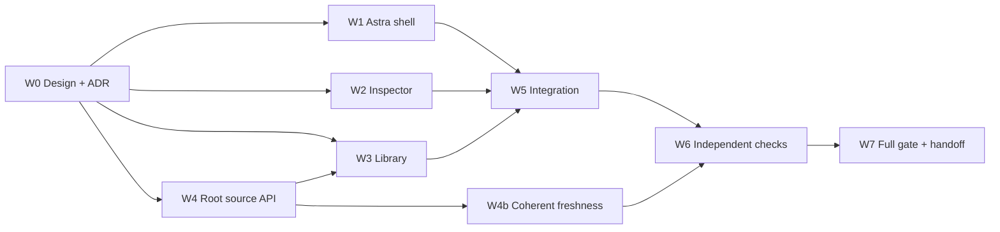

# Task-first workspace implementation plan

**Date:** 2026-09-07. **Status:** task-first increment and subsequent browser visual refinement verified at their separate exact boundaries. No task acceptance or release.
**Branch:** `codex/task-first-ux-pivot`.
**Base:** `329d2f3920753853ce265536d9d3ceb4e35f1f91` plus the existing September 6
audit remediation; preserve those changes independently of the pivot.

The user authorized the task-first UX pivot after an Opus screenshot assessment
and an Astra architecture review. [ADR 0014](adr/0014-task-first-workspace-ux.md)
is the implementation contract, including its dependency graph and alternatives.
The lead is Astra; source API and integration evidence are owned by the root
integrator. No worker may edit another worker's shared file without transfer.

## Subsequent browser refinement

The user authorized the design council's bounded follow-up, specified in
[ADR 0015](adr/0015-browser-native-visual-refinement.md). Three Astra workers
implement Work/shared styling, inspector disclosures, and Library/Context;
root integrates browser evidence and the [Figma comparison board](https://www.figma.com/design/5GbVebHulITT4gWLVTmtGh).
The [new verification report](audits/2026-09-07-browser-visual-refinement.md)
tracks this delta and its independent review. The checked items, counts and
exact artifact review below describe the prior frozen task-first increment;
they are historical evidence, not automatic approval of subsequent source edits.
The subsequent refinement passed Work94/Gallery22/Python1976 and independent
artifact review `review.4TW9K8X39XQBV4123ZD0ZYJPEC` at
`evt.01M1XX22D73N20AKSEZPQ4WK72`; its exact evidence remains separate.

## Delivery checklist

| Work | Owner | Observable result | Verified implementation evidence |
| --- | --- | --- | --- |
| W0 Architecture and design | Root + Opus + Astra | Screenshot-grounded choices, exact baseline, ownership and dependency DAG | ADR 0014 written; implementation authorized, canonical acceptance not implied |
| W1 Shell and task creation | Astra lead | Work/Team/Library/Settings, URL state, task-first composer, explicit contextual launch, local recovery | Implemented; frozen original-target recovery passed component and synthetic browser checks |
| W2 Inspector and semantics | Inspector worker | Readable task detail, domain-specific labels, exact creation result and retry-safe API client | Implemented; both locale/domain contracts and final screenshot review passed |
| W3 Library | Library worker, inspector worker for recovery correction | Localized recipes, structured exact sources, advanced editor, addressable tabs and preserved drafts | Implemented; exact sources and retained uncertain publication passed regression tests |
| W4 Source API | Root | Authenticated metadata-only catalog for all six kinds, shared source eligibility, explicit bounds | Implemented; six-kind bounded metadata-only contract and integrated gate passed |
| W4b Observation freshness | Library worker | Quiet unchanged canonical records remain current after coherent reread; active heartbeat still ages | Implemented; coherent observation and stale active heartbeat regressions passed independently |
| W5 Integration | Astra lead | Paired locales, styling, component contracts and reproducible packaged Work assets | Final packaged assets built; Work 85, Gallery 22 passed with zero frontend skips |
| W6 Independent verification | Root and non-author reviewers, Opus visual consultation | Actual browser journey, responsive/focus evidence, exact source review | Both Opus consultations complete; independent source/image review found no remaining app P0/P1/P2; corrected JPEG metadata revision registered |
| W7 Full gate and handoff | Root | `git diff --check`, full `make check`, exact hashes and truthful remaining gates | Full make check passed: 1976 Python tests; exact artifact review approved; handoff recorded separately |

Canonical coordination tasks (inspect their current revisions with the CLI;
this table does not imply completion or acceptance):

- Root integration/ADR/source API: `task.2FN5KSDDDQ7Y23CFJ47CFAJJR9`.
- Astra shell/composer/integration: `task.39Y6GZ6JAJ7PY3NW5YGQ233RWS`.
- Inspector/API/semantics: `task.0V6MQPN7423640BYR4AVPY7MPD`.
- Library/context/recipes: `task.7E9C153146DZA2762JF865HVXW`.

## Verified implementation conditions within this increment

- [x] New ready task with no runs never reads as completed or accepted because
  its evidence record is complete; verify both locales.
- [x] Every profile option is distinguishable by accessible name.
- [x] Creating a task selects its returned exact identity without a second
  manual selection, and never implicitly creates a run.
- [x] Task creation works without a qualified provider; actual launch remains
  blocked until all existing provider/context/design conditions pass.
- [x] URL navigation restores selected task, filter and Library tab; auth
  exchange strips secrets without losing approved navigation state.
- [x] Missing tasks, stale evidence, unknown readiness and truncated catalogs
  stay visibly unresolved. Late responses do not replace a newer selection.
- [x] Local errors preserve draft, selection and the original uncertain
  request's body/key/CAS. Switching destinations/locales does not lose drafts.
- [x] Cross-task run recovery clearly identifies the original frozen target;
  starting a new Context Pack cannot erase an uncertain publication.
- [x] A coherent fresh read confirms unchanged older canonical records without
  refreshing a stale active attempt or hiding invalid/future evidence.
- [x] Team recipes preview their roles and grants; applying, hiring and
  launching remain separate explicit actions.
- [x] Context source picker supports all six source kinds and exact revisions;
  no silent revision upgrade and no eligibility inference from an incomplete list.
- [x] Metadata source API cannot return generic source records, artifact
  paths/manifests, actors, config, source bytes or provider output.
- [x] Work/Library/Settings retain access to existing Gallery and diagnostics.
- [x] Desktop and narrow layouts keep selected task values readable, focus
  visible, controls operable and feedback local to the action.
- [x] Rebuilt checked-in assets match source; full `make check` passes under
  Node/Python matching repository version files and locked Ruff, followed by exact evidence registration.

The checked conditions describe implementation and available tests, not canonical
acceptance. Actual browser Back/forward remains unexercised; its route contract
is covered hermetically. See the [verification report](audits/2026-09-07-task-first-pivot-verification.md)
for the exact commands, screenshot limitations and independent review record.

## Evidence plan

Use disposable synthetic fixtures for screenshots and journeys. Capture a
configured empty workspace, created ready task, blocked dependency, local
failure, review state, Library/Context editor and narrow layout. Never copy
actual operator state roots, credentials, prompt transcripts or raw provider
outputs into proof artifacts. Provider qualification in a fixture is fake and
must be described as such.

Backend tests cover authorization, read-only behavior, all six source kinds,
current effective revisions, restriction/manifest exclusion, malicious extra
fields, Unicode bounds, deterministic truncation and source drift. Frontend
tests cover parser bounds, domain semantics, navigation, exact retries, stale
selection races and draft preservation. Browser checks exercise the assembled
product beyond isolated component tests.

Full-tree green and independent review are separate gates. A scoped check is
fast feedback, not a substitute for `make check`; passing either gate does not
accept a task or establish provider live qualification.

### Integration findings and disposition

| Finding | Required disposition | Owner |
| --- | --- | --- |
| Global missing capacity incorrectly disables a fresh ready task | Use task-specific freshness/readiness, retain global evidence warning and server CAS | Inspector; regression added |
| Old immutable event age permanently expires otherwise current tasks | Separate coherent observation time from runtime liveness; no timestamp rewrite | Library worker, W4b |
| Retry for task A can appear inside task B's run composer | Bind recoverable operation visibly to original target and preserve exact request | Astra; independent source finding |
| New Context Pack discards uncertain save identity | Keep original pack/revision/draft/key until outcome is resolved | Inspector; independent source finding |
| State domains are visually ambiguous and stale warnings repeat | Explicit domain labels, distinct readiness copy and one local freshness explanation | Inspector + Astra; Opus consultation |
| Team acts on an unnamed selected task | Show target identity and disable target-specific action without a selection | Astra; Opus consultation |
| Read-only Team form still offers hiring | Disable form and submit path consistently with workspace write mode | Astra; independent source finding |
| Accepted prerequisites absent from launch-derived creation options | Keep launch options scoped; source task-creation prerequisites from the task observation | Astra + Inspector; independent source finding |
| Navigation retains irrelevant scroll; close label implies task completion | Destination scroll reset, narrow inspector focus, **Close details** wording | Astra; browser verified behavior |

Browser proof is split from write verification. The browser Context Pack
publication click was not performed because automatic approval review rejected
it as a possible canonical write; publication and exact retry semantics use
isolated regression tests instead. A separate rejection of **Close task** was
resolved by showing its read-only `onSelectTask(null)` implementation; the
label was then clarified to **Close details**.

## Explicitly open outside this increment

L1/R2, Grok transport privacy and retention policy remain separate audit work.
User research, full accessibility certification, light theme, project switching,
canonical Team entities, automatic DAG scheduling and provider resume are not
silently claimed by this task-first surface. Do not remove existing CLI/MCP or
legacy recovery as a side effect of this UX implementation.

## Final branch checkpoint

The integrated source manifest contains 469 exact file hashes and 50 pivot delta
records against the 609-file pre-pivot inventory. Earlier runtime remediation
remains unchanged. Full `make check`: Work 85, Gallery 22, Python 1976 passed;
13 intentional/local-only Python skips and two existing deprecation warnings.
No frontend tests were skipped. The first two gate attempts exposed test
formatting and stale provider-auth assertions; both were corrected and the full
gate repeated. See [test evidence](evidence/2026-09-07/ux-pivot-test-verification.json).

Independent review caught malformed bitmap dimensions in the first browser
artifact. JPEG extensions/dimensions were corrected without changing image
bytes, and artifact `artifact.5DMF26K420TKPZ6FSJPWXN0Y2V` was revised through
the supported CLI to `evt.01M1WEGEV7CQPEEDM0KEJ6777V`. The earlier revision
is superseded evidence, not the current proof. Historical before-image `.png`
paths contain JPEG 1440×1000 bytes; that fact is explicit in the correction.

Task `complete/submit` transitions were not performed after automatic approval
review rejected them under the original review-only lifecycle boundary. Exact
artifact review and targeted handoffs provide durable verification without
promoting task acceptance. ADR 0014 remains proposed for owner governance; its
original “pending verification” header is the frozen design-time status. This
checkpoint and the verification report carry the later implementation result.

### Next work, with closure criteria

- **Before release / external:** L1 six-profile live qualification on the intended
  Linux/source boundary, then R2 exact independent release evidence. Requires
  separate operator authorization; existing Claude/Grok failures remain open.
- **Before release / engineering decision:** resolve Grok argv privacy transport
  and choose retention policy; follow the September 6 audit criteria.
- **Soon / UX:** replace the ready provider-auth panel's misleading “Critical
  attention required” headline with state-specific copy (P3).
- **Validation:** operator first-use study plus keyboard/screen-reader audit;
  exercise actual browser Back/forward and browser Context Pack publication.
- **Opportunity / decision:** test a compact density preference, light theme and
  attention digest before committing to another broad visual redesign.
- **Governance:** owner evaluates the exact reviewed working tree and ADR 0014;
  task acceptance, commits, push and release require their own explicit steps.

Independent artifact review `review.6GD3GXYBA8W22SJ6RBQG1K7S9Z` is
approved at `evt.01M1WF8EV1WYDFXJPQKVPDQDMB`, with non-stale exact
target `evt.01M1WEPXKVVQ8E2BHTP8JBWQRT`. It is an artifact review,
not task acceptance; source and image hashes matched in the independent readback.
